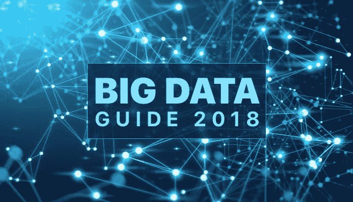

# 2018 年大数据完全入门指南

> 原文：<https://medium.com/swlh/the-complete-beginners-guide-to-big-data-in-2018-82ed7a396ba3>

## **什么是大数据？**

Big Data

大数据是一个术语，用于描述大量来自新数据源的多样、复杂且快速变化的数据。这些数据集非常庞大，很难用传统的数据处理软件或传统的软件管理工具来管理。

现在，每个组织的目标都是在这个竞争激烈的市场上留下自己的印记。为此，有效的数据管理极其重要。处理大量的数据不是一件容易的事情。这就是 [**大数据**](https://en.wikipedia.org/wiki/Big_data) 发挥作用的地方。

首先，数据管理不仅仅是架子上的另一个能力因素。这更是一个决定市场赢家的关键区别点。重要的不是数据量。最重要的是企业管理数据的能力以及他们如何处理这些数据。

## **大数据能做什么？**

如果你还在疑惑为什么要把 [**大数据开发**](https://www.goodfirms.co/big-data-analytics) 纳入你的业务；以下是几个原因:

1.  大数据可以决定用户行为
2.  大数据能够进行预测分析
3.  大数据有助于获得洞察力来制定业务战略
4.  大数据可以执行流程，以便从数据集中提取价值

牢记上述所有因素，组织和企业都期待着大数据的发展。此外，通过整合大数据，他们可以提出新的计划和经过改革的战略，这些计划和战略有能力转变任何业务。

除此之外，大数据的应用不仅限于软件或应用程序开发。大数据开发被用于许多其他领域，例如:

*   金融科技
*   机器人学
*   气象学
*   医学
*   环境研究
*   信息学和网络安全

由于大数据的数量持续呈指数级增长，因此对其进行分析并不容易。但是，对这些数据进行适当的管理和研究可以帮助您做出明智的业务决策。因此，为了简化事情，有必要了解不同类型的大数据。

## **大数据的类型:**

大数据可以大致分为三类:

## **1。结构化**

任何可以以固定格式存储、处理和访问的数据都可以归类为结构化数据。数据已经以有序的方式存储在数据库中。数据的格式以及如何从中获取价值是已知的。

结构化数据的例子:存储在任何数据库软件中的信息

## **2。非结构化**

任何具有未知结构或格式的数据都可以被称为非结构化数据。数据量巨大，从中获取价值并不容易。数据可以包含文本文件、视频和图像的混合。

非结构化数据的例子:任何 Google 搜索的输出

## **3。半结构化**

它包含上述两种形式的数据。很多时候，如果数据被定义但不是结构化的，它可以被归类为半结构化数据。半结构化数据包含的信息包含组织属性，但不是传统的数据库格式。

半结构化数据的例子:存储在 XML 文件中的任何数据

## **大数据的三个 V**

在 21 世纪初，Gartner 分析师 Doug Laney 以三个 V 的形式阐述了大数据的概念。此外，大数据包括数据创建、存储和检索；它的显著特征在于:

## **1。音量**

大数据的定义本身表示大量的数据。所有企业都有大量的数据，包括从商业交易、交易和投资、社交媒体统计和其他数据中收集的数据。因此，数据量至关重要，因为它给出了如何从数据中提取价值的想法。

还有，某个数据集能否确定为大数据，取决于数据的体量。借助大数据，您将处理大量低密度数据。数据的大小可能从兆兆字节到兆兆字节不等。

因此，在处理大数据时，容量是一个必须考虑的重要参数。

## **2。速度**

速度是指数据生成的速度。生成包括两者；接收数据和对数据执行的操作。数据生成和处理的速度决定了数据的实际潜力。

此外，生成的数据流是前所未有的大规模。

因此，大数据的速度涉及数据流入和流出来源的速度。数据的流入是持续的、大量的，因为它来自许多来源——商业交易、社交媒体网站、应用程序日志和其他网络。

对这种前所未有的数据流的处理和运行将决定数据的真正潜力。这就是速度对大数据至关重要的原因。

## **3。品种**

如今，当谈到数据时，我们不仅仅局限于纯文本数据或数据库形式的结构化数据。数据意味着不同类型的数据—结构化、非结构化、数字、音频、视频、pdf、金融交易和股票数据。所有这些不同类型的数据都需要不同的预处理和正确的处理来从中获取上下文。

此外，各种数据意味着挖掘、存储和分析每种类型数据的不同方式。随着应用程序向大量用户发展，需要敏捷处理，传统数据库不足以产生商业价值。

因此，多样性包含在大数据特征的三个 V 中。

## **尾注:**

大数据分析有明确的商业价值。将它整合到您的业务中有五大优势-

*   成本降低
*   指数生长
*   明智的决策
*   优化的产品
*   缩短产品开发时间

如今，越来越多的企业正在使用大数据来超越竞争对手和分析数据。所以，不要再等了，抓住这个绝佳的商机吧。在时间、金钱和资源方面，这会让你的企业付出很大代价。

此外，[大数据开发](https://www.goodfirms.co/research/big-data-analytics)将为您的业务开辟新的机遇，并帮助您更好地了解消费者偏好。将大数据与高性能分析相结合，将有助于您的企业顺利完成复杂任务，没有任何麻烦。

## 这篇文章发表在《T4》杂志《创业》(The Startup)上，这是 Medium 最大的创业刊物，拥有 338，320 多名读者。

## 在这里订阅接收[我们的头条新闻](http://growthsupply.com/the-startup-newsletter/)。

