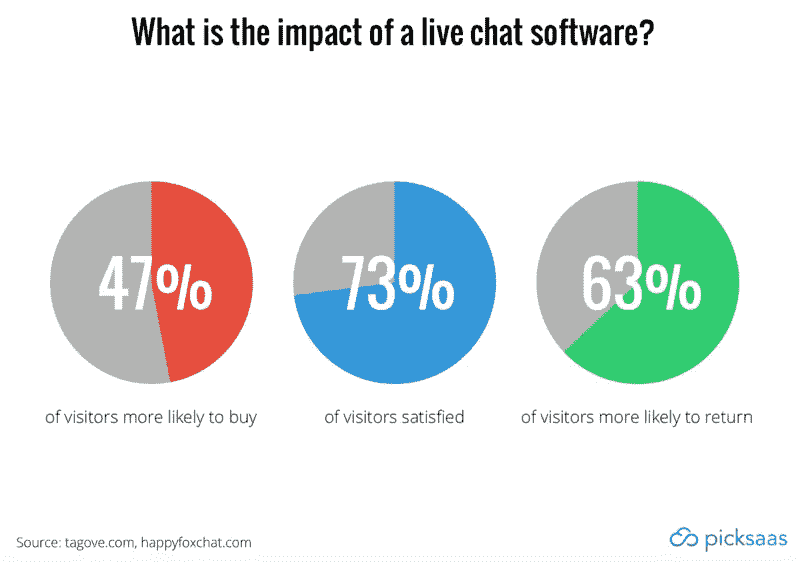
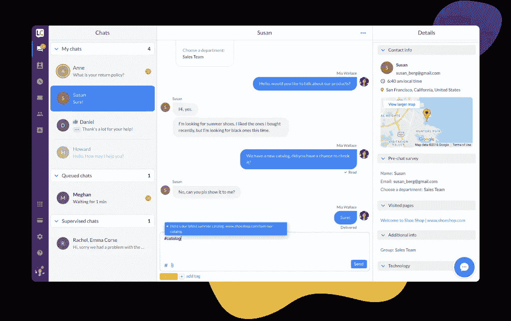
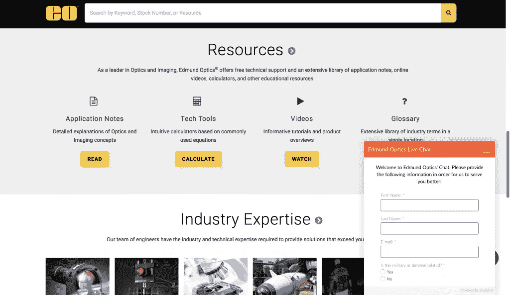
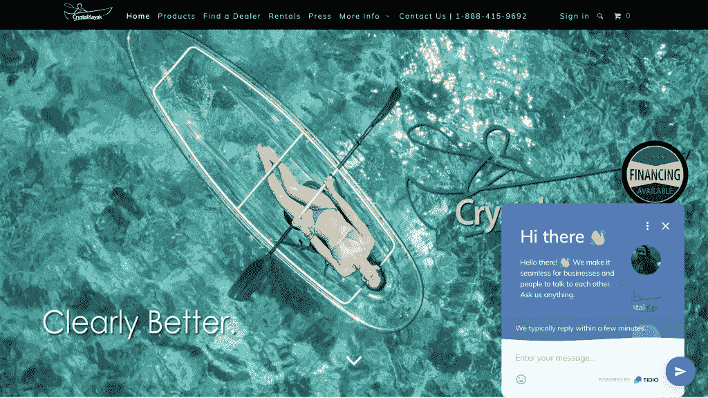
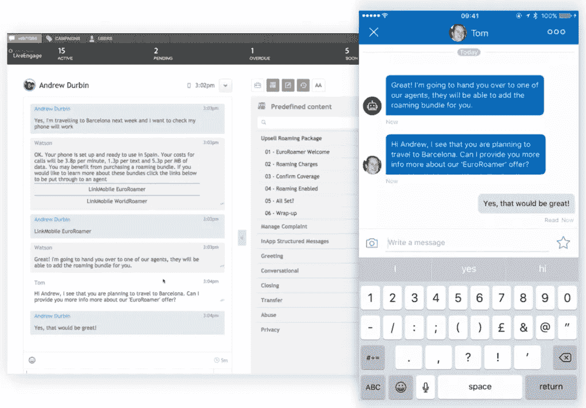
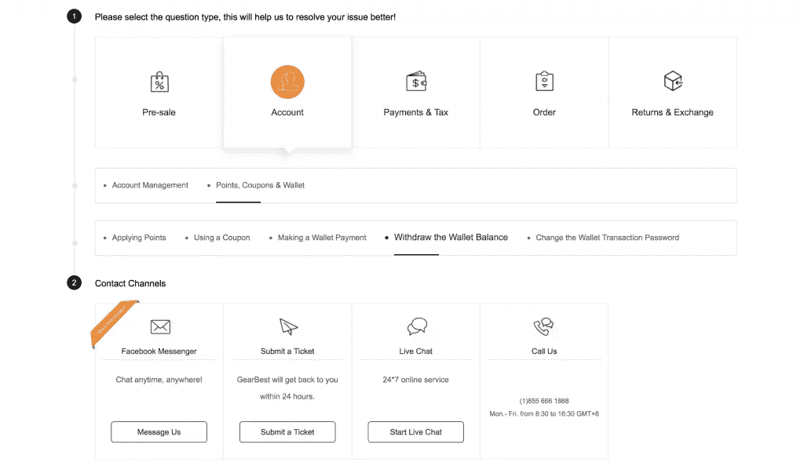

# 完全指南:最佳电子商务实时聊天软件

> 原文：<https://medium.com/swlh/the-complete-guide-best-live-chat-software-for-ecommerce-aa926293a60b>

*本文原载* [*米查林娜男爵*](https://medium.com/u/649c9367c411?source=post_page-----aa926293a60b--------------------------------)*@*[*picksaas.com*](https://picksaas.com/blog/ecommerce-live-chat/)

在我们关于[电子商务最佳软件解决方案](https://picksaas.com/blog/ecommerce-software-solutions/)的文章中，我们讨论了将帮助您提高在线销售额的云解决方案。其中一个是实时聊天，今天我们将更深入地了解现有的最佳实时聊天应用，并讨论它们可能值得在您的电子商务业务中实施的具体功能。

好吧，但是…

# …实时聊天如何帮助您的电子商务业务？

## 快速通信

实时聊天在**方面表现突出，最大限度地减少了联系当前或潜在客户所需的时间**。 [79%的客户表示，他们更喜欢任何其他支持渠道的实时聊天](https://www.ecommerce-nation.com/e-commerce-companies-use-live-chat/),因为它提供了即时性。浏览你的商店的访客可以直接联系你，询问关于送货、规格或替代产品的问题，而不是写电子邮件。

然而，这不一定是单方面发起的对话。**您还可以设置特定的触发器，帮助您快速解决客户在特定子页面上最常见的问题**。

想问客户只要停留在你的产品页面超过 10 秒钟，他是否有任何关于预计送货费用的问题？没问题。只要设置触发器，他就会看到聊天消息在合适的时间弹出。

## 收集数据

另一个重要的领域，你可以从安装在你网站上的聊天工具中获益，那就是它在软件包中提供的分析引擎。

你实际上可以开始收集访问者在你的网站上的行为观察。例如，视频中的一位实时聊天用户 CartHook 讲述了他的故事，他的客户一看到“关于我们”的页面就离开了他的网站。这帮助他认识到，他应该更加注重建立自己网站的可信度，并使他能够增加访客每次访问他的商店时的购买次数。

实时聊天不仅仅是分析你的访问者的行为。他们还能让你即时访问你的访问者是谁的数据，并让你存储这些数据。你可以想象，无论是与已经在你的商店多次购物的顾客交谈，还是与第一次看到你的登录页面的访问者交谈，这都可能非常重要。

## 最佳化

收集和分析数据是不够的。你**必须利用这一点，采取行动**，将有用的信息转化为额外的销售。

您可以通过多种方式利用收集到的信息优化您的商店。有哪些例子？

*   你是否倾向于从和你聊天的第二个顾客那里得到同样的问题？**也许你应该优化产品页面**上的信息，或者将这个问题添加到你的常见问题解答中，以节省你和你客户的时间？
*   访问者一检查其他颜色选项的可用性就放弃了你的网站？也许你应该用新的颜色来扩展你的报价？
*   访问者在访问您的“关于我的页面”后放弃购物车？也许你还没有足够重视建立你的品牌的可信度？你为什么不**把你团队的照片放到“关于我”的页面**上，让你的访客知道店后面有真人？

## 提高客户的忠诚度和满意度

调查实时聊天软件对访问者行为的影响的研究表明**它对客户的行为、忠诚度和满意度有重大影响**。实时聊天往往会带来最高的客户支持满意度，73%的实时聊天用户对服务感到满意，相比之下，61%的用户使用电子邮件，44%的用户使用电话支持。没什么好惊讶的，因为可能我们所有人都希望我们的问题能很快得到回答。

更有趣的是，**实时聊天支持可能会影响客户购买产品的实际意愿**，因为研究表明，47%的在线购物者更有可能在能够与实时在线助理交谈的情况下进行购买。 **63%的受访者表示，如果网站提供实时聊天支持，他们更有可能再次访问该网站**，因此这可能是提高访问者忠诚度的一个好方法。

# 电子商务企业的 5 个最佳实时聊天解决方案

既然您知道设置实时聊天可能对您的业务非常有益，那么您需要找到符合您需求的合适软件。剧透:有很多。

但我们是来帮你的！我们的团队选择了 5 个最佳实时聊天软件解决方案，它们对您在线商店的发展最有帮助。但是，是什么让它们成为电子商务的典范呢？我们研究了以下几个方面:

*   **与 Shopify、BigCommerce 等电子商务平台的整合**
*   **适用于电子商务**业务的附加功能，如销售跟踪
*   **评论**，电商中的意见和用户群

## 1.LiveChat —一个很棒的电子商务实时聊天工具，有目标/销售跟踪、票务系统和自动问候

LiveChat 是主要的实时聊天解决方案之一，高度关注为电子商务店主提供增值服务。凭借其票务系统、高级数据分析和目标跟踪，它旨在满足所有规模企业的要求。它与大多数成熟的电子商务平台进行了本机集成，包括 Shopify 或 BigCommerce。它也是唯一一个与官方 Magento 技术合作的实时聊天解决方案，该解决方案是专门为该平台的用户量身定制的。

**LiveChat 电子商务集成**

LiveChat 可与大多数常见的电子商务平台轻松集成，包括:

*   购物化
*   大商业
*   Volusion —原生 Volusion 的实时聊天
*   Magento —与 Magento 的技术合作伙伴关系
*   Ecwid

**电子商务的 LiveChat 功能**

LiveChat 的许多功能对电子商务业务特别有用。其中一些包括:

*   票务系统—对于大量请求，保存案例以便稍后通过电子邮件解决
*   访客分析——在聊天时洞察访客的数据，例如他们之前访问的产品页面、他们在谷歌中输入什么关键词找到你的网站、他们的人口统计数据和在网站上的时间
*   销售/目标跟踪—设定您希望通过实时聊天对话获得的目标，例如销售产品，并跟踪您的对话对实现这些目标的影响
*   “客户”列表—当前浏览您网站的客户列表，可以根据他们的现场行为(例如，他们在现场停留的时间)轻松过滤
*   偷窥信息写作——在访问者发送信息之前，实时查看他/她输入的信息(提示！在客户提问之前，用它来准备答案👍)
*   吸引眼球——设置吸引眼球的选项，吸引浏览商店的访客的注意力

**LiveChat 电子商务用户群和意见**

目前，全球有超过 25，000 名客户在使用 LiveChat。其中，估计约 25%来自电子商务领域。

LiveChat 倾向于获得用户的好评，在特定市场(*州，截至 2018 年 8 月 7 日*)的评分如下:

**电子商务市场:**

*   Magento: 4.4/5.0
*   大商业:5.0/5.0
*   Shopify: 4.0/5.0
*   WIX: 4.5/5.0
*   Weebly: 4.8/5.0

**回顾市场:**

*   G2 人群:4.5/5.0
*   GetApp/Capterra: 4.8/5.0

点击[此处](https://picksaas.com/blog/livechat-review/)查看我们对 LiveChat 的完整评论。

## 2. [Tidio Chat](https://picksaas.com/live-chats/tidio-chat) —免费增值解决方案，具有出色的 WIX/Weebly 集成和本地 Shopify 聊天机器人解决方案

Tidio 是一个设计良好的免费实时聊天解决方案，专注于与您正在使用的其他平台的集成质量。使用 WIX 或 Weebly 时，您将能够轻松定制聊天窗口，并在 WIX 面板/仪表板中监控聊天。Tidio 最近对其广受欢迎的 Shopify 集成进行了重大更新，增加了一个自动检查订单状态、送货地点和产品可用性的机器人。这是通过聊天工具与您商店的数据库在 Shopify 中的本地集成来实现的。

**Tidio 电子商务集成**

Tidio 可与大多数流行的电子商务平台轻松集成:

*   Shopify —与自动化机器人功能的本机集成，例如，让您的客户检查交付、订单状态
*   WIX/Weebly —本地集成，允许您在 WIX/Weebly 电子商务平台中定制聊天窗口并监控您的聊天
*   大商业
*   普雷斯塔商店
*   3DCart

**电子商务的特色**

Tidio 提供了一系列可能对电子商务特别有用的功能:

*   易于设置的自动功能，让您根据访客的活动类型向其发送自动消息，例如，向再次光临您商店的人发送特别邀请
*   当您无法进行即时聊天时，通过电子邮件发送回复
*   如果你正在使用 Shopify，设置一个自动机器人来处理关于产品可用性或交付选项的请求
*   与 Facebook Messenger 集成，让您可以处理脸书粉丝页面上的请求
*   实时访问者列表，让您监控浏览您网站的人

**Tidio 电子商务用户群和意见**

目前，全球有 302，000 家公司使用免费版的 Tidio Chat，其中 7，000 家公司为 Tidio 的高级功能付费。其中很大一部分来自电子商务领域，Tidio 是 Shopify 最受欢迎的实时聊天解决方案之一。

**来自部分市场的 Tidio 用户意见**

*   Shopify 5.0/5/0
*   大商务 3.5/5.0
*   WIX 5.0/5.0
*   Weebly 3.8/5.0

**审查地点**

*   G2 群组 4.4/5.0
*   Capterra 4.5/5.0

## 3. [LivePerson](https://picksaas.com/live-chats/liveperson) —一款高端企业级实时聊天软件，专注于移动消息和更高级的数据跟踪

LivePerson 是财富全球 500 强中最大的电子商务公司中最受欢迎的实时聊天解决方案。它是为大型企业设计的，专注于为要求更高的客户提供更高级的功能。它通过与 Facebook Messenger、SMS 集成，或允许在您企业的移动应用程序中轻松实现聊天，为您将业务聊天与移动通信渠道集成提供了各种机会。

**真人电子商务集成**

LivePerson 的目标是中型和大型企业，在大多数情况下，这意味着定制软件的实施和集成的必要性。因此，它不提供与 Magento 或 Shopify 等主要和最受欢迎的电子商务平台的原生集成。

**电子商务的 LivePerson 功能**

LivePerson 对电子商务企业的一些好处包括:

*   共同浏览功能，允许在聊天的同时远程引导访客浏览您的商店
*   与移动应用程序集成，允许您在公司的 Android 或 iOS 应用程序上设置实时聊天选项
*   与您的手机短信系统集成，让您更快地回复聊天，使用简单的短信
*   将您的聊天连接到 iOS 界面，让苹果地图用户在他们的 iPhones 上找到您的业务时直接聊天[目前处于测试模式]
*   在 AdWords 活动中添加聊天按钮，增加客户联系的机会

**LivePerson 用户群和意见**

LivePerson 在大型企业中最受欢迎，其客户包括 Gearbest 或 Home Depot 等主要电子商务品牌。

**复习地点**

*   G2 群组 3.6/5.0
*   Capterra 4.5/5.0

->阅读我们的[完整指南中的完整排名，为您的电子商务](https://picksaas.com/blog/ecommerce-live-chat/)寻找实时聊天软件。

*在*[*picks as*](https://picksaas.com/)*，我们帮您找到 saas 软件，发展您的业务。*

*与我们聊天，关注我们的* [*推特*](https://twitter.com/picksaas) *，或者* [*订阅*](https://picksaas.us16.list-manage.com/subscribe/post?u=0a811ad254e7cd14718599e3a&id=bdf0cfd955) *我们每周的 SaaS 软件更新。*

## 这篇文章发表在 [The Startup](https://medium.com/swlh) 上，这是 Medium 最大的创业刊物，有+365，103 人关注。

## 订阅接收[我们的头条](http://growthsupply.com/the-startup-newsletter/)。

