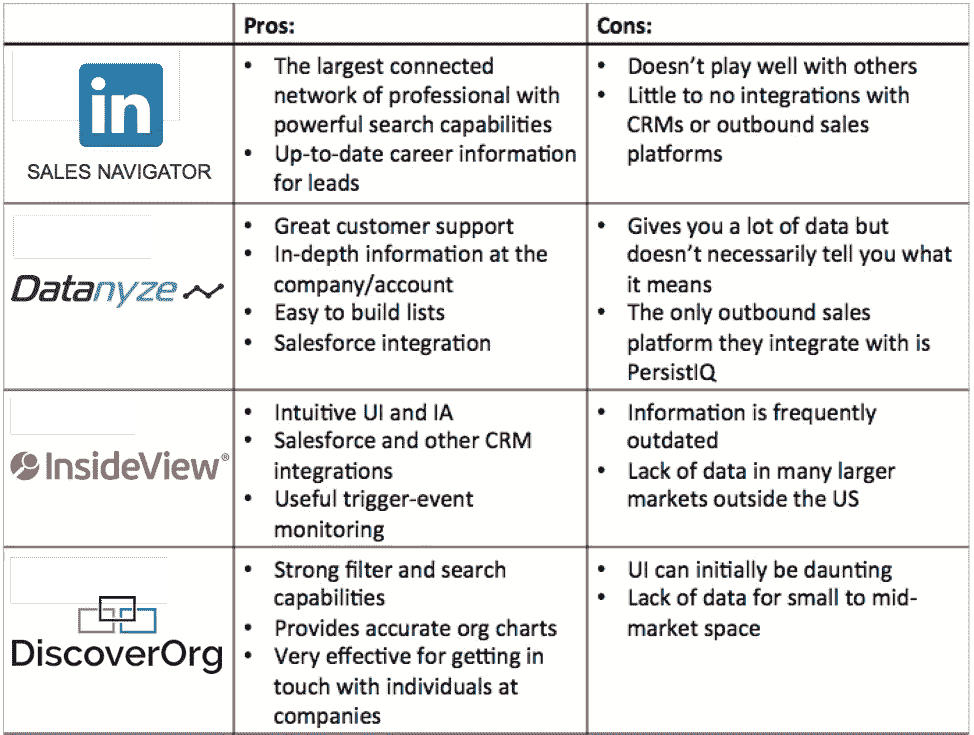
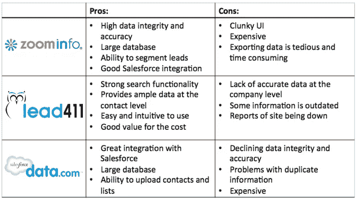
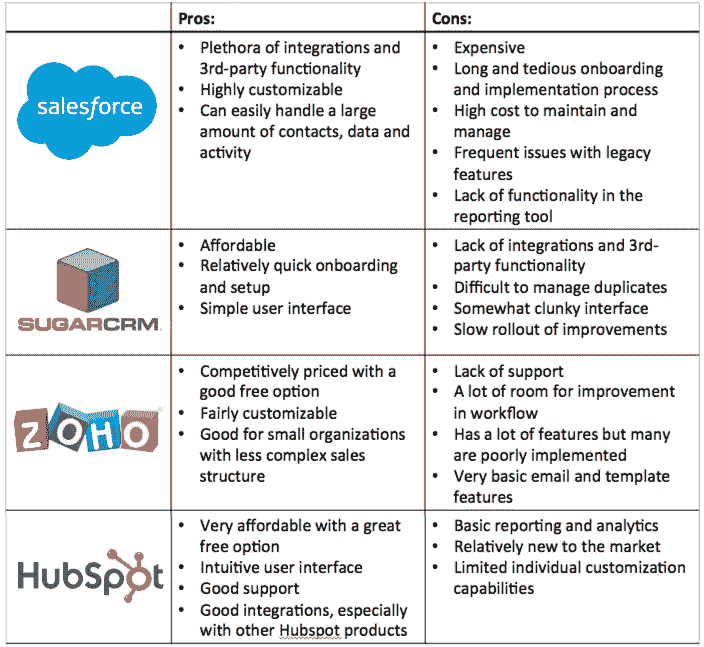
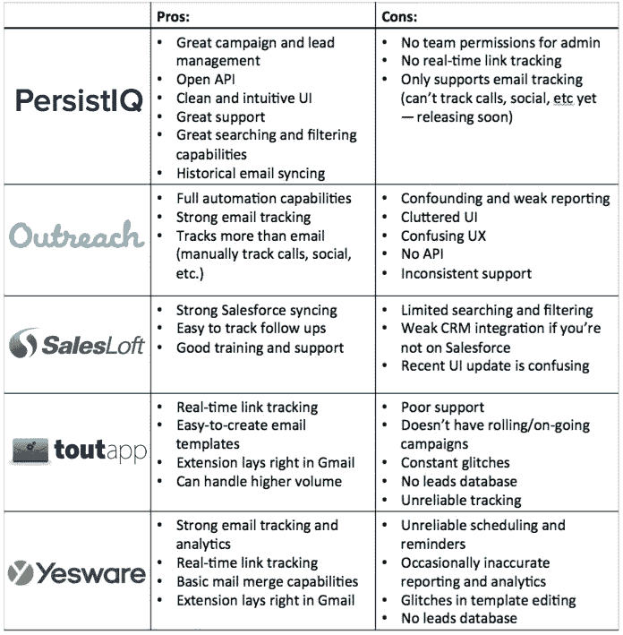
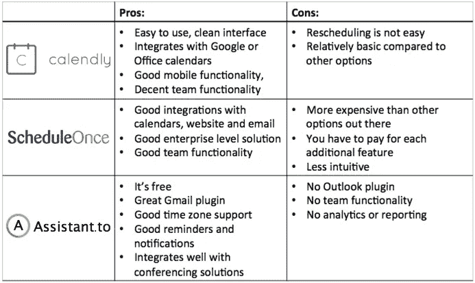
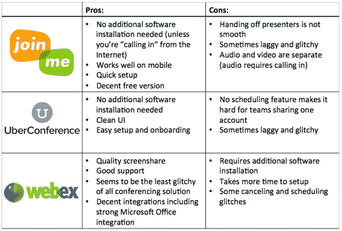
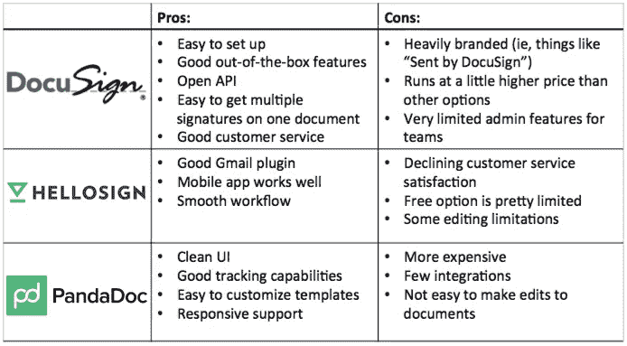

# 构建完美销售组合的完整指南

> 原文：<https://medium.com/swlh/the-complete-guide-to-building-the-perfect-sales-stack-d53653e02530>

最近，我和 Hubspot 的 CRO 马克·罗伯格就我们即将推出的播客进行了交谈。我问他，“你得到的一个常见问题是什么，实际上是个错误的问题？”

他解释说，人们经常问他一些问题的绝对答案，比如，“我应该在销售人员中寻找什么样的特质，”以及“我应该如何接纳新员工。”马克解释说，“错误在于勤记笔记并试图复制。”除非你的企业是 Hubspot 的翻版，否则他的答案是无用的，而且可能是有害的。相反，你应该问，“我如何想出最适合我公司的员工入职流程？”

那天晚些时候，我和[布莱恩·鲍尔弗](https://www.linkedin.com/in/bbalfour)聊了聊，他也在 Hubspot 工作，负责管理他们的增长团队。他也强调了这一点:“人们首先需要停止寻找策略，开始建立一个成长过程。”

这种想法超越了招聘和入职。这种想法困扰着销售行业对销售堆栈的选择。

销售不是基于使用的工具。销售是通过销售代表使用的流程实现的。这些工具只是让这个过程变得可扩展。([点击发微博](http://ctt.ec/1De5q))

与其投资于下一个工具或平台，不如退一步，分析你的销售流程，考虑对你和你的企业来说最好的方法。

阅读列出销售堆栈中所有工具的文章对于了解可用的工具和平台非常有价值。然而，跟风也有危险。一旦你变得过于依赖工具，你就会受到它们的摆布，并有可能成为一台自动机器——只是系统中的另一个齿轮。当你盲目地跟随他人将一种新工具纳入你的销售组合时，你关注的是错误的东西，而忽略了更大的图景。

# 检查销售流程

销售流程是一个系统，它使用可用资源在整个客户之旅中有效地引导潜在客户，使这些潜在客户享受这一旅程。一个好的销售过程是可预测和可重复的。一个伟大的销售过程是可扩展的。

然而，整个销售过程充满了挑战，如果处理不当，不仅会影响销售代表的工作效率，还会影响整个组织。

为了建立一个伟大的过程，你需要考虑你的买家的旅程，并确定旅程中每个阶段最重要的部分。

在很高的层面上，您的销售流程的各个阶段可能与我们的类似:

1.  线索挖掘
2.  领导管理
3.  展示产品
4.  完成交易

对于每一个阶段，弄清楚你需要完成什么，以便有效地将大多数潜在客户推进到下一个阶段。然后翻到一张销售清单，[像这样，](http://www.bowerycap.com/blog/sales/ultimate-guide-to-startup-sales-tools-2015/)找到能满足你需求的解决方案。

让我们来看一下如何创建您的销售组合。

# 第 1 阶段—挖掘潜在客户

有三种主要的方法来挖掘潜在客户:人工潜在客户、第三方潜在客户来源和外包。

对于手动潜在客户，速度至关重要。找到一个合格的销售线索需要多长时间？你需要了解你的商业经济学，以了解这是否是可持续的。接下来，考虑销售智能。销售智能软件为销售代表提供重要信息，如背景和联系信息，用于销售线索、客户或跨垂直市场。

我们最喜欢的工具是 [LinkedIn 销售导航器](https://business.linkedin.com/sales-solutions/products/sales-navigator)。我们知道大多数潜在客户都在 LinkedIn 上闲逛。这使我们能够相当快地获得我们需要的所有信息。

一些公司没有时间、资源或定价结构来证明手动潜在客户，所以他们使用第三方主要采购公司。我们发现最高诚信的线索来自 [ZoomInfo](http://www.zoominfo.com/) 和 [Datanyze](http://www.datanyze.com/?persistiq) 。  。

你不是用时间来支付，而是用金钱来支付。因此，重要的问题是每条线索的成本是多少？

对于潜在客户的产生，还有一个更可行的选择:外包。通过 [Elance](https://www.elance.com/) 和 [Upwork](https://www.upwork.com/) 雇佣自由职业者，我们在不牺牲准确性和速度的情况下，将我们的单位成本领先优势降至 0.50 美元以下。

但是管理一个自由职业者团队也有其自身的挑战，可能需要一篇自己的博文。首先，这里有一些重要的提示:给出明确的指示；一次测试多个自由职业者，裁掉表现差的人(那些给你不好的线索，线索数量少，不能遵循指示的人，等等。)迅速；核实他们所有的工作。

寻找优秀的自由职业者是一个持续的过程，包括与六个左右的人签订合同来完成同样的任务。我们在单独的电子表格中仔细跟踪他们的结果，使用电子邮件验证工具，如 [Kickbox.io](http://kickbox.io/) 、 [Rapportive](https://rapportive.com/) 或[Briteverify.com](http://www.briteverify.com/)来减少反弹，并选择继续只与表现最好的人合作。

在销售线索挖掘阶段选择工具/平台时要问的重要问题包括:

*   信息的准确性如何(数据完整性)？
*   每条线索给了我多少信息？
*   我的每条线索的价格是多少？这是否符合我的商业经济学？
*   我需要多长时间才能找到 X 条线索？
*   有多少销售线索是真正合格的销售线索，有多少是成交的？

## 推荐工具

**销售智能**:

**铅源**

# 第 2 阶段—销售线索管理

理论上，这就是 CRM 的初衷。在实践中，客户关系管理系统会降低高速销售流程的速度，尤其是在交易量最大的漏斗顶端。这导致了专门关注出站流程的平台。

这并不意味着 CRM 是无用的。它应该是销售过程的支柱，是所有沟通的中心数据库，可以协调销售和营销团队的活动。因此，您的对外销售平台需要与您的 CRM 集成。我们选择的 CRM 是 [Salesforce](http://salesforce.com/) 。

在活跃的销售过程中，对外销售沟通的数量巨大(电子邮件、电话、社交媒体、直邮等。).一些平台解决了管理这一数量的挑战，同时保持销售的个人因素，同时防止线索被遗漏。为此，我们构建并使用了 [PersistIQ](https://persistiq.com/?utm_source=blog) 。

在大多数情况下，需要多次尝试才能得到领导的回应。创建成功的对外销售活动有许多[因素，你需要确保你的对外销售平台能够支持它们。我们表现最好的活动是那些高度个性化和相关的活动，而不是那些普通的和完全自动化的活动。自动化和个性化之间有一个微妙的平衡！](http://blog.hubspot.com/sales/critical-factors-for-sales-follow-up-success)

就像寻找潜在客户一样，有条不紊的方法是值得的。测试多种策略，跟踪结果，对最佳表现的节奏和主题加倍下注。

同样重要的是要注意营销自动化和销售自动化之间的重要差异。你不应该试图用一个来代替另一个的工作。

在销售线索管理阶段选择工具/平台时要问的重要问题包括:

*   我是否在为我的对外销售使用正确的平台，或者我是否在尝试使用营销自动化来破解销售解决方案？
*   我的 CRM 可以与我的对外销售自动化平台集成吗？
*   我能否在每个系统中轻松导入和管理销售线索？
*   我的销售自动化是否允许我建立个性化的多点接触营销活动？
*   我可以测试和分析多个活动中的不同信息吗？
*   在每个平台上与我的团队协作有多容易？

## 推荐工具

**CRM** :

**对外销售平台*:**

*完全公开，我为 PersistIQ 工作，但我已尽最大努力对对外销售平台空间给出公正的意见。

# 阶段 3——展示产品

当事情进展顺利，很大一部分冰冷的电子邮件转化为电话、演示和面对面的会议时，管理日历就成了一件苦差事。不应该通过与潜在客户的多封电子邮件来确定会谈时间，这里的错误可能会对交易产生毁灭性的影响。

我们试了几个工具，包括[日历](https://calendly.com/)、[日程](http://www.scheduleonce.com/)和[助理](https://www.assistant.to/)。它们与 Google Apps 很好地集成，让我们为潜在客户提供一系列潜在的会议时间供选择，并避免在我们同时有多个请求时重复预订会议。

演示和屏幕共享软件也取得了长足的进步。在过去，这是一场噩梦。每一方都必须在预定通话前几分钟下载并安装软件，并弄清楚如何使用。但是使用云解决方案，可以避免这种情况。会议软件的另一个重要方面是视频的完整性。落后的屏幕分享会毁掉一个好的演示。

我们同时使用了 [UberConference](https://www.uberconference.com/) 和 [Join.me](http://join.me/) 。

在此演示阶段选择工具/平台时要问的重要问题包括:

*   我的日程安排技术与我的日历集成了吗？
*   我的日程安排工具在更新以避免重复预订方面有多好？
*   对方加入会议的速度和方便程度如何？
*   服务的可靠程度如何？

## 推荐工具

**调度**:

**会议:**

# 第 4 阶段—完成交易

演示完毕后，就该结束交易了。减少购买过程中摩擦的工具，如电子签名的 [DocuSign](https://www.docusign.com/) 或 [HelloSign](https://www.hellosign.com/) ，在这里很重要。

但是就像在冰冷的电子邮件流程中一样，研究和坚持是至关重要的。你在和决策者说话吗？签署文件的是同一个人吗？

演示结束后，销售往往会停滞不前。这是因为 AE 停止了推动它前进，或者更糟的是，未能准确地映射客户，并且正在将它推向错误的道路。不幸的是，我们还没有找到一个软件工具可以为你做这项工作。

在达成交易阶段选择工具/平台时要问的重要问题包括:

*   建立提案有多容易和直观？
*   向一家公司的多个人发送建议书有多容易？
*   编辑模板和提案有多容易？
*   服务的安全性如何？
*   这个过程需要多大程度的自动化？

## 推荐工具

**合同:**

一旦你有了自己的核心销售组合，你就可以开始填补小缺口，帮助你更快、更准确地完成整个流程。这就是个人偏好经常出现的地方。举个例子， 一个团队成员可能更喜欢[维奥拉诺贝特](https://www.voilanorbert.com/)而另一个可能更喜欢[推力 io](https://thrust.io/)fo[r](https://thrust.io/)fI[n](https://thrust.io/)d[I](https://thrust.io/)n[g](https://thrust.io/)an[d](https://thrust.io/)/[o](https://thrust.io/)r[v](https://thrust.io/)[a](https://thrust.io/)r

我最喜欢的一些补充工具是:

*   查理艾普
*   [Rapportive](https://rapportive.com/)
*   [立即](http://immediatelyapp.com/)

# 结论

为您的销售团队寻找合适的产品组合，就是要规划出您的购买者之旅，并确定您的团队的需求，以高效和有效地推动潜在客户完成这一旅程。

用数据指导决策。做一个分分钟的工作流程分析，这样你就可以了解你的瓶颈在哪里，以及如何简化流程。

底线是你永远不要在你的销售团队中投资一个工具或平台，如果它不适合你的工作流程，不能让销售代表更有效率。

记住马克和布莱恩给出的明智建议:首先关注过程，而不是战术([点击发推](http://ctt.ec/4rNMt))。

如果您对 PersistIQ 的免费[演示感兴趣，请访问](http://bit.ly/1VF6d3G)[此处](http://bit.ly/1VF6d3G) …并告诉我的团队是 Brandon 派您来的。

如果你喜欢这个，请看看我写的其他帖子:

[黑客、创新者和偶像加速成功的 9 个秘密](/@brandon_lee_09/the-9-secrets-hackers-innovators-and-icons-use-to-accelerate-success-e46e4fda0013)

[价格策略的终极指南](/@brandon_lee_09/the-ultimate-guide-to-price-strategy-60e2c19be71a)

[信任黑客](/@brandon_lee_09/trust-hacking-3dddfd71955f)

发表于*[**【SWLH】**](https://medium.com/swlh)**(***创业、流浪、生活黑客)**

********