# 洛杉矶合作空间完全指南

> 原文：<https://medium.com/swlh/the-complete-guide-to-coworking-spaces-in-la-77104c7f5a34>

## *因为整天在咖啡店外工作是不合适的……*

[WeWork Los Angeles](http://blogs.seattletimes.com/monica-guzman/2014/01/11/should-you-be-coworking-new-seattle-space-signals-rise-in-community-based-work/)

随着自由职业经济的兴起，全球不同城市的共同工作空间也如雨后春笋般涌现。受这些空间提供的灵活性、成本效益和社区感的影响，自由职业者和企业已经开始选择退出传统的办公室租赁。根据 [JLL 的全球市场前景报告](http://www.jll.com/research/201/jll-global-market-perspective-february-2018) , **的联合办公空间在过去五年里增长了 200%** 。

> 到 2022 年，合作成员的数量预计将上升到 510 万。

此外，众所周知，共同工作空间可以营造有利于生产力和创新的环境。硅滩的不断增长也使洛杉矶成为了一个科技中心，在过去的几年里，成为了数字游牧民和新兴创业公司的温床。话虽如此，我还是在洛杉矶列出了 37 个联合办公空间，将它们分成不同的类别，从大型国际连锁企业到面向利基市场的小型企业。

# 国际的

**1。**[**we work**](https://www.wework.com/)它们的鼻祖——we work 提供合作空间和各种不同的资源，帮助个人和公司成长。WeWork 于 2010 年在纽约成立，现已迅猛发展，在全球 80 多个城市拥有 400 多个办公地点。无论您是努力开展业务还是追求创意项目，WeWork 都会提供灵活的计划来满足您的定制需求。

**2。**[**Spaces**](https://www.spacesworks.com/)
源自阿姆斯特丹，Spaces 提供了一个具有独特创业精神的国际合作空间网络。基于成功孕育更多成功的理念，他们致力于培养一个由思想家、成功人士和幻想家组成的社区。会员可以在办公时间访问任何 Spaces 商务俱乐部，以及定期的网络午餐和演讲活动。他们社区的一些知名成员包括 GitHub、GoPro 和 Oracle。

# 全国性的

**3。**[**sand house**](https://sandhouse.com/)sand house 的使命是为初露头角的企业家和创意人员提供成长所需的工具和环境。一个在好莱坞，另一个在迈阿密，他们的一些便利设施包括乒乓球台，每月欢乐时光和舒适的休息室，供您放松和放松。

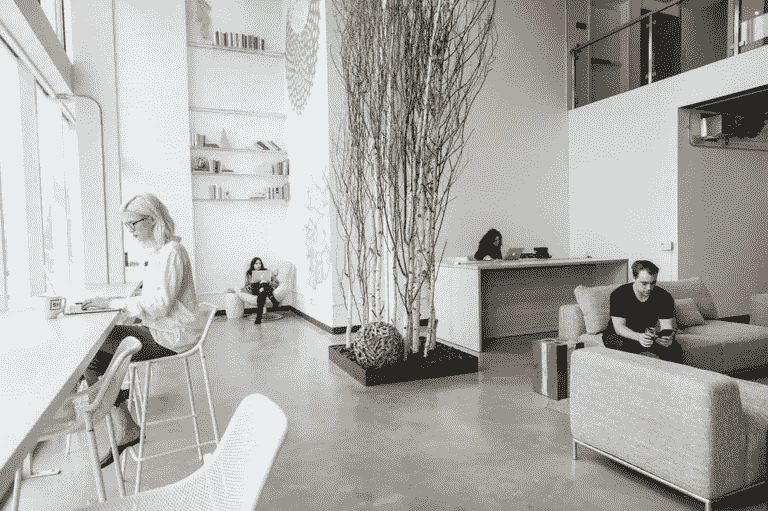

[Sandhouse](https://sandhouse.com/)

**4。** [**勤劳**](https://www.industriousoffice.com/)
勤劳提供可容纳 1-100 人团队的工作空间。洛杉矶有四个便利的位置，全国有 53 个位置，您会发现自己被充满活力的专业社区所包围，从自由职业者到财富 500 强公司。

**5。** [**卫星**](http://santamonica.thesatellitecenters.com/)
卫星中心是一个共享工作空间的社区，其位置遍布加利福尼亚州。虚拟办公室的起价为每月 36 美元，位于圣莫尼卡的私人办公室计划的起价为每月 1675 美元。

6。这个高档的共同工作空间位于曼哈顿和好莱坞，为其社区提供额外津贴，如文化节目，让里面的成员接触到艺术、时尚、音乐、政治和一系列其他行业的大腕。提供一个完整的餐厅和酒吧，会员还可以享受为他们新鲜准备的饭菜的便利。

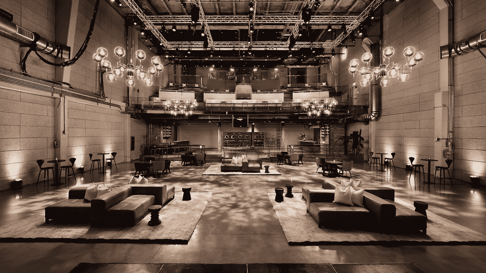

[NeueHouse Hollywood](https://www.rockwellgroup.com/projects/neuehouse-hollywood)

**7。OnePiece Work**[**one piece Work**](https://onepiecework.com/)
在圣莫尼卡和加州其他地方新开张，one piece Work 为初创公司提供办公空间，更像是一个加速器，而不是一个共同工作的地方。他们主持每月一次的 OnePitch 活动，企业家和投资者可以在一个有趣的竞争环境中交流。

**8。**[**Serendipity Labs**](https://serendipitylabs.com/)
Serendipity Labs 在洛杉矶有两个场所，在全国有多个分支机构，旨在提供优质的、基于酒店的工作场所体验。它们迎合了希望扩展其房地产平台的公司以及希望释放其全部潜力的专业人士。

**9。**[**CTRL Collective**](https://www.ctrlcollective.com/)
容纳个人和公司在创业生命周期的每一个阶段，CTRL Collective 都努力将各种行业的组合聚集在一个屋檐下。他们的创新合作空间位于普拉亚维斯塔、曼哈顿海滩、帕萨迪纳和丹佛，旨在激发您的创造力。

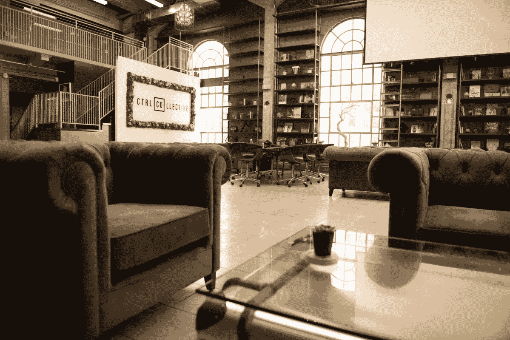

[CTRL Collective](http://happeningindtla.com/co-working-space-downtown-la/)

**10。**[**Muse Rooms**](https://www.themuserooms.com/)
Muse Rooms 位于北好莱坞和伯班克，Muse Rooms 提供 24/7 开放会员资格，每月 250 美元起，而办公室会员资格每月 550 美元起。他们在伯班克的位置甚至有一个 19 世纪的古董酒吧，你可以在那里播放黑胶唱片。

# 仅限洛杉矶

**11。** [**跨校区**](https://www.crosscamp.us/)
跨校区致力于创造一个可以培养有意义的关系并找到工作与生活平衡的环境。他们的一些便利设施包括冥想室，引人入胜的活动，以及康普茶和桶装精酿啤酒。在帕萨迪纳、圣莫尼卡、DTLA 和南湾，Cross Campus 的会员资格将把您与洛杉矶最活跃的合作社区联系起来。

**12。**[**The Collection**](http://www.thecollection527.com/)
坐落在 DTLA 熙熙攘攘的人群中，一座修复得非常漂亮的历史建筑内，该系列提供传统的租赁条款以及可供出租的共享办公空间。结合了奢侈品和高科技的额外津贴，他们的目标是让企业家追求他们的商业努力。

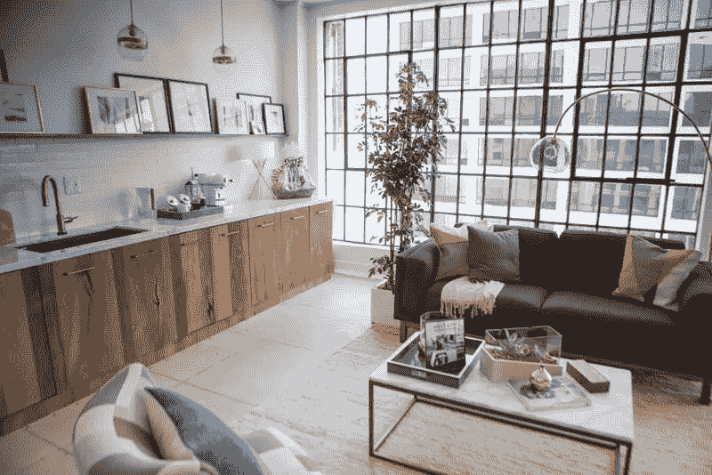

[The Collection](http://www.thecollection527.com/)

13。[**Indiedesk**](https://www.indiedesk.com/)
作为 DTLA 日益增长的科技场景的一部分，包括 [LootCrate](https://www.lootcrate.com/) 、 [VRLA](https://virtualrealityla.com/) 和 [Mindshow](https://mindshow.com/) 在内的多家创业公司都诞生于这个联合工作空间。他们迎合任何行业的新晋企业家和自由职业者，并提供各种不同的会员计划，从每周通行证到共享和专用办公桌。

**14。** [**一日通票的价格是 20 美元，而他们的会员费是每月 159 美元。**](http://www.laxcoworking.com/)

**15。**[**Podshare**](http://podshare.co/)
Podshare 是一个生活/工作社区，遍布洛杉矶的 200 多个地点，它的使命是在整个城市建立接入点，供人们工作、淋浴、小睡、给手机充电，并结识其他友好的 podestrians*！未来是“进入而不是拥有”，因此 Podshare 的会员通行证允许您进入洛杉矶所有可用的中心。每个房间包括一张双人床或大床和一台 22 英寸平板电视，配有网飞和 Hulu。这种千禧一代的共同生活空间起价为 50 美元/晚、280 美元/周和 1000 美元/月，是获得 Airbnb 的舒适和宿舍的社交氛围的好方法。*

**

*[Podshare Los Feliz](https://www.booking.com/hotel/us/podshare-los-feliz.en-gb.html)*

***16。** [**该公园**](https://www.parkworkspaces.com/)
虽然欢迎任何行业的个人，但该公园专门帮助时装业的人，为他们提供成功所需的工具和环境。提供交钥匙办公空间解决方案，他们的使命是创造一个社区，促进合作，创新和想象力。*

*17。 [**顿悟空间**](http://epiphanyspace.com/)
顿悟空间为艺术家和创意专业人士提供共同工作、房间出租和画廊空间。由于好莱坞的创造性生活方式和工作可能会导致一些人感到孤独、被拒绝和失望，他们的目标是创建一个培育社区，艺术家和其他志同道合的人可以相互支持。*

*18。[**Village Workspaces**](https://www.villageworkspaces.com/)在洛杉矶有两个办公地点，一个在[圣塔莫尼卡](https://www.villageworkspaces.com/santa-monica-coworking-space/)另一个在[西洛杉矶](https://www.villageworkspaces.com/west-los-angeles-coworking-space/)，Village work spaces 提供专为提高您的工作效率和帮助您的业务蓬勃发展而设计的精品办公空间。便利设施包括免费的每周早餐、当地啤酒厂的桶装啤酒🍻和位于洛杉矶西部的专业录音室。*

*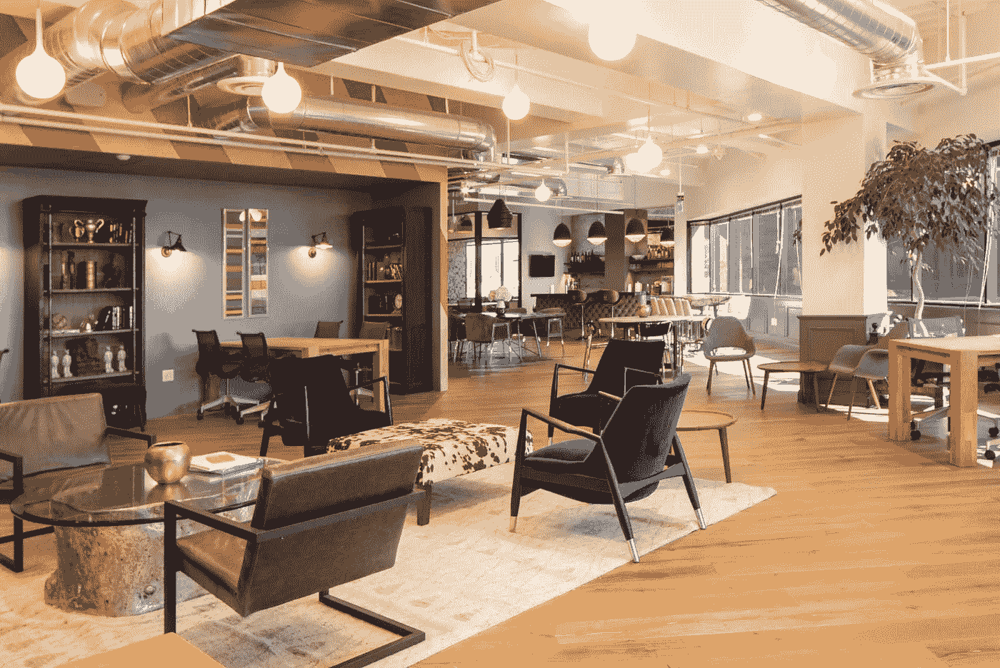*

*[Village Workspaces West LA](https://www.villageworkspaces.com/west-los-angeles-coworking-space/)*

***19。**他们的一些独特的便利设施包括满足您所有录音需求的播客声音工作室和设计师的纺织品工作室。*

*20。[**biz Haus**](https://www.bizhaus.com/)
biz Haus 位于 El Segundo 和 Marina del Ray，高度重视灵活性、社区和联系。这个共同工作的空间旨在创造一个环境，在这个环境中，成员们相互支持，并从共享空间、资源和想法中获得能量。他们的一些成员包括福乐鸡快餐店和双枪咖啡。*

*21。Opodz 坐落在小东京的中心，有各种各样的每月桌面计划来满足你的需求，还有一张 20 美元的白天通行证，供那些想参观这个地方的人使用。*

*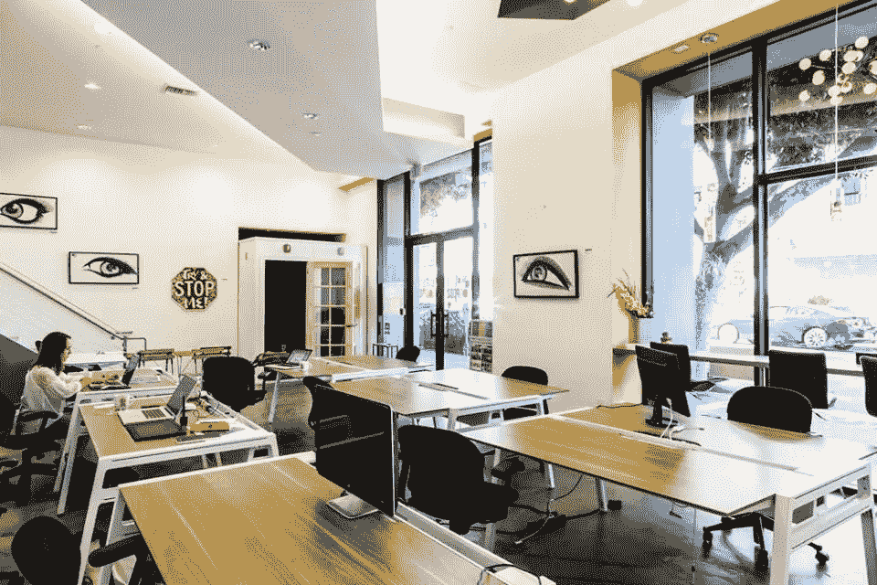*

*[Opodz](http://www.opodz.com/gallery/)*

***二十二。位于 Mar Vista 的 ofia 是一个合作空间，提供各种会员计划，从虚拟办公室计划到热办公桌计划，在虚拟办公室计划中，你可以找到专门的接待员来接听你的电话，在热办公桌计划中，你可以在公共办公桌上拥有自己的工作站。***

***23。**[**BLANKSPACES**](https://www.blankspaces.com/)
自 2008 年成立以来，blank spaces 致力于建立一个共享协作工作空间的企业家和自由职业者社区。他们在圣莫尼卡、DTLA、卡尔弗城、帕萨迪纳都有分店，不久还将在长滩开设分店。*

*24。 [**二期**](https://phasetwospace.com/)
卡尔弗城二期旨在营造一个科技、媒体和娱乐汇聚的环境。他们有一系列独特的设施，包括电话亭、淋浴和一个 1000 平方英尺的绿色房间，可用于沉浸式技术拍摄以及电视/电影制作。*

*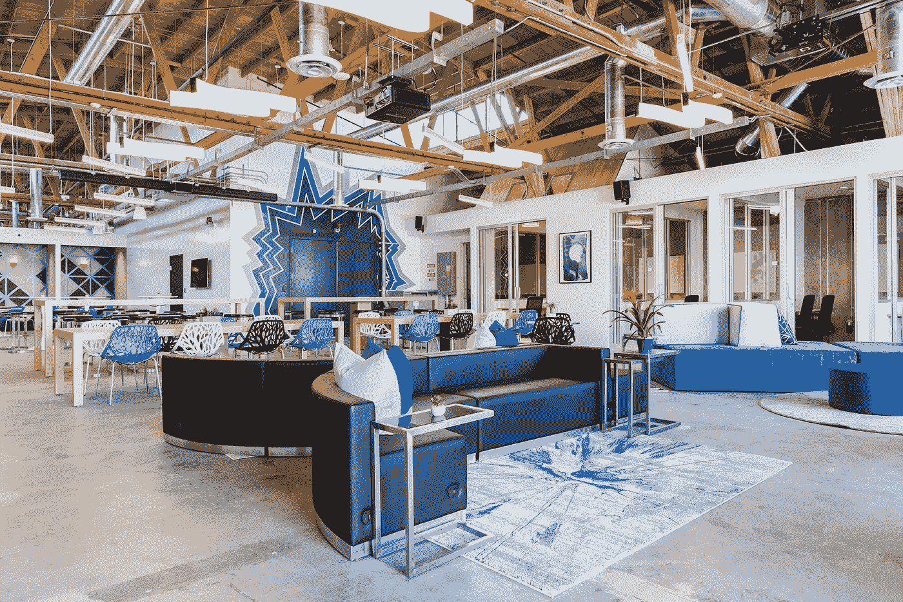*

*[Phase Two](http://voyagela.com/interview/meet-dan-pastewka-phase-two-culver-city/)*

***25。** **俗话说，沙滩上的生活更美好🌴。距离海洋仅几步之遥，这个位于硅海滩中心的共同工作空间旨在通过创造一个让你感到最舒适的氛围来帮助你提高生产力。查看他们的网站，通过订阅兑换一天的免费海滨别墅！***

*****26。**[**dots Space**](http://www.dots.space/)
位于卡尔弗城和贝弗利山，提供了行政办公室和公共工作空间的组合。他们的设施包括一个瑜伽室和一个冥想室。***

***27。Rita House
这座西班牙殖民风格的建筑在 20 世纪 70 年代曾是一个服装屋，它拥有一个公共工作空间，个人可以在这里与其他志同道合的创造者和创新者建立真实的联系。Rita House 还在他们的空间举办了一系列活动，从信息研讨会到现场音乐表演。根据您的需求，他们有三种不同的会员计划——社会会员、当地会员和居民会员。***

***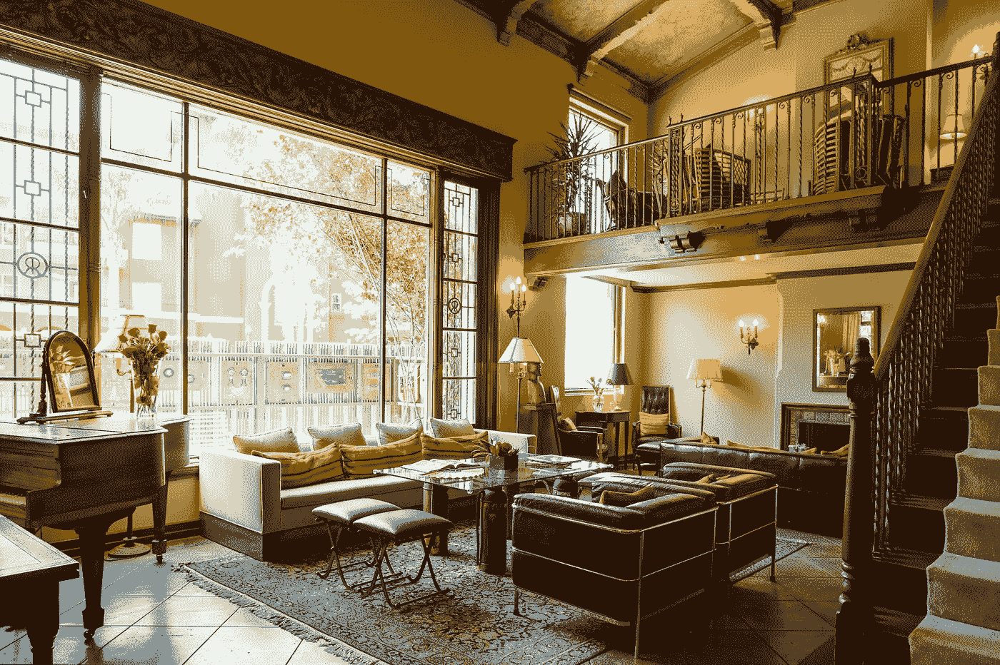***

***[Rita House](https://www.ritahouse.com/new-gallery/)***

*****二十八。** [**点燃空间**](https://www.ignitedspaces.com/)
点燃空间是一个共同工作的空间和工作室概念，点燃空间通过其内容创作资源和促进艺术成长的环境来迎合创作者。它位于城市的中心创意中心(好莱坞和 DTLA 的时尚区),是构思和创作的最佳地点。***

*****29。**[**Procolo.Co**](https://procolo.co/)
Procolo.Co 为企业提供了一个绝佳的合作空间，是当地初创公司、创造者和新的卫星团队成长的完美之地。15，000 平方英尺的空间还为那些寻找更多空间的人提供了六个独特的套房。Procolo.co 设计精良，距离站台、Hayden Tract 和地铁 Expo 线仅一箭之遥，其优越的地理位置使其成为洛杉矶最令人垂涎的合作空间之一。***

***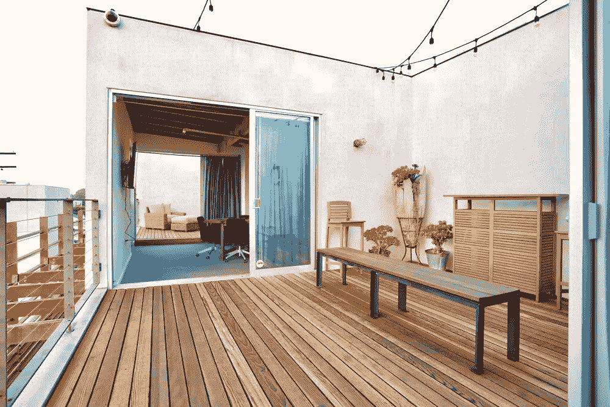***

***[Procolo.Co](https://www.smartpreneur.com/workshops/)***

# ***利基焦点***

***三十岁。[**Glitch City**](https://glitch.city/)
迎合了独立艺术家和游戏开发者的需求，Glitch City 为多学科创作者提供了一个聚集和协作的空间。他们专注于建立一个强大、紧密的成员社区，因此不会对不速之客开放。欢迎那些觉得自己非常适合的人在他们的网站上申请成为会员。***

*****31。**[**Kleverdog co working**](http://kleverdogcoworking.com/)
爱狗人士的天堂🐶— Kleverdog Coworking 欢迎你带上你毛茸茸的朋友一起去工作！他们有各种各样的会员计划，从兼职的弹性办公桌到一间办公室里 3 张固定的指定办公桌，并配有一扇带锁的门，供你和你的同事共享。***

*****32。**[**LA 中心**](https://www.thehubla.com/)
LA 中心是一个注重影响力的共同工作空间，面向有社会意识的企业家、公民领袖、非营利领袖和其他致力于建设可持续经济的人。它是全球网络 Impact Hub[的一部分，致力于创建企业家社区，为世界上最紧迫的问题提供解决方案。](https://impacthub.net/)***

***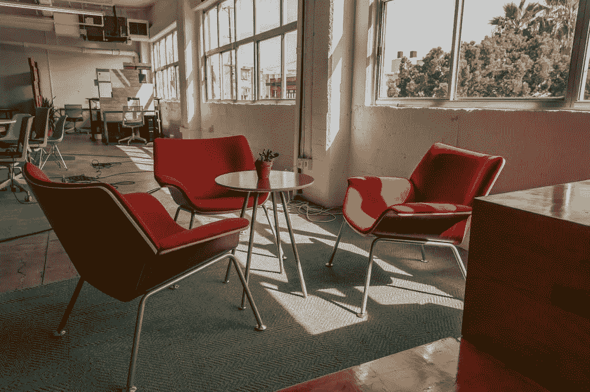***

***[The Hub LA](https://www.builtinla.com/sites/www.builtinla.com/files/laincubators_impacthubla.jpg)***

*****33。**一些会员特权包括 WriterDuet(一种合作编剧软件)专业版的 45%折扣和每周三的免费华夫饼！无论你是一个出版的小说家还是有抱负的博客作者，孵化出版社欢迎来自所有领域和背景的作家。***

***34。[**Metro Co-Lab**](http://metrocolab.org/)Metro Co-Lab 是一个由基督教价值观驱动的合作空间。位于圣莫尼卡的大都会，一个基于捐赠的咖啡馆，距离第三街长廊和海滩只有几个街区，这个地方还举办每周一次的周日服务。我过去就在这家咖啡店附近的街道上工作，非常喜欢这里的自然光线和整体氛围。他们还有镇上最友好的咖啡师——对唐尼和杰克来说！:)***

***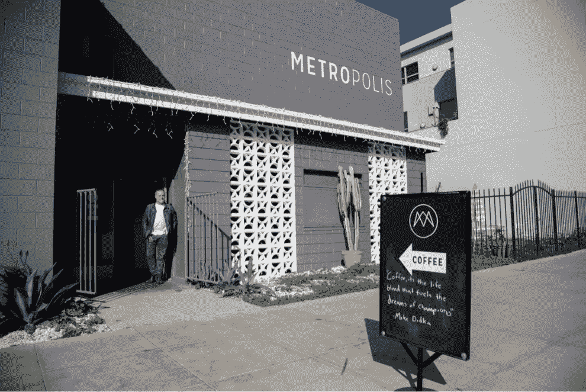***

***[Metropolis](https://togetherla.net/metro-calvary-chapel-metropolis-beyond-sunday/)***

*****35。**[**Paragon Spaces**](https://paragoncoin.com/login)
Paragon Spaces 是在大麻行业工作的人一直缺乏合作空间的情况下构思出来的。尽管娱乐性大麻合法化，但这种物质的使用仍然处于灰色地带，这使得许多初创公司无法出租工作场所。这个联合工作空间由区块链科技公司 Paragon 创建，专注于为大麻行业带来透明度，目前正在接受申请，并将只接受通过他们自己的加密货币支付。***

*****36。** [**百里香艺术**](https://www.thymelearts.com/)
作为东好莱坞的一个表演艺术孵化器，百里香艺术迎合了那些寻求走到一起创作新作品的艺术家们的需求。除了共享工作区和办公室，他们还有多个排练室和一个舞蹈室。***

***37。[**Biz Babez**](https://www.bizbabez.la/)几周前我有幸得到了拜访 Biz Babez 的机会！联合创始人之一 Dani 经营着自己的可持续服装品牌 Dazey LA，与她的朋友 taryn 一起创办了 Biz Babez，Taryn 是一位企业家，也有自己的素食主题服装品牌 Vegetaryn。作为小企业主，两个女人都怀念有同事和随之而来的社会交往，这就是 Biz Babez 的想法是如何产生的。位于 DTLA 市中心的联合工作空间迎合年轻的女性创意企业家，并专注于培养一个紧密团结的女性社区，她们相互激励、支持和合作。***

***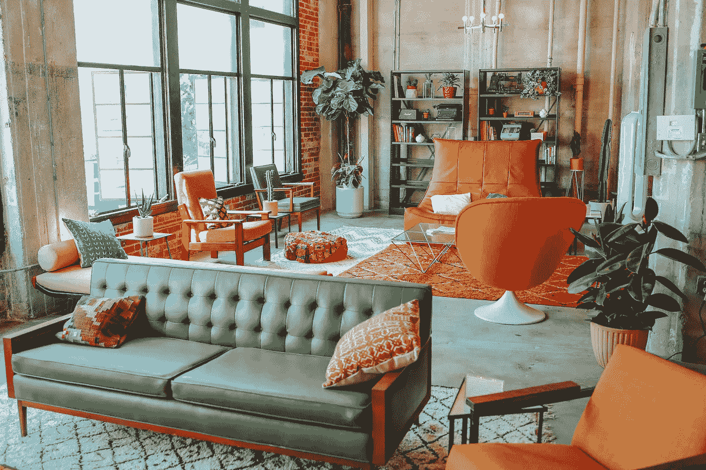***

***[Biz Babez](https://www.bizbabez.la/photos/#itemId=59f22bef8e7b0f2fb05a4931)***

******原帖***[***https://www . unosusanto . com/blog/the-complete-guide-to-co-working-spaces-in-la***](https://www.unosusanto.com/blog/the-complete-guide-to-coworking-spaces-in-la)***

> ******喜欢读什么？去访问我的*** [***博客***](https://www.unosusanto.com/blog/) ***找到更多我写的文章！也可以随时关注我的*** [***推特***](https://twitter.com/unosusanto) ***和***[***insta gram***](https://www.instagram.com/unosusanto/)***敬请关注最新更新:)******

******

## ***这篇文章发表在 [The Startup](https://medium.com/swlh) 上，这是 Medium 最大的创业刊物，有+ 371，663 人关注。***

## ***在这里订阅接收[我们的头条新闻](http://growthsupply.com/the-startup-newsletter/)。***

******