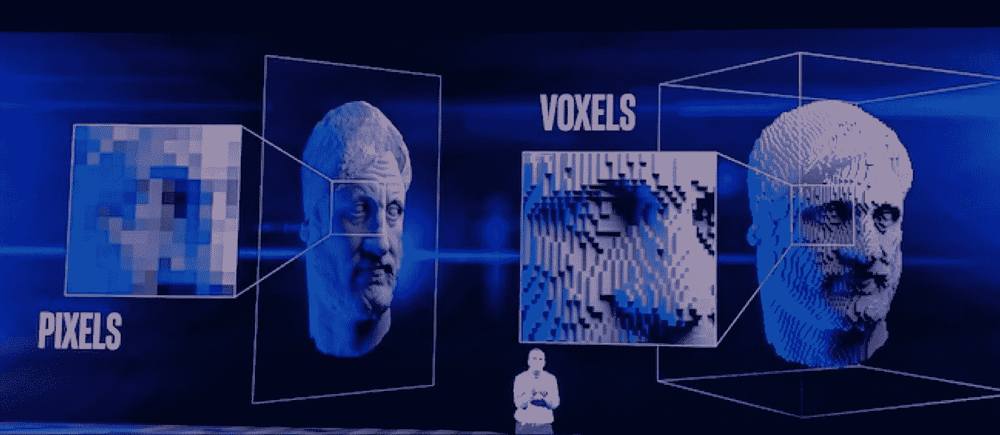

# 互联世界

> 原文：<https://medium.com/swlh/the-connected-world-3f647141bf3b>

**Intel’s presentation @ CES 2018**

我们生活在一个非常有趣的时代，在这个时代，我们之间的联系，我们的同龄人，我们的亲人，然后我们的设备，我们的汽车，我们的公共事业都结合起来，形成了一个动态的网格。在每年举行的消费电子展(CES)上，所有这些都汇聚在英特尔的展厅里

事实上，史蒂夫·乔布斯在设计中最看重的是建立联系的能力。设计师的工作就是建立联系，看到别人看不到的图案。但是如果你的电脑这么做了呢？还会是电脑吗？下面是英特尔 CES 2018 更新的链接

Intel’s Event @ CES 2018: Video by [The Verge](http://theverge.com)

我们工作室的人喜欢整个演示，它引发了一些非常好的对话，我将在下面尽力捕捉。

# 体素

当我在 CES 上看到英特尔展示的这个产品时，我可能吓了一跳。体素是定义三维空间中的点的图形信息单位。它由一系列 5K 摄像机拍摄，每分钟产生高达 3TB 的数据。立体视频(输出)使观众能够从任何角度观看其内容。想象一下，如果你要去看一场板球比赛，立体视频可以让你在投球手投球时从他的角度观看比赛。或者让你从射手的角度看一次射门。在我们看来，它给你提供了多种视角或观点，打开了一个可能性的世界。

更多关于体素的信息[点击这里](http://whatis.techtarget.com/definition/voxel)

# 神经形态计算

能够像人类一样感知的计算机。识别模式，并在此基础上做出决定。虽然在介绍中只是简单介绍。

这将模仿大脑观察、学习和理解的方式。我们觉得这将人机交互的规则向前推进了一步，为机器带来了创造力和决策能力，但时间会告诉我们这是如何展开的。虽然这有无限的可能性，但最好的应用是更好地利用人类的判断。

# 自治的

像汽车和无人驾驶飞机这样的自动驾驶汽车似乎是未来的趋势。我们强烈地感受到这一点，因为它将消除人们控制、驾驶的需要。也许这将解决像公路暴怒这样的问题，阻止事故的发生。也许我想得太多了🙂但是有一个可爱的框架，包括设置传感器，绘制环境和数据，以及一套规则来确保这些车辆的功能。

这真的打开了我们的思路，让我们从技术、设计和商业的角度去思考什么是可能的，并把我们的工作室变成了一个下午的论坛。

虽然我们感到兴奋，并开始考虑未来的互联和智能世界，但作为倡导者，我们觉得有责任继续以人为本的设计，以及技术如何才能最好地利用我们人类已经拥有的优势🙂

**我们喜欢你的想法，人类同胞？**

*您可以关注我们的* [*脸书*](https://www.facebook.com/monsoonfish)*/*[*LinkedIn*](https://www.linkedin.com/company/13404751/)*/*[*Twitter*](https://twitter.com/monsoonfishy)*/*[*Dribbble*](https://dribbble.com/monsoonfish)

*原载于 2018 年 1 月 15 日*[*monsoonfish.com*](http://monsoonfish.com/blog/connected-world-ces/)*。*

## 这篇文章发表在 [The Startup](https://medium.com/swlh) 上，这是 Medium 最大的创业刊物，拥有 284，454+人。

## 在这里订阅接收[我们的头条新闻](http://growthsupply.com/the-startup-newsletter/)。

