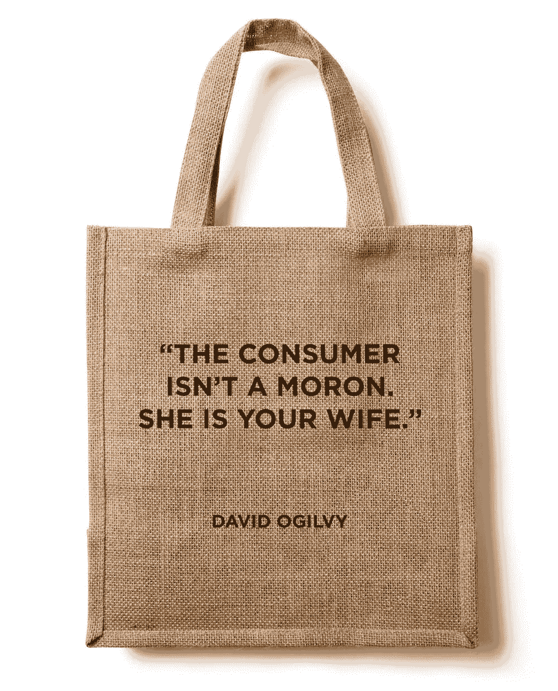

# 消费者不是傻瓜

> 原文：<https://medium.com/swlh/the-consumer-isn-t-a-moron-c0e58ed2baae>

[Credit](https://dribbble.com/shots/1740229-Free-Eco-Bag-Mockup)

# 3,520,934

## 那是今天[写的博文数量](http://www.worldometers.info/blogs/)。

# 5,740,000,000

## 这是每天谷歌搜索[的数量](http://www.statisticbrain.com/google-searches/)。

# 782,651,327

## 这是[今天](http://www.internetlivestats.com/twitter-statistics/)发送的推文数量。