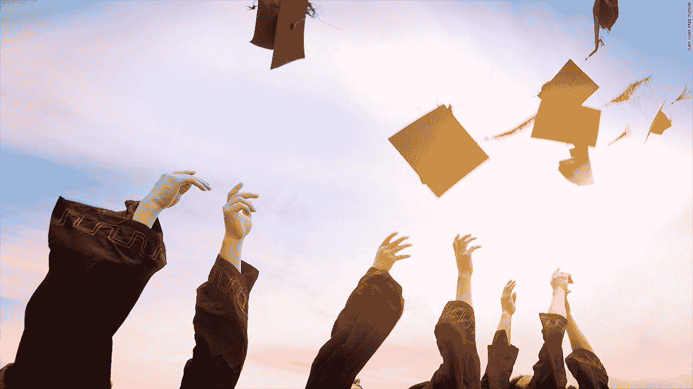

# 免学费的成本

> 原文：<https://medium.com/swlh/the-cost-of-free-tuition-5539b2356d43>

本杰明·斯卡德尔

我在一个被教育包围的家庭中长大。我的父母都是大学和高中教师，这表现在他们的教育中。童年时，我非常重视阅读和学校的重要性，因此我从不认为大学是一项遥不可及的任务，而更多的是一种天赋。我理解高等教育的重要性，并且相信每个人都应该能够获得高等教育。我甚至一度认为，高校免学费是实现所有人平等获得教育机会的可行途径。

但它不是，也永远不会是。

纵观人类历史，人民的教育水平一直是一个社会成功、进步和强大的标志。我们回顾文明，例如罗马人或希腊人，对他们教育人民承担责任的能力感到钦佩。

现在，对于那些负担得起的人来说，可获得的教育水平是非凡的，著名的学院和大学分散在全国各地。但是今天，我们努力让每个人都有机会接受教育，获得大学能提供的更高层次的学习。经济机会是独特的，每个人都有不同的情况，受过多的因素影响。这就提出了一个问题，个人的教育机会是否应该受到经济手段的影响？解决方案如何才能成功实施？

这就是理想主义者和经济学家介入的地方，他们正在讨论将大学生免学费纳入政府政策的想法。这个错综复杂的难题的第一部分是“免费”意味着什么。在这种情况下，“免费”意味着上学的费用不会落在学生身上，而是落在政府身上，然后是纳税人身上。人们将如何实施、接受和支持这一切，都属于这种理想的整体复杂性。

很明显，绝大多数人支持受过教育的公众，并且理解免学费对下一代的好处。因为我们觉得有道德义务让所有人都有平等的受教育机会，不管他们的经济阶层如何，所以许多人成了理想主义的牺牲品。作为在全国范围内争取免学费的杰出人物，[伯尼·桑德斯](https://www.cnbc.com/2017/10/10/bernie-sanders-we-need-to-make-college-free-to-make-america-great.html)说，“每个有愿望和能力的人都应该能够接受大学教育，不管他们的背景和支付能力如何”。他是对的，这不是一个激进的想法，但也不是一个现实的可能性。不应该反对每个人都应该能够接受他们所渴望的教育，因为无数的好处将大大改善我们的社会。但是，如果我们作为人决定将我们的期望建立在一个不切实际的概念上，比如免学费，当这些期望没有得到满足时，我们不仅会不满意，而且我们彼此之间的互动也会被消除，破坏防止我们国家崩溃的最强有力的纽带。

美利坚合众国是一个多种经济阶层融合和交流的国家。然而，基于经济阶层的歧视是一个非常现实的问题。虽然没有基于课外的有意拒绝，但那些没有可用机会的人被困在他们当前的处境中，没有非常有限的方法出去。在一个金钱真正重要的领域，一种对抗这种无意歧视的解决方案已经形成；大学。理想主义者支持免学费的主要理由是，不管收入多少，这将为所有人创造平等的受教育机会。表面上看是这样，直到对高中甚至小学的影响被意识到。

对于那些已经负担得起大学学费的人来说，随着对高中成绩的重视程度提高，他们的关注点将会简单地转移到获得最好的成绩单上。你家庭的经济状况将再次发挥作用，因为最好的 SAT 备考、夏令营、导师和私立学校将是获得进一步教育的必要条件。许多人认为，一些人的财政优势绝不会消失，但它只会从大学转移到大学预科。

学院和大学免学费会影响美国人的社会交往，这种想法很少被考虑。随着学生的高中生涯越来越重要，越来越多的学生将被鼓励进入通常不会进入的私立学校，因为它们在历史上提供了更多的大学入学机会。随着出勤率的这种变化，有能力上私立学校的人和没钱上私立学校的人之间会产生更大的两极分化；或者更简单地说，越富越穷。随着这两个群体之间的互动越来越少，美国人民之间将进一步分化为富人和穷人，这种分化将远远大于现有的分化。

如果将免学费纳入政府政策，肯定会产生社会和经济影响，但这个想法首先必须是有效的。为了有效，它必须考虑所有的经济因素，因为它们会改变计划的实际实施。很少被考虑的一个最重要的因素是免费普及大学的实际必要性。哈佛大学的一位经济学家埃里克·马斯金说:“许多学生能够为他们的高等教育支付相当多的费用。让他们搭便车是一种浪费”。当构建任何大的财政计划时，资源的分配必须高效且深思熟虑。允许那些已经能够负担得起部分(如果不是全部)大学学费的人免学费，是不负责任的财政行为，因为这些资金可以用于更有益和更重要的需求。重要的是要明白，免学费背后的意图是在社会中创造一种更大的平等感，但实际上可能会发生相反的情况，因为好处将更多地落在那些已经负担得起大学的人身上，而不是那些需要大学的人身上。

由于许多人不需要免学费，这不仅是对税收的严重浪费，还会产生负面影响，因为大学费用可能会增加。第一信托顾问公司的首席经济学家 Brian Wesbury 声称:“当你免费赠送一些东西时，对它的需求就会增加，当需求增加时，价格就会上涨。我们已经知道学生贷款对大学费用造成了什么影响。类似于学生贷款流行的时候，大学将意识到为了盈利，他们将不得不提高上学的费用，超过政府愿意支付的费用。必须明白，私立大学是一门生意，即使是以教育为主要目标，盈利的想法也隐藏在表面之下。即使政府决定通过简单地同意支付任何额外的金额来对抗大学不断增长的成本，税收也会呈指数增长，因为大学和政府会不断地迫使对方提高成本。由于对利润的关注，私立大学免学费的想法将比公立大学更不切实际，因为价格将不受控制，税收将飙升。当从整体上看待免学费的概念时，我们可以清楚地看到这个想法实际上是多么不现实，因为在我们的社会中实施这样的计划实际上永远不会成功。

我们作为一个国家可以一致同意，社会只会受益于更高的人民教育水平。当人们被教育到一个责任点时，可以做出更明智、更认真、更有影响力的决策。在一个理想的世界里，免学费可能是实现这一目标的有效途径，但这在美国是行不通的。除了产生与预期相反的效果之外，还会出现更大的贫富差距，个人的经济状况仍然很重要。免学费无疑会增加税收，让很大一部分人感到不安。总的来说，这个概念在我们的社会中根本行不通，因为意想不到的负面影响和人们的愤怒会将免学费从政府政策中挤出去。

通过最初取消大学费用，不仅上学费用可能会增加，而且富人和穷人的世界会简单地级联到高中环境中。财富的两极分化和阶级之间缺乏互动不会像许多人认为的那样被消除，而是实际上会在整个社会得到加强。从整体上看高校免学费的概念，很容易理解为是一个复杂的话题，影响因素很多。作为具有道德价值观的好公民，我们看到了这种想法背后的原因，以及如果它成功地应用到美国社会中会带来的好处。

但不会，也永远不会。

## 这篇文章发表在《创业公司》杂志上，这是 Medium 最大的创业刊物，有 310，796 人关注。

## 订阅接收[我们的头条](http://growthsupply.com/the-startup-newsletter/)。

