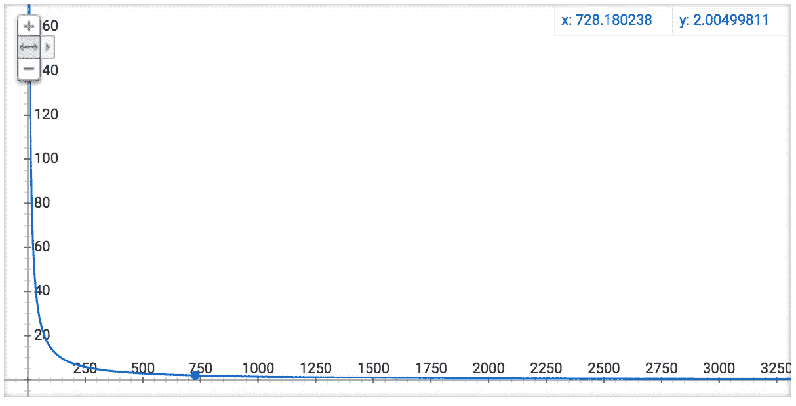
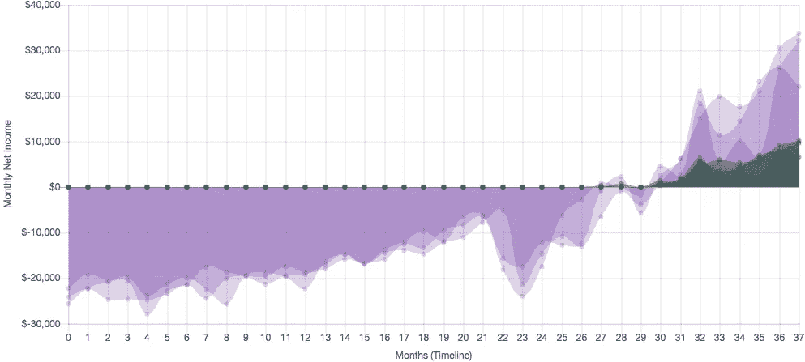
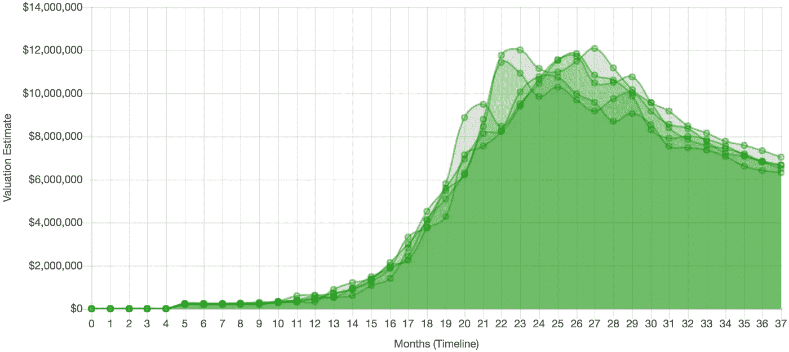

# 提高 Earnest 的成本:对 Earnest Capital 的共享收益协议(海豹突击队)的评论

> 原文：<https://medium.com/swlh/the-cost-of-raising-earnest-a-review-of-earnest-capitals-shared-earnings-agreement-seal-2cf68c099ddc>

Photo by [Kari Shea](https://unsplash.com/photos/FZU6emgWeaQ?utm_source=unsplash&utm_medium=referral&utm_content=creditCopyText) on [Unsplash](https://unsplash.com/search/photos/apple?utm_source=unsplash&utm_medium=referral&utm_content=creditCopyText)

【2006 年至 2012 年，我从一个朋友那里借了 4 万美元给[*bootstrap storm pulse*](/swlh/how-we-bootstrapped-a-weather-startup-b3f0463839d4)*(一家盈利的 SaaS 企业，拥有 2000 名订户和 600 万名访客)，然后通过可转换票据和风险资本的定价轮次筹集了 330 万美元，转向了企业 SaaS，并拥有*[*【risk pulse*](https://riskpulse.com)*，在那里我从 2013 年至 2018 年担任首席执行官。以下是我对共享收益协议(或海豹突击队)第一版的评论，这是由 Earnest Capital 撰写的创业融资的新结构。*

“为创业者、制造商和独立创业者提供早期融资”的第一家投资公司 arnest Capital 发布了他们的第一份投资意向书，亲切地称之为海豹突击队。可以在线阅读最新版。因为最新的版本可能会改变，所以我做了一份拷贝来记录我今天要查看的版本。你可以在这里找到它。

虽然伴随着这份文件，出现了一系列关于真实资本的报道和讨论，但还没有对海豹突击队和其他形式的资本进行深入的批评或比较。我想提出我自己的评论，从两个方面来看这个金融工具对企业家的成本:美元和股权。

由于海豹突击队的混合债务/股权性质，这种分别检查美元成本和股权成本的方法是一种走钢丝的方法。但是如果我们要理解这个乐器的整体，我们需要确保我们完全理解它的各个部分。一旦我们做到了，我们就能重建整体并理解它是如何工作的。

最后一点:Earnest Capital 创作了海豹突击队结构，但他们也对其进行了开源，因此其他投资者如果愿意也可以采用它，用于自己的投资。这种开源投资结构的*模式*类似于 YCombinator 对 [SAFE](https://www.ycombinator.com/documents/) 所做的。这对这次审查意味着什么？在整篇文章中，我将大量引用 Earnest，但这并不意味着他们打算让海豹突击队成为他们公司的专属。我自己的意图是，这种分析对任何坐在谈判桌上、头顶海豹突击队、独立于另一边投资者的创始人都有帮助。

# 海豹突击队 101 大楼

在我们深入研究术语和成本之前，先来看一下结构概述:

*   投资者最初并不通过共享收益协议(或海豹突击队)获得股权，但它确实有股权条款，因此它可以在以后为投资者创造所有权。
*   海豹突击队不是贷款:它没有明确的利率或偿还时间表，但在规定必须偿还的意义上，它是一种负债。
*   回报以“创始人收入”的最低百分比出现，假设创始人的工资低于某个阈值，则等于净收入。条款清单的样板上写着 30%。
*   海豹突击队不需要个人担保，也没有止赎条款——如果你无法偿还，投资者没有追索权。
*   投资回收期在签署协议时设定，基于原始投资的倍数(通常为 3 倍、4 倍或 5 倍)。原始投资乘以这个 3x-5x 的乘积称为回报上限。
*   与可转换债券类似，海豹突击队定义了一个估值上限，实际上设定了投资者在未来任何融资中可能面临的每股最高价格。
*   海豹突击队的是一种种子工具，旨在服务于收入后但仍处于早期阶段的创始人。
*   作为一种借贷和投资的混合结构，海豹突击队的债券与可转换债券和外管局的债券属于同一大类。

> “这种结构的全部意义在于，让我们与创始人重新结盟。”— [Tyler Tringas，Earnest Capital](https://www.useloom.com/share/194b289ac5104310a60190a0bdcb6f67)

表面上看，这听起来很有趣。那么，创始人应该如何决定海豹突击队是否适合他们呢？让我们从美元(现金)和股权(所有权)的角度来思考通过海豹突击队接受资本的成本。

# 印章打字

虽然海豹突击队不是一种传统的贷款，但它是一种债务，尽管是一种更友好的债务。由于不需要任何个人担保，它比学生贷款更有利于创业者。它也没有任何还款时间表。付款时间完全由你决定；没有早或晚的概念。尽管我们将会看到，这些概念确实与海豹突击队的资本成本有关。

**这些永恒的特征和个人担保的缺乏，使得与传统风险债务或银行贷款的比较变得困难，甚至不公平。**

然而，在本节的其余部分，我将有意地做几个这样的比较，*并不是说像个人信用卡这样的东西可以或者应该取代海豹突击队*，而是为你提供一个熟悉的参考点，关于各种形式的借贷资本的美元成本。你不应该选择狼而不是哈士奇作为你的家庭监护人，只是因为你知道狼更大。但如果你想了解狗的解剖学和遗传学，你可以通过比较它们的身体特征来了解很多东西——不是为了判断谁是赢家，而是为了了解大自然为什么以这种方式设计它们，解释它们在食物链中的位置，并预测它们是否会在新环境中茁壮成长。

同样，我们可以通过比较借款的各种形式因素和特征来了解借款的本质，我们可以问自己，像海豹突击队这样的新工具是否会在[新的 bootstrapper 融资环境](/swlh/the-new-bootstrappers-how-alternative-funding-models-are-embracing-founder-lifestyles-bd66a6656120)中表现良好。

> 一旦这一领域的融资选择增加，海豹突击队(就现金而言)的条款将需要变得更加有利。

# 海豹突击队资本成本，以美元计

就美元成本比较而言，会计已经发明了一种可以用来衡量各种形式的资本随着时间推移的成本的度量标准:利息。出于我们的目的，我们可以方便地使用年化利率(APR)——与你在信用卡账单和抵押贷款利率上看到的指标相同(是的，明智的做法是，你也不应该为你的房子再融资来资助你的创业)。

海豹突击队没有明确的利率，更不用说年利率，但这并不是因为资本是免费的，甚至是廉价的。相反，海豹突击队的条款没有提到利率，因为它实际上是可变的，而不是固定的。换句话说，没有办法用一个单一的数字来表示海豹突击队的利率，这个数字在所有时间点都是真实的，或者在所有海豹突击队情况下都是通用的。

这并不罕见。大多数创始人应该熟悉可变利率抵押贷款的概念。根据市场情况，利率会随着时间的推移而波动。以下是 1963 年至 2015 年美国利率的变化情况:

An example of a dynamic (variable) interest rate.

那么海豹突击队呢？实际上，当我们绘制一笔海豹突击队融资的年利率时，我们看到的情况与上面的图表非常不同。我们看到的不是起伏的山丘和山谷，而是一条从无穷远处开始的曲线，随着时间的推移，它的长尾接近 0%(但在你有生之年不会到达)。

对于有 4x 回报上限的海豹突击队，日 APR 如下:

Effective Interest Rate for SEAL with 4x Return Cap (f(x)=1460/x Graph Credit: Google Search)

y 轴是用整数表示的。要获得更熟悉的百分比形式，将 y 值乘以 100，即 20 = 2，000%，80 = 8，000%，等等。如你所见，回收期越长，年利率越低。

但是，‘低’只是相对于自身而言的；事实上，与其他有义务回报的资本形式相比，海豹突击队的资本是极其昂贵的。继续这个例子，如果你在一个有 4 倍回报上限的海豹突击队上拿了 150，000 美元，图表显示 2 年后 APR 仍然是 200%(第 728 天，蓝点)。除了海豹突击队的其他好处，第二年的资本成本仍然是大多数信用卡的 10 倍(年利率 15-25%)。直到第 20 年，年利率才进入信用卡领域(20%)。为了与典型的可转换票据的利率(10%)相匹配？40 年。

虽然这些其他工具不是替代品或等价物，但创始人最好考虑一下 3-5 倍的权重。

但是对创始人来说，海豹突击队资本最个人化的美元成本是 [**【低但公平】的创始人薪水**](https://earnestcapital.com/funding-for-bootstrappers/) 的概念。这个术语让海豹突击队的投资者能够划出一条线，超过这条线的创始人薪酬将被视为创始人收入的一部分，即计入净利润，因此投资者将分享一定比例的收入。

多低才算公平？截至今天，样板条款清单中还没有任何指导，但这个术语可能会使那些被困在生活水平很难改变的企业世界中的创始人失去资格——汽车贷款、抵押贷款和学费等成本往往是固定的。这是另一个条款，资金来源的竞争应该将“更高但公平”的数字写入海豹突击队条款清单。

# 我们到了吗？

实际上，一家海豹突击队投资的初创公司需要多长时间才能收回回报上限？这张 [SimSaaS](https://simsaas.co) 图展示了一家拥有稳固市场发展势头的初创公司的幸运未来。让我们假设他们在海豹突击队接受了 250，000 美元的融资，而他们在 MRR 有 3，000 美元(图表中的第 0 个月):

3-Year Revenue Forecast (MRR) for SMB SaaS Company Growing 10% MoM (Credit: [SimSaaS](https://simsaas.co))

250，000 美元使创始人能够全职工作，并忍受最初一段时间的负净收入(0 美元线以下的紫色部分)，直到第 27 个月实现盈利(基于 P&L)，那时他们的收入达到每月 5 万美元。为什么是这个数字？根据模拟，他们不得不雇用一些额外的团队成员来支持他们不断增长的客户群和业务。

3-Year Net Income Forecast for SMB SaaS Company Growing 10% MoM (Credit: [SimSaaS](https://simsaas.co))

深绿色部分代表支付给 Earnest 的净收入的 30%。到模拟的第 38 个月，总额为 43，596 美元。在以 4 倍回报上限倍数获得 25 万美元后，Earnest 的未付部分为 956，404 美元。假设创始人将所有新获得的利润(3 万美元/月)投入到回报中，为了尽可能缩短债务期限而放缓增长，向 Earnest 的最终付款将在大约两年半(约 31 个月)后发生。

当然，这不是创始人*应该做的事情，因为他们需要现金来实现增长，而他们等待的时间越长，APR 实际上就越低。相反，他们应该做的是支付最低费用，这将需要 8 年多一点的时间来完成每月 1 万美元的投资回报。虽然比抵押贷款短得多，但八年的欠款时间可能会很长，尤其是在创业领域，一年可能会感觉像十年。*

由于大多数创始人无法获得不需要抵押或担保的资本，海豹突击队提供的现金如此昂贵有什么关系吗？也许不是；但是我们仍然可以利用这个事实来预测，一旦这个空间中的融资选项的数量增加，这个维度上的海豹突击队的条款将需要变得更加有利。

> 你被介绍给 Stripe 的风险投资伙伴，他们表示愿意以 1000 万美元的估值投资 100 万美元。

# 权益中的海豹突击队资本成本

现金并不是海豹突击队融资的唯一成本。其创造者[保证金](https://earnestcapital.com/shared-earnings-agreement/)在其 [14 个条款](https://docs.google.com/document/d/1MoLiH_VnhX-0vfZ1zgMSfpcIt0rdyD9rc27BbypplDI/edit)中的 6 个条款中包含了股权条款:

1.  **股权基础:**这是欧内斯特对他们所有权的定义。因此，可以预见的是，两次计算中的*大于*。一种计算方法是简单地计算原始投资额还剩多少。另一个计算方法是回报上限——投资金额乘以 3-5 倍(现在是 4 倍)。这个定义将在别处被替代。
2.  **股权转换:**这允许 Earnest 将他们的股权基础(见上文)以最低的每股价格转换成你的创业公司的股份。他们在比较什么价格？首先，他们会查看与你签署的条款清单中估值上限所隐含的股价。其次，他们关注新投资者支付的每股价格。
3.  估值上限:这个数字为 Earnest 购买一股你的初创公司股票的价格设定了上限。计算时，用这个数字(例如 2，500，000 美元)除以你的股份数(或单位数，如果是有限责任公司)。许多创业公司从为创始人发行 10，000，000 股普通股开始。如果你在估值上限为 250 万美元的海豹突击队上融资 15 万美元，Earnest 的最高每股价格将为 0.25 美元。
4.  **销售:**该条款规定，如果你的公司被收购，Earnest 有权获得最大收益。这是通过比较股权基础(例如，如果你以 4 倍的价格获得 15 万美元，则为 60 万美元)和以估价上限价格购买的股票的市场价值，使用回报上限的任何部分来确定的。
5.  **参与权:**如果你筹集更多的资金，Earnest 有机会投入足够的资金来保留他们的股份(所有权百分比)，而不会遭受稀释。因此，如果他们通过股权转换条款(上面的第 2 条)拥有 10%的股份，而你筹集了资金，他们必须有机会投入足够的资金来保持他们的所有权比例，这样他们在融资完成后仍然拥有 10%的股份。
6.  **剩余股权:**在其网站上被列为海豹突击队的关键属性(但尚未在条款中定义)，是另一个股权组成部分。Earnest [写道](https://earnestcapital.com/shared-earnings-agreement/)**在大多数情况下，如果你出售公司或筹集更多资金，我们会同意 Earnest 的长期剩余股份。我们希望长期留在你的团队中，但不想给你任何“退出”的压力。"*鉴于在发布本文时没有可用的计算方法，目前不可能量化这一关键属性的成本；现在，我们将简单地记住这一额外的所有权份额，并假设这是一个有意义的规模，足以让投资者费心去包括它。残留的木桩，神秘的肉。*

*如果用美元衡量的资本成本最好用机会成本来表达，那么用权益衡量的资本成本最好用投资者的选择权来表达。而且，正如所料，这些条款最大限度地认真。*

*什么是可选性？选择性是指保留选择最有益结果的能力，尤其是在披露新信息之后。这与被迫接受一个结果正好相反。还记得那些*选择你自己的冒险*书中的最后一个决定点，选择第 23 页而不是第 101 页，因为第 101 页说你没有得到宝藏吗？这就是工作中的选择性。*

*在条款清单中，你通过*设定*风险上限和回报下限以及*尽可能长时间地保持*这些界限，为你创造了选择权。更好的是，这些界限不仅不会消失，而且会根据基于新信息(公司的出售、未来的融资和利润)的计算重新设定。*

*这是在权益基础、权益转换和销售条款中，当提到“较大者”或“较低者”时发生的情况不管将来发生什么，Earnest 总是以尽可能低的价格获得尽可能多的所有权，以获得尽可能大的成果。这是一门选修课。*

***这种选择性意味着创始人在海豹突击队融资的股权成本很高。**多高？当然，要看情况。让我们考虑一个场景:*

1.  *你签署了一笔 25 万美元的现金注入，使用海豹突击队，估值上限为 350 万美元，回报上限为 4 倍。*
2.  *墨迹未干之后，投资者的预期回报是 1，000，000 美元(250，250k * 4x 美元)。*
3.  *你辞掉你的日常工作，开始发展你的业务。*

*到目前为止，这与上面的场景相匹配。然而，这一次，你意识到事情真的起飞了；增长更快，你作为这个增长率的反映的估值很诱人。这张 [SimSaaS](https://simsaas.co) 图表显示了大约两年后的 1000 万美元风险估值(在你当前的增长不可避免地开始放缓之前):*

**

*Venture Valuation Forecast Using Growth Rate Multiple on ARR (Graph Credit: [SimSaaS](https://simsaas.co))*

*你被介绍给 Stripe 的[风险合伙人，他们说他们同样对你的远见和吸引力印象深刻，并愿意以你偏好的 1000 万美元估值投资 100 万美元。](https://stripe.com/partner-program)*

*你很激动并接受了。*

*在这个场景中 Earnest 得到了什么？馅饼是如何切片的？*

*在这种情况下，你接近盈亏平衡，还没有达到盈利能力。返回上限的全部 100 万美元仍然存在。受到增长的刺激，Earnest 选择根据股权转换条款使用他们的权利，将 100 万美元变成所有权。如果他们使用新一轮融资设定的估值(1000 万美元)，他们的所有权将与 Stripe 相同:8.3%(100 万美元除以 1200 万美元的融资后估值)。但是他们不需要。相反，他们使用 350 万美元的估值上限，他们在融资后的持股比例为 28.6%。*

*冒了 25 万美元风险的欧内斯特现在是你最大的投资者股东，是你的 3.4 倍。*

*严格来说，相对于其他投资类型，这种投资的成本有多高？如果你使用一种普通的种子期可转换票据，单利 8%，同样的估值上限为 350 万美元，那么他们新一轮的股权基础将是 29 万美元(25 万美元+ 8% * 2 年)，相当于 8.2%的股权，这是 YC 的种子期前投资的范围，但仍令人满意。*

*相反，你的第一批投资者现在拥有的股份几乎和你和你的联合创始人一样多。对 Earnest 来说，回报率上限的计算结果不错……但对你和你的新投资者来说，结果就不那么好了。鉴于他们声明的偏好是将现金返还给他们的有限合伙人，人们可能会认为这种结果不太可能出现，但这是一个明确的条件。如果他们拿走了他们的 28.3%，Stripe 拿走了他们的 8.3%，你和你的联合创始人之间的五五分成将缩小到 31 比 31。总的来说，你仍然是多数派(50%+)，但不再是超级多数派(67%+)。*

*股权成本裁决:在股权基础和估值上限的支持下，Earnest 相当于多个联合创始人在对他们最有利的时候，在你的所有权蛋糕上深深地切了一块。不幸的是，这些条款对你和你的新投资者来说都很糟糕，最有可能的结果是新投资永远不会发生。根据目前的条款，最佳成长期投资者将选择放弃投资海豹突击队资助的初创企业。出于这个原因，希望保留搭乘火箭的选择的创业者应该对海豹突击队的融资三思而后行。*

> *许多基金承诺对它们的投资组合公司来说不仅仅是钱；对于收取利润分成的投资者来说，兑现这一承诺至关重要。*

# *现购自运*

*既然我们已经分别计算了美元(债务)和股权(所有权)的成本，我们可以把它们放在一起，并问自己:是什么策略会让投资者把这些术语放在一起？*

*要回答这个问题，我们先来考虑种子投资者进行传统股权投资时会发生什么:他们给创始人现金以换取股票。企业家同意这种交换是因为:*

1.  *与他们的细价股不同，现金有能力让人们(包括他们自己和那些甚至还不相信创始人愿景的人)去做需要做的工作，以增加他们企业的价值；用沃伦·巴菲特的话来说，[每一美元钞票都是一张“对社会的索取支票”](https://www.youtube.com/watch?v=qnbO8BY2Jog)可以用来调集资源，将人们引向创始人想要的方向；和*
2.  *创始人知道，如果他们成功了，他们的企业将价值巨大，这将使他们能够通过未来的融资或流动性事件获得大量现金。到那时，现金将不再是稀缺资源，投资者可以获得他们的那部分收益，而不会对创始人在财富曲线上的新位置产生实质性影响。拥有 500 万美元和 700 万美元之间的差别不如 0 美元和 200 万美元之间的差别有价值。现金在个人层面的边际效用递减。*

***总结一下:在传统的种子投资中，创始人放弃了不稀缺的、有名义价值的(股票),而选择了稀缺的、有直接法定货币价值的(现金)。**这项交易的结果是，如果他或她成功，他还必须接受分享一定比例的现金。然而，到了那个时候，现金就不那么稀缺了，对企业家和企业的价值也比以前低了。*

***有了海豹突击队，事情就完全不同了。**当现金稀缺时，投资者向创始人提供现金，但他们自己对现金的获取(通过回报)会出现在收购或退出的非线性支出的这一边。这意味着现金仍然是一种稀缺资源。诚然，创始人本身在短期内也分享了现金，但这是因为他们积极地为企业工作，创造了比他们以现金形式获得的更多的价值。*

*与此同时，投资者正在收取租金，而且是一大笔租金。我说租金，而不是股息，因为他们的索赔是基于法律协议，而不是股权。在达到回报上限之前，这相当于 30%的利润，或者更多。*

***如果这个合作伙伴在运营上缺席，会让人感觉不公平。**许多基金承诺对其投资组合公司来说不仅仅是钱；对于收取利润分成的投资者来说，兑现这一承诺对于维持积极的创始人关系至关重要。*

*这种租金最终降低了投资者的投资风险，因为他们不从事企业价值的业务；换句话说，**当他们进行投资时，远不是*押注*退出，他们甚至没有*计算这种流动性事件的几率*；由于他们的选择性，他们不必。**相反，尽管现金稀缺，他们还是会作为合伙人接受一份利润，因为这在外部世界已经证明了经济价值。也就是说，除非你的股票变得明显更有价值，在这一点上，他们会转换轨道，捕捉股票的价值。*

> *以美元和股票计算，海豹突击队资本的高成本可能不会令人感到震惊。*

# *封印你的命运？*

*既然我们从投资者的角度理解了海豹突击队的成本、组成部分和整体战略，那么海豹突击队对创始人的效用呢？什么时候海豹突击队对企业家来说是一个好的金融产品？*

*Earnest 还没有给出任何适合他们产品的创业公司的具体例子，但我们可以想象这样一个企业的特点:当时间是绝对必要的确定性存在时，更便宜的资本来源是不可用的，到明年你的企业将会非常富有，坦率地说，现金的成本并不重要。与此同时，你很确定明年之后的增长*将会持平，这样以增长为基础的投资者无论如何都不会感兴趣，所以股权成本也无关紧要——你不打算融资。**

*换句话说，海豹突击队会给初创公司带来可预测的、稳定的现金流；一个货币供应通胀的小泡沫，抵消了海豹突击队的*事实上的* APR，让你忘记了回报上限和估值上限。风险投资家会对你缺乏雄心而目瞪口呆，但你正忙着泡在无聊的美元浴缸里，不会注意到这一点。*

*走这条路需要很大的把握。大多数创始人都不确定他们拥有什么，它会变得多大，什么时候会有多少利润，有一天会值多少钱。对[报](https://earnestcapital.com/shared-earnings-agreement/)语重心长:*

> *有时在业务的早期阶段，你不知道你是想建造一艘价值 10 亿美元的火箭船，还是一家主导利基市场的世界级公司，或者一家令人惊叹的生活方式企业 SEA 将所有选项留在桌面上，同时在计划发生变化时提供平稳过渡。*

*然而，正如我们所看到的，在实践中，海豹突击队的建议条款将要求这些创始人关闭其中一些选项的大门，这是早期创始人不应该*做的事情。**

*那么，早期风险投资是答案吗——外管局、可转换票据、定价股权融资？不。引用 DHH 的话来说，“在网络空间里，试图只做一家好的意大利餐馆的人太少了。”(我强烈推荐他的整个[谈](https://youtu.be/4TdZ_c5uhso?t=705))。*

*这又把我们带回到海豹突击队是干什么的问题上:海豹突击队是为了利用市场中的一个漏洞而创建的，那个意大利餐馆正好可以完美地坐落在这个空地上。不幸的是，虽然很诱人，但在当前的条件下，许多创始人可能会发现自己在未来的场景中“占便宜”正是这些条件的感觉。*

## *更好的方法？*

*这篇文章是对第一版《海豹突击队》的有意批评，该书旨在为卓越的创始人提供他们所需的资本，用泰勒·特林加斯的话说，就是建立“可盈利、可持续发展的公司”。这是一个崇高的目标，我希望这篇文章可以帮助那些创始人权衡利弊。*

*无论它是否会成为海豹突击队的未来版本，一种金融产品将会出现，它将创始人与渴望以风险和回报对称的方式合作的投资者联系起来。对双方来说，这种机会太大了，不可能不出现。在未来的一篇文章中，我将尝试勾勒出这一领域的新金融产品可能会是什么样子，使用 SimSaaS 来模拟资本的部署，同时关注成本和可选性。*

**你可以在 Medium 上关注我，或者在 twitter 上关注我*[*@ mattwensing*](https://twitter.com/mattwensing)*。如果你喜欢这篇文章中的分析，可以看看在线创建和分享财务预测的应用程序*[*【SimSaaS*](https://simsaas.co)*。**

**

## *这篇文章发表在 [The Startup](https://medium.com/swlh) 上，这是 Medium 最大的创业刊物，拥有+396，714 名读者。*

## *在这里订阅接收[我们的头条新闻](http://growthsupply.com/the-startup-newsletter/)。*

**