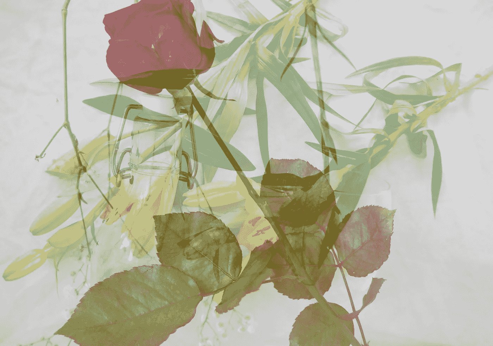

# 创造性沙盒方法:通过跨学科思维寻找想法

> 原文：<https://medium.com/swlh/the-creative-sandbox-method-finding-ideas-through-interdisciplinary-thinking-d89cdab3c3bf>

*本文原载于 2017 年 8 月。*

**创意沙箱是我的一个概念，它是一个跨学科的想法结合起来形成其他东西的空间。**

可能是书里的旁注。随想随记的笔记本。任何事情都可以进行的对话类型。奇怪的项目。

但这是一个空间，在这里我们将不同的学科和我们生活的一部分结合在一起，形成新的东西。这是一个空间，在这里我们可以看到它们之间的差距和重叠。

你知道当你睡着的时候，一堆奇怪的图像浮现在你脑海里的那些时刻吗？当一切都变得模糊不清时。

这就是当你以这种毫无压力的方式结合学科时的感觉。比如把底片叠放在一起，寻找新的图像。

最近，我一直在尝试将更多有创意的沙盒融入我的生活。自然的第一步是明确这意味着什么。这是我长期以来一直觉得有意义但却很难解释的一件奇特的事情。我试图在这里阐明一个模糊的、非常个人化的概念，所以我不确定它对其他人有多大意义。

[创造力](https://www.rosieleizrowice.com/blog/howtothinkcreatively)就是从一个领域窃取创意并应用到另一个领域。一个想法的酷之处在于它不会过期。它不会用完，如果你继续用新的方式使用它，它就不会磨损。

> 新闻通常不是新的。

我们对原创的最大希望是去别处看看。移动到图书馆中不同的书架。顺着切线走。查一个脚注。然后带着新鲜的洞察力回到最初的领域。

简单地说，跨学科学习就是同时结合不同的领域。这就是我们在小学所做的——每天就几个不同的主题上课。但是随着年龄的增长，我们不得不缩小范围，专注于一个领域。我们最终的研究领域越来越窄。自从离开正规教育，我一直投身于跨学科学习。

跨学科知识是多样化的一种方式。想法有时会被困在一个领域，而在其他地方会更好。

正如罗伯特·A·海因莱因所说:

> 一个人应该能够换尿布，策划入侵，杀猪，造船，设计建筑，写十四行诗，结算账目，建墙，接骨，安慰垂死的人，接受命令，发号施令，合作，独自行动，解方程，分析新问题，扔粪肥，给计算机编程，做一顿美味的饭菜，高效地战斗，英勇地死去。特殊化是为了昆虫。

创造性沙盒方法是关于使用跨学科的想法和思维，以一种无压力的方式来扩展我们的思维。我用了这个不可否认的俗气的名字，因为沙盒似乎是对低风险修补任何碰巧可用的东西的完美比喻。

以下是我认为是创造性沙盒的一些领域。

# A.多个同步项目

我倾向于同时做很多不同的项目。

他们总是以某种方式结束啮合。相似之处出现了。

我为一个人做的研究帮助了另一个人，我在一个人身上学到的技能在其他地方也有意义。在项目间切换总能消除创意障碍。事实上，我经常通过阅读一个完全不相关的话题来解决问题。一个连接产生火花，形成一个新的想法。

与其说是关于单个项目，不如说是它们之间的空间。将一个想法与另一个想法结合起来形成新东西的机会。或者告知正在进行的事情。

它让事情变得有趣——有趣是一个被低估的形容词。我们不是为无聊而生的，无聊总是导致枯燥的工作。我们需要多样性，正如约书亚·福尔在《与爱因斯坦一起漫步》 [*和《与爱因斯坦一起漫步】*](https://www.amazon.co.uk/gp/product/0141032138?ie=UTF8&tag=rosieleizr06-21&camp=1634&linkCode=xm2&creativeASIN=0141032138) 中所写的:

> “单调使时间崩溃；新奇展现了它。你可以每天锻炼，健康饮食，在经历短暂人生的同时，活得更长。如果你一生都坐在小隔间里传递文件，那么某一天注定会与不可记忆的日子混在一起，然后消失。这就是为什么定期改变常规，去异国他乡度假，尽可能多的体验新东西来巩固我们的记忆是如此重要。创造新的记忆会延长心理时间，延长我们对生活的感知。”

虽然我醒着的时候大部分时间都在研究，但其中很大一部分是没有重点的。好奇心是司机，让我偏离正题。但是这些切线总是会在以后出现。只要完成的项目有一定程度的凝聚力，并且不陷入混乱，它就是有效的。

# B.任何数字笔记存储库

我是 Evernote 的无耻啦啦队长。这是我的第二个大脑。虽然我通常更喜欢纸质笔记本(见 C)，但能够在任何地方获得灵感而不用带着成堆的 [Moleskines](https://www.amazon.co.uk/gp/product/8883704894?ie=UTF8&tag=rosieleizr06-21&camp=1634&linkCode=xm2&creativeASIN=8883704894) 更实际一点。

在 Evernote，我保留了几个主题松散的笔记本。写作、职业、旅行、健康、生产力、哲学、心智模型、生活清单、草稿、文化、极简主义和引言。每次我看书，我都会把笔记和喜欢的章节打出来。我用网络剪报收集文章。我经常在笔记上乱写东西。在每个周末，我[处理](https://www.rosieleizrowice.com/blog/the-value-of-constraints-for-creativity)所有的事情，整理、注释和转录。

Evernote 作为一个创造性的沙盒是因为它使学科结合变得容易。当我开始一个新项目或有一个想法时，我可以搜索一个相关的术语，看看我有什么相关的。或者卡住了就随便挑音符，看看混在一起会怎么样。通过搜索引擎进行研究是不同的。

谷歌绝对不是一个创造性的沙盒。精选的研究是因为没有琐碎，没有分散注意力的空间。

# C.实体笔记本/普通书籍

保持笔记本的方式有无数种——记录、计划、组织、研究。

我总是保持一个通用的，有创意的沙盒笔记本。这是其他事物之间的共同联系。私密性和多功能性使它毫不逊色。没有人必须看到内容，没有什么需要是完美的。只要翻开一页，乱写。一直带着一个 Moleskine 为我的想法提供了一个孵化的地方。

我人生的每一个大计划，每一次改变，每一次飞跃，都是从一个笔记本开始的。我知道有些人在生活的不同领域会有不同的选择。就我个人而言，我更喜欢一次有一个——这样携带起来更方便，而且可以让想法意外结合。

# D.旁注和多本书

最近有几个人问我，一次读一本书好还是多本书好？我没有明确的答案，但我更喜欢同时拥有至少两个。再说一次，这是两本书之间的空间，两本书之间的共性。即使没有有意选择补充书籍，也总会有联系要建立。

旁注(在书的页边/封底做笔记)是另一种结合想法的方式。

是的，我知道我们大多数人被教导永远不要在书上写字。我知道大多数人认为这是对这本书的亵渎。嗯，我喜欢书。但是我对画线、涂鸦、折角和在空白处写字没有意见。

这是一种将我正在阅读的内容与我以前读过的内容或我获得的任何其他信息联系起来的方法。我读的书的边缘是一个创造性的沙盒。

# E.博客

博客对我来说一直是一种实验性的媒介。当人们谈论有一个预先计划的内容策略时，我感到很惊讶。或者在“推出”一个网站之前搞清楚一切。

这对一些人来说是合适的，但是我的个人网站一直是一个开发想法的地方。当我在这种格式之外做更多的工作时，这变得更加重要。

我很小的时候(大约 13 岁)就开始写博客，它已经成为我发展思维的一个不可或缺的部分。

博客(我不敢相信我们仍然没有一个不那么难听的词来形容它)是探索想法的完美媒介。

把每一个帖子都看作一次科学实验。你有一个想法，你的假设。在写作、编辑等过程中，在获得反馈的过程中，想法往往会消失。不过，有时候还是有些东西在那里。

进入的障碍不存在。如果你搞砸了，代价通常是最小的。

我的大多数帖子都是从我的日记开始的。我有一个想法，我正在努力解决它。我做了一些研究(但不太多)，记下一些东西，然后它形成了一个感觉连贯的结构。这真的不是故意的。我只是探索，寻找值得交流的瑰宝。

写作是学习思考的终极方式。有一个可以私下写作的地方是很重要的(写日记可能是最好的日常习惯之一。)有一个公共场所开始对话并获得反馈会改变这个过程。

# F.经历和对话

引用惠特妮·卡明在接受蒂姆·费里斯采访时的话，*艺术要模仿生活，你需要有生活*。

这是我目前正在做的事情——认识到，作为一个患有焦虑症的内向青少年，我的生活经验非常少。一边过着该死的生活一边想办法做该死的工作。试图找到玩耍和修补的空间，做一些不可扩展的事情。

上周，我花了大约 30 个小时在火车、地铁、公交车、长途汽车和出租车上。奇怪的是，整个经历多少有助于创造性思维。视觉刺激从移动的窗户中迸发出来，这为我的思绪跳跃提供了完美的背景。

大约六个月以来第一次休假一个周末，去经历一些事情，做一些思考，我的头脑比以往任何时候都清醒。

我喜欢的大多数书都来自作者的所见所闻，而不是他们独自坐在书房里反复思考的东西。马丁·伊登(杰克·伦敦最不受欢迎的书，每个年轻作家都需要读一读)的这句话很好地说明了这一点:

> 你这个傻瓜！你想写，你试着写，但你没有什么可写的。你身上有什么？一些幼稚的想法，一些半生不熟的情感，许多未消化的美，一大堆无知，一颗充满爱的心，一个和你的爱一样大，和你的无知一样无用的野心。
> 
> 你想写作！为什么，你刚刚开始有东西可以写了。你想创造美，但你对美的本质一无所知。'

我不擅长这个。这不是我们可以强迫的事情——我不能明天起床就决定要有一次难忘的经历。

因此，另一种选择是寻找空间，允许意外之喜，多说一点“是”，寻找当前常规之外的选择。这些时刻的随机性让我将它们视为创造性的沙盒——连接和实验的空间。

## 最后，它'`s all material.`

*附:如果你希望我的帖子每月一次发送到你的收件箱，请在这里* *注册* [*。*](https://rosieleizrowice.substack.com/welcome)