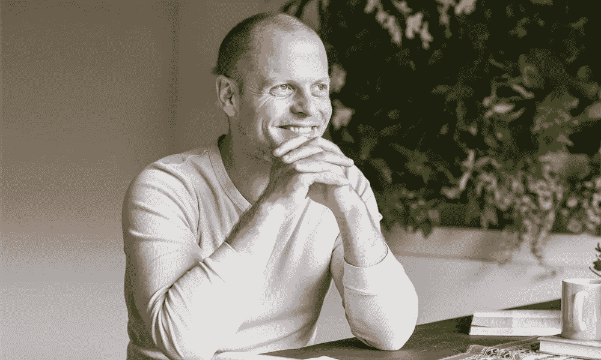
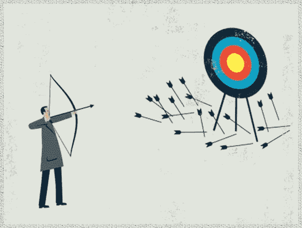

# 对失败的极度恐惧——管理恐惧的最有用的建议

> 原文：<https://medium.com/swlh/the-crippling-fear-of-failure-the-most-helpful-tip-to-manage-your-fear-75562d2510ab>

最近，我害怕开始一项我知道不应该再推迟的任务。为什么推迟？因为我害怕不会有结果。

和所有事情一样，这往往会阻止我们采取行动。

坚忍不拔的《纽约时报》畅销书作家蒂莫西·费里斯(Timothy Ferris)接受了一次采访，他在采访中讨论了对失败的恐惧。这对我很有帮助。你可以在这里观看整个采访:*如何克服恐惧，练习自爱，&建立写作套路*。

[www.entrepreneurmag.co.za](https://www.entrepreneurmag.co.za/advice/personal-improvement/ongoing-learning/10-books-tim-ferriss-thinks-every-entrepreneur-should-read/2/)

最近我很忙。

学期快结束了。期末考试来了。期末论文要交了。我一周工作 30 个小时，精力不足。

我仍然想找时间做我喜欢的事情。然而，似乎没有足够的能量。

伴随着这种令人衰弱的压倒性压力的，是无时无刻不在的意识，即时间正在流逝。我们只有这么多的时间去完成我们此生真正渴望的事情。

今年夏天，我真的想用最好的方式利用我不在学校的事实。不用去上课和写作业，我可以腾出时间来写和研究我感兴趣的话题。

## 我非常兴奋。

在这种动力下，我仍然会有犹豫和不确定的时候。我担心这个夏天可能不是为一本书收集研究主题的最佳夏天。也许明年夏天我会装备得更好。

所以，我开始研究失败。

> 我对自助文章不太感兴趣。我发现它们重复且不相关。我感兴趣的是切实可行的计划。

在哲学(我目前正在学习的内容)和蒂莫西·费里斯(很大程度上从斯多葛派哲学中获得这些方法)的帮助下，我们可以真正明白什么是“失败”，以及为什么我们不应该害怕这种定义不清的社会结构。

# 恐惧环境

采取任何你一直在拖延的行动。研究一本书。写一篇雄心勃勃的博文。演出。约一个女孩/男孩出去。什么都有可能。

你拿一张纸。在顶部你写下你的恐惧。然后你写三栏。

# 规定

第一列是**定义**，你可以具体描述可能发生的最坏情况:“公司倒闭还不够具体。”问:“那又怎样？那又怎样？那又怎样？”比如:“我付不起房租。”不管是什么。写下来，但是一定要具体。可能有 40 种情况，20 种，但至少有 10 种结果。

# 预防

T 何第二纵队是**防**。这包括你可以打电话、发邮件、联系的人，以防止失败。如果是学者，你可以考虑奖学金。对于每一个最坏的情况，写一个答案。

# 修理

F 或者第三栏写**修复**，你会怎么修复伤害。哪怕是 1%。任何可能的小修理在这里都是有用的。你能搬进你朋友的卧室吗？你能接受一份临时的酒吧工作吗？一颗子弹接一颗子弹。

不要着急。慢慢来。想多久都行。

# 燃料

> "我至少在生活中的几乎每一个重要时刻都使用过这个方法."—蒂莫西·费里斯

蒂莫西·费里斯曾用过这种方法。

这有助于将你的恐惧转化为现实，而不仅仅是你大脑中的一个图像(或一个野心)。

费里斯提到，他的书(连续 5 年在畅销书排行榜上，被翻译成 35 种语言)被出版商拒绝了 27 次。有时甚至不太好。

对那封不好听的拒绝信，他说:

> "保留那些拒绝信。"

国际畅销书*自我是敌人*被出版社拒绝了 4 次。J. K .罗琳的《哈利波特》系列也有类似的问题。

[emmascrivener.net](http://emmascrivener.net/2015/03/the-gift-of-failure/)

失败是必然的。但是，如果你已经着手定义，寻找防止崩溃的方法，并尽一切努力修复损害，你的失败将看起来更有形。

你可以选择继续下去。它不会像对许多其他人一样，使你残废。拒绝是必然的。失败就会发生。在这个帮助下做好准备。

> “谈论黑暗、失败和艰难时期非常重要。
> 
> 当我采访别人的时候，我总是试着把它带出来，因为这很容易，就像你说的，听一个采访，或者看到杂志封面上的人，然后对自己说哇，我真的希望我能做那样的事情，但是我就是我，他们就是他们。
> 
> 他们已经搞清楚了。他们总是在早上 6 点醒来，就像精神上的空手道斩来征服没有不安全感的一天——这只是胡说八道。”——*蒂莫西·费里斯*

在生活中，我们常常害怕万一。如果我选择打开额外的 Instagram 帐户，在那里我放了所有的音乐，但没有人观看它，会怎么样？

如果我选择读博而没有被录用怎么办？

找不到新闻工作怎么办？

我最近意识到，在每个可以想象的领域，每个人都经历过怀疑。这就是我们生活的世界。

然而，重要的是继续前进，努力工作，并在前进的道路上充满感激和反思。

你真的没有什么可失去的，生命很短暂。

让我知道这是否有助于你现实地看到你的恐惧。你可以战胜他们，只要实际一点。

## 在你走之前…

**🗣Connect 跟我上** [**推特**](https://twitter.com/JakubFerencik) **，**[**insta gram**](https://www.instagram.com/jejjejfercak/)**，或者** [**脸书**](https://www.facebook.com/jejjejfercak) **。**

如果你觉得这篇文章有帮助，请点击

下面的按钮(记住它可以达到 50 次鼓掌——如果你慷慨地使用那个鼓掌按钮，那就帮了我大忙了；) ) *或者分享一下脸书/* [***推特***](https://twitter.com/JakubFerencik) *上的文章如果你想让你的朋友在某个方面从中受益的话。*

我写这封信是为了让你继续思考，让我感恩和反思。干杯干杯干杯，下次见，

继续反思。

## 这篇文章发表在 [The Startup](https://medium.com/swlh) 上，这是 Medium 最大的创业刊物，拥有 314，551+人关注。

## 在这里订阅接收[我们的头条新闻](http://growthsupply.com/the-startup-newsletter/)。

