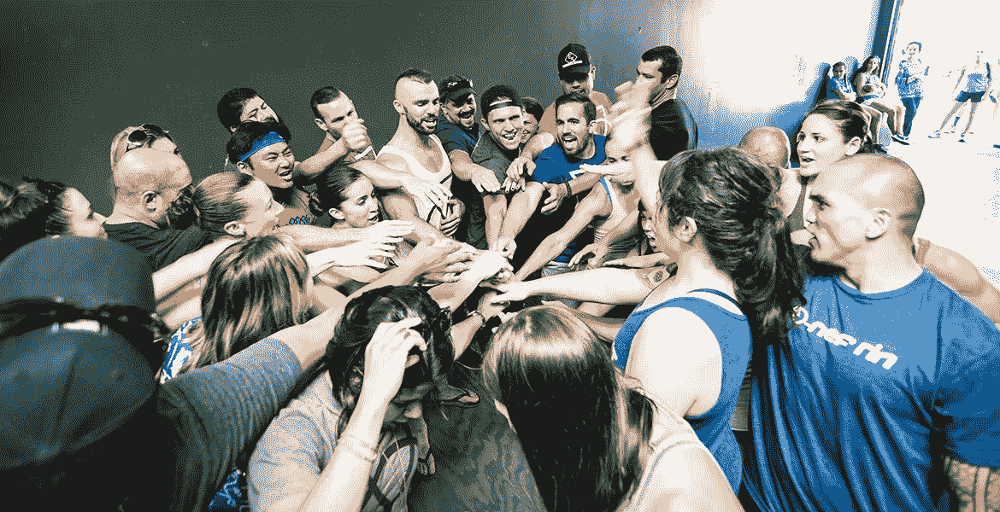
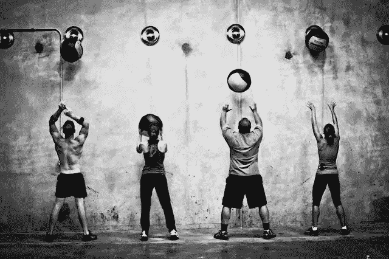

# 交叉跳跃体验

> 原文：<https://medium.com/swlh/the-crossfit-experience-a2eb9a8c0b3>

## 心灵

竞争意识使一个人身上显露出某种特殊的东西。无论是自己对抗队友还是和朋友一起。我们抓得更紧，推得更紧，拉得更紧，感觉心跳加速，眼睛睁得更大。我们在一起是一种归属感、责任感和共同的目标。

我们完全沉浸在这种经历中。没别的事了。不是酒吧的重量，不是我们紧张的生活，不是我们正在做的项目或在家的生活。

我们专注于眼前的任务，完成工作，为了挑战自己，对身边的人负责。你不退出，我不退出。就在你认为可能的时候…教练在那里。眼睛盯着你，检查你的动作安全，调高音乐音量，让你一直保持动力。

当这一切都结束了…你感觉到你的心怦怦直跳，你的腿和胳膊的重量，当你试着喘口气的时候，汗流浃背…你喜欢这样，因为你的大脑是完全清晰的。你忍不住笑了，你击掌，挥拳猛击周围的人。你充满了内啡肽和成就感。

# 十字路口的心脏

十字架在盒子里，不是体育场；这是在社区，不是人群；此外，它是在日常生活中的人，而不是运动员。99%的 CrossFit 社区成员都是为明天做得更好，而不仅仅是为了在今天证明自己。而在它的核心，这是在广泛的时间和模态领域的功能健身精神真正生活和呼吸。

# 我的生意陷入困境

我不经营健身房。我从事的不是盈利或创造销售、培养职业运动员、追求非凡的增长，也不是将投入不足作为有效产出的来源。

我的工作是帮助别人。帮助他们实现目标，过上健康、充满活力的生活。这恰好与锻炼和社区相吻合，这是 CrossFit 和一般团体健身的两大支柱。参与其中是一件令人惊奇的事情。

我非常感谢有机会通过我们的运动项目和课堂气氛每天影响我们的成员、社区以及他们的朋友和家人的生活。

今天，我们一起经历了一点痛苦，对任何事情都变得更好、更坚强、更有活力。

我们是一个健身社区，是一个由不同专业和文化背景的人组成的紧密团结的团体，他们每周都会聚在一起运动一小时、几次，让我们的心率加快、出汗并兴奋不已。难以置信。

在过去的 5 年里，这是我的兴奋，我的压力减轻，我的满意和我的实现。这真的感觉像是我的人生目标；帮助和支持他人，就像很多人帮助我一样。

这是 CrossFit。这是我的社区。这就是我从事的行业。每一天，为了生活。❤

真诚地

泰勒·华莱士
蔻驰/共同所有者
克罗斯菲特·科里登

## 这篇文章发表在[《创业](https://medium.com/swlh)》上，这是 Medium 最大的创业刊物，有 286，184+人关注。

## 订阅接收[我们的头条新闻](http://growthsupply.com/the-startup-newsletter/)。

