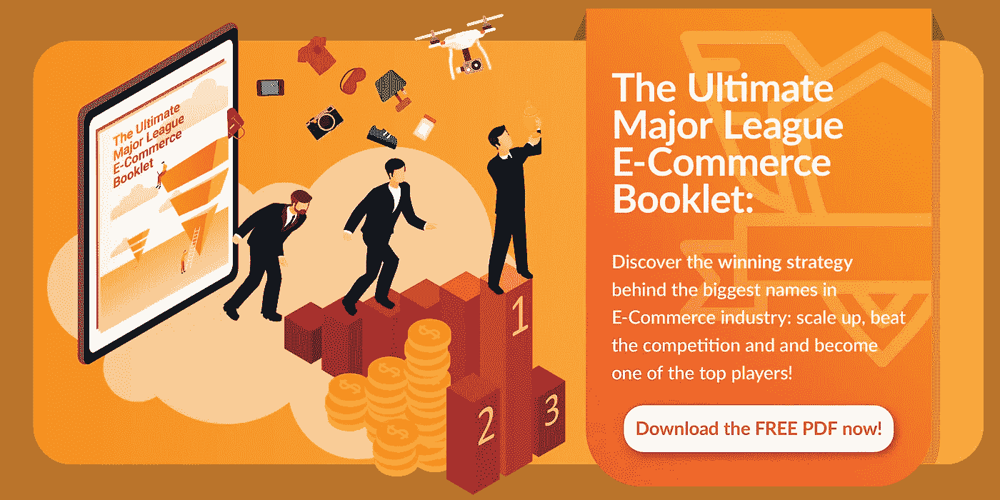

# 电子商务行业的客户参与革命——关系至关重要

> 原文：<https://medium.com/swlh/the-customer-engagement-revolution-in-the-e-commerce-industry-where-relationships-matter-2e93962db3ea>

> 这篇文章指导你如何利用数据成为一个以参与为导向的电子商务公司。

你正在经历一场技术革命。

今天你发现一个新工具，明天它将成为历史。很难保持更新。

你的顾客呢？他们的购买行为变得越来越复杂。很难跟随他们的旅程并始终如一地陪伴他们；哪一点是营销人员做得对的？

你生活在顾客的时代。你必须承认权力已经转移到消费者身上。

而你，作为营销人员，在你的旅程中经历过这些。我们一起来过一遍。

在现代，你掌握了大众营销；精心制作一条信息，然后发送给所有观众。然后是互联网革命中数字营销的出现，带来了广告交换器&程序化广告(Google 双击等)等新技术。).今天，你生活在智能营销的时代，知道如何利用人工智能等新技术的公司正在掌握有效性营销。

这场革命驱动着你，激励着你，但也让你害怕。

有太多东西需要消化:新技术、新软件、新商业模式…

如果你的竞争对手更善于利用这场革命呢？

在电子商务领域，一切都取决于客户体验。与你的每一个客户建立**一对一的关系**是成功的关键。

你必须清楚地了解你的买家的角色。他/她长什么样？他们在贵公司的购物体验如何？

消费者期望你的参与度达到一个新的水平。他们更有可能从提供定制内容的公司购买。如果一家公司没有预料到他们的需求，他们很可能会更换品牌。

因此，这不再是到处打广告的问题，而是吸引人的问题。

你如何变得专注？**利用数据**。

在你把你的商店带到网上的同时，你开始从顾客和潜在顾客那里获取数据。你正从你的营销努力中获得线索。你的是把人们带到购物车，有时他们离开，有时他们购买。你的商店现在是一个装满信息的盒子。如果您能够利用这些数据，您将获得竞争优势。

我们在这篇文章中要讨论的实际上是如何利用这些信息来吸引你的受众，从而获得更好的竞争地位。

让我们拿出一些统计数据来。只有 1%的公司分析了他们的数据，77%的客户没有参与其中。

> *这是客户差距！*

但是不用担心！我不会让你失望，读了这篇文章，你不会成为一个统计数字！

让我们一起努力！在这里你可以找到一个客户参与计划，从战略，计划，战术和执行。我们要理解它，然后执行它。

# 第一步:发现你的现状

作为每一个想从 A 点到 B 点的企业，你应该首先了解 A 点是什么样的。你可以使用的最佳策略是询问！直接问你的客户。你可以通过创建一个调查表格(Google form，Qualtrics，SurveyMonkey 等)来完成。)并发送到您的客户收件箱(您有他们的电子邮件！！).

像每一个策略一样，我们想要了解我们想要达到的结果是什么。这里有一些你肯定想收集的信息:

**NPS** :查看我上一篇 [**文章**](/udroppy/udropy-co-founder-carlo-bellati-on-the-future-of-dropshipping-3010124e360c) ，我在文章中描述了如何分析数据来找出你的 NPS 值。

**网上购物体验的满意度**

**需要改进的地方**

**您的客户支持水平**

**客户满意度(CSAT)**

当你为调查写问题时，你应该尽量简洁，避免开放式问题。你可能想问的唯一公开的问题是关于改进的领域。类似这样的话:*“非常感谢您的公开反馈”*

既然你已经收集了所有这些信息，你必须分析这些数据。这里的目标是了解你的现状。希望一切都好！但是，如果有些领域不像你预期的那样，就有一些工作要做。

# **第二步:明确目标&计划**

此时，你就知道应该把精力集中在哪里了。

因此，是时候定义目标了。一些可以在特定时间段内衡量的指标，如*到 2018 年底实现 80%的 CSAT*。

大多数时候，试图超越这一目标的电子商务企业家关注的是产品质量、快速运输和客户服务。

# 第三步:执行计划

在这个阶段，你应该写下你将用来实现目标的战略和战术。像公司一样思考！

让我们回到典型的电子商务企业家的例子。更好的客户参与可以提高客户满意度。您的客户可以在不同的点上与您的公司接触:在运营、服务、销售和营销期间。

让我们看看您应该如何参与每个部门的工作。

Sales&营销:用 AI 来撬动数据。根据客户互动的数量和质量给你的销售线索打分。不要试图卖给不准备购买的人。

为了提高客户参与度，您应该对客户有一个清晰的了解。Shopify 有一个基本的数据库，但如果你想扩大你的团队并增加收入，你肯定应该看看 CRM 领域。软件的一个例子是 [Salesforce](https://www.salesforce.com/uk/) 、 [MS Dynamics、](https://dynamics.microsoft.com/it-it/) [Hubspot](https://www.hubspot.com/) 。

以下是一些接触点示例:

**网站**:通过你的博客发布内容。建立一个客户社区，每个人都可以提问和回答问题。让你的客户感觉自己也是你品牌的一部分。

**邮件**:根据客户喜好发送有针对性的邮件。不要把运动配件卖给讨厌它的人，他从来没有在你的店里买过任何与它相关的东西。

**推送通知**:通过短信向您的潜在客户发送智能通知&，执行您的交叉销售和追加销售策略。

服务:一旦你吸引了你的潜在客户(营销),你转化了它(销售),然后呢？

你想留着它！关键是**客服**。

同样，如果你想创造一个长期资产，你必须有一个客户服务部。不要低估它。许多企业家雇佣了一批没有清晰结构和关键绩效指标的增值业务人员。

因此，为了在 24 小时内解决问题，与您的服务团队一起制定 SLA(服务水平协议)至关重要。对于每种情况，都应该创建一个票证，以便由正确的代理在正确的时间处理。跟踪常见问题也很重要。

你的客户不想一有问题就给你打电话，你也是。事实上，研究表明，服务查询根据其执行方式而有不同的成本。通过电话处理一个客户案例大约花费 5 美元，而在自助服务系统中完成一个案例大约花费 50 美分。因此，您应该使用这些数据在您的客户群体中构建知识库环境，以增加 CSAT。

O **运营:**当然，零售行业的客户满意度也与交付最好的产品和尽可能短的时间有关。为此，你必须找到合适的合作伙伴。你正在成长，你需要一定程度的灵活性。不可能在家里创造一切。在这一点上，寻找能使你的操作自动化的软件是最基本的。自动化软件的一个例子是 [**uDroppy**](https://medium.com/udroppy) ，这是一个先进的平台，像你这样的人可以通过点击几下鼠标来采购产品、将产品进口到商店、管理和完成订单；一切尽在浏览器的一个标签中。

# **结论**

你生活在一个客户参与革命的时代，关系很重要。

了解自己的现状，设定目标，写下计划，然后执行。始终如一地这样做，并始终提高客户体验的标准。

正如我在一开始所说的，这场技术革命可能会吓到你。想想你的激情是什么，是什么让你每天越来越努力，并保持安全，不要外包。如果你是一名热情的营销人员，你可能会关注营销本身。所以，专注于营销，选择最好的合作伙伴来管理其余的一切。

在 [**uDroppy**](https://medium.com/udroppy) 我们正在帮助电子商务企业家通过为他们管理整个供应链来做到这一点，从采购产品到运送到最终消费者；从单一平台获得一切。

我们分享在这个行业取得成功的有见地的战略。点击 查看[终极**触地策略。**](/swlh/ecommerce-touchdown-strategy-33600bd96e49)

[**订阅此处**](https://get.udroppy.com/register) 至 uDroppy，关注我获取更多有价值的见解。

## 这篇文章发表在 [The Startup](https://medium.com/swlh) 上，这是 Medium 最大的创业刊物，拥有+383，380 名读者。

## 在这里订阅接收[我们的头条新闻](http://growthsupply.com/the-startup-newsletter/)。

