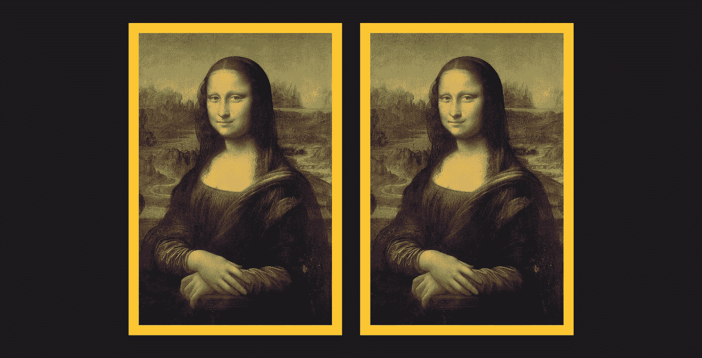

# 达芬奇零知识证明

> 原文：<https://medium.com/swlh/the-da-vinci-zero-knowledge-proof-d6271363382b>

*零知识证明是区块链界的热门话题。下面的小故事说明了一种在零知识证明中经常使用的技术，即多次重复一个协议以减少其“可靠性错误”。*

Which Mona Lisa is which? Image: [https://commons.wikimedia.org/wiki/Category:Mona_Lisa](https://commons.wikimedia.org/wiki/Category:Mona_Lisa)

# 故事

当国际刑警组织打来电话时，佩吉·佩格·斯维特正在她位于英国萨福克郡内瑟·邦普斯特德的小屋喝茶。卢浮宫立刻需要她。一架直升机正在路上。

佩吉是世界上最好的艺术史学家，也是达芬奇的专家。她有一种感觉，这和画这个电话有关。

# 巴黎

几个小时后，她到达了卢浮宫。一个名叫维克多的男人把她带进了旁边的房间。

很明显，维克多没有心情闲聊。他没有浪费任何时间解释发生了什么事。

“谢谢你来巴黎，佩格-口哨女士。我们发现自己处在一个奇怪的境地。这是最高机密，但是蒙娜丽莎昨晚被偷了。警察行动迅速。有一场汽车追逐赛，沿着香榭丽舍大街，绕过凯旋门，奔向布洛涅森林，然后穿过塞纳河返回。我们终于在埃菲尔铁塔下抓住了艺术品窃贼。

“然而，当我们往逃跑的货车里看时，在我们面前，有两幅一模一样的蒙娜丽莎！我们别无选择，只能把两幅画都带回来。

“我们发现自己在这里。这两张黑床单后面是两幅蒙娜丽莎的画，我们不知道哪一幅是真迹。

“我们看不出他们之间有什么不同，也不知道还能找谁。我听说他们称你为“谚语者佩吉”,因为你从来没有看不出赝品。

“今晚有一个展览，展出巴黎一些最著名的人物。我需要在接下来的 5 分钟内知道这些画中哪一幅是真的，这样它才能及时重新挂在画廊里。所以，请你告诉我，佩格-口哨女士，哪幅画是真正的蒙娜丽莎！”

他说最后一句话的时候，把两张并排靠墙放着的画的黑色床单甩了下来。

佩姬看了一会儿这两幅画。他们确实非常相似。乍一看，它们完全一样。她对赝品的准确性感到惊讶。

她走近一些，仔细观察了他们几分钟。她看着两幅画，脸离油画不到一英寸。

最终，她远离了那些画…她发现了不同之处。她知道哪一个是骗子。

她正要讲述到底是什么泄露了秘密，但有什么东西让她停了下来。

# 她怎么能相信维克多这个人呢？

她没有看到任何证据证明他是卢浮宫的官员或是法国警察。她没有看到任何证据证明他或他所说的任何事情是真实的。

5 分钟的期限似乎非常短，突然她想…如果维克多实际上是这里的罪犯呢？

现在她想到了这一点，维克多身上有一些不合适的、不恰当的、令人讨厌的和不寻常的东西，而佩吉的直觉通常是正确的。

也许维克多创作了《蒙娜丽莎》的赝品，并且正在用他的赝品替换真品。他对其准确性的最后检查是将两幅画并排放在一起，测试世界上最好的艺术史学家佩吉。

她试图不去理会这些耸人听闻的想法，但她就是不喜欢他身上的某些东西。整个情况感觉很奇怪。

# 她该怎么办？

也许她应该说这两幅画是一样的……但是他会重新挂上赝品(因为如果是他创作的，他肯定知道哪幅是赝品，也许他在画框的背面做了标记什么的),然后他会偷走真品，以为没人会知道。然后她不得不提醒警察蒙娜丽莎的真迹被盗了。

或者……她应该告诉他这两幅画的区别。但之后他会从世界上最好的艺术史学家那里了解赝品可以改进的地方。如果他做了一个和这个一样好的赝品，然后被告知她发现的微小差异，这将立即使他成为世界上最好的伪造者！

她需要一种方法来证明她能区分这些画，这样他就不会带着真品跑了。但是她需要在不透露任何关于她发现的差异的知识的情况下这样做，这样他就不会从世界上最好的艺术史学家那里学到任何东西……至少在她能在房间里找到她信任的人之前。

她需要向一无所知的**证明她知道这两幅画的区别。**

# 她开始…

“我将向你证明这两幅画是不同的，因此我知道哪一幅是真正的蒙娜丽莎。但我不会透露有什么不同。”

维克多立即表明他的手并不像他试图表现出来的那样值得信任。

“你究竟怎么做到的？！抱歉，佩吉，但我们真的很急。请你告诉我有什么不同，”他反驳道。

# 协议

“这是我们应该做的，”她不慌不忙地开始说。“我会指着其中一幅画，你必须记得我指的是哪一幅。然后你会蒙住我的眼睛。然后你可以交换这些画，或者把它们留在现在的位置。当你准备好了，你可以拿掉我的眼罩，我会再一次指向我最初指向的那幅画。”

维克多插话道，“但这只是一个 50-50，我怎么知道你不只是猜测？”

“你不需要，”她回答，“但是我们会重复这个测试 10 次。而且，每次我们这样做的时候，你都要盯着我最初指着的那幅画，我会再次被测试我是否能指着同一幅画。如果我确实知道这两幅画之间的区别，那么我就能每次都指向同一幅画。

“然而，如果我不能说出它们之间的区别，那么，在总共 10 轮比赛中，我只有不到 1/1000 的机会猜对。准确地说，猜中的概率是 1/2 的 10 次方，或者说是 1024 分之一。”

维克多考虑了他的选择，但除了按照佩吉制定的方案行事，他别无选择。在 10 轮实验过程中，她确实表现出，通过每次指向同一幅画，她能够以非常高的概率(1023/1024 或 99.9%)说出两幅画之间的区别，而没有透露任何关于她所发现的区别的信息。

# 接下来发生了什么？

更重要的是，佩吉的直觉是正确的！维克多在她到达之前就已经知道哪一幅是真正的蒙娜丽莎了。他是个伪造者，正计划偷真迹。他联系了佩吉，作为最后的检查，以确保他能逃脱惩罚。

然而，他困惑地看着，一轮又一轮，她指着同一幅画，从而表明他的赝品是不合格的，但没有透露到底是什么泄露了秘密。

在 10 轮协议后，佩吉离开了房间，并立即打电话给她信任的在卢浮宫工作的朋友。

5 分钟后，她和她的朋友回到房间，发现维克多和真正的蒙娜丽莎不见了！他显然已经放弃了伪造，并且不耐烦地带着真画跑了。

佩吉立即报警，并开始寻找维克多！

*零知识证明可以让你在不透露任何你不想透露的信息的情况下，证明你知道一些事情。*

*在关于零知识证明的学术文献中，如果验证者可以 100%确定证明者确实知道秘密，那么协议被认为是完全“合理的”。通常，协议的零知识属性是以协议的可靠属性为代价获得的。*

*在上述协议中，协议的每一轮都有 1/2 的“可靠性误差”，即验证者只有 50%的把握证明者知道每一轮的秘密。*

许多零知识证明协议多次重复相同的测试，其中每一轮都有固定的可靠性误差。这种重复产生了小得多的可靠性误差。

请查看我之前的博客[中用表情符号](/swlh/this-simple-yet-powerful-invention-is-changing-the-world-d04688c25f13)解释的哈希函数，也请查看我的公司 [Pilcro](https://www.pilcro.com/?utm_source=medium&utm_medium=daVinci&utm_campaign=awareness) ，这是一款在你制作品牌内容时可以即时访问你最喜爱的品牌资产的应用。

## 这篇文章发表在《T4》杂志《创业》(The Startup)上，这是 Medium 最大的创业刊物，有 303，461+人关注。

## 在这里订阅接收[我们的头条新闻](http://growthsupply.com/the-startup-newsletter/)。

