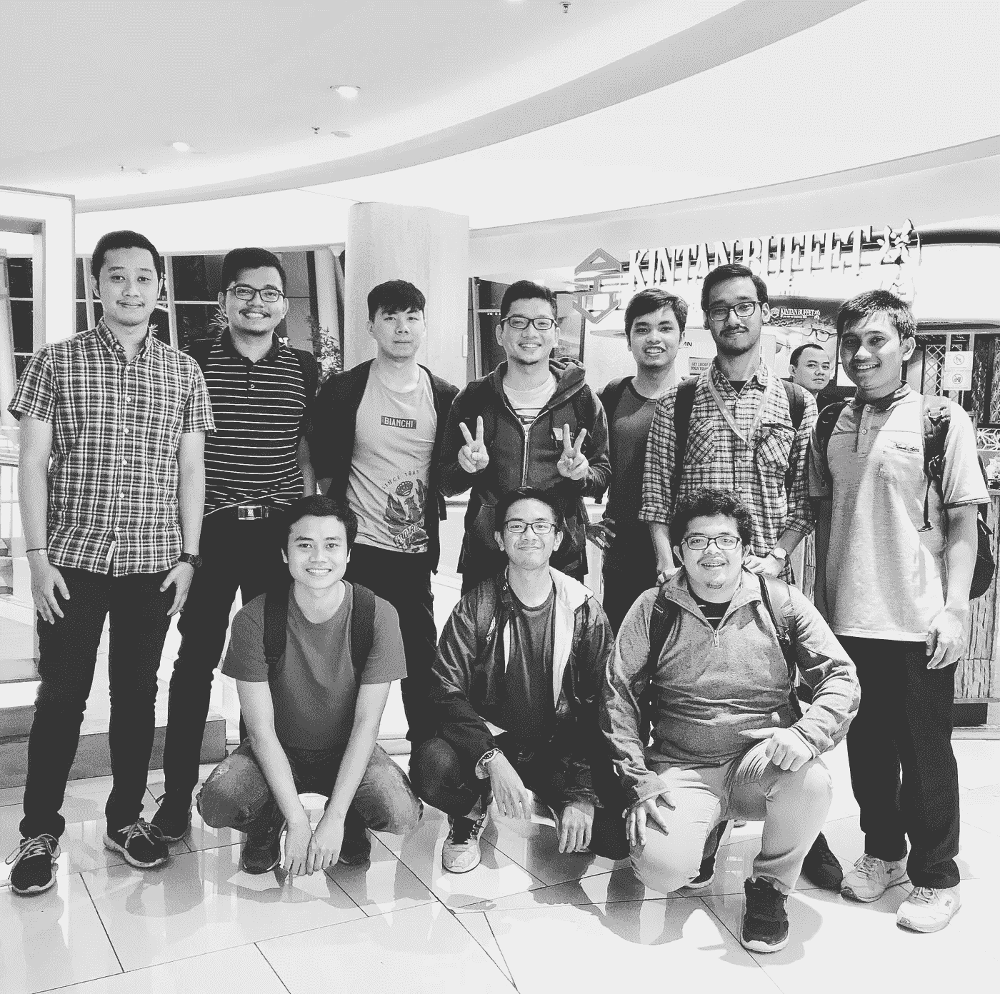
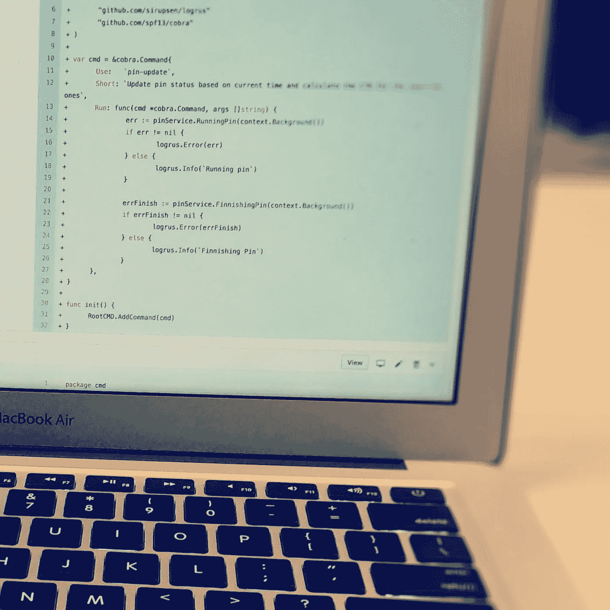

# 雅加达软件工程师的日常生活

> 原文：<https://medium.com/swlh/the-daily-life-of-a-software-engineer-in-jakarta-d2010b20dfc9>

## 只是我作为一名软件工程师在雅加达的个人日常生活

在这篇文章中，我将分享我在雅加达作为软件工程师的日常生活。

Just the best photo we have by far :D

只是提醒你，这是一个个人的故事，可能和别人不一样。这不是我经常写的技术文章，这只是我想写的一篇简单的日记。如果你不感兴趣，就从这里停下来；)

# 介绍

在继续之前，让我介绍一下我自己。我是 Iman Syahputra Situmorang，或者在很多社交媒体(instagram/bxcodec、twitter/bxcodec、facebook/bxcodec、reddit/bxcodec)和 LinkedIn(LinkedIn/imanturomang)中也被称为“Iman Tumorang”或“bxcodec”。LinkedIn 不像很多社交媒体，它在那里更专业和严肃，所以我需要在那里用`imantumorang`而不是`bxcodec` :D 做一个严肃的用户名。

我是一个土生土长的印尼人，我出生在远离雅加达的地方，但仍然在印尼。我出生在亚齐，在北苏门答腊长大。我大学毕业后搬到了雅加达。所以，还是那句话，因为我真的是 100%土生土长的印尼人，所以我对英语不太在行，抱歉因为我的语法错误，让这个伟大精彩的故事变成了一个更糟糕的故事:d。

在我的空闲时间，我总是在 medium.com/@imantumorang[的媒体上写一些文章，或者做一些关于新技术栈的小研究。或者只是尝试在 Github 中的开源项目中做贡献，你可以在这里看到我在 Github 中的绿色图:](/@imantumorang)[https://github.com/bxcodec](https://github.com/bxcodec):d .正如我上面提到的，我在社交媒体中使用`bxcodec`，专业账号使用`imantumorang`。Github 的用户名可能被假定为专业人士，但我觉得在 Github 里用`bxcodec`比用`imantumorang` :D 更酷

目前，我在印度尼西亚首都雅加达生活和工作。作为印度尼西亚的首都，很明显，这个城市非常拥挤。此外，雅加达是印度尼西亚发展最快的城市，尤其是最近科技发展如此之快。这里有很多活跃的开发者社区，从 SARCCOM、脸书开发者圈、Jakarta Js、Go Jakarta 等等等等。因此，对于软件工程师来说，这是一个值得参观的伟大城市，因为你有如此多的社区可以参观，以获得和分享知识，并扩大你的社交圈。

# 职业和专业

目前，当我写这篇文章时，我正在印度尼西亚的一个新闻聚合应用程序上工作。这是我的第二个办公室(前 Bornevia)。这家公司仍处于创业阶段。所以，如果你问印尼人关于黑尾，**没有人会知道！！**。:D

是啊！！！

现实就是这样。当我遇到新的人，他们问我的工作，当我告诉他们，他们真的不知道。他们总是会问两遍。

> 克莱伯先生:嗨，我是克莱伯先生，很高兴见到你！你好，克拉布先生，我是伊曼，也很高兴见到你:)
> 克拉布先生:你是做什么的？Iman Tumorang:我是 Kurio 公司的软件工程师。Krab 先生:Kurio？那是什么？

每次我认识新朋友的时候都会这样。如果一些在东京、Gojek、Traveloka 工作的人问起他们的工作，每个人都会认出他们公司的名字。

这其实是意料之中的。我们仍然属于小型创业类别。我们还在成长。所以，我认为每个人都认识到这一点只是时间问题。

# 日常生活

那么，让我们开始日常的故事吧！！！

# 早晨的例行公事

上午 5 时 30 分至 7 时

我通常在雅加达时间早上 5:30 起床。是的，它总是，每一天。即使在周末。显然，除非我要去某个地方度假。

通常，在从床上醒来之前，我总是读一些 quora 的回答或 medium 的文章，它们可能值得一读。或者回复我前一天晚上忘记回复的任何朋友的 Whatsapp 聊天记录。或者有时候，我只是躺在床上不做任何特别的事情，或者在印度尼西亚，我们说:“Golek Golek Mandjah”。

上午 7 时至 8 时

早上 7 点到 8 点，是吃点东西当早餐的时候了。所以我要去买些早餐。它可以是我从 Warteg (Warung Tegal)买的米饭和一些便宜的菜——这是一家印度尼西亚的小餐馆，食物很好，但价格便宜。或者有时候，我只是吃面包和一杯冷牛奶。我不是一个非常喜欢咖啡的普通工程师，我是一个喜欢牛奶和果汁的外星人类型的工程师。:D

上午 9 时至 10 时

吃完早餐后，就该工作了。我通常在这个时间去上班。去办公室至少需要 40 分钟。在雅加达，有一种叫做 TransJakarta 的公共汽车，由政府提供服务。我每天都坐捷运去上班。只有 Rp。3500，我可以去雅加达所有的巴士站。不管多远，价格都是一样的。3500.

# 在办公室

上午 10 时至 11 时

我在上午 10 点左右到达办公室，或者如果有不好的事情发生，可能要到上午 11 点。当我到达办公室时，是时候打开我的笔记本电脑了。检查一些电子邮件，通知或在 Slack 中发生的事情(我们使用 Slack 进行交流)。

上午 11 点至 12 点

如果没什么重要的事，我会去 Github，检查一些 PR，对我的队友提交的 PR 进行代码审查。也许，如果我几天前已经提交了一份 PR，我只是检查了它，如果它已经批准，然后合并它，或者如果它要求更改，所以我必须根据审查来更改它。

Reviewing Pull Request in Github

幸运的是，今天早上，我们没有那么多的公关，所以我不需要做代码审查。我昨天提交的 PR，已经被批准了。然后我会把它合并到主分支。

后来，在检查了 Github 之后，如果我在 Github 中没有发现任何更重要的事情要做，我会检查吉拉，检查一些也许我可以解决的任务。我们使用吉拉作为我们的项目管理工具。经过长途跋涉，我们最终决定使用吉拉。几个月前，我们使用 Waffle.io，但是 Waffle 对于我们的案例来说太小了。然后我们转向 Phabricator，但是由于某些原因，我们认为它不适合我们的情况。然后我们尝试了 TargetProcess，仅仅几个月，后来我们决定搬到吉拉。

在挑选一些任务后，我总是试着问我的团队，他们做得怎么样。询问最近发生的任何事情，可能是关于作品，或者关于一般的话题。

我总是在午饭后开始写代码。我们在上午 12 点吃午饭，所以为了避免在开始编码时对我的焦点区域造成任何干扰，我认为最好在午饭后编码。

除此之外，如果我昨天在 Github 上提交了 PR，而它被要求更改或得到了我的队友的一些评论，我做的第一件事就是尽快修复所要求的更改，这样我就可以再次得到快速的重新审查。

—上午 12 点至下午 1 点

现在是午餐时间。今天的菜单是一个米饭盒，里面有一块牛肉和一些额外的蔬菜，一个鸡蛋和一个肉饼。

午餐的菜单可能每天都不同，有时菜单可以是炒饭，有时是鸡肉，或排骨汤，Soto，肉丸等，而且是免费的。嗯，不是每个公司都提供免费午餐，但我们 Kurio 每天都提供免费午餐。

吃过午饭后，仍然是下午 12:30，我们还有多余的时间做其他事情。通常，我们打乒乓球或者有时玩棋盘游戏。或者只是在 Youtube 上看任何搞笑的视频。

但今天，我只是在打乒乓球，直到再次工作的时间。

—下午 1 点至 4 点

在这个时候，我在我的焦点区域。我会努力在午饭前完成我今天早上从吉拉挑的任务。今天的任务是做一个新的服务，一个微服务。所以我开始编写代码，编写逻辑功能和单元测试，制作测试套件和集成测试，等等。

在 Kurio 中，我们后端有 4 种编程语言。分别是 JavaScript，TypeScript，Go (Golang)和 Python。但是 Golang 是这里最受工程师喜爱的，所以它在很多微服务中被广泛使用。对于我目前的任务，我用的是围棋。

我个人开始爱上这种语言了。我喜欢它的简单性，尤其是对于并发服务。而且，它很快。关于编程语言，这里不做任何对比。但是，我有我个人的理由喜欢 Golang，你也应该试试:)

同样，因为这个任务有点大，所以我想我今天不会完成它，但即使这样，我还是会尽我所能去完成它。:D

—下午 4 点到 5 点

在这种时候，我通常不会太有效率，我要么提交一份简历并接受审查，要么审查其他人的简历。与团队成员闲聊已评审的代码。或者只是帮助我的朋友，他们可能有一个需要额外的大脑来解决的问题。或者，如果是我需要一个额外的大脑来解决我的任务。在这个时候，我们通常会在团队之间进行更多的讨论。

但是今天，我不是真的在做特别的讨论。我的任务很明确，其实不需要别人帮忙解决。我的朋友也是，看起来他们没有任何需要和其他工程师一起解决的问题。

—下午 5 点到 6 点

我们每天这个时候都要站起来开会。我们使用 Scrum ala-ala。不那么完美的 Scrum，因为我们仍然是一个小公司，所以，即使没有任何像 Scrum 这样的软件方法论，它仍然可以得到适当的管理。我们自己定义了我们的任务，也管理了我们自己。到目前为止，我们还没有任何 Scrum 大师，只有一个团队领导会安排会议和管理我们。

在这里，我们通常会解释我们的任务、进展或每个工程师面临的任何障碍。

—周五下午 5:30 至 7:00

**周五，我们和所有后端团队工程师开了一个周会。所以在这个时候，在后端部门工作的每个工程师都必须参加这个会议。**

**因为还是我们几个人，所以这个会议还是有效的。不知道以后我们有这么多工程师会怎么样。**

**在这里，我们告诉每个工程师我们一周的工作。我们在做什么很酷的东西，或者我们试图学习或探索什么新的东西。或者我们在一周内面临的问题。我喜欢这个会议，我可以听到其他工程师关于他们的项目和经验。此外，如果我们有一些我们团队无法解决的问题，我们可以在这里询问其他工程师的意见。**

**也许你应该在你的团队中尝试一下，我不确定这是否适用于一家公司，因为每家公司都有不同的文化。但是对于一个小团队来说，这应该是合适和有用的。这就像 Scrum 中的回顾，但是 Scrum 中的回顾是关于每个工程师在当前 sprint 中面临的任何问题。**

**在这里，我们不是在谈论 Sprint，而是在谈论我们的经验，以及我们为其他与我们有不同项目的工程师所做的工作。或者，如果有人刚刚学习一种新的编程语言或技术，他可以向我们介绍并告诉我们它的好处和缺点。**

**所以当会议结束时，每个工程师都会有新的知识，可以是关于其他团队的项目，也可以是某人刚刚探索的新事物。**

**例如，如果我在探索新的东西，比如说 gRPC，因为这对我们这里的一些工程师来说是新的，我会告诉他们我在这里学习 gRPC 的经验。为什么我对它如此兴奋，它有什么好处和坏处。所以当会议结束时，现在每个人都有一点了解了。如果每个人都认为它很好，那也许会在他们的下一个项目中实现。这也适用于任何技术栈，比如数据库、框架、库，以及任何我们想要分享的新事物。**

**—下午 6 点到 8 点**

**在这个时候，我们通常做一些随意的事情。有些人会回家。一些人仍在继续他们的工作。或者有时，打乒乓球或棋盘游戏。没什么特别的活动。除了周五，后端工程师将有一个周会。**

# **工作后**

**—晚上 8 点到 10 点**

**如果没有什么特别的事，我通常在晚上 8 点左右回家。但是如果我有事要做，比如去校园(我也是边工作边上大学，为了继续深造🙂)，我会在下午 6 点半回家。但是，今天我不去学校了。所以我会在办公室呆得晚一点，晚上 8 点回家。**

**—晚上 10 点到 11 点**

**这是家庭时间。嗯，事实上我一个人住在雅加达，所以在这个时候，我会和住在远方的家人视频通话，不是每天晚上，只是如果我想或想念他们的话。**

**但是对我来说，更多的时候是在这个时间玩游戏。我喜欢手机游戏，因为它便于携带。我可以躺在床上玩。**

**—晚上 11 点至凌晨 1 点**

**玩游戏的时候很容易无聊。我不知道为什么。所以如果我睡不着，我会回到我的笔记本电脑。打开我从事的一些附带项目，比如开源项目，或者只是我的个人项目，或者只是探索一项新技术。**

**但目前，我仍在探索围棋。用它制作一个简单的应用程序或库。再说一次，你应该试试，:D**

**我也喜欢写作，所以如果我累得不想写代码，我会在我的媒体上写几句。**

**—凌晨 0 点至 1 点**

**该睡觉了。等不及第二天的冒险了。下次冒险再见:)**

# **结束了！！！**

****

## **这篇文章发表在 [The Startup](https://medium.com/swlh) 上，这是 Medium 最大的创业刊物，有+393，714 人关注。**

## **订阅接收[我们的头条新闻](http://growthsupply.com/the-startup-newsletter/)。**

****