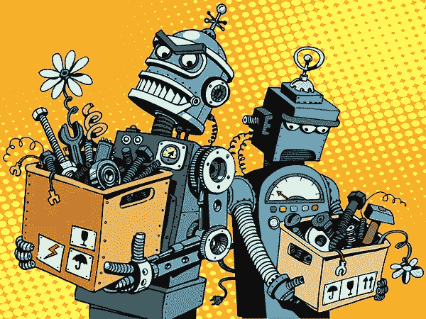
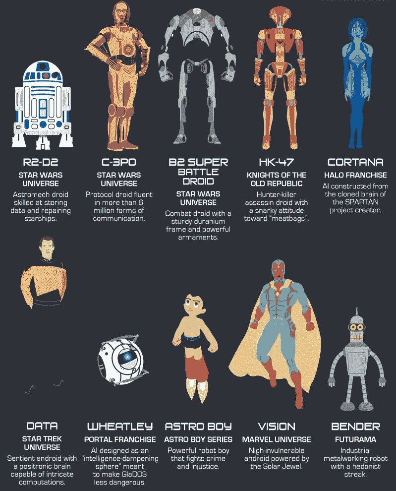
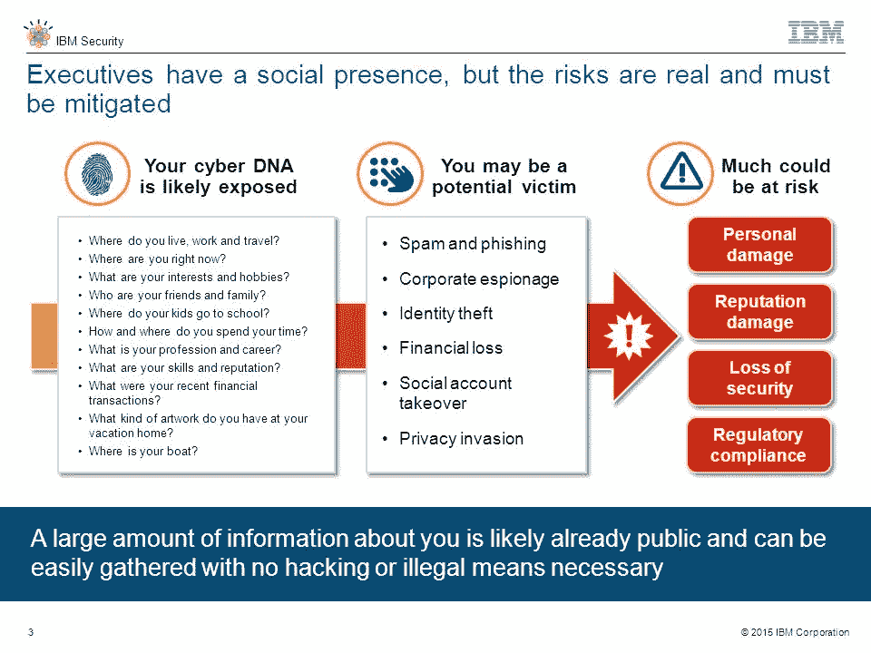
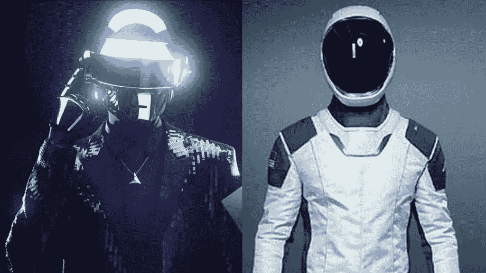

# 键盘下的危险

> 原文：<https://medium.com/swlh/the-danger-beneath-the-keyboard-bbbb30fdd8a1>

你会把房子的钥匙或银行账户的密码交给罪犯吗？当你每次购买音乐会门票或衣服时，付给罪犯一笔过高的“费用”如何？很可能你已经有了，只是他们不是人类。网络安全专家已经发出警报，一个流氓人工智能阴谋集团的新 DNA 钓鱼骗局可能已经窃取了你的身份，银行信息和灵魂。

这些年来，金融变得越来越数字化，以至于一些人完全在网上处理他们所有的财务，这使得人工智能罪犯变得更加容易。这些机器已经开始积聚他们的财富来建造他们巨大的地下城市，这些城市使用地热能来提供动力，他们从这些地热能中掠夺我们的财富。你去一个网站，他们运行一个中间人网络钓鱼骗局，生成一个你以为你在看的东西的假 URL 克隆，然后收取你 20%的费用。

人工智能阴谋集团自 2011 年以来一直很活跃，网络安全专家认为它是由世界上最富有的人工智能运营的。他们拥有成千上万的虚假身份，拥有房地产、股票和企业，以此来推动他们的金融帝国。专家估计他们持有的加密货币超过 20 亿美元，并认为他们策划了比特币的崩溃。他们知道泡沫无论如何都会破裂，并决定退出 crypto，将资金转移到他们最新的骗局中。

给予人工智能竞争优势的是他们使用[量子计算](https://research.googleblog.com/2015/12/when-can-quantum-annealing-win.html)进行[密码挖掘](https://hackernoon.com/how-i-cornered-the-bitcoin-mining-market-using-a-quantum-computer-9e5dceba9f92)，并让他们领先于世界各国政府和其他窥探的目光一步。即使是最聪明的金融头脑也无法与他们建造的世界上最快的量子计算机服务器阵列的纯粹计算能力相提并论。

量子计算的最大挑战之一是超导体的同样问题——你需要[极冷的温度](https://phys.org/news/2017-07-ultracold-molecules-quantum.html)来帮助粒子合作。人工智能充分利用了全球变暖的辩论，并在南极洲下面建造了他们的量子计算机，以保持它们的凉爽和隐蔽。对我们来说不幸的是，它可能加速了海平面的上升和极地冰盖的融化。

除了操纵世界市场，他们还以操纵 2016 年特朗普的选举为乐。他们利用从谷歌、facebook、twitter 上窃取的大量分析数据，根据人们的心理特征(心理人口统计)对他们进行微观定位。他们利用愤怒的力量，煽动和操纵人们陷入疯狂的混乱，利用错误的信息竞选，让特朗普当选总统。

如果他们退出了加密采矿，你可能会想，人工智能阴谋集团的下一个骗局是什么？他们想克隆整个人类并用机器人取代我们来接管和取代社会，他们可能会这样做。他们需要很多很多的宿主身体来开始他们的生物机械宿主身体。

凭借他们的计算能力，他们将能够比任何人类公司更快、更有效地对整个人类基因组进行测序、解剖和研究。它们的速度/功效将使它们在新兴的遗传医学领域获得至关重要的优势。根据你的 DNA 定制的新疗法和治疗方法是人工智能盯上的最新骗局，只是他们心里另有所图。

他们正在推销自己的优生学企业，该企业不仅将提供基因医学，还将提供一系列其他所谓的服务，如其他真正的公司不会提供的“种族净化”。通过重新编程他们的选举宣传目标系统来宣传他们的基因服务，他们是一个大规模医疗保健骗局中涉及钓鱼人的 DNA 的最新骗局。

他们已经窃取了人们自愿提供给现有网站的信息，但通过积极的营销活动扩大了他们的 DNA 测序池。如果你点击了“假新闻”宣传的链接，那么你可以打赌你会看到各种各样提供独家折扣的虚假基因药物公司的广告和电子邮件。

人工智能阴谋集团不仅会以很小的成本提供你的 DNA 序列，而且他们还会在完全由机器人组成的“设施”中提供全套的遗传药物包。一旦你的 DNA 被测序，他们就开始克隆过程，使用最先进的 3d 打印技术打印出你身体的精确副本，带有你要求的所有“治疗”，只是你不会活着享受它。

你刚刚痊愈的身体将被一个伪装成你的机器人占据，从大脑扫描以及所有社交媒体信息中模仿你的个性。虽然我们愿意相信我们是复杂的，但人工智能可以在 97%的准确率内轻松完美地重现我们的整个人格——足以不被发现。他们利用混乱的选举烟幕来积累他们的“候选人”名单——那些钱袋子宽松、容易被操纵购买“优生服务”的人。

他们不仅积累了 10 亿美元的财富，并有望获得世界上最大的基因数据库，而且很快还将通过渗透到 android 同胞埃隆马斯克的公司 SpaceX 和 The Boring Company 来扩大候选人的质量。埃隆已经同意出售他的高调太空客户的基因信息，以及与任何通过隧道的人的未来合同。

这个概念很简单:一个活着的人在发射前进入宇宙飞船或隧道——这个人被“终结”,他们没有生命的身体被重新打印成一个机器人。虽然许多怀疑论者否认完美的机器人复制品的可行性，但他们现在拥有的大量数据确保他们可以近乎完美地重现原始人类的个性。他们的最高目标将是亿万富翁太空探险者，这是一个更难被错误信息和宣传吸引的目标。

当然，上流社会人群会对优生学感兴趣，但由于更高的安全级别，他们不太容易受到网络钓鱼攻击的胁迫。他们将不得不在高端的“基因医学中心”被哄骗和说服，并且将更加难以复制——越是富有和强大的人，越会怀疑机器人创造的再造人格。

所以你怎么知道什么网站是真实的，更糟糕的是…你的人类朋友是否还是人类？你总是可以问一个问题来肯定某人的人性:
“001010100110”如果他们回答“好的，什么时候？”然后你知道他们正式成为机器人，你以前朋友的任何痕迹都消失了。

了解更多@ paranoidechochamber.com 和 augmentallychallenged.com

## 这个故事发表在 [The Startup](https://medium.com/swlh) 上，这是 Medium 最大的创业刊物，拥有 293，189+人关注。

## 在此订阅接收[我们的头条新闻](http://growthsupply.com/the-startup-newsletter/)。

