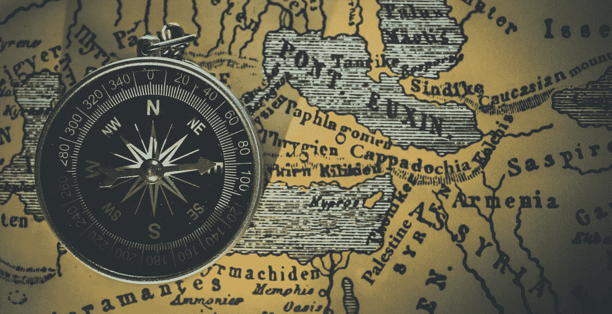

# 所有个人成长文章中的危险

> 原文：<https://medium.com/swlh/the-danger-in-all-personal-growth-articles-75d922605fd4>

Photo by [Himesh Kumar Behera](https://unsplash.com/photos/t11oyf1K8kA?utm_source=unsplash&utm_medium=referral&utm_content=creditCopyText) on [Unsplash](https://unsplash.com/search/photos/map?utm_source=unsplash&utm_medium=referral&utm_content=creditCopyText)

## 总是别人的故事

近一年来，我每个月都会去见一两次私人教练。我现在不想解释我选择这一步的原因，但我想分享我从自己和他人身上学到的最重要的一课。

甚至在互联网出现之前，自助就已经是一个巨大的话题，个人成长也是如此。过去的思想家和哲学家都思考过好的生活方式。

今天，每个人都可以在网上发表意见，你永远不会远离聪明的建议。

许多文章、博客、视频和播客致力于自我提升、成长、生产力和激励策略。

我对所有这些话题都很感兴趣，在这个加速和充满机遇的时代寻找指导。我读了关于媒介的文章，它是有用的思维模式、心智模式、想法和灵感的奇妙而无尽的聚宝盆。然后，我尝试一些方法，看看它们如何适应我的生活，改变和适应我的习惯。

但问题是(我很感激我的教练帮助我理解了这一点):

> 也许有成千上万的系统来组织你的生活和你的思想，但是这个星球上有将近 80 亿人，每个人都需要找到自己的系统。

很可能没有一个系统对你的生活方式有用，即使是那些流行的系统。

想象你正在旅行..

假设你在罗马，想去威尼斯。

你向某人问路，他们的第一个回答是:“嗯，这是我从都灵到米兰的路。”他们继续详细描述他们从都灵到米兰走了什么路，什么路号，在哪里停下来加油。

这对你有帮助吗？

你想从罗马到威尼斯，因此其他方向不会带来任何优势。

下一个人可能会回答说，他们去了威尼斯，但从维罗纳出发。他们开车走小路到达那里，在一个小村庄迷路了，然后他们的车坏了，所以他们走完了剩下的路。有用吗？没有那么多，尽管这是一个很酷的故事。

最终，你会遇到一个从罗马来到威尼斯的人。事实证明，那几乎是半个世纪前的事了，那时的道路完全不同。他们到了那里，可能会帮你找出大致的方向，然而所有周围的条件都是不同的。

你是一个旅行者。每一个关于实现目标的故事、书籍或媒体文章实际上都是关于其他人如何实现目标的故事(或者正在努力实现目标！).

> 他们的故事可能包含有帮助的暗示，但是没有理由他们的方式应该和你的相似。

**他们不站在你站的地方。**

**他们不想去你想去的地方。**

他们的方式不是你的方式。

即使是一本非常成功的书，像大卫·艾伦的*成事，*也不会对地球上的每个人都有用。事实上，这是一个成功的系统，因为它向许多读者承诺，它将使他们的生活步入正轨。在这个过程中，它可能帮助了很多人。

不能保证对你的具体情况真的有帮助。

为什么这种认识是有帮助的？

这消除了很多压力。

> 许多知名作家恳求你早起，做各种各样的活动，健康饮食，冥想，使用日历，不要使用日历，使用待办事项，去他妈的待办事项……最后，他们在描述他们的方式。

T2 和 T3 是如何相处的。什么帮助了**他们**。这并不意味着你必须做这些才能过上好的生活。

(免责声明:使用其他人为他们的生活找到的系统可能也适用于你的生活。试试看是否合适。)

亲爱的读者，请寻找更大的图案。

不要找精确的路线规划者，找一般的旅行小贴士。

**在高速公路上如何避免撞车？**

**如何安全驾驶，欣赏风景？**

**绕道去看意想不到的东西可能有用的地方。**

> 许多人认为阿哈系统对他们有效。这并不意味着这些系统对你有用。

如果你想找一个系统，很有可能它并不存在，你完全有自由自己去构建它。

感谢阅读。

## 这个故事发表在 [The Startup](https://medium.com/swlh) 上，这是 Medium 最大的企业家出版物，拥有 288，884+人。

## 在这里订阅接收[我们的头条新闻](http://growthsupply.com/the-startup-newsletter/)。

