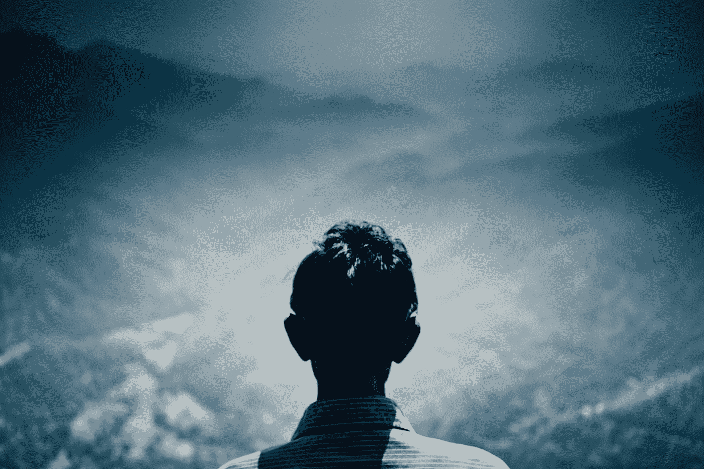

# 你对自己的生活做出的危险假设

> 原文：<https://medium.com/swlh/the-dangerous-assumption-you-could-be-making-about-your-life-6bec71fe922f>

Photo by [Joe Roberts](https://unsplash.com/@iamjoeroberts?utm_source=medium&utm_medium=referral) on [Unsplash](https://unsplash.com?utm_source=medium&utm_medium=referral)

> "汤姆，我们要买一辆房车，还要卖掉房子."

冰顺着我的手臂流下来。

我不敢相信我妈妈会这么说。

> 有很长一段时间，这个女人想卖掉我们在马里兰的房子，去佛罗里达生活。我只听说了这些。那是她的梦想，伙计们！

现在她想把我们童年的家换成..*吞咽*..房车？！

因为极度的震惊，我忍不住笑了。

这样的。是。生活。

# 勒布朗·詹姆斯说你什么都错了

我成为勒布朗·詹姆斯的粉丝已经有一段时间了。

> 我知道——现在你们一半人讨厌我，另一半人点头表示“好吧，汤姆，我明白了！”

显然，勒布朗现在是湖人队的一员，因为我对他有点痴迷，我在过去的 6 个月里观看了 Youtube 上的每一个 NBA 脱口秀。

> 我只想知道他要去哪里。

当我观看其中一个访谈节目时，一位名叫布莱恩·温德霍斯特的 NBA 内部人士说，在 16-17 年前，勒布朗·詹姆斯会想到克利夫兰打球是不可想象的。

就像，没有机会。

> 然而，16 年后，我们在这里谈论他如何不仅赢得了那个城市的冠军，而且在迈阿密热火队结束后回到那里，只是为了给阿克伦带来一个冠军。

记住，如果你告诉 17 岁的勒布朗这将会发生，他会告诉你你疯了..

但是它发生了..

**果然如此。**

# 你的五年计划是愚蠢的

我的也是。

> 我今年 25 岁，我看到[在未来会有很多旅行](/the-mission/how-to-figure-out-what-the-hell-you-want-to-do-with-your-life-11093936a4ba)。

但是如果我结婚了呢？如果我有一个孩子呢？如果我卷入了一场可怕的事故，不能再走路了怎么办？

我知道这很极端，但是更疯狂的事情没有发生吗？

> 前几天，我表妹把她的简历发给我看，因为她想彻底改变职业。

她结婚了，有房子，有一个很棒的孩子，是一个很好的榜样。

然而在这里，她想彻底改变职业生涯？

> 疯狂的是，在我们生活中的很多时候，我们非常想要某样东西，却无法想象还想要别的东西。我们是 CER·泰恩。

> “不，妈妈，我确定。”

但是有样东西吸引了我们的目光。其他人。其他地方。一些其他的工作。一些脸书的视频显示有人从他们的笔记本电脑上直接运输尿布赚了几百万。

为什么我现在要告诉你这些？

> 因为我们会改变。我们的人生道路不是永远不变的高速公路。有修路工程。有时候路通向悬崖边，然后我们不得不掉头去别的地方。

# 出于某种原因，我总是认为我的生活会遵循一定的道路

> 五年前，我以为我现在已经结婚了。我原以为我会在宾夕法尼亚州的哈里斯堡从事营销工作。我以为我会在美国东北部度过余生，一直戴着葡萄园的葡萄藤。

想知道我现在在哪里吗？

菲律宾。

还没结婚。

> 每天穿着旧的白色 t 恤，因为我真的不在乎我穿什么了。

我曾经想，在我的余生里，我会成为一名作家/博客作者。现在我花更多的时间[制作视频](https://www.youtube.com/channel/UC8nN0X9k1JO3IlYUEPtA83g)。

我曾经认为佛罗里达州的 T4 是我的最终目的地，但是两年前我去了旧金山之后，我想住在那里。

现在，在菲律宾和胡志明度过一段时间后，东南亚是我的首选目的地。

> 我有一种感觉，这个旋转木马永远不会停止。我总是想要不同的东西——我想这是人的本性——我也知道上帝可能在某个地方嘲笑我所有的宏伟计划。

# 保留期权的好处。

> 人们害怕不确定性。我也是。

所以我们计划确保我们知道生活中会发生什么。但是我的朋友们，这让沙拉失去了味道。

> 如果你确切地知道未来 30 年、40 年甚至 50 年你的生活将会怎样，这将会多么令人兴奋？

这就像走进星球大战 9 [时知道**雷伊**、**芬恩**和**凯洛**会在哪里结束](/the-post-grad-survival-guide/this-is-how-quickly-things-can-change-in-2-years-1d7bf60760a3)。它消除了所有的戏剧性。它最小化了我们的情绪反应。它减少了快乐。

所以我一直不理解看剧透的人。我跑题了..

> 你看，人类喜欢计划，因为它让我们感到舒适，但我们也有喜欢惊喜的一面。有些人比其他人更压抑这种特质，但它就在那里——它将永远在那里。是人啊！

我们需要短期计划让我们放心，但我们需要长期开放让我们兴奋。

我的朋友们，这根本不值得讨论。即使你说“**不，汤姆，我不想要不确定性——我要一份 20 年计划，请给我一杯可乐”**，那也没关系。

因为生活不喜欢计划。生活像湿漉漉的狗一样甩掉计划。

> 我们无法控制自己的生活。你的计划很愚蠢。他们不重要。我告诉你这些不是因为我相信这是真的，我告诉你这些是因为这是真的。

如果可怕的事情真的发生了呢？如果你妈妈受伤了，需要有人照顾她怎么办？

当然，这将是一个调整，可能会打乱你的计划，但我认为你会比你想象的更快地适应新的生活方式。

当你以这种方式看待不确定性——将其视为值得欢迎的事情，而不是值得害怕的事情——它会让你感到更加放心。

接受它，你会过得更充实、更令人兴奋、更奇怪的是，更舒适。

> 想在媒体上赚点外快吗？本周我将主持一些免费培训，名为“**如何在 Medium 上每月额外挣 900 美元**”[在此获得免费座位](https://events.genndi.com/register/169105139238473045/da2e6c5a01)！

## 这篇文章发表在[的《创业](https://medium.com/swlh)，这是 Medium 最大的创业刊物，拥有+395，714 人关注。

## 在这里订阅接收[我们的头条新闻](http://growthsupply.com/the-startup-newsletter/)。

