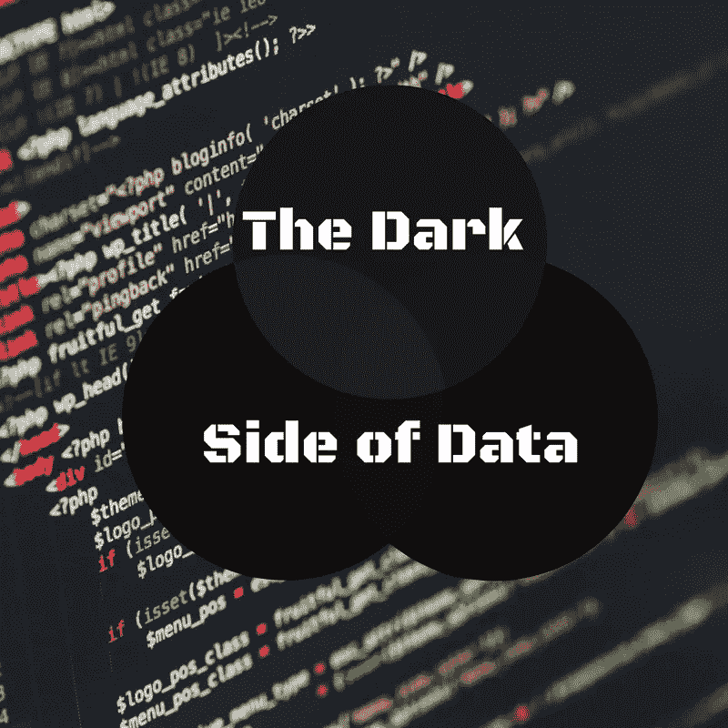

# 数据的阴暗面

> 原文：<https://medium.com/swlh/the-dark-side-of-data-5b474adccb3f>

今天新闻中华而不实的科技文章会让你相信，人工智能令人担忧的属性是，有一天，机器可能会变得有认知能力，并取代人类。不知何故，为特定任务编写的代码将最终创建一个产生意识的黑盒(不管那是什么)，为人类特定功能而建造的机器将进化成更伟大的东西。不仅仅是没有科学背景的人写的新闻文章是这样写的，公众人物，如斯蒂芬·霍金和埃隆·马斯克，也在宣扬对有知觉的机器的恐惧。

作为一个使用机器学习模型的程序员和数据科学家，这似乎离眼前的现实很遥远。我不是说某一天不会发生，但那一天不是明天，也不是后天。

## 我们现在所处的位置:

**我们目前能够编码*狭义的*人工智能。**也就是说，我们有某些非常擅长特定任务的程序。我们可以创建一个程序来查看它自己下的每一盘棋，根据隐藏在数据中的一些未知的统计意义来找出最佳的走法，它会做得非常好，但同一程序不能下围棋，也不能识别猫的图片。我们可以编写其他程序来完成这些任务。我们甚至可以让所有这些程序在同一台计算机上并行运行。对于我们人类来说容易完成的每一项任务，我们都必须花费数年时间给计算机编程来完善这一技能。然而，最终，我们这些机器学习工程师需要编写程序来完成这些任务，我们需要输入数据来查看。

那么，计算机将如何决定查看没有提供给它的数据呢？当它看到猫的照片时，它将如何决定学会欣赏树木的位置？当我们还远未完全理解人类是如何做到的时候，我们怎么能给一台机器编程，让它自己做出选择，自己进行物候进化呢？没有等同于生物学的命令，也没有等同于进化。在这一点上，人工意识的构建完全是幻想，缺乏手边的现实。

# 那么眼前的现实是什么呢？AI 有什么值得警惕的一面？

**现实是，人工智能和数据科学目前正处于取代数百万份工作的初级阶段，**或许更重要的是，**在没有清晰或道德编码的情况下做出对人口有巨大影响的统计决策。**

## 没有分布式所有权的自动化:

更换工作对那些能够支付得起数据科学家、机器学习工程师或人工智能专家的公司来说是有益的，因为他们可以给某人 15 万美元的工资来一次更换数百个工作。随着高薪技术人员获得稳定的工作和巨额收入，他们经常为一家公司编写专有代码，而这家公司很可能比他们活得更久。工人的近亲对他们建造的东西没有兴趣，只有他们带回家的钱。换句话说，尽管当前的家庭核心正从父母的辛勤工作中获益，但一旦这种工作不复存在，未来的几代人也无法获得同样的保障，因为关键在于自动化。

**如果大部分工作被能做人类工作的机器和程序取代，那么两百年后谁会拥有这些机器和程序？如果它被少数精英垄断，剩下的工作岗位就很少了，那会发生什么？我们会重新分配财富吗？对于所有人来说，生活会变得奢侈吗？人类几千年的工具进化，一代又一代人的努力，技术的进步，会让整个全球社会受益吗？或者我们大多数人会被排除在外，陷入我们现在所不知道的贫困之中吗？**

但仍有一个问题:**如果没有经济稳健的消费者，自动化对精英们有什么用？**精英们会利用经济上绝望的人来收获最后一点钱，还是会忘记贫困的人，而利用其他精英作为消费者——就像今天的富国和穷国一样？

对我来说，这是数据科学和人工智能最接近的黑暗骨架。除了让它自动化之外，我们对未来没有任何计划。我们没有同意任何社会契约，也没有为这种技术进步制定宪法。我们有过期的专利，但秘密甚至隐藏在一家可能不希望将其突破推向专利的公司内部。我们建造的机器是公司的财产，而不是建造机器的个人的财产。我们设计可以学习的程序，因此取代了程序员。最后，我们编写的程序甚至开始在没有艺术家的情况下复制艺术。一个世纪后，谁将拥有这些程序？

## 缺乏道德决策:

第二个问题，**是数据科学家编写代码，这些代码在没有清晰或道德编码的情况下做出对人群有巨大影响的自动统计决策。**警惕自动化的有效性和道德是最恰当的。请记住**代码是由人类编写的，数据是由人类收集的，两者都可能有偏见和谎言**。

如果我们收集关于累犯的数据，我们可能很容易发现一个趋势，即美国黑人更有可能重复犯罪，但我们的数据是如何收集的，我们没有包括哪些数据？我们注意到有一种将美国黑人关进监狱的偏见了吗？我们是否注意到历史上有一种让美国黑人变穷的趋势，这很可能会对这个数据产生影响？我们是否以有偏见的方式撰写问卷来确定累犯？这些问题的答案对于创建一个道德和公正的模型来预测和处理累犯都是必不可少的，但是它们在当前我们预测累犯的模型中被忽略了。

像脸书、谷歌和 Twitter 这样的公司正在使用机器学习模型来让你上瘾，而不考虑社会影响。由于一家巨擘公司的唯一目标是保留、增长和收入，他们不会考虑商业模式中的道德含义。我们一次又一次地看到这样的例子，比如[优步在悉尼](https://www.huffingtonpost.com/2014/12/15/uber-sydney-surge-pricing_n_6325026.html)发生恐怖袭击时发出的激增警报，或者[脸书利用处于危险中的青少年](https://www.theguardian.com/technology/2017/may/01/facebook-advertising-data-insecure-teens)。但是这些是明显的道德败坏的算法。那些更微妙的伦理道德呢？

数据科学家可能会发现自己从事的工作是试图预测保险费率、招聘人才、将广告导向正确的人群，以及许多其他伦理上不确定的领域。可能很容易忘记伦理，特别是因为我们中的许多人没有接受过这方面的培训，但思考你的模型和你收集的数据是否会影响一个群体是至关重要的。

我们这些在现场的人必须问自己对此应该做些什么，能做些什么？当然，你想供养你的家庭，通过专门研究我们的社会而努力工作后，拿走你应得的那份财富，但这种阴谋的代价是什么？当然，你想优化你的模型来为你的公司获得最高的收益，但是你刚刚为一个子群体创造了什么可能的负面影响呢？我当然不知道答案，你可能也不知道，但作为一名全球公民，你有义务批判性地思考这些未来的结果。

因此，努力思考，道德思考，挑战自己，挑战你的同事也这样做。牢记这一点，也许我们可以为未来的人们把明天变得更加美好。

## 这个故事发表在 [The Startup](https://medium.com/swlh) 上，这是 Medium 最大的创业刊物，有 286，184+人关注。

## 订阅接收[我们的头条新闻](http://growthsupply.com/the-startup-newsletter/)。

