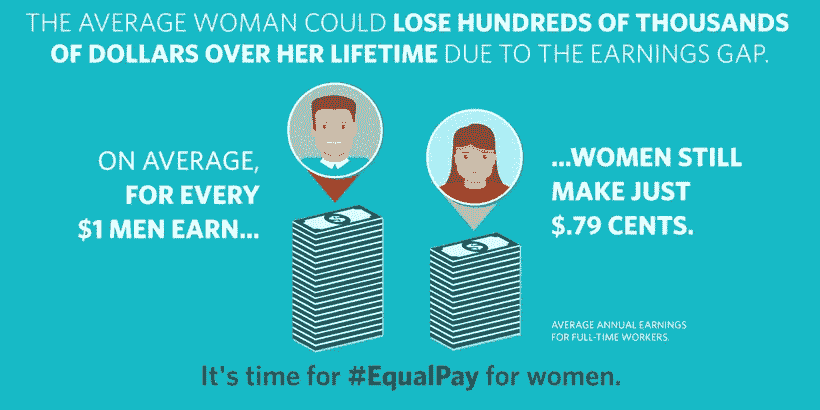

# 性别平等的阴暗面

> 原文：<https://medium.com/swlh/the-dark-side-of-gender-equality-700955d39ba>

作为一名倡导平等的女性科技领袖，我注意到自己最近的一些行为令人质疑。

My brain is breaking.

我注意到我有四个明显的缺点，它们阻碍了女性与男性的平等。像其他人一样，我宁愿相信自己是完美的…但事实是，我有缺陷。

不管怎样，我真的想要平等。除了看到对他人行为的评判以及什么导致了问题和解决方案，我还必须不断地审视自己的行为。我并不以此为荣，但如果我在自己内心建立起意识并改变，也许其他人也会。

这是这样的:

**判断**。我投希拉里一票。我希望看到更多的女性首席执行官。然而，我一直认为希拉里不讨人喜欢，而且[我公开指责玛丽莎·梅耶尔在育儿假方面树立了一个坏榜样](http://venturebeat.com/2016/01/03/its-time-for-family-friendly-tech-what-zuckerberg-got-right-and-mayer-got-wrong/)。

I can’t hear what she’s saying when she looks like this.

我最近听了 Elisa Kriesinger 的《[闭嘴吧](https://soundcloud.com/user-88808584/just-shut-up)》，她是*Strong opinion loosed*播客的创始人。我从未听说过“上声”(或“升调”)或“口齿不清”(vocal fry)这两个词，但自从接受了关于女性说话“令人讨厌”的所有方面的教育后，我所做的就是从女性那里听到“口齿不清”或“升调”。我来判断。我想向他们指出这一点，以帮助他们，但我只会在死亡中再制造一个剪纸，成千上万的剪纸会麻痹妇女，使她们不敢说话。

让我来列举一下我评价女同事的其他方式:

1.  不说话。
2.  没有证据就直言不讳——我们都知道，分享没有确凿数据的观点对女性来说是职业自杀。
3.  公开表现出不安全感。
4.  道歉太多。
5.  上班哭。

我从未让其他女性感觉不好，或告诉她们这些行为会阻碍她们——但我判断并感觉这些行为会阻碍她们。

我该怎么办？我的游戏计划是不批评。我不知道我可以停止我的反应或判断，但我可以选择表达积极/有益的想法。我会鼓励女性畅所欲言。我会指导他们演示技巧和风格，并强调沟通技巧对你的职业发展至关重要。

**工资大战**。我雇人。我雇佣女人和男人。马萨诸塞州最近成为第一个通过[一项法律的州，该法律规定在面试过程中询问薪水历史是非法的](http://www.askamanager.org/2016/08/the-first-state-has-made-it-illegal-to-ask-about-salary-history.html)。每次我提供工作机会时，我都依赖这些信息。然而，我知道，平均而言，[女性的收入是男性的 1.00 美元的 0.79 美元。](http://www.aauw.org/research/the-simple-truth-about-the-gender-pay-gap/)

> 依靠薪资历史，我主动将薪资差距永久化，将工作机会建立在充满不平等薪资的历史上。

Yes; It’s time for #equalpay. And I can do more to help.

我该怎么办呢？我将专门询问期望薪资，而不是询问薪资历史。我会将这些信息与可用的补偿金额结合起来，做出最好的决定。我不会以不同的收入雇佣相同技能的男性或女性。

**不断的自我批评**。长期以来，人们一直认为女人对自己比对男人更苛刻。在我们对自己的公开批评中，我们为人们创造了一个热情的环境来批评我们所做的一切。

旁注:哦，嘿——看这里——你正在读一篇我公开批评自己的文章！

如果我们把批评自己作为一种爱好，那么很容易建立一个我们不够好的信念系统。这造成了信心打击。我处在一个许多年轻女性都仰视的位置，所以如果我公开讨论我的缺点，我是在鼓励她们也这样做吗？我个人通过自我认知获得了更多的自信，如果我觉得自己不够好，我会更加努力地工作……所以我的自我批评对我来说一直是一种积极的动力。但这很容易对那些对自己不太自信、事业刚刚起步的人不利。

对此我该怎么办？我真的很纠结如何在这里做出改变。

> 我认为公开承认错误，并允许他人给予反馈，通常是一件好事。但是，就成长机会进行健康的讨论，一有机会就把自己扔到公共汽车底下，并邀请其他人从你毫无生气的身体上驶过，这两者之间是有细微差别的。

我的计划是试着保持自我批评和自嘲的幽默，告诉我丈夫是一个更好的母亲，并试着在工作中做到这一点。这不会改变我批评自己的倾向，但把这些想法藏在心里可能会让许多女性觉得不应该批评自己。这是一项正在进行的工作。

**不变的人的期望**。我也把这个题目叫做:*为什么我的丈夫不帮我修车？*从小到大，我的父亲总是确保我母亲的汽车有汽油，并早起清除积雪。很多人都在谈论骑士精神是如何消亡的，或者甚至可能已经消亡。

> 我意识到为平等而战是骑士杀手。但是，我还没能改变我对我丈夫和一般男人的期望。

我感激一扇门被打开。我很感激晚餐账单被处理好了。我的轮胎漏了一个多月，这导致我深夜在一个不安全的地方给我的车加油……我确信这是我丈夫的错。他对我说过一句话:

> “性别平等始于家庭。”

我最讨厌这种说法，因为它经常被用来作为没有放下马桶座圈的借口。但我不得不承认，他说得有道理。如果我真的关心平等，我想要一个众所周知的席位，我应该放弃对另一个席位的期望吗？

Perpetuating gender roles at home will not help. But I’m not ready to take the trash out.

问题是这种基于历史上男性/女性角色的特殊待遇的概念对我来说仍然是有意义的。这是性别平等的另一个阴暗面，如果我们真的想要平等，这是我们必须放弃的。

我意识到继续对侠义行为抱有期望对我来说是不公平的。这显然是一种比职业更个人化的倾向，但事实是我正在强化一种性别刻板印象，这可能也会影响到我与男性的工作关系。我不记得有哪一次我在和同事包括男人喝酒时放下名片；我们都没有付钱！