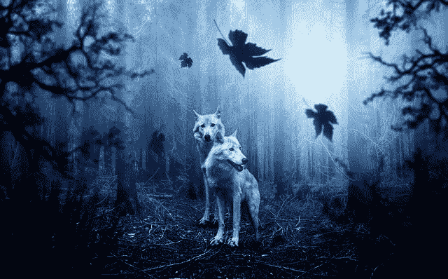

# 动机的阴暗面

> 原文：<https://medium.com/swlh/the-dark-side-of-motivation-cea95989c5fc>

[Comfreak/pixabay](https://pixabay.com/en/wolf-forest-dark-predator-animal-2864647/)

> “做你喜欢的事，钱会随之而来。”
> 
> **“追随你的激情”**
> 
> **“进入愿望实现的感觉。”**

这是一些引自积极思考，自我感觉良好，自我帮助的文献。他们可能会也可能不会对你起作用。

但是动机的另一面很少被提及。然而，它可能非常强大。它可以摧毁任何经过它的东西。这就是我们有时需要做的。

我说的是动机的阴暗面。激励的阴暗面就是用自己最阴暗的情绪来激励自己。那些高能的情绪通常被认为是负面的。它们可以是愤怒、恐惧、沮丧，甚至是厌恶。

# 积极的动机对你有什么作用？

对大多数人来说,“做你喜欢的事情”和“追随你的激情”是如何实现的？

当你“进入愿望实现的感觉”时，你感觉如何？当我这样做时，我感到放松、快乐和满足。我没有感觉到一点点渴望去完成工作，去实现现实中的愿望。

当我筋疲力尽，快要放弃的时候，我会有一种愿望实现的感觉，这是最后的手段。我用那种感觉让 [**留在游戏里**](https://ideavisionaction.com/entrepreneurship/how-to-stay-in-the-game-until-the-payoff-day/) 。它有它的用处，但大多数时候，是动机的阴暗面点燃了我去做最好的工作。

# 如何利用激励的阴暗面

有什么让你生气的事吗？你担心未来的事件吗？你被什么事挫败了吗？一种情况让你厌恶吗？太好了！

盘点这些情况、事件和条件。把它们列一个清单。记住它们，进入其中一种黑暗的情绪。那可能是愤怒、恐惧、沮丧，甚至是厌恶。

你现在感觉如何？你不是更有活力、更专注了吗？现在，你还想滚动你的社交媒体吗？或者你想把精力用在一些有建设性的事情上，以克服令人愤怒、恶心的情况，或者避免未来可怕的事情发生？

# 利用恐惧作为动力

假设你担心将来会被人工智能抢了饭碗。避免这种可怕的未来的唯一方法就是现在就去上计算机科学课。但是你必须在业余时间做这些。

尽管如此，你喜欢娱乐。你想和你的朋友出去玩。无论他们什么时候打电话给你，你都不能说“不”。这让你现在不能上计算机科学课。

毕竟，你白天工作很努力。你的工作目前似乎很稳定。谁知道十年后会发生什么？

是什么让你不再在晚上闲逛，而是去上计算机科学课？"感觉到愿望实现了吗？"或者培养和感受失去工作和生活水平的强烈恐惧？

# 结论

即使大多数自助文献建议我们思考好的感觉，积极的想法和情绪只在有限的情况下起激励作用。

如果你想消除分心和懒惰，专注于工作，你需要培养一些高能、黑暗的情绪，比如愤怒、恐惧、沮丧和厌恶。

***如果你真的想让你的生活更上一层楼，*** [***注册我的电子邮件简讯***](https://ideavisionaction.com/email-newsletter/) ***每周都会收到我关于个人发展和生活经验的最新帖子。***

## 这个故事发表在 [The Startup](https://medium.com/swlh) 上，这是 Medium 最大的企业家出版物，拥有 352，974+人。

## 在这里订阅接收[我们的头条新闻](http://growthsupply.com/the-startup-newsletter/)。

