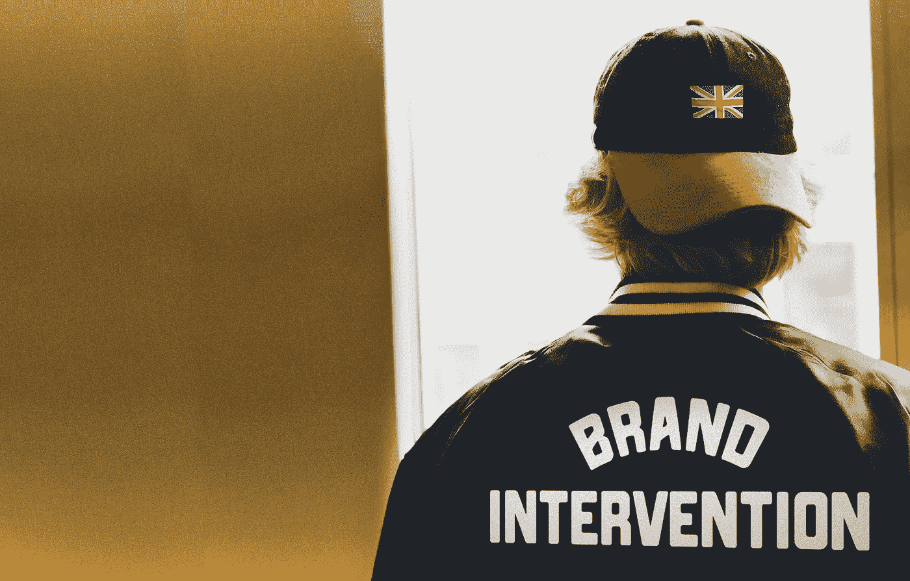
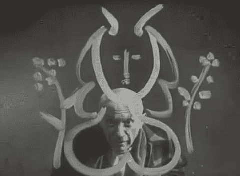
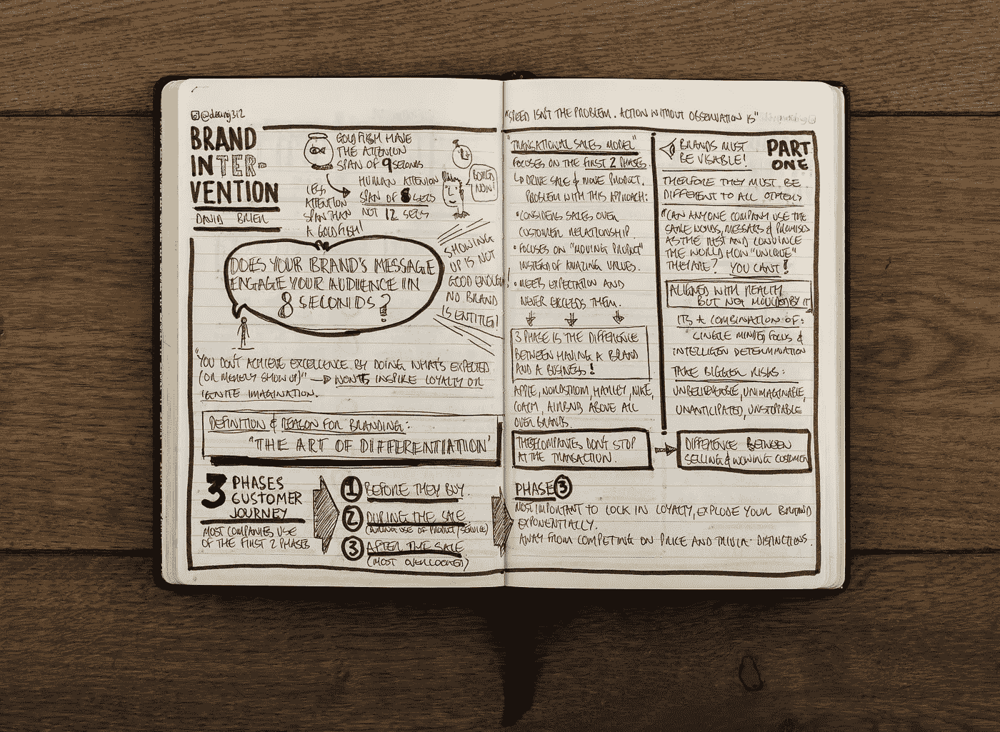
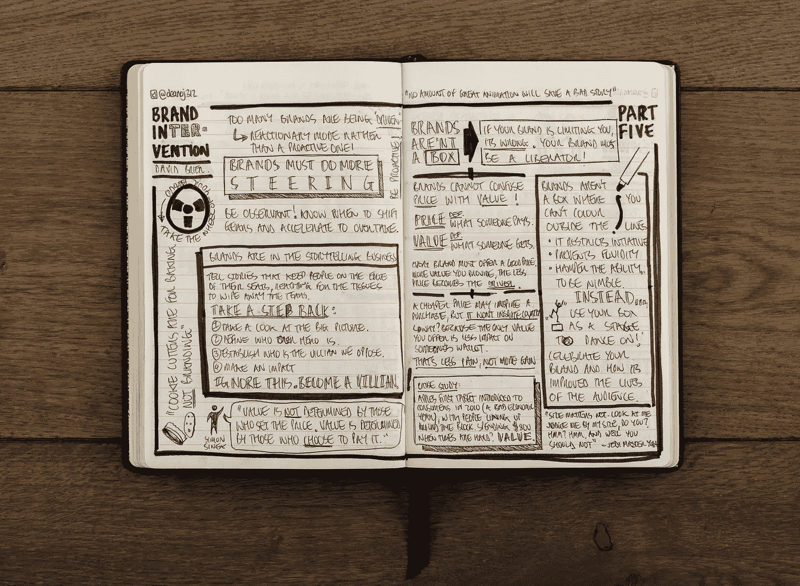
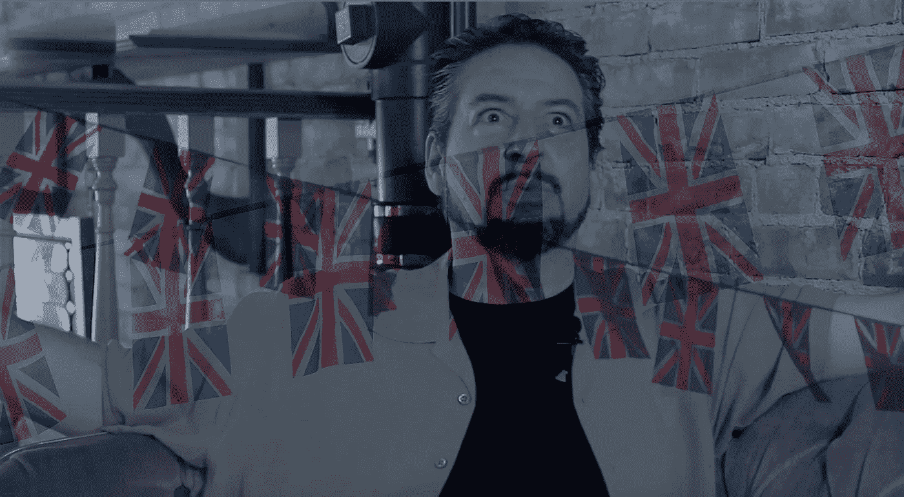
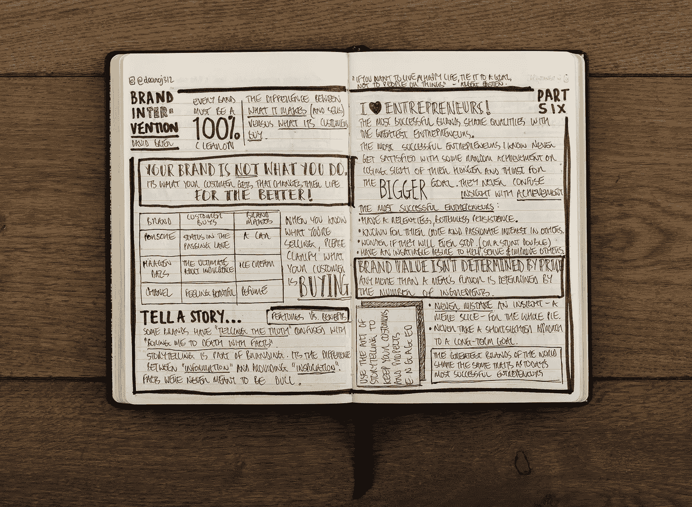

# 新视频揭示了“我的书被英国设计师劫持的那一天”

> 原文：<https://medium.com/swlh/the-day-my-book-was-hijacked-by-a-uk-designer-1ebebc625cba>

谈论英国的入侵…

> “好的艺术家临摹，伟大的艺术家偷窃。”巴勃罗·毕加索

我的书被一个英国设计师劫持了。

简而言之，他拿走了我的书，用它做了我认为不可能的事情(而且在道德上肯定有问题)。

所以我找到了这个英国人。发现他的名字是*迪安·奥卡拉汉。*

他采用了我的语言和概念，并用它们做了我从未想象过的事情。

这里有几个例子:

## 英国的入侵暴露在世人面前

迪恩甚至把我的书的内容称为“肉”。什么神经！

> 所以我通过 LinkedIn 联系到他，非常简单地告诉他，“我要让世界知道你做了什么。”

我可以告诉他，当我告诉他时，他既害怕又兴奋。

所以，我和他进行了视频通话，录了下来，并在这里和全世界分享。

这是当今“小世界”的荣耀，来自世界一个地方的东西发现自己在另一个地方，只是以新的和意想不到的方式激励另一个地方。

感谢迪安最初与我分享他的“笔记”。

## 这篇文章发表在 [The Startup](https://medium.com/swlh) 上，这是 Medium 最大的创业刊物，拥有 335，210 多名读者。

## 订阅接收[我们的头条新闻](http://growthsupply.com/the-startup-newsletter/)。

