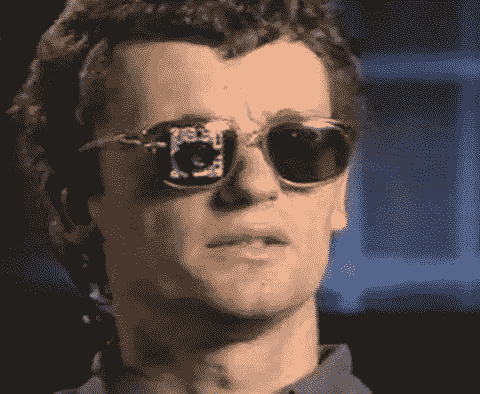
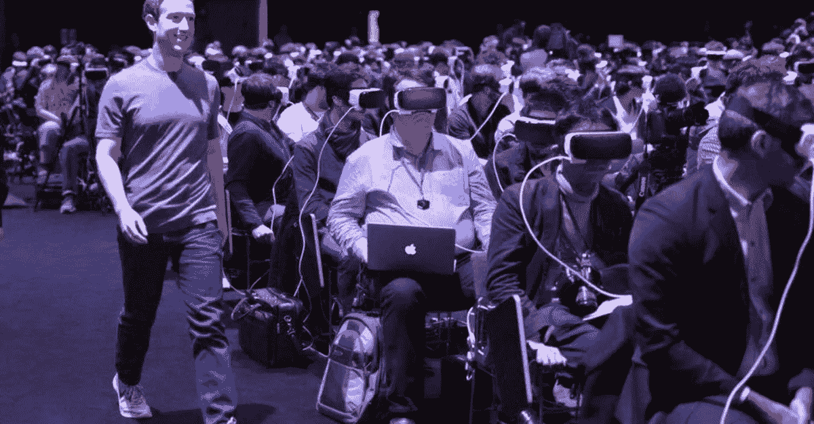
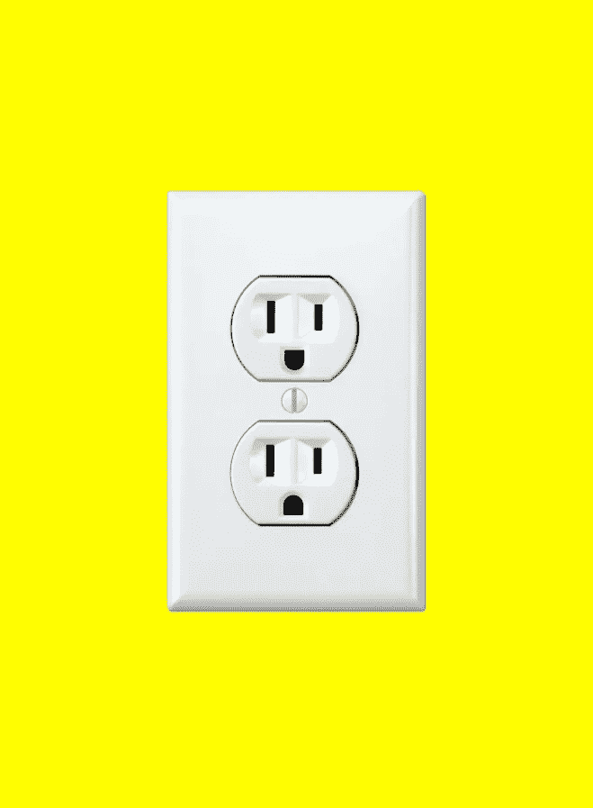

# 你成为机器人的那一天

> 原文：<https://medium.com/swlh/the-day-you-become-a-cyborg-d7f5abf88be2>

许多人会开玩笑地将他们的智能手机描述为第五肢，但可穿戴技术的发展表明，有一天我们的设备将成为我们的一部分。在某些情况下，他们已经是了。由于集成了人工组件或技术，半机器人是具有增强能力的有机体，我们中的许多人已经属于这一类别。

我们往往会将电子人这个词与科幻小说中的超级人类联系起来，如电影《银翼杀手》中的机械战警或罗伊·巴蒂，但我们今天的电子人往往是那些有健康并发症的人。

那些患有不规则心跳的人依靠心脏起搏器和植入式除颤器来维持稳定的心脏功能。大多数人都知道至少有一个人有更常见的增强功能，比如助听器或隐形眼镜——这是我们最受欢迎的两种生物增强功能。

2002 年，失明 20 多年的延斯·瑙曼(Jens Naumann)通过一次神奇的大脑植入手术恢复了部分视力。脑/计算机接口的最早用途之一是，医生将连接在摄像机上的电极植入他的大脑。然后，相机被安装在一副眼镜上，让 Jens 能够捕捉他周围的世界。手术后不久，延斯利用他尚未完全恢复的视力，绕着多贝尔研究所的停车场慢慢地开着车，多贝尔研究所是他增强手术背后的研究机构。

除了显而易见的技术发展，该领域最令人着迷的进展来自于这些增强装置的改进设计，以及微妙的变化如何改变了公众对使用这些辅助装置的人的态度。

不久前，义肢不仅昂贵，而且看起来很不协调。由于 3D 打印及其开源的设计方法，假肢变得更容易获得，也更有吸引力。

这些辅助设备也变得越来越有用。36 年前，在希望马拉松比赛中，[特里·福克斯用一条假腿跑了 3339 英里。这在当时是一个难以想象的壮举，他不得不调整他的跑步风格，开发出一种双跳跃来适应他的条件。快进到 2008 年，假肢发展到如此程度，双腿截肢的奥斯卡·皮斯托瑞斯被禁止参加北京奥运会，因为他的假肢](https://www.youtube.com/watch?v=xjgTlCTluPA)[对他的运动员同伴构成了不公平的优势](http://www.theguardian.com/sport/2008/jan/14/athletics.andybull)。

对于那些有需要的人来说，过去被认为是花哨的残疾已经慢慢变成了一种容易获得的——在某些情况下甚至是有利的——增强。现在，随着脑机接口被纳入这些假肢，患者有机会通过植入大脑的电极来操纵他们的假肢。

在一个价值 1400 万美元的项目中，150 名科学家合作建造了一个设备，使截瘫患者不仅能够行走，还能在 2014 年世界杯上进行开球仪式。

## 你在读《人性化设计》

[*人性化设计*](http://designforhumanity.danieleckler.com) *是一篇探索拟人化设计的过去、现在和未来的互动散文。您目前正在阅读第 7 部分，共 7 部分。*

## 虚拟现实

类似于假肢，虚拟现实曾经是一项庞大而有限的技术。然而，它终于成熟了，如果它目前的能力有任何迹象的话，它是一个准备以从未被认为可能的方式融合数百万人生活的界面。未来的预测表明，虚拟现实最终将以透明镜片的形式附着在我们的日常眼镜上。

随着镜头技术随着虚拟现实的进步，不难想象一种具有广泛功能的隐形眼镜，让我们可以无缝地在幻想的虚拟世界、增强的现在和沉浸式的过去旅行中移动。

脸书大学的马克·扎克伯格和他的团队正在带领人们奔向过去:

> “我想起了我的宝贝女儿，想起了我想要记住她的第一步。当我迈出第一步时，我的父母只是拿起一支笔，在一本婴儿书上写下日期……当我的表妹，当她的儿子迈出第一步时，她用相机拍了一张照片。我妹妹，当她儿子迈出第一步时，她用手机拍了一段视频。但我想捕捉整个场景。所以，我希望我们可以拍一个 360°的视频。这样，即使我的父母和家人不在那里亲身经历，他们也能感觉到他们就在我们身边。VR 是下一个平台，任何人都可以创造和体验他们想要的任何东西。”

扎克伯格上面描述的虚拟现实体验，无论多么人工，都比我们目前在设备上的交互方式更加直接和直观。事实上，我们将在头上戴上头盔，或者在眼镜上戴上镜片，但是一旦我们沉浸在场景中，就会感觉比我们与现有界面交互的方式更自然。随着我们越来越意识到，像 Snapchat 和脸书这样的社交应用增加了几层界面供我们导航。

这个想法得到了纽约大学计算机科学系教授肯·佩林的支持。他将这些扭曲层称为“干扰”，相当于固定电话的静电干扰。根据柏林的说法，每个界面都包含一定程度的干扰:交流中断的点。我们最好的工具之所以有用，是因为它们是自然的用户界面——我们与它们的交互感觉就像是我们自然行为的有机延伸。

历史上，我们不得不通过各种工具与计算机交互:屏幕、鼠标、键盘等。，但正在开发新的接口来帮助减轻干扰，无论是读取我们温度的芯片还是脑机交互。

# 奇点

随着脑机交互变得越来越普遍，它有可能最终取代我们更传统的界面。

结果将是与未来设备的一致通信，一种数字心灵感应，嵌入式人工智能将能够读取脑电波，并以无数种方式翻译我们的生物信息。

> 人类和技术之间的界限可能很快会变得非常模糊。

如果我们将大脑/计算机接口的想法再向前推进一步，我们可能能够将我们的大脑与其他大脑连接起来，创建一个人与人的接口，这可能会让我们以一种我们从未体验过的方式直接获得无限数量的人类想法。

忽略我们可以访问的大量内容，让我们问自己一个全新的问题:这种体验会是什么样的？直接连接到另一个人的头脑和里面的内容会是什么感觉？

撇开隐私问题不谈，我们可以接触到想法、梦、记忆、梦的记忆等等。我们的经历会不再是个体的吗？我们的身份会彼此融合吗？更不用说我们的经历和身份会与我们可以接触到的知识和内容交织在一起。

最突出的想法是人工智能在上述场景中的作用，特别是如果像许多人预测的那样，它最终在每个方面都超过了人类思维的能力。我们的自然倾向是害怕这样的场景，回到《黑客帝国》和其他科幻寓言中探索的想法。

> 如果人工智能注入我们的脑机接口，提供了迄今无法想象的超凡体验，那会怎样？

但是，如果人工智能注入我们的脑机接口，提供了迄今无法想象的超凡体验，那会怎样？也许人类思维及其所有敏捷的灵活性的结合，将会得到无尽的知识海洋和比我们更有好奇心的人工智能的完美补充。

如果你能想象一个世界，在那里，每一点知识都可以在一瞬间被召集起来，问题可以在一个巨大的人类和人工智能团队的协作下得到解决，那么也许一个非常适合人类繁荣的未来并不遥远。

# 人性化设计

探索拟人化设计的过去、现在和未来的互动文章。**亦作** [**可作为说话的**](http://designforhumanity.danieleckler.com) **。**

.

.

## 1: [人性化设计](/swlh/the-future-of-design-is-emotional-5789ccde17aa#.7sqgnt32y)

## 2: [苹果，原始人类](/user-experience-design-1/the-design-secret-apple-stole-from-volkswagen-66a20d17a609#.usddbpwou)

## 3: [对话式用户界面](/life-learning/the-future-of-cui-isn-t-conversational-fa3d9458c2b5#.aat7yx6ei)

## 4: [更智能的未来](/swlh/how-to-design-a-cui-59f1fb3f35fc#.n1o4necvk)

## 5: [情感机器](/swlh/the-future-of-emoji-accced8e7108#.qt0io7nfl)

## 6: [电脑也会哭](/the-mission/siri-will-you-ever-understand-me-e5747ab73b08#.sv5wccxk0)

## 7:你来了！

.

.

# 感谢阅读

这是一篇互动+进化的作文。如果您对新内容、对当前内容的修改或其他任何事情有想法，请[联系](mailto:hi@danieleckler.com)！

> 如果你喜欢读这篇文章，请点击页脚的♥按钮，这样更多的人可以欣赏伟大的设计！

嗨，我是丹尼尔。我创办了一些公司，包括 Piccsy (acq。2014)和 EveryGuyed (acq。2011).我目前对新的职业和咨询机会持开放态度。通过[电子邮件](mailto:hi@danieleckler.com)联系。

本文由[肖恩·朗肯](http://www.shaunroncken.com/)合著。