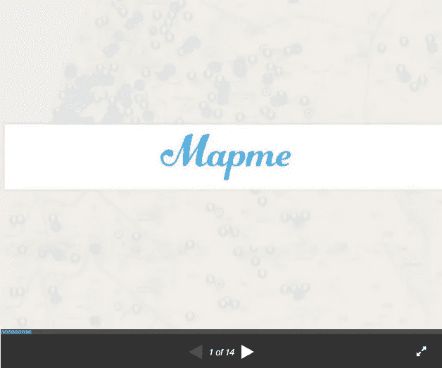
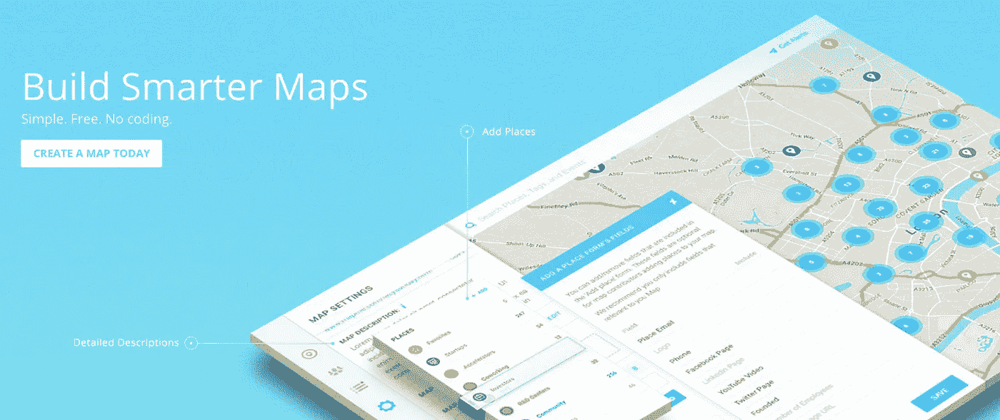

# 我们用来筹集 100 万美元的甲板

> 原文：<https://medium.com/swlh/the-deck-we-used-to-raise-1m-c001eb08f35a>

我不是筹款专家。到目前为止，我唯一的经历就是我们的种子期。作为第一次尝试者，研究其他球场是这一过程的关键部分。了解其他人做得对(或错)是非常有价值的。

当我们几个月前开始融资时，我看了至少 30 副牌。而且不，我说的不是 Linkedin 的 B 系列套牌或者 Airbnb 的种子展示。我说的是身边同行的套牌。尽管人们总是不愿意分享他们的牌。可以理解，这是非常隐私的…

为了让其他创业者更容易筹集资金，我把我们最初的卡片组**公之于众。(不是嵌入的，点击链接打开。)**

****

**我从使用这副牌的经历中学到了一些基本的东西:**

*   **某种形式的牵引+团队高于一切。**
*   **演示后没人听。**
*   **不要在设计上浪费太多时间。(我们没有。)**
*   **10-12 张幻灯片的内容是完美的。**
*   **做了 10 个不同版本的甲板。每隔几周迭代一次。**
*   **随着时间的推移，很多事情都会改变。可能一切都会。😂**

**我知道许多其他创业公司分享了他们的演示，但我在以色列很少看到。我很乐意看到更多的以色列创业公司为了当地生态系统的利益发布他们的套牌。**

**我对继续让 Mapme 变得更加[透明](http://mapme.com/about/dashboard-v2/)感到非常兴奋。感谢我们的投资者给了我们这么做的绝佳机会。更多即将推出！👌**

****

**[www.mapme.com](http://www.mapme.com)**

***想聊天？ben@mapme.com/@*[*benln*](http://www.twitter.com/benln)**