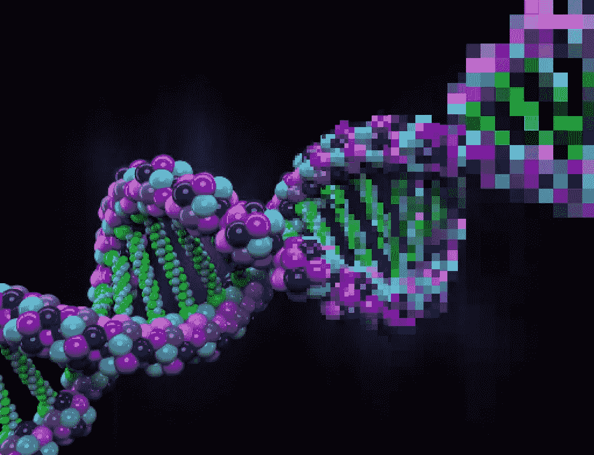

# 数据的分离

> 原文：<https://medium.com/swlh/the-decoupling-of-data-1b01c26a43a4>

区块链或人工智能有无数的用例，但比任何具体用例都更重要的是两种技术交汇处的范式转变:去中心化的数据所有权和数据与生成数据的应用程序和服务的解耦。

## 我们在哪里

今天，互联网被垄断我们数据的科技公司所主导。亚马逊、苹果、谷歌和脸书等公司正在无情地争夺用户数据的管理者。他们将尽可能多的数据吸收到他们的*许可的*平台上，在那里他们可以规定数据如何使用以及由谁使用[。许多新兴的企业已经被今天强大的技术](https://www.theverge.com/2018/8/16/17699626/twitter-third-party-apps-streaming-api-deprecation) [总理](https://www.cnbc.com/2018/08/23/23andme-is-telling-developers-that-it-plans-to-shut-off-its-api-in-two-weeks.html)设定的自助规则的变化[扼杀，消费者几乎没有能力迁移他们的数据或限制其使用，在某些情况下甚至没有删除。](https://www.theverge.com/2018/8/16/17699626/twitter-third-party-apps-streaming-api-deprecation)

这些有围墙的数据花园超越了我们的手机领域，进入了我们的医院。众所周知，医疗保健行业的数据非常分散；尽管纳税人花费了数十亿美元，但仅仅是获取你的健康记录就可能是一场噩梦，更不用说将其准确纳入新的医疗服务提供商的系统了。花时间与医疗从业者交谈，他们会很乐意告诉你这不是一个技术问题，而是一个商业激励。大玩家，供应商和电子健康记录供应商都没有动力让他们的系统互相交流。耶鲁大学医学院的 Harlan Krumholz 博士讲述了一位主要医疗保健领导者令人震惊的承认，完美地证明了这一点。

> “一个非常重要的医疗系统的领导在电话中私下对我说…‘为什么我们要让人们更容易获得他们的健康数据…我们希望让病人和我们在一起，所以我们为什么不想让他们离开变得更困难一点呢？’…我简直不敢相信，一个专业的医疗保健提供者向我解释这种医疗体系的哲学。"

提供商将他们的大量健康记录视为具有竞争力的 [资产](http://www.hschange.org/CONTENT/970/)，这既是因为“数据是新的石油”，可以用来推动新的创新，也是一种与他们应该服务的人建立粘性的懦弱方式。一前一后，电子健康记录供应商拖拖拉拉，互相争夺市场份额。

> 这一点的影响不能低估。这是*的毁灭性打击。*

医疗保健专业人员依靠健康记录做出明智的决策。如果没有正确的数据，在正确的时间，做出正确决策的可能性会更小。约翰·霍普斯金估计医疗事故是美国第三大死亡原因。然而，这还没有包括非致命事件导致的成本增加和护理质量下降。

或许更阴险的是，现状剥夺了新生的数据科学产业繁荣发展所需的燃料。大量的数据被闲置，大部分是关系良好的人获得数据，竞争被扼杀，最终受害的是病人。

## 捆绑数据

现状的结果是你的数据与产生它的应用程序和服务捆绑在一起。

如果我在亚马逊上买了东西，这个记录会留在亚马逊上。如果我发布了一个出现在你的新闻订阅上的状态，脸书会有那个数据。如果我做了血液测试，该数据由进行测试的提供者保存。如果我想更多地了解我的祖先，我会买一个 23andme 祖先试剂盒，我的基因组数据会留在 23andme。

在 23andme 的例子中，一个重要的区别是你为你的基因组数据和对它的分析付费。你不能把两者分开。我无法使用我的 helix.com 数据获得 23andme 血统报告，反之亦然。一个非常精明的用户可以挖掘 23andme，下载他们的原始数据，并上传到类似于[promote ase](https://promethease.com/ondemand)的网站，但是这个过程很难扩展，并且需要很高的技术成熟度。此外，Promothease 是为数不多的提供基因组数据分析而不生成数据本身的服务之一。

23andme 曾经提供一个 API，使第三方开发者能够访问同意的用户的基因组数据，但在 2018 年 8 月，他们改变了规则，并切断了访问。相反，第三方应用将只能利用 23andme 生成的*报告*，而不是硬基因组数据本身。你再也不能使用 23andme 的 API 来竞争对用户基因组数据的分析。这就是数据与服务捆绑在一起的后果:因为提供服务的公司运行一个集中的平台，数据托管在这个平台上，这可能会扼杀竞争。

哦，如果你还不知道，23andme 仍然在利用他们的平台和*你的基因组数据*从一家制药公司获得[数亿美元的投资。](http://fortune.com/2018/07/25/glaxosmithkline-23andme-gsk/)

> 难怪在这种不平等、隐私问题和抑制竞争的背景下，人们开始转向权力下放。

我在这里使用 23andme 作为例子，但是现在有无数的公司在所有的垂直领域都这样做。

## 更好的方法

区块链技术实现了数据的分散所有权，因此，*将数据从应用和服务中分离出来*。通过拆分数据并让用户控制，用户将能够把他们的数据带到任何地方，这将促进公开竞争。分散的数据所有权意味着没有一个集中的实体拥有托管数据的平台，也没有一个集中的实体能够改变规则来为自己谋利或扼杀竞争。

再次以基因组数据为例，用户可以自由获取他们的 23andme 数据，并使用它从 Helix、23andme、Ancestry、*或*promote ase 获得分析。这些公司中没有一家能够阻止其他公司在这个高度分散的竞争环境中提供服务。事实上，他们无法阻止任何人*。*我们的基因组分析不再只有一个选项，而是有成千上万个选项。公司和个人一样，将真正竞争提供最好的算法，金钱和数据将流向最好的算法。从长远来看，仅此一项就能给用户带来难以想象的好处。

> 公司和个人都将在提供最佳算法上展开真正的竞争。

但是，好处并不仅仅局限于用户。随着算法对用户和他们的美元的公开竞争，*算法存在一个直接的商业模式。*与其担心如何在一个有围墙的花园里获得用户群，或者如何获得医院数据的内部访问权，*如果你能创造出一个伟大的算法，你可以通过把它卖给用户来直接赚钱。这为创造算法提供了强大的动力，从而开启了一个新的可能性领域。*

> 分散的数据所有权为算法创造了直接的商业模式。

关于患者拥有的健康数据的好处已经写得很详细了，但简而言之，这里对患者和提供者也有类似的好处。患者将会得到更好的护理，提供者可以专注于做他们最擅长的事情并提供高质量的护理。EHR 供应商可以专注于在数据之上提供最好的 UI 和工具。

同样，我使用的是医疗保健的例子，但是这些概念在医疗保健之外也广泛适用。

## 隐私

许多技术正在成熟，可以确保用户的隐私也得到尊重。特别是，[同态加密](https://en.wikipedia.org/wiki/Homomorphic_encryption)、[安全多方计算](https://www.newamerica.org/oti/blog/protecting-privacy-secure-multi-party-computation/)和[零知识证明](https://en.wikipedia.org/wiki/Zero-knowledge_proof)可以允许算法在不暴露数据本身的情况下对用户数据进行训练。尤其是零知识证明，是区块链社区的最爱。然而，这些技术还处于起步阶段，在大规模应用之前还需要大量的研发工作。

## 结论

随着算法在我们生活中变得越来越根深蒂固和重要，我们必须创建公平和稳健的结构。今天的现状是两者都不是。科技巨头掌控着互联网的广阔领域；他们吸收消费者数据，将其货币化，并调整其平台的规则，以抑制竞争，为自己谋利。我在本文中主要使用了医疗保健的例子，但这是每个行业都存在的问题。

由区块链支持的分散数据所有权更好地改变了这种模式。通过将数据与生成数据的应用和服务分离，分散的数据所有权将扩大用户的选择，在算法之间形成公开竞争，并为算法创造直接的商业模式。最终结果将是创新的爆发，更公平的竞争环境，以及消费者的巨大利益。

## 与我联系

你也可以在 Medium 上关注我，或者在 Twitter 上关注我。感谢您的反馈！

## 这篇文章发表在[《创业](https://medium.com/swlh)》上，这是 Medium 最大的创业刊物，有+398，714 人关注。

## 订阅接收[我们的头条新闻](http://growthsupply.com/the-startup-newsletter/)。

