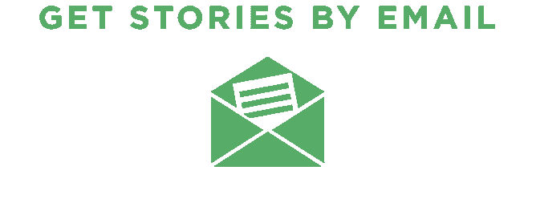

# 简历权威指南:维基百科没有告诉你的一切

> 原文：<https://medium.com/swlh/the-definitive-guide-to-resumes-everything-wikipedia-didn-t-tell-you-dfa5d03c6d3d>

[**这是我按时间顺序排列的简历模板。**](https://drive.google.com/file/d/0BykBIkZjPt4qS09lbTlJd1NRbGs/view)

109,000,000.

这是搜索查询“简历示例”的谷歌结果数

我记得我第一次开始写简历的时候。这是压倒性的。有这么多选择，我怎么知道该选择哪一个呢？在如此缺乏经验的情况下，我如何设计一份能让我获得带薪工作面试的简历呢？

没过多久，我就被所有的“简历范例”弄得不知所措，我决定需要外界的帮助，于是我收拾好自己的研究，在中佛罗里达大学的就业中心安排了一次约会。

在那里，我遇到了一位才华横溢的女士，凯瑟琳·兰考特，直到今天我仍然记得她，因为她教会了我如何找到一份工作。

Kathleen 向我提供了从简历样本到求职信范例和参考列表模板的所有示例，但为了这篇文章，我将只告诉你她的简历秘密。

一旦她给了我样本，我就跑回宿舍，在那里炮制我的简历。

喔，真是一团糟。

幸运的是，我有一个后续约会，Kathleen 能够更好地了解我的经历，并根据我的工作经历、技能和成就帮我定制简历。

如果我们都有一个凯萨琳来帮助我们登上简历的顶端，那不是很好吗？

我以为你会同意，所以我写了这篇博客来指导你浏览网上所有糟糕的、不错的和绝对令人惊讶的简历。

开始了。

# 每天我都在优化——简历优化

六秒钟。

根据网上求职匹配服务公司[的调查，招聘人员平均花 6 秒钟审查一份个人简历。](http://cdn.theladders.net/static/images/basicSite/pdfs/TheLadders-EyeTracking-StudyC2.pdf)

在这项研究中，加法器使用“眼球追踪”软件来观察招聘经理在这六秒钟内关注简历的哪些部分。

[http://thesherwoodgroup.com/business-education/redesign-your-resume-for-a-recruiters-6-second-attention-span/#.VeCNh9NViko](http://thesherwoodgroup.com/business-education/redesign-your-resume-for-a-recruiters-6-second-attention-span/#.VeCNh9NViko)

招聘人员花费 80%的时间在以下方面:

*   名字
*   目前的职位和公司
*   以前的头衔和公司
*   以前职位的开始和结束日期
*   当前职位的开始和结束日期
*   [教育](http://abcnews.go.com/Business/recipe-perfect-resume-revealed/story?id=23782664)

## 为什么是公司？

招聘人员对公司名称感兴趣，因为这与品牌息息相关。这很不幸，但却是事实，所以如果你有什么名人可以炫耀，确保在简历的开头就这样做。

## 为什么标题？

招聘经理想看看你最近的头衔是否和你被考虑的职位差不多。

**PS:招聘人员** [**甚至不打开你的求职信**](http://humancapitalist.com/7-step-resume-review-what-recruiters-really-look-for/) **。**

要点:你简历的顶部最吸引眼球，所以要确保它得到了优化。

# 简历格式

写一份完美的简历很难，因为每个人对“完美”都有不同的看法所以不要关注完美，让我们转向格式。

求职者将做出的最重要的决定之一是如何组织他们简历的内容。

## 按时间顺序排列的简历

我相信你们大多数人最熟悉的简历类型是按时间顺序排列的简历。这是雇主们倾向于喜欢的类型，因为它提供了一条易于遵循的工作经验之路。

但是仅仅因为这是最受欢迎的简历类型并不意味着它是适合你的格式。

如果你想在某个领域谋得一个职位，并且在这个领域你有稳定的进步记录，那么按时间顺序排列的简历是一个不错的选择。然而，如果你最近的工作经历与你申请的工作不相关，使用这种格式可能会对你的求职努力不利。

以下是什么时候不要使用一份**按时间顺序排列的**简历:

*   当你只在一个领域有经验，而申请不同行业的工作时
*   当你是一个入门级的求职者，几乎没有工作经验
*   当你频繁跳槽，大部分工作都做了不到一年
*   当你的工作经历有很大差距时

如果你属于这些类别中的一种，不要担心——简单地使用不同的简历格式。

这是你的 b 计划。

## 功能性简历

这种类型的简历以你的技能、经历和成就为中心，而不是你以前的工作。

功能性简历没有提到你以前的职位和工作日期。如果是这样的话，那也是模糊的。

以下是你应该考虑功能性简历的时候:

*   当你是一个入门级的求职者，几乎没有工作经验
*   当你在长期失业后重新进入劳动力市场时
*   当你做过很多工作，但这些工作并没有显示出你的职业成长。

***注:虽然我确实读到招聘人员对功能性简历持怀疑态度，*** [***我还是用了一份功能性简历***](http://thisisforthecrazyones.com/wp-content/uploads/2015/01/HollidayLauren-_-Resume-Draft-2014-151.pdf) ***，而且它登陆了我的*** [***很多面试***](https://www.themuse.com/advice/how-i-landed-15-job-interviews-in-30-minutes) ***。***

## 组合简历

组合简历是时间型简历和功能型简历的混合体。它以描述你的职能技能和相关资格开始，以倒序的雇佣历史结束。

以下是你应该考虑组合简历的时候:

*   你正在转行，需要指出你的技能，这与你目前申请的职位有关
*   申请工作时，你很少或根本没有时间顺序简历
*   你正在申请一份工作，而你在简历中几乎没有经验可以展示

事实:超过 90%的雇主现在将简历直接放入可搜索的数据库，同样比例的雇主更喜欢通过电子邮件接收简历。

这意味着绝对必须具备:

*   文档形式的格式化“打印”简历，可以作为电子邮件的附件发送给雇主
*   一份基于文本(ASCII 文本)的电子简历去掉了大部分格式，直接粘贴到发送给雇主的同一封电子邮件中(也可以粘贴到在线工作公告板上的申请/简历提交表单中)。

确保阅读招聘人员的说明。他们可能会建议提交特定的文件类型。

以下是关于哪些文件类型适用于哪些交付方法的高级要点。

*   ***文本(ASCII)简历*** 删除所有格式，使简历在所有电子邮件系统中显示相同，也便于粘贴到雇主简历数据库中。
*   ***PDF*** 简历在跨平台的外观上非常兼容和一致，但当他们试图将简历粘贴到他们的数据库时，可能会让雇主头疼。
*   [***在线简历***](https://sumry.me/) 让你的简历全天候可用，很容易扩展成在线作品集。

***外卖:***

*   ***没有一个合适的简历格式***
*   ***在求职过程中，你可能需要制作多份简历***
*   ***注意职位描述的格式类型表示提交***

# 标题

## 第 1 行:姓名(28 磅字体)

显然，我想我们都知道简历上的第一件事就是你的名字。你的名字是简历上最重要的信息，因为这是招聘人员记住你的方式。它应该突出，易于阅读。

你的名字应该是简历上最大的内容。我会在你的简历中使用相同的常规字体。标题字体唯一不同的地方是它比其他字体大了几号。

## 第 2 行:邮寄地址(12 磅字体)

招聘人员会查看候选人的邮寄地址，看看在薪资谈判过程中是否会产生搬迁或通勤成本。

我的朋友住在佛罗里达的时候在纽约申请工作时用了她祖父母的地址。如果你申请的是你所在州以外的工作，试着做同样的事情。

## 第 3 行:手机号码|电子邮件地址 LinkedIn 短网址(12 磅字体)

这是不言自明的。

***重要提示:*** 我真的不认为我需要重申我要说的话，但从我收到的一些简历来看，似乎许多年轻的专业人士不知道这封电子邮件的花絮… **确保你列出一个** [**专业电子邮件地址**](/freelan-ce-ship/you-must-learn-how-to-write-a-damn-good-email-1c8087e02c40) **。**

保持简单无趣。坚持:

*   lastname.firstname@gmail.com
*   firstname.lastname@gmail.com
*   [firstinitial.lastname@gmail.com](mailto:firstinitial.lastname@gmail.com)

你真的想避免包括数字和老派的电子邮件提供商，如 aol.com，尤其是如果你申请一个时尚的互联网营销职位。

## 第 4 行:个人网站 URL |任何附加的在线作品集链接

最后，我强烈推荐包含一个到你的专业在线网站的链接。

假设你已经清理了你的数字足迹，你的网站应该包括一个关于页面、作品集、联系信息、博客(如果你写作的话)和社交媒体简介的链接。

在这一行，我还包含了一个到我的写作作品集的链接，我的作品集存放在 pressfolios.com 的 T2。

# 增加目标还是不增加目标……这是一个问题

这一部分将会很短，因为我不认为你应该在简历中包含一个目标。

更不用说，可能不会有太多的空间，因为你应该只有一页纸的简历。

我写这一章只是为了你们这些[对在简历中添加客观陈述](https://hbr.org/2015/07/yes-your-rsum-needs-a-summary)充满热情的人。如果你打算在这一部分添加一些东西，那么我建议你输入一个**个人品牌陈述。**

这里有两个很好的资源来开发一个好的个人品牌或使命宣言。

*   [写一篇关于你自己的创造性非小说](http://50waystogetajob.com/mission/write-creative-non-fiction-about-yourself)
*   [练习 4 种不同的自我介绍方式](http://www.quintcareers.com/best_resume_format.html)

***外卖:***

*   ***客观陈述已经过时。我建议把它从你的简历中去掉。***
*   如果你必须把某样东西放在该放的地方，那么我建议你写一份个人品牌声明。

# 你的技能

技能部分不需要写在你的简历上，但是我建议把它加进去。

如果你在客观陈述和技能部分之间做决定，那么毫无疑问，列出你的技能。

**为什么？两个原因:**

1.  要点更容易理解。
2.  你可以很容易地量化你的技能和资格。

## 技能类型

1.  与工作相关的:这些是与你申请的工作相关的技能。

[***25 大热门硬技能***](http://blog.linkedin.com/2013/12/18/the%E2%80%9325-hottest-skills-that-got-people-hired-in%E2%80%932013/)***:***

*   社交媒体营销
*   移动开发
*   云和分布式计算
*   Perl/Python/Ruby
*   统计分析和数据挖掘
*   用户界面设计
*   数字和在线营销
*   招聘
*   业务开发/关系管理
*   零售支付和信息系统
*   商业智能
*   数据工程和数据仓库
*   网络编程
*   算法设计——这听起来很酷
*   数据库管理和软件
*   计算机图形和动画
*   C/C++
*   中间件和集成软件
*   Java 开发
*   软件质量保证和用户测试
*   PR & communication s——很乐意做这个。我超级擅长拓展
*   软件工程管理
*   信息安全
*   战略和战略规划
*   存储系统和管理

**2。可转移:**你可以用在不同角色和职位的技能是可转移技能，因为你把它们从一个职位“转移”到另一个职位。大量可转移的技能也被称为“软技能”

***十大可转移技能:***

*   沟通
*   协力
*   时间管理
*   解决问题
*   组织
*   学问
*   计算机/技术
*   倾听
*   创造力
*   领导力

## 量化

量化你的技能就是给你的成就标上数字。

例如，在我的技能部分，我通过添加以下要点来量化我在社交媒体方面的能力:

*   Elance 前 5%的社交媒体营销

如果你没有任何可量化的技能，也不要担心。只需找到一个在线测试或认证。这不会花费太多时间，而且会给雇主一个与你的技能相关的实际数字。

***我建议***[***Smarterer.com***](http://smarterer.com/)***，或者如果你是做营销的，***[***HubSpot 的集客营销认证***](http://academy.hubspot.com/certification) ***。***

## 定制

你应该有几份不同的简历，这样你就可以快速有效地在线申请工作，或者马上给联系人发送简历。

例如，我有三份简历。

*   写简历
*   社交媒体简历
*   营销简历

一个好办法是[将你想要的每份工作描述](http://inbound.org/post/view/how-to-correctly-apply-for-a-job)复制并粘贴到 Word 文档中，然后突出显示其中重复出现的技能。将这些重复的技能添加到你的技能部分。

## 长度

压倒性的意见似乎是:保持你的技能部分简洁明了。

包括 8-15 项你最强和最受欢迎的技能。

你增加多少取决于你的经验、能力和给定的工作描述。

## 好的要点与不好的要点

陈词滥调=糟糕。

迷你，丰富多彩的故事=好。

根据 CBSNews.com AskLizRyan.com 公司的首席执行官利兹·瑞恩的说法，你的技能部分应该用很小很小的故事来完成。 ***与其说沟通能力强，不如说你从零开始建立了公司的简讯。*** 这是一个要点，它充分说明了你的情况。从零开始构建的短语是 ***口语*** ，所以雇主喜欢它，因为它表示你对自己的皮肤感到舒适。

## **公式**

一个绝妙的要点告诉招聘人员你已经做了什么。

**坏技能示例**

*   注重结果的专业人员
*   优秀的沟通技巧
*   经过证明的成功记录
*   底线导向
*   自我激励
*   通力合作者
*   很强的谈判技巧

**变坏为好**

*   精通财务>花了四天时间追查财务漏洞
*   在压力下工作出色>在每天报道地震危机时保持冷静
*   出色地与客户合作>挽救了我们最大的客户，他正准备离开

**必备技能**

据《福布斯》报道，以下是雇主最希望在求职者简历中看到的六项技能。

1.  能够在团队结构中工作
2.  能够与组织内外的人进行口头交流
3.  决策和解决问题的能力
4.  获取和处理信息的能力
5.  计划、组织和优先处理工作的能力
6.  分析定量数据的能力

[**按技能类型分列的惊人技能资源列表**](http://jobsearch.about.com/od/list/fl/list-of-skills-resume.htm)

# 发现你的技能

列出你的技能往往会让你一无所获。这只是因为它需要对以前的经历进行大量的反思。

为了让这个过程对你来说更容易，我将带你一步步找到你的最佳品质和技能。

1.  进行一次大脑转储:打开一个笔记本或谷歌文档，把你所有的成就从以下地方“转储”出来:

*   学校
*   工作(专业或其他)
*   志愿工作

2.除了你的成就，**“转储”(在同一个 doc 中)你一直使用的所有计算机程序或机器/特殊设备。**

例如:

*   微软办公
*   POS 系统如果你是餐馆服务员

3.对这些项目进行反思。查看这些成就，开始写或打字，看看你用了哪些技能来实现你清单上的项目。

4.创建一份你技能的电子表格。打开 Google 或 Excel 电子表格，并按如下方式标记各列:

*   动作动词
*   技能(名词)
*   公制的

一) ***从“技能”栏开始。*** 从[这里](http://jobsearch.about.com/od/list/fl/list-of-skills-resume.htm)和[这里](http://www.quintcareers.com/job_skills_values.html)获得技能想法。现在，在这一栏中列出你所有的技能。尽量至少列出 10 个。

B) ***接下来，添加动作。*** 每项技能都要求你在第一栏输入一个动作动词。这里有一个从 A 到 Z 的动作动词的详尽列表。

C) ***最后，生动量化每个技能。*** 想钱、想时间、想金额。以下是一些例子:

*   管理 10 万美元的内容预算
*   在两周内撰写和编辑超过 10000 字的职业指南
*   Elance 前 5%的社交媒体营销

最后，删除尽可能多的单词，保持简洁明了。

***重要提示:如果你想获得最好的技能，就不要急于完成这一部分。思考过程需要时间，当你申请工作的时候，它会让你的生活变得更容易。***

# 工作经历

High Fliers Research 2013 年的一份报告得出结论，没有工作经验的大学毕业生很少有机会找到工作。*(咄！)*

不管他们是否承认，以前的工作经验对雇主来说是最重要的，所以你要确保你能有效地写这一部分。

## 体验框架

您的工作经历可以根据以下任一项分为几个部分:

*   你的技能(功能性简历)或
*   你受雇的日期(按时间顺序排列的简历)

当然，对你的经历进行排序的最典型的方式是后者——按时间顺序——在顶部列出你的最新职位。

**包括什么:**

你应该让你以前的每一个职位都很容易在雇主面前脱颖而出。确保每项工作包括:

*   ***职位名称***
*   ***公司名称***
*   ***任职日期*** (年月-年月)
*   ***市，*州，**

注:在本指南的最后，我会告诉你如何格式化你的整个简历。暂时只专注于写下好的内容。

***要点***

每份工作经历中最重要的部分是你为每份工作打出的三到五个要点。

你要确保你的要点漂亮而有力，而不是蓬松。同样，正如我在技能一章中提到的，你需要**量化**你的成就。

如果你需要复习度量标准，请参考那一章。

这里有一些要点提示:

*   每个项目符号以动作动词开头
*   使用词语，如利用、设计、组织、创造、提供、发现、合作
*   每个描述最多使用三到四个要点
*   确保你的动词符合时态，例如，你不想在你的第一个要点中使用“begin ”,然后在第二个要点中使用“used”
*   不要在每个项目符号的末尾加上句号

# 志愿工作

我们确信你们中的大多数人可能几乎没有工作经验。不要难受！当我们开始的时候，我们都没有什么经验。

为你的简历和作品集增加亮点的一个好方法是志愿加入一个非营利组织。

## 我应该在哪里做志愿者？

你可能想知道去哪里做志愿者。哪些非营利组织在你的简历上看起来最好？不在于你在哪里做了那么多志愿者，而在于你在那里的时候做了什么。

志愿参加酷的活动，这会给你很好的体验。这样不仅好看，还能帮你认识更多志同道合的人。此外，它给你机会学习更多。

我会志愿参加短期、高回报的活动，比如 [GiveCamp](http://givecamp.org/) 或者[创业周末](http://startupweekend.org/)。

在奥兰多 GiveCamp，我只需要花一个周末或 54 个小时作为一个非营利组织的项目经理，该组织提交了一份免费完成网站的提案。

只需投入最少的时间，我就能够:

*   获得项目经理经验
*   回馈社会
*   将网站添加到我的作品集
*   认识比我聪明的酷人，并得到更多的名片

# 教育

耶！我们已经完成了你简历的末尾——教育部分，这是最容易完成的部分，因为它的内容最少，也最不重要。

## 要包含的内容:

*   大学名称
*   学位类型和专业
*   预计毕业日期(年月)
*   位置

如果你和我一样，从大学退学了，那又怎么样？

我建议不要在简历中写教育背景。作为一名大学辍学生，这就是我所做的。只有两位招聘经理问过为什么没有。

***注意:不要把你的整个教育历史一直追溯到小学。包括你最近的学位，仅此而已。***

# 附加部分:包括或不包括…

以下简历部分是可选的，或者是对很少或没有相关工作经验的求职者而言。

## 课程作业

课程部分是专门为目前在校学生或没有相关工作经验的应届毕业生准备的。

如果你打算把你的课程包括在内，那么我强烈建议你在教育部分这样做。只需在你的教育信息下添加要点，并列出你的相关课程。

***只包括高度相关的类。研究一下哪些课程是最好的，或者问问你大学的职业顾问。***

## 奖项和俱乐部

如果你获得了一个奖项或者是一个职业俱乐部的成员，那么毫无疑问地包括它。

只需将技能部分更改为“技能、荣誉和俱乐部”，并根据需要添加要点。只要保证技能和技能分组就可以了；荣誉与荣誉；还有梅花和梅花。

## 参考

虽然有些求职者会在简历中添加参考资料，但这并不是简历的正确格式。

招聘经理在进行面试后会要求推荐信；因此，只在以下两种情况中的一种情况下包括您的推荐人:

*   你在简历的第一页有很多空白
*   招聘启事要求你附上推荐信。

***注意:*** 即使招聘人员要求在你的申请中附上推荐信，我也建议你在申请中附上一份单独的 PDF 格式的推荐信。

# 一份“有吸引力”的简历是什么样的？

呜哇！困难的工作——制作内容——已经完成，但是不要停止阅读，因为我们仍然需要设计和格式化你的简历。

一份没有吸引力的、格式不当的简历会像一份内容糟糕的简历一样阻碍你得到回复。

虽然一些求职者(大多是设计师、营销人员和创意人员)制作独特的简历来脱颖而出并展示他们的技能，但这种简历并不适合所有人。

[**这里有一个按时间顺序排列的简历模板。**](http://blog.freelanship.com/wp-content/uploads/2015/08/LastnameFirstname-resume-20140506.docx)

[**这是我的功能性简历模板，你可以随意复制。**](http://thisisforthecrazyones.com/wp-content/uploads/2015/01/HollidayLauren-_-Resume-Draft-2014-151.pdf)

# 仅适用于创造性领域(如果你从事非创造性职业，请跳过)

如果你从事创意行业，那么写一份创意简历和一份乏味的黑白简历是个好主意。

***若此则彼***

*   如果你是通过求职公告板申请工作，附上你的“无聊”简历。只附上你的“创造性”的，如果它允许你上传更多的文件。
*   如果你直接给招聘经理发邮件，我会附上你的创意简历。

## ***创意简历操作指南***

有许多不同的方法可以有效地展示你的简历。

**初学者**

对于那些从事创意行业但不是设计师的人，我建议用类似于 [Sumry](https://sumry.me/) 或 [Branded.me](https://branded.me/) 的格式来制作你的简历。

这些易于操作且美观的工具让想要成为设计师的人可以制作出华丽、常青的简历。

你也可以用自由职业者身份将你的简历设计交换或外包给设计专业的学生。

**中级**

你知道什么是向量吗？你喜欢在 Illustrator 中自定义矢量还是在 Photoshop 中自定义 PSDs？

如果你回答是，那么下载一个免费或付费的自定义简历模板。你可以在 [**Mighty Deals**](http://www.mightydeals.com/) 和[**graphic river**](http://graphicriver.net/)**等地方找到创意模板。**

**高级**

如果你是一名设计师，那么我没有必要告诉你该做什么…我相信你会想到一些东西！

http://freelanship.com

[*自由职业者*](http://freelanship.com) *简单来说就是基于项目的工作经历。*

这些实习不同于传统的实习，因为它们关注的是可交付成果，而不是时间框架。

*他们可以是虚拟的，也可以是在职的。*

自由职业者关注的是获得的经验，而不是其他。

我们不在乎它是否是一个不酷的小企业，想要雇佣一个营销自由人或脸书。

重要的是经验或项目是否有价值。

*发表于* **创业、旅游癖和生活黑客**

-