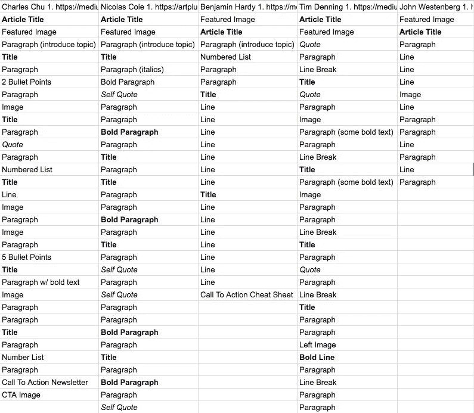
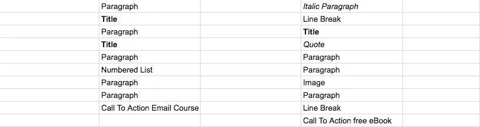
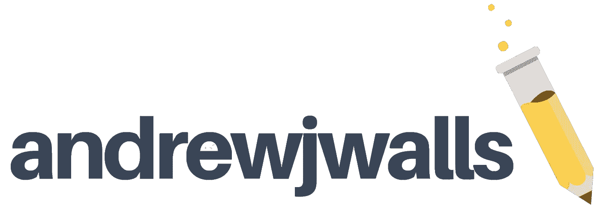

# 从分析媒体前 5 名作家看权威媒体风格指南

> 原文：<https://medium.com/swlh/the-definitive-medium-style-guide-from-analyzing-mediums-top-5-writers-cbf385dc0459>

新作家似乎总是吐出冗长的段落。

有长的连续句和**没有变化。**

media 有这些奇妙的工具让写作*变得美丽*，我将向你们展示 media 的精英作家是如何运用这些工具的。

## 首先，这些工具是什么？我会在下面列出它们。

段落(2 +行，通常不止一个想法)。组织成句子，感叹词！还有问题吗？

行(1 行文本=一个独特的想法)

*   要点(在苹果电脑上点击 alt-8)

[链接(要链接，高亮显示并点击“链接”链)](https://www.lifewire.com/how-do-hyperlinks-work-2483287)

1.  编号列表(类型 1。并按 enter 键)

*斜体文本*(高亮文本，点击小 I)

**粗体文本**(高亮文本，大写 B)

> 引号(突出显示文本，撇号)

# 标题(高亮显示，大写 T)

## 字幕(高亮，小写 T)

**换行符**(在新行上点击+号，它是双连字符)

**图像** ( [Unsplash](https://unsplash.com/) 、[pexel](https://www.pexels.com/)是简单、免费、非固定的图像存储库。点击图像获取 4 个间距选项；左，小中心，大中心，宽屏)

**嵌入内容**(新行+上的箭头或括号。下面是一个嵌入的推文示例。您可以嵌入视频和大多数社交内容。)

# 就这样。

T 这个平台上讲述的故事多得令人难以置信，而且是通过那些简单的工具……我在这一段提到了这个大字母。

让我们看看中型企业的精英是如何使用它们的。

我做了一个电子表格，把查尔斯·楚、尼古拉斯·科尔、本杰明·哈代、蒂姆·丹宁和约翰·韦斯特伯格的文章分解成这些部分。

注意到相似之处了吗？他们都让自己的写作 T22 充满活力。

# 他们用引号、斜体字、图片、标题、项目符号和列表来表达他们的想法。

> 他们链接到自己的消息来源，如果别人说得更好，他们不怕直接引用。

1.  他们在读者时间上很有效率。每篇文章一篇论文，不到 10 分钟。没有浪费的话。
2.  他们有行动呼吁。他们收集热情读者的电子邮件，让他们保持阅读和参与。
3.  他们并不害怕让自己的写作风格在特质中闪耀。例如；

*   [Charles Chu](/the-polymath-project/visualizing-the-meaning-of-life-the-drip-coffee-model-87a37e3d4040) 引用他的原始材料为他的论点添加不同的观点，并以他读过的书为他的文章的基础。
*   尼古拉斯·科尔使用**粗体**和*斜体*文本来突出重要的或有意义的单词。
*   本杰明·哈迪使用短小、简洁、沉重的线条来加强文章的冲击力。
*   蒂姆·丹宁在每个“部分”使用换行符来表示何时开始新的推理。他把这些串联起来，形成容易理解的论点。
*   约翰·韦斯顿伯格使用短文来保持观点的尖锐和简洁。

# 怎么能写得像 Medium 的精英？简短的风格指南

以一个有影响力的标题**开始，然后是一个有吸引力的、相关的特色图片。**

马上介绍你的话题。读者从阅读这篇文章中会获得什么价值？

将你的文章分成最多 2-3 个不同的部分。每篇文章都有一个标题，最多 2-3 段，并带有一些**粗体**或*斜体*文本。

用图片完成每一部分。

链接或引用你的来源。一直都是。

利用个人经验和弱点。这篇文章是哪里来的？亲身经历？研究？可信度很重要。

> 写一个你热爱的领域。

我写这篇文章是因为我迫切的想写出更吸引人的文章。我决定研究精英作家，通过与你们分享我所学到的，我自己更好地理解它。你今天学到了什么？

以行动号召结束。邮件列表？访问你的个人博客？可能只是分享其他你引以为豪的文章。设法让读者留在你的生态系统中。

想要更多吗？加入 100 多名读者，获得 [**10 个故事**](https://www.andrewjwalls.com/subscribe/) ，每周一剂我最好的文章，引用，我使用的资源等等。我会发给你一个文件夹，里面装满了设计思维、领导力和创业工具。 [**在这里获取权限**](https://www.andrewjwalls.com/subscribe/) **。**

## 这篇文章发表在 [The Startup](https://medium.com/swlh) 上，这是 Medium 最大的创业刊物，有 318，983+人关注。

## 在这里订阅接收[我们的头条新闻](http://growthsupply.com/the-startup-newsletter/)。

