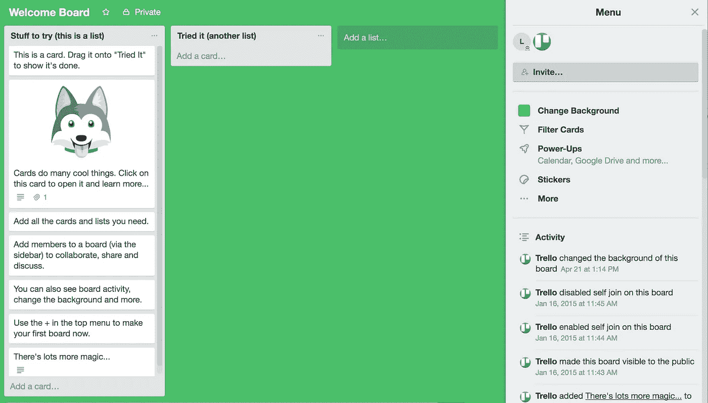
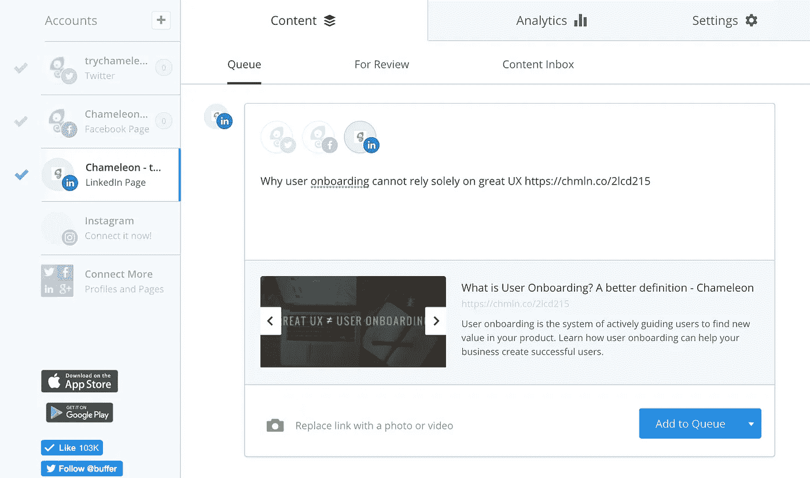
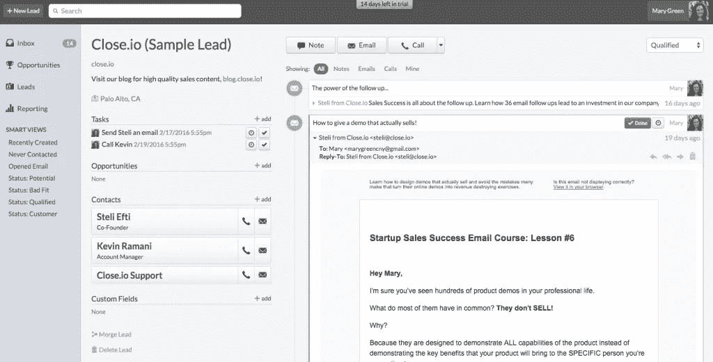
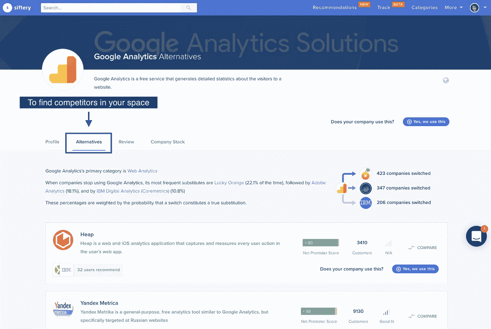
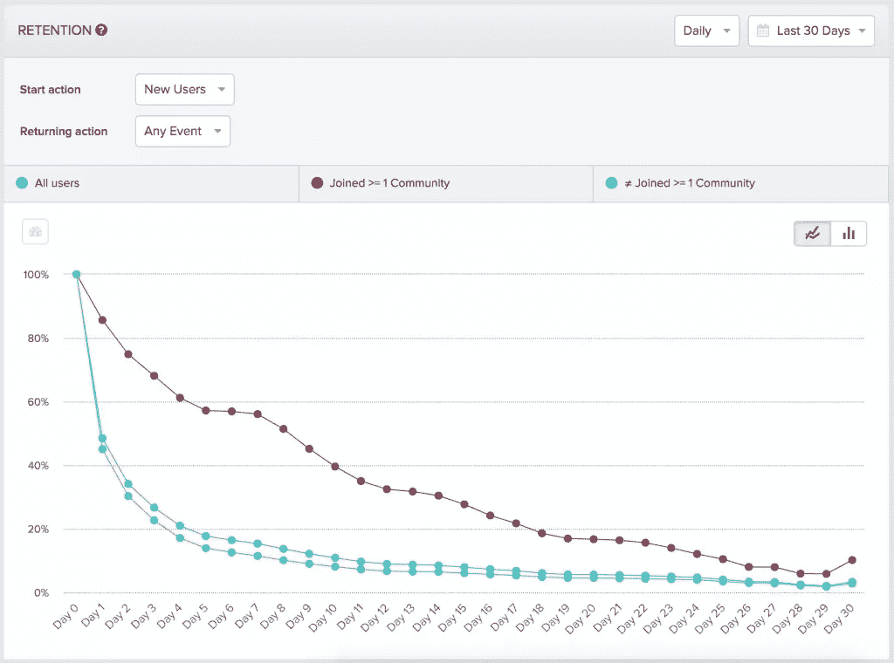

# 成功用户入职的令人愉快的秘密

> 原文：<https://medium.com/swlh/the-delightful-secret-of-successful-user-onboarding-79b6f1fd4871>

流失会扼杀一个企业。为了防止新用户没有完成入职就离开，您需要更好地理解他们的“啊哈！”时刻。

对于初创公司来说，流失是一个经常被忽视的问题，因为他们关注的是增长而不是保留。HubSpot 前增长主管布莱恩·鲍尔弗(Brian Balfour)甚至反复建议，公司应该优先考虑留住人才，而不是增长。

然而，据估计，30%以上的 [SaaS 供应商的流失率超过 10%](http://sixteenventures.com/saas-churn-rate)。这可能会扼杀一个企业，因此迫切地寻找提高保留率的方法非常重要。

有一个关键的秘密🔮这可能会有所帮助——**将客户流失和强大的用户加入联系起来，以实现更高的保留率**:啊哈瞬间。这一时刻，或者说缺乏这一时刻，是用户漏斗泄漏的主要因素之一。

啊哈时刻💡是**用户第一次认识并内化产品或功能的价值**。其他名字包括:哇时刻；哇的时候到了；达到第一个值的时间；这些都暗示了当用户遇到这一时刻时的感受。

# 为什么是啊哈时刻💡这么重要？

用户只有在发现产品有用时才会继续投资。我们的注意力都是有限的，在此期间，你的产品必须给用户带来价值。人们想要快速的结果，拒绝浪费时间在产品中寻找显而易见的东西。

由于有几个选项(即你的竞争对手)可以解决大多数需求，产品需要在注册后，在新用户转向下一个选项之前快速证明其价值。

最重要的是，在关系早期失去的用户不太可能再回来。实际上， [KickOffLabs](https://blog.kissmetrics.com/the-first-5-minutes/) 发现:

> **用户头 5 分钟的改善可以推动生命周期价值增加 50%。**

你必须给用户一个回来的理由，向他们展示你的产品有多成功，并继续提供更多的价值来防止流失。

🔍**Inbound.org 的一个例子**

Inbound.org，一个营销人员的社区，以前使用的注册过程只是让用户回到主页，留下来探索。然而，在发现用户的啊哈时刻是在参与一场对话之后，主页上引入了一个新的行动号召“通过分享他们最喜欢的文章或提出问题来开始”。这个简单的行为增加了 15%的新用户保持率！

在这篇文章中，我们将讨论第一个关键的 Aha 时刻，注册后的第一个主要时刻，但重要的是要注意在用户的生命周期中有几个 Aha 时刻。成功提交表单并看到您的产品界面是一个小小的啊哈时刻，获得支持票的回复也是如此。随着用户对你的产品参与度的加深，不断驱使他们[在你的产品](https://www.trychameleon.com/blog/what-is-user-onboarding?utm_source=medium&utm_medium=blog&utm_campaign=chameleon_blog&utm_content=finding_aha)中发现新的价值是很重要的。

# 啊哈时刻的伟大例子

Trello 和 Buffer 是两个非常成功的产品，在帮助用户实现啊哈时刻方面做得非常好。

[Trello](https://trello.com/?utm_source=chameleon&utm_medium=blog) 是一个项目管理平台，其价值主张是让用户能够快速组织和优先处理日常项目。在登陆他们的应用程序后，Trello 通过一个模板化的示例欢迎板帮助用户快速掌握他们的核心价值。

Trello 使用欢迎板，通过鼓励用户与之互动来快速展示产品的工作原理。他们认识到，Aha 时刻是用户能够添加任务并在列表中移动它们的时候，因此“要尝试的东西”列表中的第一项是将一张卡片拖到“已尝试”列表中。这样，用户很快就明白组织他们的项目是多么容易——这是 Trello 核心价值的一部分。

Trello 是一个很好的例子，展示了如何使用自己的产品吸引新用户，并引导用户快速发现产品的价值。

[Buffer](https://buffer.com/app?utm_source=chameleon&utm_medium=blog) 是一款社交媒体管理工具，可以让你轻松安排未来的社交帖子。Buffer 通过默认提示用户使用“添加到队列”按钮(而不是立即发布帖子)来帮助他们“啊哈！”。

Close.io 是一个 CRM 解决方案(帮助管理销售前景和机会)，声称它减少了数据输入，以帮助您更有效率。它会自动跟踪你的所有活动，所以在注册后，用户会立即被带到一个联系界面。在这里，他们将看到与该联系人的历史交互的所有信息，但是因为他们是新的，所以使用了样本数据(例如对话)。通过这种方式，Close.io 正在帮助用户找到啊哈时刻，即使所有必要的数据尚不可用。

空状态可能是一个令人沮丧的用户的原因，因为他们不能(或不想)想象产品的全部荣耀。然而，您可以通过这些策略将这种风险转化为机会，利用[空状态来实现更好的用户入职](https://www.trychameleon.com/blog/how-to-use-empty-states-for-better-onboarding?utm_source=medium&utm_medium=blog&utm_campaign=chameleon_blog&utm_content=finding_aha)。

# 确定你的产品的啊哈时刻

所以接下来的问题是:“我的产品的啊哈时刻是什么？”这取决于产品 UX、价值主张、用户角色和其他因素，但可以通过遵循假设驱动的方法来确定:确定最有可能的啊哈时刻，然后测试它。如果它不是正确的，那么确定一个不同的，并再次测试。

第一个假设应该基于你的产品的价值主张。这将是你网站上的一份利益声明，或者是你努力的目标。您可以尝试通过以下方式验证这一点:

## 1.询问当前客户

你目前的客户很可能发现了啊哈时刻，这帮助他们留下来，所以他们是一个伟大的想法来源。

关注相对较新的客户(例如 1-3 个月大)，发送调查(使用像 [Typeform](https://www.typeform.com/?utm_source=chameleon&utm_medium=blog) 这样的工具)、产品内投票(使用像 [Hotjar](https://www.hotjar.com/?utm_source=chameleon&utm_medium=blog) 这样的工具)或简单的电子邮件(使用像 [Intercom](https://www.intercom.com/?utm_source=chameleon&utm_medium=blog) 这样的工具)。

以下是一些您可以使用的示例问题:

*   他们是什么时候决定继续使用你们的产品/为你们的产品买单的？
*   他们最感兴趣的功能是什么？
*   他们是否立即看到了价值？
*   他们感到失落还是不知道该做什么？
*   他们能够很快用你的产品获得成功吗？

一旦你收集了回复，通读每一条回复并寻找主题——他们在哪里面临问题(例如困惑点或他们在哪里寻求帮助)以及他们在哪里迅速找到成功和快乐。

如上所述，Aha 时刻将因用户类型而异，尤其是对于具有较大市场和多个角色的产品。在查看客户调查数据时，重要的是按人物角色对数据进行分组，以了解某些用户类型是否对产品的相似部分感到困惑或兴奋。这样，如果需要，我们可以使用这些信息来定制不同的用户入职培训。

## 2.用户测试

如果你不能从询问现有客户中找到一个清晰的啊哈时刻，你可以回顾一下潜在客户在注册你的产品并通过入职流程时的表现。你可以现场查看(使用像 [FullStory](https://www.fullstory.com/?utm_source=chameleon&utm_medium=blog) 这样的产品)或者用测试用户代理(使用像 [UserTesting](https://www.usertesting.com/?utm_source=chameleon&utm_medium=blog) 这样的产品)。

你也可以独立设置一些测试，简单地使用 Google Hangouts 或 Zoom 来观察用户在做什么以及他们的反应。重要的是要注意他们在哪里提问，在哪里进步很快。你将能够通过他们的面部反应来确定他们高兴和高兴的时间，并且你可以在接下来的谈话中就这些问题提出进一步的问题。

## 3.观察竞争对手

最后，你也可以通过观察你的竞争对手在做什么来获得一些想法。他们也可能试图确定他们的关键啊哈时刻，并在他们的网站上清楚地解释他们的价值，所以如果与你的产品相关，你可以利用类似的主题。

您可以在[产品搜索](https://www.producthunt.com/?utm_source=chameleon&utm_medium=blog)、 [Siftery](https://siftery.com//?utm_source=chameleon&utm_medium=blog) 或 [Capterra](https://www.capterra.com/?utm_source=chameleon&utm_medium=blog) 上找到竞争对手，并注册免费试用，亲自体验一下！

你需要每年与竞争对手交流一两次，看看他们是否做出了改变。理想情况下，虽然你应该在需要再次检查它们之前很久就很好地掌握啊哈时刻。

# 让啊哈时刻经受考验

一旦你发现了一个可能的啊哈时刻，你应该测试它，以确定它是否真的与长期用户参与相关(并导致长期用户参与)。有时，用户在采访中表达的内容可能与他们的实际行为有所不同，所以用数据进行测试是真正理解你的 UX 目标的重要组成部分。

首先，你会想要建立**相关性**:用户达到这个啊哈时刻是否与他们更投入相关。然后你会想要建立**因果关系**——达到这种顿悟时刻会让他们更投入吗？如果你这样做，那么你就有了减少流失的秘方！🍾

## 1.建立关联

要做到这一点，回顾一下你的用户留存数据，看看用户是否会在满足 Aha 时刻后返回，以及这与你的总体留存数字相比如何。然而，为此，你需要已经在你的分析工具中作为产品事件跟踪 Aha 时刻。

然后，您将能够从[振幅](https://amplitude.com/?utm_source=chameleon&utm_medium=blog)建立一个保留图表，如下图所示。我们在那里的朋友也写了一些关于[分析留存](https://amplitude.com/blog/2015/12/15/how-to-increase-growth-through-retention-analysis/?utm_source=chameleon&utm_medium=blog)的精彩内容——查看更多想法。

这张图表显示了所有用户、加入“社区”的用户和没有加入“社区”的用户对新用户的忠诚度。你可以创建一个类似的图表，包括完成了你的啊哈时刻的用户群和没有完成的用户群。如果你注意到一个明显的区别，如上所述，那么很明显，Aha Moment 产品事件与更好的保留相关联！🎉

**如果你还没有追踪啊哈时刻**

如果你还没有收集 Aha Moment 产品事件的数据，那么你就不能进行这种分析。您有两个选择:(A)让您的产品收集这些数据并等待评估，或者(B)跳过这一步，直接进行原因分析。

## 2.确立因果关系

相关性并不意味着完成该事件的用户一定会更加投入。Aha 时刻和保持的驱动力可能是一些其他的行为或事件，所以试图将更多的用户引向 Aha 不会有助于保持。因此我们必须检验因果关系。

要做到这一点，你需要运行一个实时的 A/B 测试，在这个测试中你改变了产品中的一些东西，并对照一个控制组来评估它。

(注:如果你对 A/B 测试不熟悉，或者流量不够，那么你可以做一个串行测试，你改变一件事，然后测量结果，并与前期进行比较。这不像 A/B 测试那样在同一时期内比较两组结果那样可靠，但这是一个可以接受的第二选择。)

尝试通过实验推动一群用户走向啊哈时刻，并评估这如何影响他们的保留。做到这一点的最好方法是一些产品内的用户指南。如果你不想等待可用的工程资源，那么你可以使用[变色龙](https://www.trychameleon.com/how-it-works?utm_source=medium&utm_medium=blog&utm_campaign=chameleon_blog&utm_content=finding_aha):你可以决定在用户旅程的什么时候向他们展示什么内容，而不需要写任何代码。

或者，您可以向选定的一组用户发送电子邮件活动，以帮助推动行动。在此之后，你应该评估一下控制组和测试组在记忆方面的表现。

如果保留随着测试组的增加而增加，这就证明了你假设的啊哈时刻确实推动了用户保留！如果没有，你可以尝试另一个想法。

一旦你证明了你的假设，你就知道你的目标是什么，你可以更加努力地推动你的所有用户走向这个关键的啊哈时刻。🚀

# 结论

了解你的啊哈时刻是成功吸引用户和留住新用户的秘诀。它为您为产品团队设定的目标提供了框架，是推动产品采用的系统方法。它可以而且应该不仅适用于新用户，还适用于用户生命周期的每个阶段，以及所有的产品和功能采用目标。

*查看我们的博客***，了解更多用户入职最佳实践！**

**

## *这个故事发表在《创业公司》杂志上，有 259，700 多人聚集在一起阅读 Medium 关于创业的主要故事。*

## *在这里订阅接收[我们的头条新闻](http://growthsupply.com/the-startup-newsletter/)。*

**