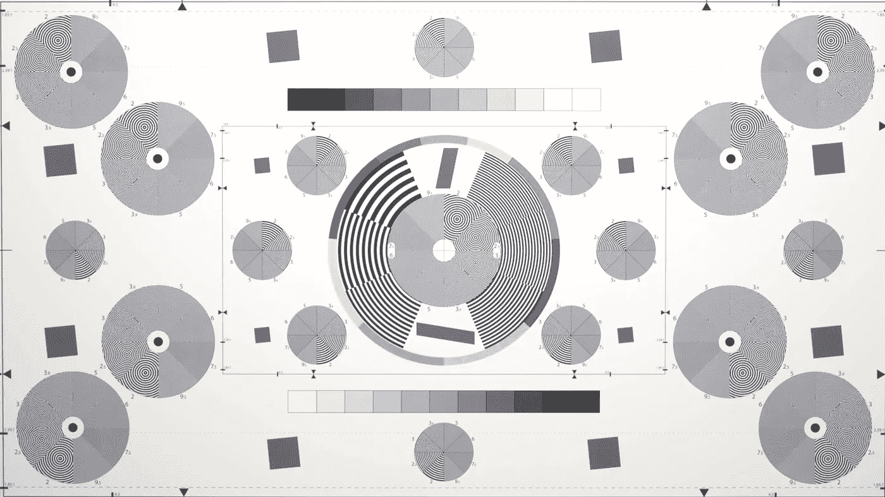

# 创造力的民主化

> 原文：<https://medium.com/swlh/the-democratization-of-creativity-ce6bf785163a>

不久前，拥有一台相机曾经是一件事。如果你有一台相机，它通常只用于两种不同的用途:记录和创意摄影。我用文档这个词来描述那些充斥在每个人阁楼上的相册里的普通家庭照片之类的东西，而创意摄影指的是任何艺术或商业意义上的摄影。

当然，大多数人都有某种能拍 35mm 胶片的普通傻瓜相机，或者后来的低端数码相机。有些人总是买一次性相机。不管怎样，对于普通人来说，没有太多的动力(甚至没有太多的可能性)带着那种装备出门，并开始发展他们的摄影技能。胶卷很贵，早期的数码相机很麻烦，质量也很差。

手机摄像头开启了这一切的革命。当然，就图像质量而言，早期的例子(实际上直到最近)糟糕得可笑。然而，每个人口袋里都有一架照相机。俗话说，最好的相机是你随身携带的那台。

自从 2007 年 iPhone 问世后，智能手机开始大受欢迎，照片的使用和分享方式也大幅增加。社交网络对此负有很大责任。移动编辑应用程序让普通人可以廉价地了解诸如对比度、色温、高光等内容，以及它们如何影响每张照片。诸如 Instagram 上的过滤器使整个过程变得无脑。对于许多人来说，他们知道照片用某种滤镜看起来“更好”，但他们并不完全清楚为什么。

## 所以现在每个人都比较擅长摄影

当然，并不是每个拍照的人都是出于创造性或艺术性的考虑。对许多人来说，他们只是想记录下这一刻。而对于这个群体，我认为高质量智能手机摄像头的大规模扩散是最有利的。

想想老一代人和新一代人在试图留下回忆时拍摄的所有可怕的照片。由于我们中的许多人都不经意地学习了一些关于照明、构图和其他摄影基础的知识，甚至这些假期快照或午餐时的照片最终都要好得多。

但是对于摄影的艺术和创作端，我认为这种现象是一把双刃剑。随着每个人平均技能水平的提高，Instagram 上的半路出家的摄影师的过度饱和也在增加。拍摄或多或少还可以的照片并不是火箭科学，当标准不高时，这些就可以了。不幸的是，这确实意味着这种饱和会导致好的作品经常被淹没在内容的洪流中。然而，这是否意味着只有真正优秀的作品才能坚持下去？还是说这只是一个碰运气的游戏，人气越来越少建立在技巧上？

就像他们说的，当所有人都好的时候，没有人是好的。

## Instagram 和分享的便利性

这在很大程度上与 Instagram 有关。与其他任何平台相比，Instagram 是所有技能领域的摄影师的首选。

分享的能力前所未有。几分钟之内，你见过的每个人理论上都可以看到你的内容。这一切都让世界变得更小，因为你觉得你在世界各地的朋友和家人的生活中处于领先地位——即使你已经多年没有与他们真正互动了

## 拼人气是否有损真正的创造力？

这是这个古老问题的现代版本。喜欢和参与的吸引是否导致创意人员只制作他们认为会给他们更多关注的东西？如果是这样的话(很容易认为是这样)，这是否会导致真正的创造性产出的整体质量下降，而不是仅仅倾向于主流，并寻求尽可能多的参与？

当然，大家都认为自己对此免疫。但事实上，我们天生就想被人喜欢。这就是为什么社交媒体如此令人上瘾——它在这件事上提供了实际和即时的反馈。

这一切都有点像出售，只是大多数时候没有钱可赚。你可以从一张张照片中获得的喜欢和受欢迎程度，可能会导致创意人员远离他们真正想要展示的东西，创造更多他们认为观众想要的东西。

当你是一个企业和营销的东西，这是合乎逻辑的(也是重要的)迎合你的观众。但是作为创意，难道不应该反过来吗？观众应该基于他们喜欢你做的东西来找你？

## 这一切是如何适用于创造性产出的更一般的概念

暗示摄影是唯一重要的创造性产出形式是完全错误的——没有什么比这更偏离事实了。一个人的创造力存在着巨大的多样性，这就是创造力的内在魅力。然而，这些媒介中有许多是视觉媒介，社交媒体的激增意味着许多这种作品被分享，并受到受欢迎程度与真正创造力的相同问题的影响。

虽然普通人的(潜在)影响力水平不同于历史上的任何时期，但这只会增加竞争的程度和一切事物的饱和度。

你认为这是一个净积极，还是没有？

我是住在纽约市的数码战略家和偶尔的摄影师。在 Instagram 上通过 **@andreikorchagin** 关注我，或者在 andreikorchagin.com[访问我](http://andreikorchagin.com)。

## 这篇文章发表在[《创业](https://medium.com/swlh)》上，这是 Medium 最大的创业刊物，有 340，876+人关注。

## 在这里订阅接收[我们的头条新闻](http://growthsupply.com/the-startup-newsletter/)。

