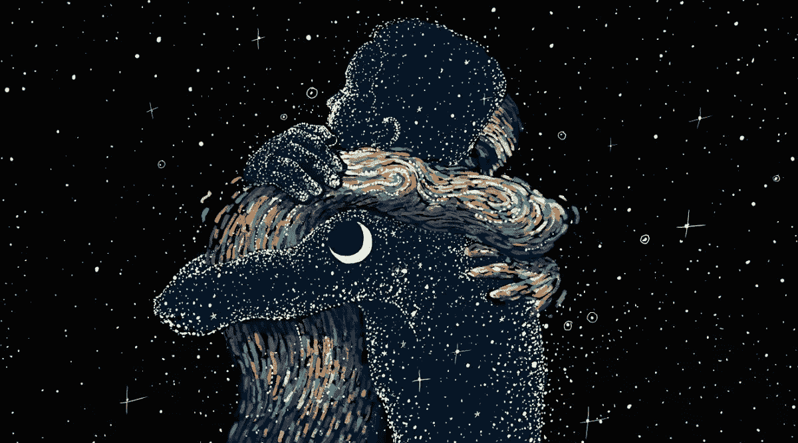

# 欲望:永远和永远

> 原文：<https://medium.com/swlh/the-desire-always-and-never-a6ff0419b143>

# 永远和永远

尽管我们作为人类积累了大量的智慧，但我们还是充满了有趣、理性而又荒谬的认知偏见。ex:
[https://en.wikipedia.org/wiki/List_of_cognitive_biases](https://en.wikipedia.org/wiki/List_of_cognitive_biases)。

我们的认知偏见和与之对抗的非理性行为甚至可能是让生活如此有趣的本质。我们都很疯狂，我们喜欢这样，因为如果我们不疯狂，我们就会很无聊。没有人想玩一个他们知道结果或者没有一丝胜算的游戏。“生活的游戏，我们都在玩，是混乱和秩序之间的‘捉迷藏’；我们是混沌，永远不会赢，但总有一线希望。因此具有诱惑力、好奇心和持续性。”~ A. Watts

当我们看到、听到或读到新的/未知的东西时，我们会将偏见推向极端，倾向于绝对地思考。我们会立刻想到最好或最坏的情况。这是一种控制机制，用来保护我们自己，我们把未知的不确定性和已知的局限性联系起来，并划分开来。

以我们对自我保证和社会安全的占位符的使用为例，这些占位符体现在“总是”和“从不”的概念中，我们在这些概念中创造了一种控制和位置的幻觉。但是一个真正处于控制之中、对自己的存在有信心和安全感的人不会使用绝对。他们没有必要。不需要创造空间或虚幻的安全感。他们完全意识到并接受他们是谁，他们在世界的什么地方；绝对诚实，谦逊和真实。

他们感觉不到对不确定性的抗拒力，在没有自我创造的社会和自我安全的感知限制的情况下，舒适地在未知中航行。他们不一致的一致性免除了他们的依赖和传统的界限。相反，它们体现了一种对所呈现的机遇的彻底开放的意识。

他们有控制欲是因为他们没有控制欲。这是强大的，这是一种生活方式，这(真的)令人难以置信。

# 欲望和快乐

快乐和痛苦，我们知道我们喜欢在哪里。欲望和快乐，开始变得有点模糊。

欲望是稀有的，精致而诱人的故事。它是对我们力所不及的东西的渴望和欲望。我们想要的东西。吸引我们的东西。感觉像是一次难以捉摸的冒险。一些我们在想象中创造的东西，随着它的展开，一遍又一遍地播放。为故事的高潮建立兴奋和热情。一旦完成，一旦我们填满了那个 desrie，它就结束了。旅程结束了。下一个开始了。

快乐是不同的。这是简单和幸福的繁荣的时刻，出现和消失就像一个想法或时刻。我们经常会想，这是不是刚刚发生的，从哪里来的。我们欣赏这种偶然事件的自发性和奇怪的抽象性。

快乐没有满足感，因为没有必要去填满。我们同时处于必要和足够的状态。我们之前是完整的，一个完整的，之后仍然是一样的，只是眼睛里多了一点神采，步伐里多了一点跳跃，脸上多了一点微笑。

如你所见，欲望躲避着潜在的痛苦、不安全感、不完整的感觉以及寻找和填补自我的空虚。当我们已经准备好所需的一切时，我们转向并依赖外部来寻找、采购和验证解决方案。这是我们做出的一个决定，我们采取的一种姿态，去感知我们自己是完整的(作为世界的一部分)还是分离的(作为这样一个地方的一部分)。

此外，我们是谁，说我们是谁，我们所拥有的还不够吗？

如果我能借用杰克逊先生的几句话…

“我从镜子里的人开始。我要求他改变他的方式。
没有比这更清楚的信息了——
如果你想让世界变得更美好，
审视一下自己，然后做出改变。”

改变很简单，让自己开心。去欣赏生活中那些来来去去，好与坏，快乐与痛苦的微妙而简单的时刻。听起来很愉快，不是吗？

## 这篇文章发表在[《创业](https://medium.com/swlh)》上，这是 Medium 最大的创业刊物，有 282，454+人关注。

## 在这里订阅接收[我们的头条新闻](http://growthsupply.com/the-startup-newsletter/)。

