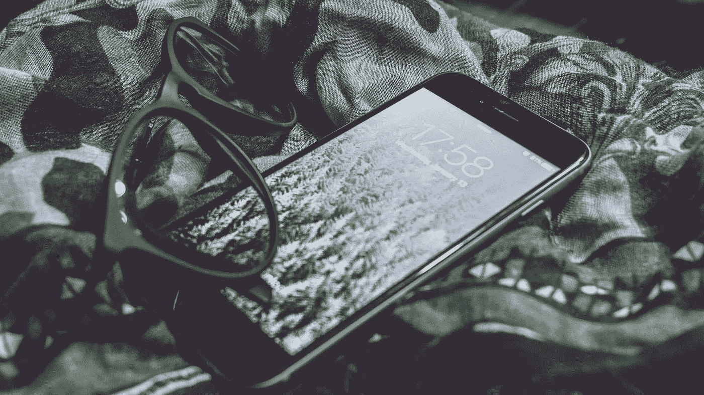
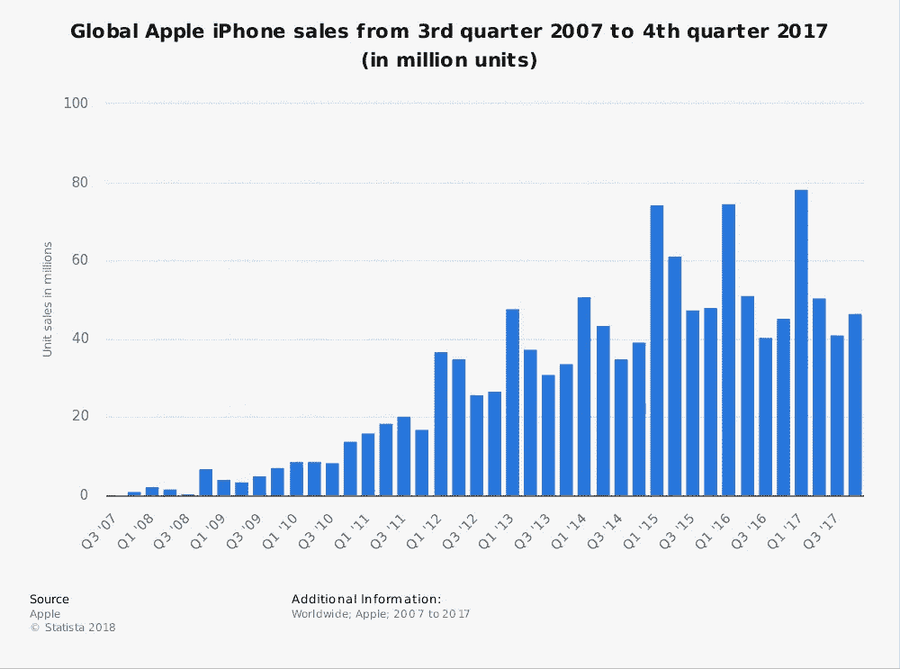

# 我们知道的魔鬼:苹果如何利用人类的基本行为

> 原文：<https://medium.com/swlh/the-devil-we-know-how-apple-leverages-basic-human-behaviour-f7c9293313b2>

## **问题:为什么我们总是从同一家公司购买产品，而不管竞争对手是否有*(也许)*更好的替代品？**

## **回答:品牌忠诚度。**

在马丁·林德斯特罗姆的书《购买学:关于我们为何购买 的真相和谎言》中，林德斯特罗姆解释说，公司会部署一个强大的营销策略，其核心主要依赖于三件事:

*   **1。例行程序**
*   **2。归属感**
*   **3。信任**

出于本文的目的，我决定看看苹果公司，一家目前净资产价值 7000 亿美元的公司，以及它是如何将这些概念融入营销的。

# 一.常规

人类渴望常规。遵循一系列规定步骤的行为赋予了我们的生活结构，并帮助我们理解我们在世界上所处的位置。

例如，在微观层面上，我们醒来，冲个澡，煮咖啡，吃早餐，为工作做准备。也许我们改变了我们喝的咖啡类型或穿的西装，但在最基本的层面上，我们创造了一个行动顺序，以消除一些怀疑、分析，并最终努力做出新的决定。我们相信，通过采取这些行动，我们将做好适当的准备并按时工作。

> “唯一改变的是一切。”

**2008 年，苹果公司组织了第一次全球开发者大会(WWDC)** 。抓住前一年 Macworld Expo 的势头，苹果举办了第一次会议，唯一的目的是向媒体、影响者和兴奋的消费者展示他们即将推出的产品。

早在早上八点半，人们就迫不及待地站在外面，焦急地等待着被允许进入大楼。这是苹果第一次销售一空，共购买了 5200 张门票。此后，苹果在 *2010 年、2012 年、2013 年、2014 年、2015 年、2016 年和 2017 年组织了 WWDC。*

从 2013 年开始，苹果还举办了第二届年度活动——简称为苹果特别活动——通常在 9 月举行。

这些事件给苹果带来了双重好处:

*   这给了他们一个机会向开发者、媒体和铁杆苹果粉丝预览他们即将推出的产品
*   它启动了一个自我延续的媒体循环:新闻机构报道围绕这些事件的炒作、产品本身，以及后来导致产品实际发布的炒作(往往是一两个月后)。我们都读过关于 [**的新闻报道，在最新款 iPhone**](https://www.cp24.com/world/iphone-5-launch-jams-shops-worldwide-in-global-ritual-1.965514)**发布之前，消费者在苹果商店排队等候数小时，有时是数天或数周。**

在推新产品的时候，套路是苹果营销策略的基石。

另一个涉及品牌特定仪式的伟大技术是苹果使用*循环与线性时间定位。像钟表一样，每年秋季都会发布新的 iPhone。*

消费者现在期待着新 iPhone 何时发布，以及何时上架。

这使得 iPhone 用户的争论从 ***他们的下一部手机是否应该是三星、谷歌或摩托罗拉的产品*** 转移到 ***我应该升级到今年的型号还是坚持到下一部不可避免的即将到来的型号。***

这与目前主导服装行业的 ***【快速时尚】*** 的趋势并无二致。

对于像 H&M 和 Forever 21 这样的行业巨头来说，最有效的营销策略之一就是每年创造 52 个“微型季节”。

虽然 Forever 21 的一条牛仔裤比一部 iPhone 8 便宜得多，但仍有一个潜在的概念，即新事物总是在拐角处出现，尽可能保持最新是至关重要的。你穿的衣服不再是你身份的唯一体现，你口袋里的智能手机也是如此。

# 二。归属感(社区)

> “营销关乎价值观。这是一个复杂而嘈杂的世界，我们没有机会让人们记住我们。没有一家公司是。所以我们必须非常清楚我们想让他们了解我们什么。”—史蒂夫·乔布斯

## **聪明。**

## **圆滑。**

## **简单。**

这是你看到 iPhone 时想到的几个词。

现在，我们所拥有的物质产品比以往任何时候都更被用作衡量我们在世界上的地位的标准。

我们不再仅仅是智能手机的拥有者。

我们崇尚奢华、创新和极简主义。

我们是创意社区的一员，欣赏美丽、直观和简单的设计。

> iPhone 用户不再购买产品；他们购买一个身份。只需 1000 美元，他们就能买到自我意识。刷一下信用卡，我们就能体现和认同那些**“与众不同”的人**

# 三。信任

> *“比以往任何时候都更接近你的客户。近到在他们自己意识到之前，你就告诉他们需要什么。”* *—乔布斯*

> 在 iPhone X 问世之前，你可能在地铁上坐在某人身边，但不会马上认出他拿的是 iPhone 6、6S、7 还是 8。

这是设计缺陷吗？还是产品本身烘焙出来的营销战术？

苹果公司将自己的产品标榜为直觉和前瞻性。然而，当谈到 iPhone 的设计时，苹果在彻底改变其设计和操作系统方面仍然很保守。从本质上来说，苹果更有动力产生一种 ***一致的*** ***体验*** 而不是每年重新发明轮子。苹果知道，无论他们做什么都是有效的，没有必要彻底背离这个公式。

在顾客交出信用卡之前，他们会确切地知道他们将从盒子里得到什么样的产品。无需升级、插件或修改。

# 四。外卖

> "获得公众的信任，你就能毫无困难地获得他们的赞助。"
> 
> —哈里·戈登·塞尔弗里奇

*注:虽然苹果的 iPhone 销量似乎在下降，但据报道，苹果在 2017 年第四季度**[*售出了 2900 万部 iPhone X，并将在 2018 年前六个月*](https://www.forbes.com/sites/gordonkelly/2018/01/21/apple-iphone-x-buy-sales-specs-new-iphone-release-date/#3e6d2e9510cb) *实现 5%的增长。)**

虽然[三星和苹果在美国的市场份额一直不相上下(三星在全球销量上超过苹果)，但](https://techcrunch.com/2017/10/13/ios-and-samsung-market-share-now-tied-in-the-u-s/)苹果在客户维系方面一直领先——这可能是一个更重要的考虑因素。

根据 AlphaWise 的一项调查， [92%的受访 iPhone 用户“有些或极有可能”在明年升级，计划继续使用苹果，相比之下，三星的这一比例为 77%](http://markets.businessinsider.com/news/stocks/apple-stock-price-morgan-stanley-note-2017-5-1002022779-1002022779) 。

自 2007 年 6 月*第一代 iPhone 发布*以来，iPhone 在构造和设计方面经历了重大的演变。然而，毫无疑问，苹果黄金产品背后的核心价值观一直保持不变:*极简设计*、*直观的操作系统和卓越的用户体验。*

换句话说，苹果精神的一致性现在已经成为根深蒂固的惯例。虽然这肯定不是苹果的唯一营销策略，但这无疑做出了重大贡献——尤其是在客户维系领域。一旦一个品牌成功地将其成功的营销策略置于自动驾驶状态，就像苹果公司所做的那样，消费者不再怀疑每年花费 1000 美元升级到从根本上代表他们自己的产品的最新版本。

# **总之:**

*   **为了让任何品牌成功，*品牌特有的仪式*必须融入*信息、产品*和*体验*。**
*   顾客需要知道对你的产品有什么期待，什么时候期待产品，以及为什么你的产品优于你的竞争对手。
*   你能做的最好的事情就是把期望值设得高一些，然后每次都超越这个门槛。

如果你喜欢这篇文章，点击“鼓掌”按钮，这样它就可以传播给其他志同道合的读者。点击 [*这里*](http://eepurl.com/c6wA3T) *来注册，这样你就可以直接在你的收件箱里收到我的最新文章(没有垃圾邮件)。*

## 这个故事发表在 [The Startup](https://medium.com/swlh) 上，这是 Medium 最大的创业刊物，拥有 289，682+人关注。

## 在这里订阅接收[我们的头条新闻](http://growthsupply.com/the-startup-newsletter/)。

