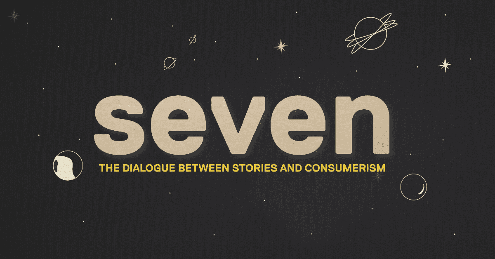
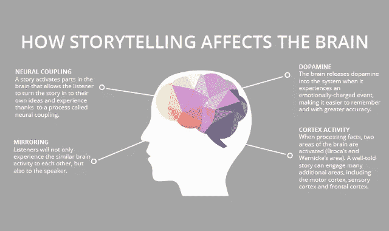
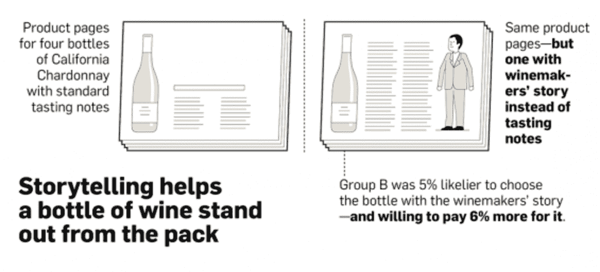
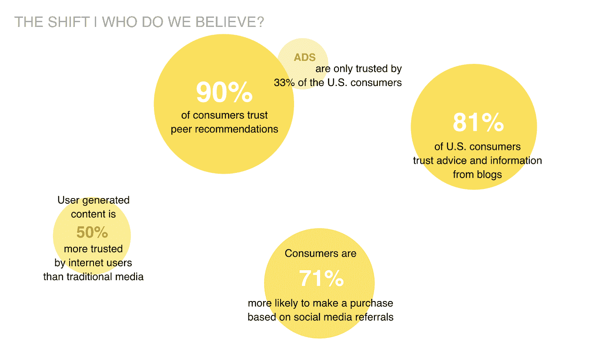

# 故事与消费主义的对话

> 原文：<https://medium.com/swlh/the-dialogue-between-stories-and-consumerism-a73fb3338e5a>

你知道宇宙是由微小的故事组成的吗？从洞穴绘画到电影，故事似乎从未停止对人类的着迷。尽管这些年来方法发生了巨大的变化，但分享和倾听故事的愿望仍然极大地影响着日常生活。精彩的故事会促使我们采取行动，投票，捐赠，最重要的是，购买。

**1:讲故事让我们成为人类**

以这样或那样的方式，人们生活中的大部分时间都在讲故事。从很小的时候起，我们就喜欢听故事，随着年龄的增长，故事变得越来越有力量。谁不记得禁果、小红帽等诸多恶名昭彰的经典故事。这些(几千年前的)故事仍然代代相传的想法是非常了不起的。为什么我们几乎记不起两天前做了什么，但却忘不了一个千年前的故事？事实证明，故事确实能激发我们的感官，让我们的大脑去想象、阐述和回忆。根据斯坦福大学的研究，故事被记住的次数是事实的 22 倍。这就是为什么历史上故事一直被用来生存、说服和指引方向。

Source: Classifying Psychopathology: Mental Kinds and Natural Kinds

我们不区分阅读、听到或经历一个故事，也不去感受角色正在经历的任何情绪；焦虑、悲伤、快乐或解脱。这就是为什么它们如此强大，它们引发我们的身体反应。即使在没有故事的地方也能看到故事，这是我们的天性。我们是一个沉迷于故事的物种，这是最强烈、最古老的冲动之一。这是我们记忆、联系和表达价值观的方式。即使我们睡着了，我们的大脑也无法停止创造故事。它们是存在性问题解决的一种形式。人类的平均注意力持续时间比金鱼还短，我们需要它们来生存。《丛林之书》教会我们拥抱周围的环境，享受生活，《小红帽》教会我们不要相信披着羊皮的狼，可口可乐认为分享就是幸福。所有故事的共同点。他们关注人类的普遍特征，以及我们如何采取行动来改变现状。

**2:感动人的故事**

如果我告诉你，今天奴隶的数量估计在 2100 万到 4600 万之间，你可能会站着不动，惊讶大约 5 秒钟，然后继续下一件事。

然而，让我告诉你贝妮塔的故事，一个 13 岁的孤儿。她的身高与她的年龄有雀斑，棕色大眼睛和卷发。贝妮塔是生活在当今世界的 4600 万奴隶之一。她很小就失去了父母，最后不得不每天工作 12 个小时，每小时工资 2.43 美元。当她生病时，她不能呆在家里，见鬼，她甚至不能试一试她每天缝的鞋子。

你还记得贝妮塔的故事的可能性有多大？如果我告诉你，你可以通过购买我们的运动鞋来帮助 Benita，你很可能会被迫这样做。不是因为你迫切需要一双闪亮的新鞋，而是因为你可以看到贝妮塔购物时脸上露出的微笑。你不会用一些冷冰冰的事实和数字来说服人们采取行动，它们根本站不住脚！然而，用一个故事，人们会找到共同点，他们会变得情绪化。研究表明，带有道德和情感字眼的信息更容易在网上传播。事实证明，每出现一个道德或情感词汇，它被转发的概率就会惊人地增加 20%。

**3:语境午餐吃攻略**

这可能是解决方案先于产品诞生的地方。内容已经成为一种势不可挡的商品，回答“我为什么要在乎？”这个问题只需要一眨眼的时间。。现在，几乎所有的广告都专注于提供解决方案、社区建设和品牌知名度，那么是什么让你与众不同呢？一个好的真实的故事。一个伟大的故事把我们联系在一起，当我告诉你一个令人信服的故事时，我们的脑电波会匹配。我们购买情感上吸引我们的东西，然后在逻辑上证明它的合理性。使用我们能产生共鸣的语言、环境和特征，带来安慰，帮助我们想象未来。你从我们知道的开始，融入一些生动的细节，共同的经历，和你独特的转折。转折，这就是语境发挥作用的地方。背景表明你一直在关注，是背景确保你的共同精神和价值观被记住，是背景让你变得真实。我们的大多数决定都不是理性做出的，而是我们的情绪有能力在一夜之间改变观点。我们不再购买商品，开始购买情感。因此，如果没有一个令人信服的故事，你的产品、创意或品牌到了目的地就死了。

**4:用全新的工具包讲故事**

我们现在比以往有更多的方式来分享我们的想法和经验。科技打开了一扇通向全新水平的讲故事的大门。包装就是一个很好的例子。很长一段时间，包装更多地被视为必需品，而不是讲故事的工具。但是后来一些聪明的人意识到，包装的每个细节都讲述了一个故事，所以为什么不确保它是他们想要讲述的故事。突然间，超市货架变成了一件艺术品，拥有创新的材料、独特的剪裁和丰富的色彩。科技更进一步，品牌故事变得更有活力。个性化包装、标签、二维码、增强现实，这些都是为了将讲故事提升到一个新的水平。在某种程度上，品牌把我们所有人都变成了故事作者，让我们可以个性化和改变小细节。但是你如何巧妙地利用这些关于某人习惯的知识，而不让他们知道你在研究他们的生活呢？

Source: AdWeek

**5:我们，变革的推动者**

市场商人似乎不能停止尖叫出来，连续讲故事，多面讲故事，参与讲故事…所有围绕讲故事的骚动让我好奇。品牌是从什么时候开始利用故事的，为什么？

早在互联网时代之前，我们就处于广告的黄金时代。低俗的当面广告是通过广播、电视和广告牌上的商业信息片进行的。品牌忙于塑造与产品相匹配的角色，尽管如此，产品总是处于最前沿。人们喜欢广告，他们有一些乐观的东西，有时甚至是革命性的。品牌是我们尊敬的权威，广告只有一个目的:卖，卖，卖。

然而，互联网的诞生颠覆了广告业。它不仅改变了广告的传播方式，而且主要改变了消费者对广告的反应方式。谁“需要”谁之间的界限比以往任何时候都更加模糊，因为品牌需要让消费者参与进来，以帮助销售他们的产品。在消费者考虑看一眼之前，品牌首先要证明自己。洗涤剂不再只是洗涤剂，它是帮助解决气候变化的工具。手表不再仅仅是一块手表，而是一种可能拯救你生命的设备，这样的例子不胜枚举。在路上的某个地方，消费者从被动的旁观者转变为广告中最重要的角色。

**6:身份就是信任**

几千年来我们一直在讲同样的故事，但现在这个故事有了一个新的讲述者。品牌不只是努力让自己的故事脱颖而出，而是越来越关注人们如何分享他们的故事。

这解释了影响者营销的不断兴起。数字口碑需要感觉真实才能在消费者中有效，与品牌不同，人们是我们信任的人。尽管他们可能已经把自己变成了品牌，但影响者首先是人，这仍然会增强信任。这让我们想知道，为什么人们更容易相信一个人而不是一个品牌讲述的同样的故事？

是因为社交媒体、杂志和广告牌因支持出价最高的人而臭名昭著，而有影响力的人仍然精心挑选他们选择称赞的品牌吗？是因为我们将品牌视为影响者所代表的东西的延伸吗？还是他们分享的个人故事和真实内容让产品更有关联？

但不仅仅是影响者说服我们采取或不采取行动，众包和用户生成的内容在过去几年里已经得到了充分的探索。品牌从创造娱乐你的内容转向创造吸引你的内容。我们从无辜的旁观者转变为创造性的策划者，进入了一个合作讲故事的时代。

这是一个认同的时代，而认同就是你所购买的故事。一点压力都没有，对吧？你是 Mac 或 Windows，喜力或 Duvel。产品不再是中心，而是产品背后的“为什么”占据了主导地位。一个“为什么”塑造在一个故事中，具有共同价值观和承诺的熟悉特征，与品牌的每一次互动都散发着这个故事。

我们买什么和我们是谁之间的秘密对话

作为人类，我们总是希望与他人保持联系。有趣的是，消费主义似乎对实现这一目标极其有效。我们的联系更加紧密，但却感到前所未有的孤独，因此我们将自己与品牌联系在一起。你买什么就是什么，你买什么就是什么。伟大的故事引人入胜，它们邀请听众参与进来，采取行动，继续讲述故事。

众包平台从未如此成功。为什么？上面的公司都是很棒的故事讲述者！正如 kickstarter 所说:“激发社区想象力的想法、为创作者提供更多参与其创作过程的机会以及经常被忽视的声音，都是最具商业价值的成功故事”。在某种程度上，我们通过汇集品牌的故事来展示我们是谁以及我们代表什么。我们顶嘴！通过购买产品、创造内容和展示，我们成为了品牌所代表的一部分。在某种程度上，我们购买了整个社区的入场券。

我们通过我们买的东西，也通过我们不买的东西传达复杂的信息。我们投资可持续产品，因此品牌将被迫投资可持续解决方案。当我们质疑品牌道德时，我们呼吁抵制零售。这让我们不禁要问，是品牌通过我们讲述他们的故事，还是我们通过他们讲述我们的故事…

*本文是“***”系列文章的一部分，该系列文章探讨了设计的影响和作用，是必须知道的健康剂量。如果你有任何关于* [*设计*](http://reggs.com) *的问题，给 hello@reggs.com 发消息，我们会写下来。**

**

## *这篇文章发表在 [The Startup](https://medium.com/swlh) 上，这是 Medium 最大的创业刊物，有 320，924+人关注。*

## *在这里订阅接收[我们的头条新闻](http://growthsupply.com/the-startup-newsletter/)。*

**