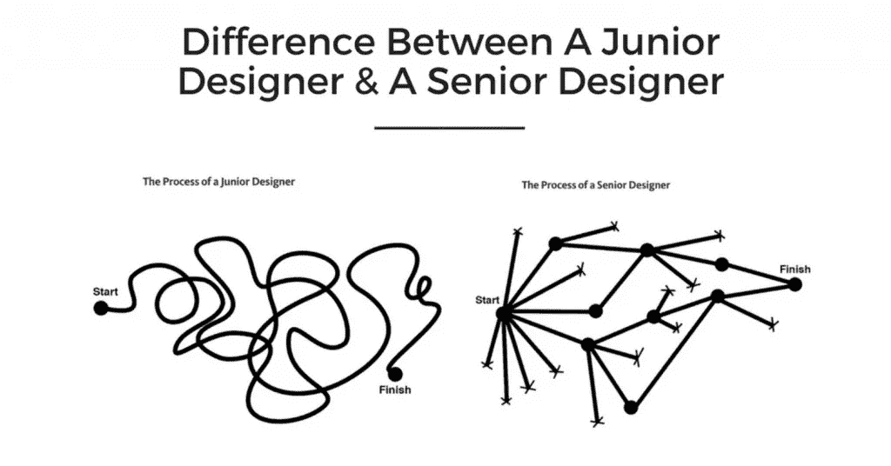

# 伟大的创业设计师和平庸的创业设计师之间的区别

> 原文：<https://medium.com/swlh/the-difference-between-great-startup-designers-and-a-mediocre-one-7634d72a15c>

当一家初创公司推出一款绝对成功的应用时，这绝非偶然。

这是团队中有一个顶尖的创业设计师的副产品，他确切地知道用户在寻找什么，以及如何交付给他们。

伟大的设计师并不总是伟大的 ***初创公司*** 设计师——也就是说，如果他们不投入工作去理解最佳初创公司设计师与其他人的区别。如果你想成为一家初创公司的顶级设计师，拥有正确的心态和投资获取正确的专业知识是绝对必要的。

**你是如何脱颖而出，成为一名伟大的创业设计师的？**

我们分析了一些行业中的佼佼者，得出了他们共有的一些关键特征，从对用户了如指掌，到知道在推出新产品后应该关注哪些指标。这些见解将帮助你从你现在正在做的事情中跳出来，在一家初创公司找到一份设计工作，并不断地把它从公园中赶走。以下是优秀创业设计师的四个特征:

# 他们知道他们的用户想要什么和需要什么

一切都始于研究。

伟大的创业设计师总是从建立对用户的坚实理解开始。没有这种理解，你将只是在黑暗中扔飞镖，希望有东西击中。最好的攻击计划是考虑您的最终用户，并逆向工作。这里有三个问题，每个创业设计师都应该从这些问题开始着手:

1.  我们用户的关键痛点是什么？
2.  我们的设计如何解决这些痛点？
3.  我们的设计如何超越当前的体验？

回答完这些问题后，就该开始[进行更广泛的用户研究了](https://www.mindsea.com/ux-user-research/)。研究你的目标受众的行为，并与他们讨论他们的需求、愿望和挑战。只有在你清楚地认识到你面前的问题后，你才能戴上你的设计帽子，开始设计解决方案。

*“*[*设计一个伟大的产品意味着解决一个真正的问题*](https://www.mindsea.com/designers-advice-startup/) *并且用比用户目前解决问题的方式好 10 倍的方式去做。”***——**[——【胡】](https://www.linkedin.com/in/hufelix) **用户体验总监** [**历历**](https://calendly.com/)

没有研究，你的设计从一开始就注定要失败。如果你在设计和原型制作的时候，首先真正理解你的用户，你就为自己的长期成功做好了准备。

在 MindSea，我们通过我们的[蓝图](http://content.mindsea.com/blueprint)建立了一个既定的流程，确保我们接触的每个项目都从研究开始。最精彩的部分？从研究到洞察并不需要几个月甚至几个月。最优秀的创业设计师了解研究的价值，但也认识到对速度的需求。这就把我们带到了下一点…

# 他们知道快速运输&快速学习是最好的

你不能只是花时间开发你认为很棒的东西，发布它，然后坐以待毙，看着你的用户群增长。如果你马上打了一个本垒打，你应该开一瓶上好的香槟，但现实是这样的:

***构建一个成功的手机 app 需要不断的测试和学习。***

无论是三次迭代还是 300 次迭代，最好的设计师都不会认为他们的工作已经完成，直到问题得到解决。

专注于快速创建，发布您创建的内容，并收集尽可能多的反馈，以根据真实用户的需求优化用户体验。

*“我的建议是* [*早点、经常把你的想法摆在真人*](https://www.mindsea.com/designers-advice-startup/) *面前。”* **—** [**凯瑟琳·特雷尔**](https://www.linkedin.com/in/katherineterrell/) **，创意总监** [**变革医疗保健公司**](http://www.changehealthcare.com/)

[脸书](https://facebook.com/)的产品设计副总裁朱莉·卓，用一系列巧妙的视觉效果[来说明初级设计师和高级设计师的区别。关键在创作过程中。](/the-year-of-the-looking-glass/junior-designers-vs-senior-designers-fbe483d3b51e)

有时并不是获奖的设计决定了交易。与其花上几个月的时间在用户拿到之前构思出完美的产品，不如创造出几十种可能性，交付出去，然后学习并不断调整。最终，你会确切地知道你的用户在找什么。

# 他们知道哪些指标很重要

伟大的初创公司设计师能够将关键指标从[虚荣指标](https://techcrunch.com/2011/07/30/vanity-metrics/)中分离出来。

当他们的作品在社交媒体上得到喜爱时，每个人都很高兴。无论是[脸书](https://facebook.com/)上的大量赞，还是 [Behance](http://behance.net/) 或 [Dribbble](https://dribbble.com/) 上的潮流设计，这些虚荣指标都是容易落入的陷阱。

*“我们的目标不是让产品模型流行起来，而是获得客户反馈，让产品更贴近市场。”***——**[**布莱恩·杰夫科克**](https://twitter.com/brianjeffcock) **，创业公司创始人兼** [**设计师**](http://brianjeffcock.com/about.html)

脸书点赞和推特转发不会直接让你赚钱。

不要庆祝你的设计在脸书获得了 1000 个赞，而是庆祝你刚刚做出的新改变让你的转化率翻倍。

“每个组织都有不同的关键指标，这些指标在业务生命周期的不同时期很重要。**[*growth hackers*](https://growthhackers.com/)*的 CEO 建议公司应该有一个“* [*北极星指标*](https://blog.growthhackers.com/what-is-a-north-star-metric-b31a8512923f)*”——或者一个对推动有意义的增长最重要的指标。作为一名设计师，了解哪些指标对您的团队至关重要，这样您就可以专注于有助于提高 KPI 的项目，这一点很重要。”***——**[**凯特琳**](https://twitter.com/KateBour) **，连环创业家** [**设计师**](http://katelynbourgoin.com/)**

**不要让这些简单的虚荣心指标在评估和衡量阶段占据主导地位，而是关注更重要的数字[比如:](https://www.invisionapp.com/blog/track-designs-effectiveness/)**

1.  **有多少用户成功注册，有多少用户提前退出**
2.  **新功能上线后转化率的变化**
3.  **不管你的北极星度量是多少**

**漂亮的设计并不总是能有效地转换或者以最好的方式解决用户的问题。他们可能会给你带来一些严肃的社交之爱，但社交之爱并不能让一家初创公司存活下来。**

# **他们可以身兼数职**

**初创公司通常没有预算在早期阶段雇佣一个大规模的设计团队。这意味着你通常是团队中唯一的设计师。在机构中，当你处理各种不同的问题并确定各种不同的解决方案时，身兼数职是一种期望。最好的初创公司设计师不会在自己的工作中拒绝这种可能性，他们会欣然接受… **最好的初创公司设计师会从容应对。****

**你可能会在一周内设计一个新的登录页面来增加转化率，然后在下一周设计一个 iPhone 应用程序原型。不管你的设计背景如何，如果你想成为一名优秀的初创设计师，你需要快速成为一名全能设计师。**

**“如果你是一名产品设计师，你很快就会成为一名无所不包的设计师:做品牌、声音和平面设计来满足出现的需求。”**——**[**李拜伦**](https://twitter.com/leeb) **，设计师 at** [**脸书**](https://facebook.com/)**

**这并不意味着你可以整天戴着耳机坐在自己的角落里创作。绝对会有需要这样做的时候，但是作为唯一的设计师，你需要确保与团队的其他成员紧密合作。**

**如果你有一个开发团队来实现你的设计，你们之间需要有一个开放的沟通渠道。你可能已经建立了自己的时间表，但是如果你不考虑开发人员创造你所设计的东西需要多长时间，你将会面临错过最后期限和其他令人头疼的问题。**

****主要例子:**如果目标是快速创建和快速发布，那么过于复杂的模型是不合适的。相反，尽可能简单。但是如果你真的真的想做一些复杂的东西，和你的开发人员坐下来一起建立一个时间表。**

**最好的初创公司设计师知道如何与团队的其他成员保持一致，并一起尽可能快地前进。**

# **包装东西**

**在创业世界里，时间过得比平常快得多。**

**在创业公司的一个月相当于在大公司的三个月。最好的设计师知道这一点，他们已经适应了快节奏的创业环境。你可能习惯于花几个月的时间从开始到结束规划项目，但是如果你想成为一名伟大的创业设计师，你需要调整你的心态。**

**如果你正在寻找下一步，那么就从[了解 UX 移动应用设计的终极指南](https://cta-service-cms2.hubspot.com/ctas/v2/public/cs/c/?cta_guid=0d8baf6a-1949-4c8a-9551-817b05237ef9&placement_guid=c3281a74-5fb7-4cea-a444-5c5ac3dd1f99&portal_id=2059954&redirect_url=APefjpE548FXITppqylXZCiz7Z9PakaCVzgBC2kHOG3Ur_H32tmCb1RMgsdGWw4kIo7WJg6mtewE-D1PRYforMx-iMJVcWOVOkqt0S-bx2eYp0ROy-kBpTYnlQi-xoYcTjkKsE2JWJMqGp3IOZAEv3mTJYmAR5cnNdXzfHuAmZoFyLYS6pA3YrxaSte_qpEMCw1t4KPt4B0YaZVojqQ_Ql8zrppPnKH9C7mHLrSC3OyW7zCGqGUmPRw&hsutk=855b4661aff9a36cacbe51d65463cf81&canon=https%3A%2F%2Fwww.mindsea.com%2Fresources%2F&click=3d8445d1-3826-48c3-b5fe-d74471f7038a&utm_referrer=https%3A%2F%2Fwww.mindsea.com%2F&__hstc=71280975.855b4661aff9a36cacbe51d65463cf81.1502723724455.1504729389092.1504816032951.15&__hssc=71280975.1.1504816032951&__hsfp=240011566)开始积累你在移动应用设计方面的专业知识。**

**手机现在正在蓬勃发展，而且还有更大的增长潜力。如果你能成为移动应用程序设计的大师，你会让自己更加与众不同。**

****你认为还需要什么才能成为一名伟大的初创公司设计师？我们希望收到您的来信！****

***原载于 2017 年 9 月 26 日*[*www.mindsea.com*](https://www.mindsea.com/startup-designers/)*。***

****

## **这个故事发表在 [The Startup](https://medium.com/swlh) 上，Medium 的出版物有超过 256，410 人关注。**

# **订阅[在这里获取头条](http://growthsupply.com/the-startup-newsletter/)。**

****