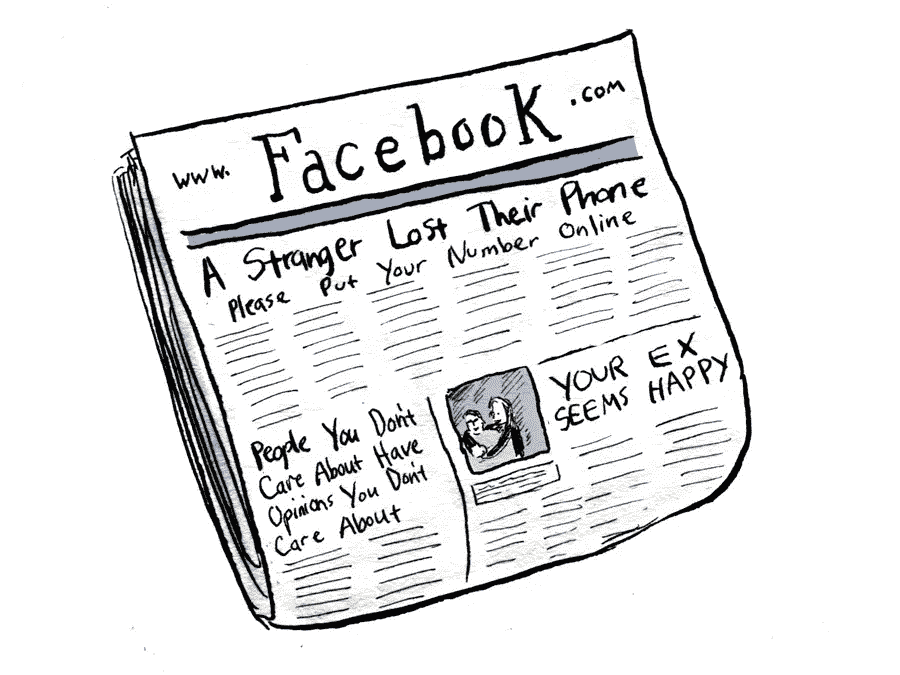

# “社会新闻”与“社会新闻”的区别

> 原文：<https://medium.com/swlh/the-difference-between-news-on-social-and-social-news-95935a99df18>

在 20 世纪 60 年代，马歇尔·麦克卢汉写道:“媒介就是信息。”

今天，平台就是信息。

当新闻是在特定的平台上开发的时候，它是不同的。这是过去几年来该行业的关键新见解/特征之一。通常称为“平台智能”

 [## 什么是“平台智能”——接受约束

### 有一种新型的编辑组织。Buzzfeed、NowThisNews、AJ+和其他创建内容进行分发的网站…

medium.com](/thoughts-on-media/what-is-platform-intelligence-embrace-the-constraints-ec5066c9eb00) 

最大的平台，我们谈论最多的是脸书。这是一个旨在建立身份和管理社会关系的平台。这是脸书的佛法。

 [## 脸书的法则:假新闻是脸书真实目的的下游。

### 脸书是许多人获取新闻的地方。但它不是为此而设计的。它旨在建立身份。…

blog.digidave.org](http://blog.digidave.org/2016/11/the-dharma-of-facebook-fake-news-is-downstream-of-facebooks-true-purpose) 

当新闻适合在一个为构建社会身份而不是向读者介绍世界而构建的平台上工作时，最好的内容，最“病毒式”或最“引人入胜”或最“可分享”的内容，将是意识形态的，就意识形态构建社会身份而言。

不是所有的平台都一样对待新闻。因此，新闻在所有平台上的消费方式并不相同。

新闻业和更广泛的社会关注脸书，但想想新闻在脸书和 Reddit 上的不同表现。

Reddit 是一个基于信息共享的网络。这是它的“存在理由”即使 Reddit 上的信息是错误的，评论中也有关于内容本身的真诚对话。这就是你上 Reddit 的原因。不是为了交朋友。不是告诉你的家人或朋友你一天过得怎么样。是为了获取或分享信息。

这并不是说 Reddit 是解决方案，脸书是问题。

**正如 Tristan Harris**[**指出微妙的设计决策会影响我们的注意力如何被科技公司**](https://www.theverge.com/2018/1/17/16903844/time-well-spent-facebook-tristan-harris-mark-zuckerberg) **操纵一样，也有设计变更会影响大公司的编辑输出。**

我们知道这些设计上的变化，因为它们所带来的转变成了一个行业笑话。"转到视频。"

 [## 病毒内容的可辩护性如何？

### 这里有一个并不罕见的视频。"美国人尝试拉丁裔汽水."

medium.com](/@digidave/how-defensible-is-your-content-e98767ee903c) 

**那么我们该怎么办？**

作为一个社会，我们需要弄清楚一些事情

1.  脸书应该成为人们获取新闻的地方吗？
2.  如果我们认为是，那么应该发生什么样的平台/产品变化，以便新闻**不在它当前居住的同一个社交空间中**。“新闻提要”实际上是一个社会身份提要。也许，就像照片或直接信息一样，脸书需要创造一种独特的产品，为新闻制作者和消费者提供最佳服务。

关于上面的第二点。参见下面的“**一个真正的解决方案**”部分——摘自一篇类似主题的早期媒体文章。

 [## “如何修复脸书”——首先:不要认为它已经坏了。第二:分解其特征

### 《纽约时报》没有邀请我就“如何修复……的问题”发表看法，我只感到受到了轻微的冷落

medium.com](/@digidave/how-to-fix-facebook-first-dont-assume-it-s-broke-second-break-up-its-features-5af236b59d8d) 

> 真正的解决方案
> 
> **脸书应该把它的特色分解成更具体、更离散的产品。从这种精神来看，最近从页面中提取内容并将其放入侧边栏“探索”部分的举措非常有意义。这吓坏了出版商——但它实际上是我们当前困境的潜在长期解决方案的一部分。“探索”这个词不仅仅是针对用户的。这是一个脸书自己正在“探索”的空间，它如何能够摆脱由身份主导的新闻供稿的背景，获得这些体验、特色和产品。**
> 
> 脸书旗下的 Instagram 没有同样的问题。他们的主要目的并不在于身份。这并不是说产品中没有身份——但主要是因为 Instagram 是关于捕捉和分享美丽瞬间的。那些时刻不一定要定义拍照的人。作为一家公司，脸书有可能成功地经营与身份无关的产品。
> 
> …..但是如果脸书想要“解决”它的“问题”——它必须从分离那些与身份过于紧密联系在一起的变态经历开始。新闻需要与旨在提供信息的体验相联系。购物需要与物质需求/欲望相关的体验相联系。

这当然是新闻业任何人的一厢情愿。

我们目前的困境是因为我们过于依赖脸书来吸引观众。我们现在依赖他们创建一个平台来满足我们接近他们的观众时的需求/愿望的想法似乎…可疑。

但这是我再次关注 Reddit 的地方。并不是说这是理想的平台，但对我们来说有一个教训。《华盛顿邮报》有一个全职团队参与 Reddit 社区([基因和团队正在杀死它](https://www.reddit.com/r/IAmA/comments/6bq6yz/hi_there_were_uwashingtonpost_more_specifically/))

Reddit 是一个以新闻/资讯为核心的平台。它是对最初的 Digg 的回应。在脸书、Twitter 和 Snapchat 出现之前，有 Digg。一个简单的网站，你可以投票选出最好的文章。你有用户名，可以关注其他用户，但只能看到他们提交的内容，并对其进行投票。网络的简单性给了它一个锐利的焦点。它是为信息服务的。

这个行业不能让脸书做任何事情，但我们可以发挥自己的影响力，就像《华盛顿邮报》一样，投资那些我们认为可以建立我们想要的生态系统的平台。为信息服务的生态系统。

我们可以利用这一点向我们的脸书朋友“游说”我们所需要的东西。我们可以指出另一种生态系统的成功。我们可以为我们的行业关注和独特或定制的内容创造更多的竞争。最终，这是我们最好的谈判筹码。

我们在哪里？

在这一点上，我们在陈述问题方面做得非常好。一个人可以把今天陈述的问题作为职业。但是我们对潜在的解决方案仍然模糊不清。

或许是因为，正如我在上面承认的，解决方案真的有可能不在我们(作为一个行业)的掌控之中，甚至可能不在社会的掌控之中。这可能取决于我们新的社会工程独裁者。马克会成为暴君、哲人王，还是介于两者之间？在执掌脸书的整个过程中，他无疑给人留下了一种认真对待自己职位的印象。

**我很想收到你的来信。Reddit 的例子值得深入研究吗？到底是什么特点让一些社交网络比其他的更适合新闻发布。如果我们可以大声疾呼——脸书、推特、谷歌和其他人会听吗？他们应该吗？我们需要他们吗？**

## 这篇文章发表在[《创业](https://medium.com/swlh)》上，这是 Medium 最大的创业刊物，有 287，184+人关注。

## 在这里订阅接收[我们的头条新闻](http://growthsupply.com/the-startup-newsletter/)。

