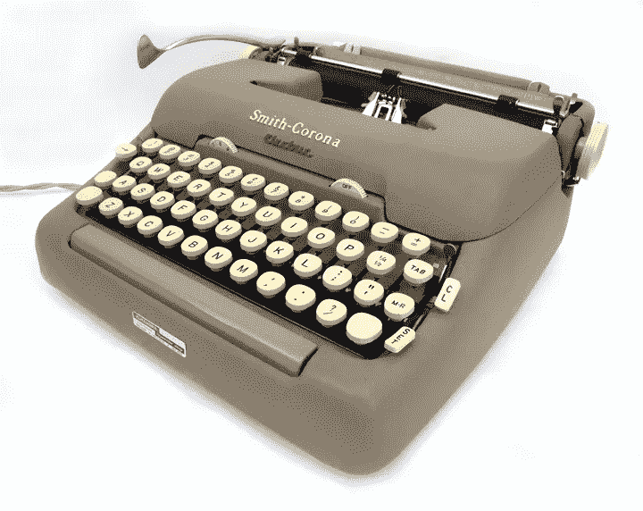

# 文案和内容写作在诱惑上的区别

> 原文：<https://medium.com/swlh/the-difference-in-seduction-between-copywriting-and-content-writing-a12999ef20ee>

## 文案和内容作者——你的创业公司真正需要哪一个？

A copywriter or a content writer — who will make you a wild girl? | © ArtsyBee, Pixabay

# 两个男孩，一个女孩

想象你是一个随着猫王的舞步尖叫的高中女生，但仍然是一个处女。梦见一个会永远保护和爱你的人。

A chaste high school girl, unaware of the power of branding | © Les Anderson, Unsplash

要是那个人是学校的万人迷罗布就好了。他又帅又酷。每个人一看到他，就会被他运动员般的身材吸引住。你们的相遇短暂而密集。罗柏很有趣，他说的每件事都简单直接，但很聪明。你会想用你的智慧给他留下深刻印象，每天放学后谈论文学和音乐。但他不会送你回家。

另一个人知道。一个真正的绅士，迈克尔很好地解释了数学。他有点书呆子气，但是善良又善解人意。你花了很长时间谈论学校项目、书籍和摇滚。他就像一个你可以信任的好朋友。

一天晚上，学校舞会后，心上人送你回家。他搂着你，吻了你一下。终于！然后他叫你…开拍。哇，对你来说有点太快了。罗柏真的很有说服力。他说他对你的感觉这么好，为什么不完全了解对方呢？如果你拒绝他，他会崩溃的。

你知道任何女孩都可以拥有他。

但是你是处女，而且打算一直保持到结婚！

尽管如此，如果你真的喜欢他，为什么不今晚一起跳"*维加斯万岁"*呢，亲爱的玛丽？

1964 “Viva Las Vegas” dance — Elvis Presley and Ann Margret getting comfortable with each other

记得迈克尔吗？他绝不会这么直接。像一个真正的绅士，一年来他一直陪你走回家，从不要求任何东西。每当你需要的时候，他都会给你帮助。丈夫的材料，如果你问你妈妈。但是只有时间会告诉我们，他会尽一切可能让你留在他身边。然而，他尊重你在结婚前保持*处女座的决定，并且永远不会尝试任何事…像罗伯一样。*

你会选择谁——罗布·迈克尔？

# **文案与内容作者**

两个家伙都别有用心，但使用不同的方法。万人迷是罗伯特文案，陪你回家的绅士是迈克尔内容作家。他们都理解你的感受。第一种人试图用紧迫感来操纵你，以达到他的目的。第二个请求你的注意来接近你。

罗柏很有魅力，能立刻抓住人们的注意力。他适应能力很强，非常了解高中“市场”，所以他和周围的学生建立了很好的联系。

他的朋友(你的同学)告诉他关于你的事情，所以 Rob 知道如何接近目标人物角色。他利用同理心来更容易地销售他的东西——他会让你有某种感觉，这样你就会决定买它。

Will you really shout “I feel so free“ after Rob Copywriter takes care of you? | © ArtsyBee, Pixabay

罗柏说简单的语言。他给你失去童贞的好处来支持他伟大的故事:你会变得狂野和自由。他没有谈到疼痛和意外怀孕的风险等特征。罗伯特让你想采取行动。

广告文案的态度是销售人员的理想状态——他可以很容易地抓住未来的客户(新的销售线索)或向他们销售一些东西。对于简短的形式，如广播广告、电视广告、横幅、广告、当今的社交媒体、网站登陆页面和电子邮件营销，他的直接的有说服力的声音将是极好的。他的方法比内容作家更有力。

但我们亲爱的迈克尔内容作家也有很大的同理心。意识到你所有的好恶，他给你你最需要的——让我们一起准备数学考试，我会永远在你身边。随着时间的推移，我会让你信任我，并建立牢固的关系，以便有一天我能得到我想要的——你会需要我。

迈克尔也很擅长讲故事。他会让你参与任何物理任务，就像这是一个故事一样。这样你会更好地理解它。他的适应能力很强，可以和从清洁女工到你的严格爸爸，博士的所有人交谈，还有，他会用事实巧妙地说服你步行而不是坐校车，总是提到好处，而不是特点。

迈克尔是作家或学者的理想人选。他可以很容易地写出更长的形式，如报纸文章、博客文章、白皮书、电子书和社论。

# **郎才女貌**

A vintage typewriter to type content or copy, whatever you need | © Joe Vintage, Flickr

这两个人在营销和品牌方面会是一个非常好的团队:你的创业公司需要他们两个人来创作内容。

好的内容可以教育读者，让他们对品牌更感兴趣。把它和文案部分结合起来——一个直接、简短、清晰的行动号召(CTA)，人们就会去做具体的事情。因此，在双方的帮助下，公司将实现其销售目标。

一个好的 CTA(文案)的例子可以在博客(内容写作)的登录页面上找到:

“S *订阅我们的时事通讯”，*

*《分享》，*

*“免费试用”，*

*“阅读更多关于……”*

还有，文案告诉读者这个品牌有多牛逼。然而，过多的文案会让他们远离你——没有人喜欢被推销。因此，内容写作可以帮助文案:它给人们时间想更好地了解你的品牌。

一句忠告:

这两种写作形式都需要有人来指导——一个**内容策略师**，他制定一个写什么、怎么写内容、在哪里发表的计划。内容必须对读者和企业都有用。

至于那些写作的人——有些人是文案，有些人是内容作者，有些人两者兼而有之！

# **TLDR:**

我们来总结一下文案和内容作者的异同:

Copywriter vs. content writer — similarities and differences

*** *一个剧情*** *是一个故事中的一系列事件，使人物以某种方式发展——把它想象成一个有几集主角变化的童话故事*

注意:我使用典型的刻板印象来使概念更容易理解，没有任何嘲笑或不尊重任何人的意思。

…

**大家好，我是 Maria，是一名内容作家、塞尔维亚翻译和儿童作家。这是我的网站:**

 [## 贝尔格莱德妈妈-写生活和写作

### 让我们揭穿肮脏的老共匪的神话。在许多方面，他们过着你只能梦想的生活——他们不工作…

mariamilojkovic.com](https://mariamilojkovic.com/) 

**这里，在** [**中**](https://medium.com/u/504c7870fdb6?source=post_page-----a12999ef20ee--------------------------------) **上，我写的是关于生活和写作的手艺。这是我最受欢迎的帖子:**

 [## 媒体作家，小心你写的东西

### 媒体上有一些我们很多人从未读过的流行文章。故意的。

writingcooperative.com](https://writingcooperative.com/medium-writers-be-careful-what-you-write-about-1251e8a35d8e) 

## 这篇文章发表在 [The Startup](https://medium.com/swlh) 上，这是 Medium 最大的创业刊物，拥有+387，966 名读者。

## 在这里订阅接收[我们的头条新闻](http://growthsupply.com/the-startup-newsletter/)。

