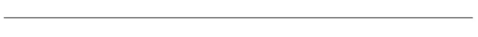
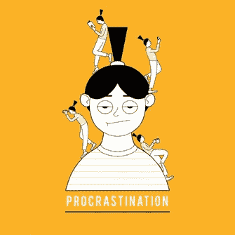
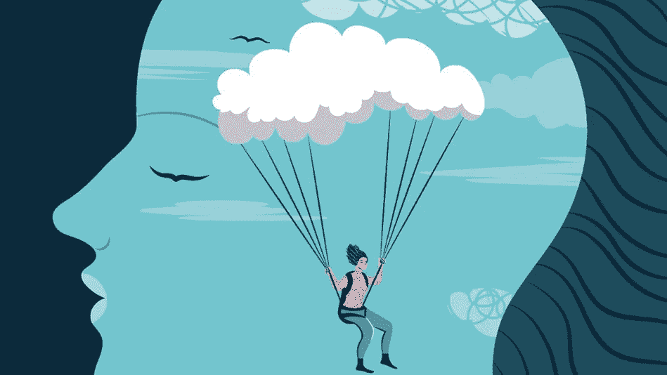
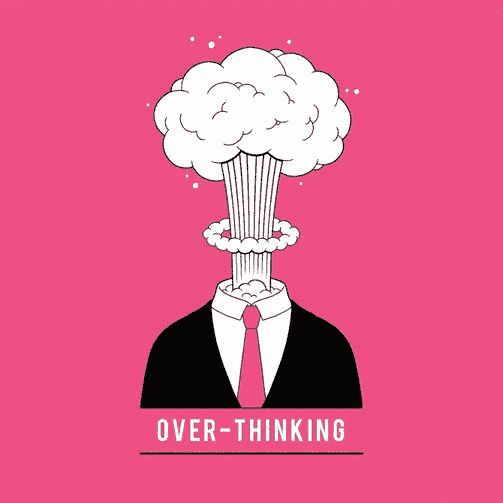
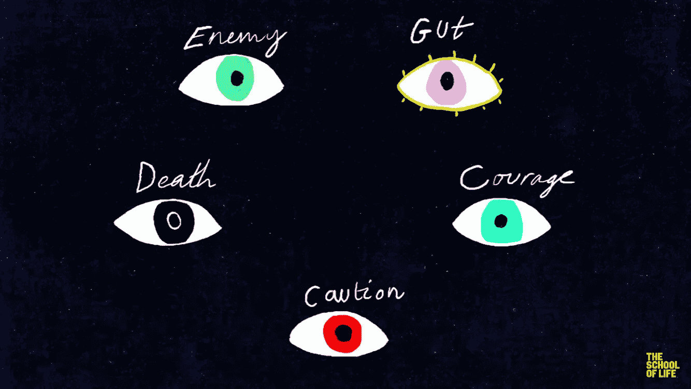
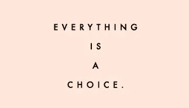

# 做决定的困难

> 原文：<https://medium.com/swlh/the-difficulty-of-making-a-decision-c001c38f4caf>

你曾经在一个重要的决定上感到困顿吗？一个你知道会改变你一生的决定？

当然，你做到了...

我们经常通过分析、列出利弊清单来解决这种情况，或者我们做一个本能的决定，希望得到最好的结果。

有些人天生会做决定，有些人没有太大的需要，有些人还是靠命运，然后我:

***不知如何做决定。***

我想(我也希望)我不是唯一一个这样的人，我和许多人一样，非常内向，善于思考，我学习，和朋友出去，我努力让我的生活充实，但是我不能做决定。我指的不仅仅是复杂的选择，也包括那些明显更容易的选择。

如果你仔细想想， ***我们决定的每一件事都会以一种相当激进的方式改变我们的生活*** :对餐馆的选择，对一段关系的选择，我们进行的学习，我们做出的工作选择。

**好在决策能力是一种技能，是可以提高的。**

因此，最近几周我决定提高这种能力并分享我的过程。我读了很多书，与有能力的人交谈，但主要是我对自己进行了内省分析，得出的结论是我们有一个很大的缺陷:

## —拖延

推迟决定以便更好地研究它是可以的，但是必须小心不要落入*“我稍后再决定”*的**陷阱**。

“我以后再决定”是我们大脑设置的一个陷阱，它保护我们不被错误的选择所伤害。它让我们在做决定时分心，就像在学习或某项艰苦的工作时一样，确保推迟一切。

## 糟糕的决定总比没有决定好。

那我该如何做决定呢？！？

很容易找到一个适用于每个人的通用答案，但是我们都是不同的，所以我只能给你一些建议，没有别的了。

*   你必须从直觉出发:如果乍一看，你的决定的解决方案对你来说是正确的，那肯定是有充分的理由的。
*   分析你的直觉:你永远不会知道你的决定会带来的所有可能的后果，但是你必须专注于为什么你会被一个选择而不是其他的选择所吸引。

*   **一步一步来**:集中精力于你的决定的优点和缺点，但是 ***一步一步来*** ，当你前进的时候总是看看你以前做了什么，你会说服自己你做的决定是准确的，因为它是小而精确的决定的结果。

冷静:如果这是一个重要的决定，不要匆忙行事，而是把它分成几部分。这就是大脑的工作方式:为了最大限度地发挥作用，它需要没有压力或紧张。 ***然后试着用放松的时刻来点缀你试图解决一个决定的时刻。我的意思不是像正念或瑜伽那样放松，我指的是与家人和朋友一起分散注意力或休闲。所以，**做一次高强度的跑步**，花些时间和家人在一起，或者和朋友谈论些别的事情，这将会给你必要的动力来继续你的过程。但是**不要拖延**:只要你觉得准备好了，就马上回到对决策的分析。***

*   **外部视角**:现在你几乎已经做出了一个决定，因为你已经完成了所有的小步骤， ***是时候拥有一个不同于你的*** 的视角了。询问人们你是否信任他们的想法，想象将会采纳你的参考点的决定，并尝试想象你的决定已经被采纳了一段时间的未来:关注这个世界的细节，关注环境，以及你是否喜欢它。 ***试着用不同的眼光看你的问题*** 。YouTube 的一个频道(生活学校)推荐了这五种不同的观点。

透过这五个视角思考，然后将它们合二为一， ***我们将能够看到我们最初的决定是被加强了还是被削弱了。在这最后一种情况下，我们应该在稍事休息后，重新开始分析，找出为什么最初的决策和从视角得出的决策不一致。***

此时只剩下 ***一件事*** 有待完成:**说服自己**。我们必须说服我们的大脑，我们最终做出了正确的决定，这是我们的完美解决方案，不是说这是唯一可能的解决方案，而是说这是最好的解决方案。我们必须认真相信它， ***对做出的结果充满热情*** 。如果在不久的将来所做的决定导致不太有利的情况，不要气馁，这是朝着你渴望的方向改变的过程。

也就是说，我可以说决定总是**困难的，对每个人来说都是困难的，但是正确的决定必须只从你开始。**

## 关于我

21 | INTJ |学生|摄影师|这是我的第一篇文章，我是一名意大利学生，所以我为我的英文道歉。如果我能帮到你一点点，我会很高兴，如果你拍下这篇文章并留下评论，这将是一个好的开始，不是吗？【T0:】

## 这篇文章发表在[《创业](https://medium.com/swlh)》上，这是 Medium 最大的创业刊物，有 287，184+人关注。

## 订阅接收[我们的头条新闻](http://growthsupply.com/the-startup-newsletter/)。

