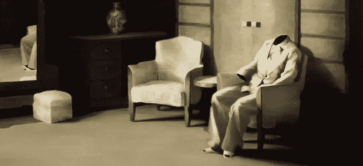

# 数字本质及其缺失。

> 原文：<https://medium.com/swlh/the-digital-essence-and-its-absence-84b0761d228f>

去年夏天，两个多月来，我没有在我的脸书个人资料上发布任何东西。这个时期我只放了一些喜欢。实验包括观察是否以及何时有人注意到了我的缺席。理论上，我可能已经死了。

没人注意到。这是预料中的结果。

除了在 Twitter 和 LinkedIn 上看到过我的喜好或我的活动的极少数联系人，对其他人来说，我基本上已经不存在了，没有理由，没有一丝兴趣。**实际上，我是通过一个通知**而(我们)保持(在线)存活的。

我们的在线社交网络非常脆弱。如果你的生活没有个人联系、电话/skype 对话或任何更直接的沟通渠道(例如 Whatsapp 等即时通讯系统)，我们的“数字存在”就会被证明是愚蠢的，缺乏一致性。

**在像脸书这样的社交网络中，持续的存在，即使是几年，也不能保存我们的记忆；保留我们的“记忆”，但不是我们的记忆，即使是偶尔的。**

如果我们通过持续使用社交媒体来提高我们的可见性，那么孤独感可以通过社交媒体得到缓解。

这与经典社会环境中已经发生或仍在发生的事情没有什么不同:证明我们在生活中的存在是以我们为代价的。

然而，数字圈子会放大孤立感，即使这在某种程度上是自我强加的。

还有一个突出的方面。重新进入线上流量似乎比线下更难。“置身事外”总是会有其后果，而且无处不在。但是在数字领域，恢复物质、声音和身份更加困难:也许是因为我们和我们转瞬即逝的**替身**之间的差异消失了。

## 这篇文章发表在 [The Startup](https://medium.com/swlh) 上，这是 Medium 最大的创业刊物，有 292，582+人关注。

## 订阅接收[我们的头条新闻](http://growthsupply.com/the-startup-newsletter/)。

