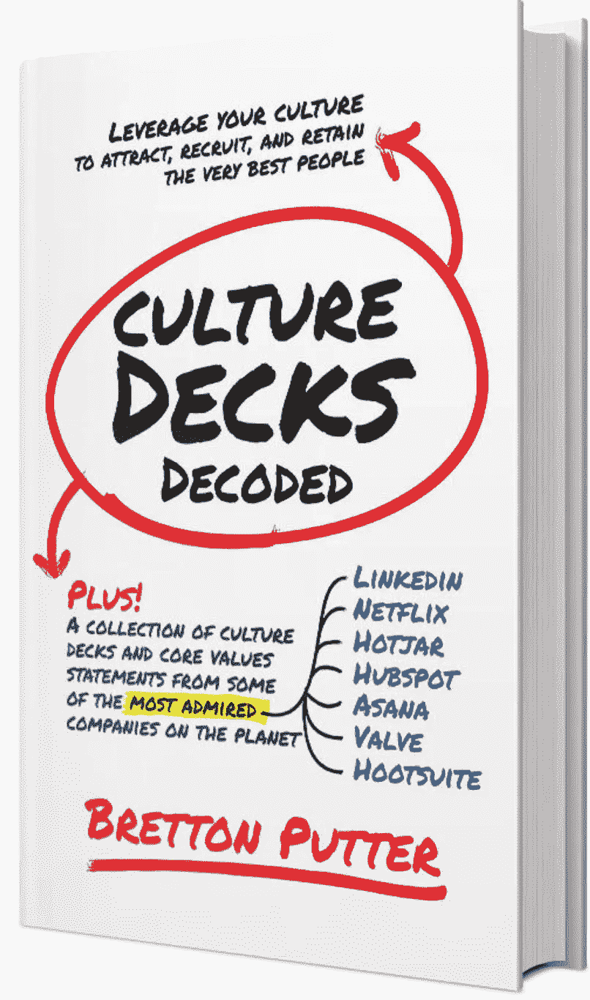

# 撰写有效愿景和使命陈述的注意事项

> 原文：<https://medium.com/swlh/the-dos-and-don-ts-of-writing-effective-vision-and-mission-statements-63e0d89343b2>

# 如何写你的公司使命和愿景宣言——以及为什么它很重要

试图阐明你的公司的使命和愿景本身可能是矛盾的:一方面，使命和愿景是定义明确的公司文化的重要组成部分，尤其是对于那些真正想做的不仅仅是赚钱的公司。(即使对于明显受利润驱动的公司，阐明你的使命和/或愿景也可能是一种强有力的行为；以沃尔玛为例，其千禧年前的愿景是“到 2000 年成为价值 1，250 亿美元的公司”。然而，另一方面，公司使命和愿景声明的声誉很差，这通常是有原因的！众所周知，它们是通用的、模糊的、与公司的活动完全脱节的，有时甚至是不可理解的。以希尔顿酒店为例，其愿景声明写道，“让热情好客的阳光和温暖充满地球”，虽然这很有诗意，但可能不是大多数人描述他们在希尔顿酒店住宿的方式。或者这家公司的使命陈述如何:‘X 是一家在全球范围内从事社会责任经营的跨国公司。它致力于提供高质量的产品和服务，让我们的客户获得更高的价值，让我们的员工和业务伙伴分享我们的成功，让我们的股东获得持续的投资回报。你永远不会知道读这篇文章，这家公司是通用汽车公司，他们制造汽车…

‍ **它们以一般、模糊、与公司活动毫无关联而闻名，有时甚至令人费解。**

‍Here's 是文化第一优势的来源。虽然对于许多公司来说，定义使命和愿景声明是另一项任务，可以列出一长串要做的事情，但在文化第一的公司中，领导者知道使命和愿景在设定公司方向和聚焦团队方面绝对至关重要。如果写得好，一家公司的使命(其存在的理由)和愿景(其想要创造的东西的雄心和梦想)将影响该公司的一切，从招聘和入职流程到销售和营销方法，再到它提供的产品和服务。愿景和使命宣言与公司价值观一起，构成了强大而有效的组织文化的基础。

那么，这两者之间到底有什么区别，在阐明公司的使命和愿景时，有哪些“该做的事”和“不该做的事”。

**愿景 vs 使命:差异**

公司**愿景**声明阐明了公司的中长期目标和抱负。展望未来 5-10 年，如果一切顺利，这将是公司改变世界的方式。要想变得强大和鼓舞人心，它应该引人注目、有意义、雄心勃勃，抓住公司存在的本质，以及如果一切皆有可能，它会实现什么。

公司**使命**陈述描述了组织在世界上可见的、有形的工作——公司做什么，为谁做，以及如何帮助客户。它解释了公司在将宏观愿景转化为日常行动时所采取的有形活动和总体方法或态度。

‍Companies 经常发现使命宣言的定义比定义愿景更容易，有些公司选择有一个使命或愿景。我相信没有一个是不行的。两者都至关重要。

**使命和愿景声明的注意事项**

**不要**

-笼统、模糊或语法复杂

-使用陈词滥调、过度使用的行话(比如将你的公司描述为“领先提供商”、“同类最佳”等等。)

-太罗嗦了

-将你的目标、策略、抱负、价值观和哲学混为一谈

——试着说出*一切*

-试着变得太聪明

-只让内部人员或员工理解

-写一个只是因为你认为你“应该”

**做**

-使用清晰、简单、简洁的语言

-在你的愿景陈述中清晰地阐述一个切实、具体但雄心勃勃的目标

-用你的愿景展望未来 5-10 年

-让它引人注目

-解释你的使命和愿景，以便 7 岁的孩子也能理解

-说得足够具体，让人们明白你在做什么生意

-独自或与同事一起深入思考这个问题

-在真实的人——朋友和家人——身上测试，并征求他们的反馈

**伟大使命和愿景陈述的例子**

下面是 18 个使命和愿景声明的例子，它们来自全球公司、DDOs(刻意发展的组织)和我在这个博客上采访过其创始人的组织。让我们从大人物开始:

**全球十大最受赞赏公司的愿景和使命宣言示例**

**1。领英**

愿景:为全球员工创造经济机会。

使命:连接世界各地的专业人士，使他们更有生产力和成功。

与谷歌一样，LinkedIn 的愿景为客户带来了结果，而使命则用清晰简单的语言描述了公司为实现这一结果所做的工作。

**2。特斯拉**

愿景:通过推动世界向电动汽车的转变，创建 21 世纪最引人注目的汽车公司。

使命:加速世界向可持续能源的过渡。

清楚他们想做什么，为什么做，以及他们想在市场中占据什么位置。

**3。易贝**

使命:在易贝，我们的使命是提供一个全球在线市场，在这里几乎任何人都可以交易几乎任何东西，在世界各地创造经济机会。

愿景:我们的商业愿景是一个由人推动、由技术驱动、向所有人开放的愿景。

*易贝对以人为本、以技术为动力的商业的愿景，以及他们提供全球在线平台以创造全球经济机遇的使命，显然是相辅相成的，但它们是截然不同的，用通俗易懂的语言写成。*

**4。宜家**

愿景:为大众创造更美好的日常生活。

使命:以低廉的价格提供各种设计精良、功能齐全的家居产品，让尽可能多的人买得起。

*他们想要创造的整体影响是明确的(创造更美好的日常生活)，目标市场也是如此(多数人，而不是少数人)，方法也是如此(通过提供设计精良、功能齐全、价格实惠的家具和相关产品，)*

**5。亚马逊**

愿景:成为地球上最以客户为中心的公司，在这里客户可以找到并发现他们可能想在线购买的任何东西。

使命:我们努力为客户提供尽可能低的价格、最好的选择和最大的便利。

*这一愿景的确雄心勃勃，但它显然植根于三个核心因素——价格、产品和便利性。亚马逊的成功无疑可以归功于他们执行使命的能力，即尽可能低的价格、最好的选择和最大的便利。*

**6。泰德**

愿景:我们坚信创意能够改变态度、生活，并最终改变世界。

使命:传播思想。

这个两个字的使命宣言可能看起来有点迟钝，因为它实际上没有说明该组织的核心服务是举办活动，然后通过在线视频提供。然而，这确实让 TED 可以不择手段地传播思想。

**7。西南航空公司**

愿景:成为世界上最受欢迎、最受欢迎、最赚钱的航空公司。

使命:西南航空公司的使命是致力于以热情、友好、个人自豪感和公司精神提供最高质量的客户服务。

清晰、简单而有力的愿景和使命陈述。西南航空显然正在实现这些目标！

8。谷歌

愿景:提供一键访问全球信息的服务。

使命:组织全世界的信息，并使其普遍可用和有用。

这两种说法非常相似，几乎令人困惑，但它们之间有明显的区别:愿景描述的是客户体验，而使命描述的是谷歌的工作。

**文化第一公司使命和愿景声明示例**

*人人文化*中提到的刻意发展型组织有一个关键的共同点，即人类发展。阅读下面的两个例子，你会发现无论是公司内部还是外部，人的发展都是两个公司声明的核心。

**9。下一跳:**

愿景:通过改变职场文化来改变世界。

使命:NextJump 的使命是通过分享我们自己的知识、我们开发的工具和我们在工作平台上的津贴来改变人们的工作和生活。用这个简单的咒语来帮助改变世界:更好的我(在工作中训练和提高自己)+更好的你(用这些知识去帮助别人)=更好的我们(一起创造一个更好的世界)

*不仅仅是一句空洞的咒语。NextJump 的愿景和使命深深地融入了他们经营业务的方式。他们是组织的尤塞恩·博尔特。点击此处了解更多信息。*

**10。迪科瑞昂公司:**

愿景:追求利润和人类发展。

宗旨:为人们提供发展的空间，让他们成为完整的自己，包括过完整的生活，成长为自己想要成为的人。

*虽然这份愿景和使命声明没有明确说明 Decurion 的具体工作，但它的*存在理由*是明确的，毫无疑问，员工的成长和发展是这项业务的核心。*

以文化为先的公司将定义其使命和愿景视为核心业务任务，与公司价值观一起构成基础的一部分，其余业务将在此基础上运营。这些陈述告知客户、合作伙伴和潜在员工，企业存在的目的是什么，并指导员工如何去做。

如果没有我介绍文化基因的愿景和使命，一篇关于使命和愿景声明的帖子是不完整的。

**我们的使命**是开发工具和服务，帮助高增长公司最大限度地发挥其文化。

我们的愿景是成为 DDO 和 T21，改变全球的商业文化。

**‍** [**文化套牌解码**](https://www.culturegene.ai/books) **将于 2018 年第三季度出版，现在就注册以获得第一章的预览，并在该书出版时得到通知。**

关于核心价值观、使命和愿景的更多信息，请查看[网上最佳公司简介](https://www.culturegene.ai/post/the-very-best-company-culture-decks-on-the-web)。

## 这篇文章发表在 [The Startup](https://medium.com/swlh) 上，这是 Medium 最大的创业刊物，有 333，853+人关注。

## 在此订阅接收[我们的头条新闻](http://growthsupply.com/the-startup-newsletter/)。

