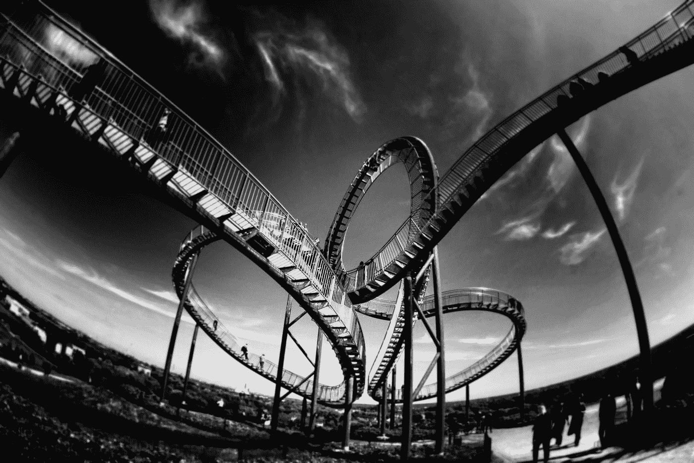

# 媒介阅读的情感过山车

> 原文：<https://medium.com/swlh/the-emotional-roller-coaster-of-reading-on-medium-200394bfb5b6>

Photo by [Mark Asthoff](https://unsplash.com/@qa9de?utm_source=medium&utm_medium=referral) on [Unsplash](https://unsplash.com?utm_source=medium&utm_medium=referral)

首先，Medium 有很多不可思议的作家。我是说很多！事实上，太多了，以至于我几乎忘记了一天中的时间，去筛选那些分享和发布的令人惊叹的作品。

其次，我发现阅读每个人的创作会让我陷入情绪的漩涡。事实上，因为我开始我的一天阅读，当我啜饮我的早晨咖啡时，文章可以…