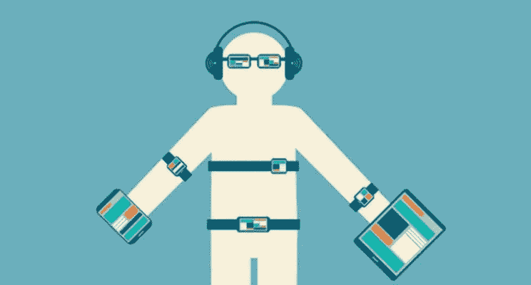

# 皇帝的新衣

> 原文：<https://medium.com/swlh/the-emperors-new-clothes-1f08dd425b36>

物联网的结构包括在需要连接的物品上安装传感器。传感器允许物理世界的对象与数字领域相结合，产生大量数据，进而为新的商业机会铺平道路。根据 Gartner Group 的数据，我们已经生活在一个互联物品比人还多的世界(84 亿对 75 亿)。

智能家居，配有连接到制造商的家用电器、摄像头、恒温器和可从任何地方访问的控制器，继续传播和普及。[城市也在发展](https://breathepublication.com/smart-cities-549ff0ecf0a1)通过数据监控和处理，实现更好的交通、污染和安全管理，以及电力、照明、水和污水基础设施的改善。在一些地方，垃圾收集已经是公共服务和垃圾桶之间的一个集成过程，垃圾桶装有传感器，可以指示它们是否需要清空。[在农村地区，对畜群、作物和灌溉系统的监控催生了精准农业，提高了效率和生产力。](https://breathepublication.com/a-matter-of-survival-c41fbf334e96)通过改善设备和供应管理、装配线和物流，各行业也继续朝着更大的数字集成发展。

随着可穿戴设备行业的发展，我们自己的身体融入物联网结构的方式开始变得越来越清晰。通过这些产品，我们可以监测和存储体温、心率、卡路里摄入量和睡眠模式的数据。这些数据可以与我们的个人和职业环境相关联，潜在地表明我们最初不知道的路径和联系。正如 CCS Insight 所言，到 2020 年，可穿戴设备市场将达到 340 亿美元——包括健身腕带、智能手表、虚拟现实设备(如谷歌 Cardboard、三星 Gear、Oculus Rift、PlayStation VR 和 HTC Vive)，以及增强现实设备(如微软 HoloLens)。

成立于 1999 年的 Jawbone 是制造可穿戴设备并试图从收集的数据中提取洞察力的公司之一。例如，通过将用户的睡眠模式与他们就读的大学进行对比，有可能得出这样的结论:顶尖大学的学生(根据《美国新闻与世界报道》的排名)比其他大学的学生睡得晚。或者，不出所料，城市居民比农村居民睡得少。

事实上，除了告知用户睡了多少小时或睡眠是否有助于恢复，人们对可穿戴设备的期望还包括对个人健康的贡献。例如，糖尿病患者将很快能够通过手表监测他们的葡萄糖水平，这种手表使用不到半毫米的针头分析皮肤下的液体。运动员将通过粘合剂进行监测，分析汗液并检查脱水或抽筋的风险。识别模式，例如在几天激烈的身体活动后晚上更好或在特定类型的食物摄入后晚上更差，提供了可以导致健康习惯改变的信息。

将可穿戴设备融入医疗保健的好处是巨大的。不仅仅是监测我们的睡眠模式或我们一天燃烧的卡路里数量，这些产品的集成创建了一个巨大而有价值的数据集，使我们能够将用户档案与习惯和健康状况相关联。我们已经到了这样一个地步，我们不仅可以利用技术来诊断和治疗疾病，还可以预测和监测我们体内发生的事件。下周我们将讨论卫生部门正在发生的变化。到时候见。

## 这个故事发表在 [The Startup](https://medium.com/swlh) 上，这里有 263，100 多人聚集在一起阅读 Medium 关于创业的主要故事。

## 订阅接收[我们的头条新闻](http://growthsupply.com/the-startup-newsletter/)。

