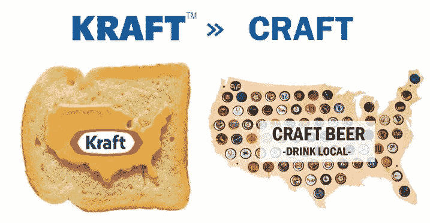
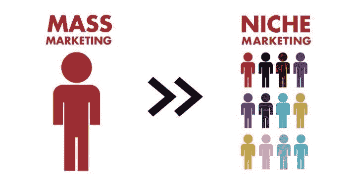
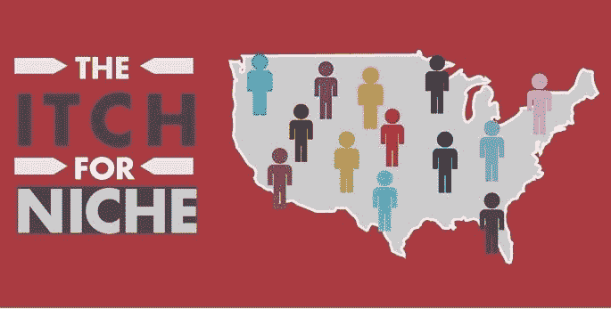
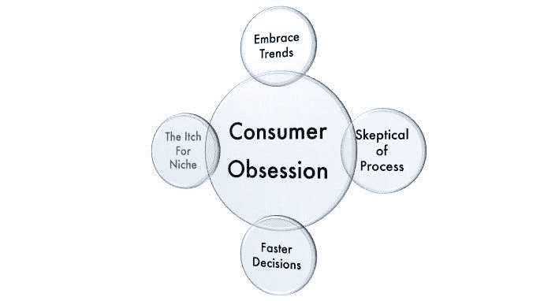

# 大众营销的终结:变小还是回家

> 原文：<https://medium.com/swlh/the-end-of-mass-marketing-go-small-or-go-home-5805d58029d2>

© David J. Katz, 2018

一千多年来，商业上的成功依赖于向一小部分消费者提供一小部分产品，这些产品明显适合他们的需求并在附近出售。

最近，大众媒体——电视、全国性报纸和杂志——的激增，加上全国性零售链的扩张，以及全球高效供应链的增长，导致了一个大规模营销、大规模生产和大规模零售商的世界。

# 零售业从面向本地市场的个性化产品转向面向大众市场的大规模生产产品。

大众营销人员依靠“必备品”发展壮大——大量单一款式的产品，通过许多细分市场销售给渴望拥有他们在大众媒体上看到的广告产品的消费者受众，而这些产品又以巨大的规模和效率生产。

# 这一策略奏效了。直到它没有。

大众品牌、大众生产、大众零售商和大众广告服务于大众市场。广告、零售和供应这些行业是高度相互依赖的，因此它们共同面对今天的破坏性市场；他们一起努力寻找新的模式和新的相关性。

因为，世界变了……**今天，我们有太多的商店、太多的媒体，以及太多的产品通过高效的全球供应链输送**。这导致大众市场商品的**供应过剩，反过来(根据宏观经济供求力量)压低价格，并有利于低价商店、品牌商店和网站竞争谁能以最低价格出售这些过剩商品。**

与此同时，互联网改变了世界。谷歌、脸书和其他信息共享网络允许以前所未有的规模获取和应用个性化营销。

当数十亿人通过谷歌搜索，数十亿人在脸书上分享他们的喜好，他们创造了大量独特的社区。这些虚拟社区成为具有独特属性、态度和期望的可进入的利基市场。

今天，人们需要并接受与其独特的个人、文化和情境需求密切相关的小众品牌和产品，这些产品能够激发明确的情感反应或解决个人需求。根据定义，这些利基市场是独特的、真实的和充满激情的，消费者将为专门为他们创造的产品支付更高的价格。

此外，互联网和消费者数据的应用使大大小小的公司能够有效地识别消费者的这些细分市场，并推出具有精准定位的新品牌和产品，现在可以通过 YouTube、谷歌、脸书和亚马逊、易贝、Etsy 和 Jet.com 等在线市场轻松而经济地获得这些产品。

几年前，有一些著名的，或者说是声名狼藉的，全国性的“必备”产品:卷心菜娃娃，豆豆娃，最新的哈利波特。然而，在过去 5 年多的时间里，市场上还没有出现真正的大众市场“必备”消费品。

“必备”产品仍然存在于新的景观中。然而，这些是利基市场的必备产品，服务于专门的地区、种族和利益群体。今天的“必备品”集中在南加州的拉丁裔职业母亲，也购买了 North Face 外套并居住在伊利诺伊州的《五十度灰》的读者，或者全美的 HO-gauge 模型火车收藏家。

罗宾·刘易斯在他的书《零售业的巨大转变》中把这种现象描述为从卡夫食品转向精酿啤酒。

# 成功已经从大众市场转移到利基市场。

我将与您分享一个激进的概念——我们必须回归到向狭窄的客户群提供狭窄范围的产品和服务。只是这一次，我们将利用新兴技术、强大的消费者数据和本地化、快速、短期的供应链，同时追求许多利基市场。

# 我们需要…“利基之痒”

# 我们必须从巨大的单一风格的生产运行转向大量更小、更快、分段的运行。

从一种款式的 100 万件，到 20 种款式的 100，000 件，以及 500 种款式的 10，000 件，这是一个大得多的数量，可以满足大得多的顾客数量。此外，通过提供与消费者独特的欲望、兴趣和需求相关的产品，我们将提供更大的价值，提供更高的满意度，赢得消费者的忠诚度，并获得更大的利润。

要想赢，我们应该借用亚马逊首席执行官杰夫·贝索斯的剧本:专注于提供客户满意度，快速拥抱新兴趋势，挑战我们的传统流程，并更快地做出决策。

我们必须回到我们的根本，一千年前，当品牌和商家在一个亲密的，高价值的水平上满足他们的客户的需求。只是现在，随着新兴技术和大数据的出现，我们可以同时跨许多利基和分类以巨大的规模做到这一点。

这里划掉，“小生之痒”

2018 年，大卫·j·卡茨——纽约市

## 这个故事发表在[的创业](https://medium.com/swlh)上，这是 Medium 最大的创业刊物，有 361，652+人关注。

## 订阅接收[我们的头条新闻](http://growthsupply.com/the-startup-newsletter/)。

