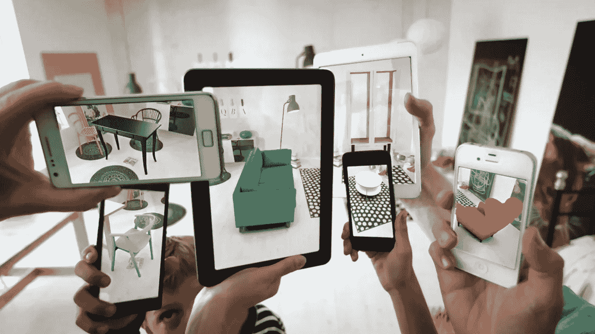
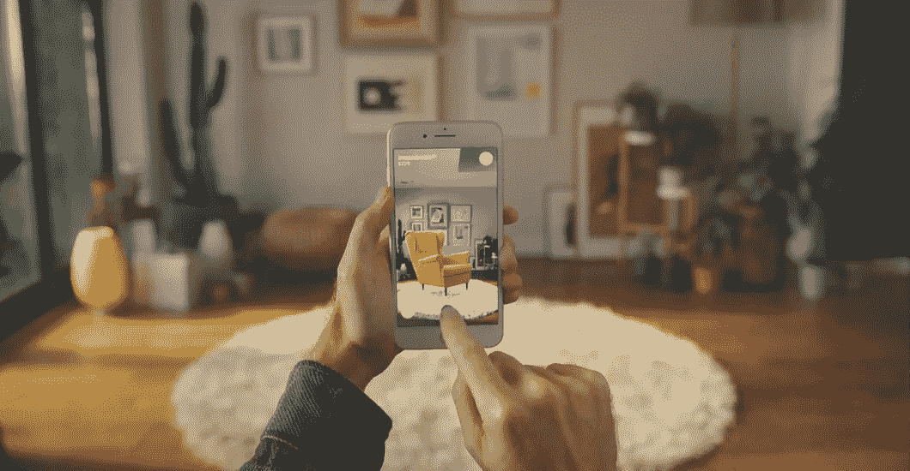
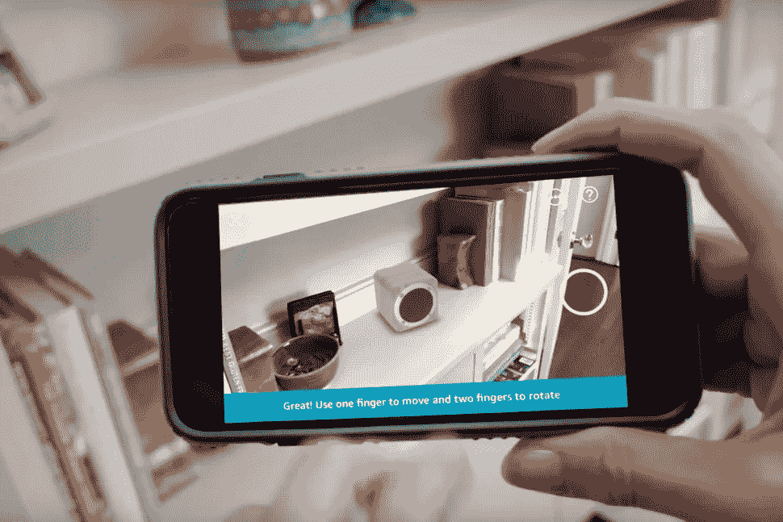
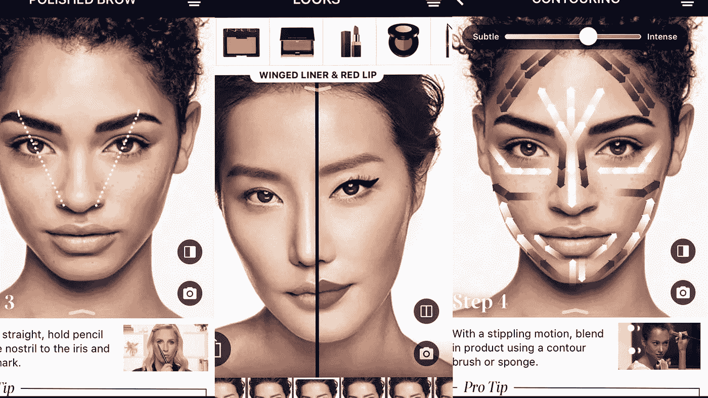
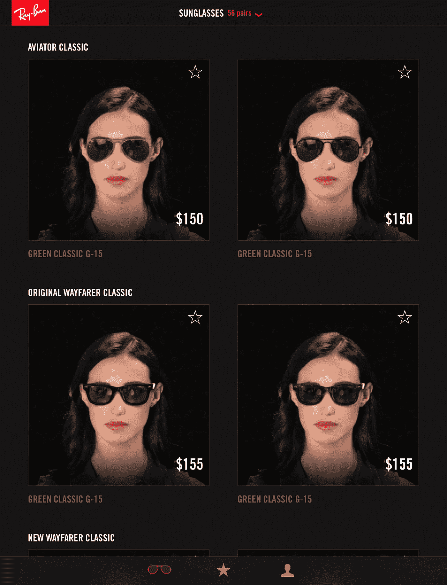

# 电子商务的末日就在眼前

> 原文：<https://medium.com/swlh/the-end-of-the-e-commerce-is-around-the-corner-f2199b446733>

# 增强现实将如何把电子商务变成电子商务

毫无疑问，增强现实是技术世界的下一件大事。我这么说并不是因为我是黑镜迷，而是因为每隔一周就会有一款新的 AR 应用发布，过去的未来梦想似乎终于要实现了。

> 在过去的两年里，随着 Pokemon Go 的发布，AR 从一个新的科技小子变成了大多数科技巨头都想分一杯羹的战场。

关于软件框架，苹果做出了最重大的举动，今年早些时候发布了 ARKit，随后是谷歌的 ARCore。而在硬件领域，各家公司正在[展开肉搏战，推出最好的 AR 眼镜](https://www.wired.com/story/future-of-augmented-reality-2018/)。

在科技世界中，到处都有对 ar 的巨大咆哮，许多行业都在探索不同的方法来应用 AR 来增强他们的业务。然而，在增强现实已经登陆的所有领域中，电子商务可能是对我们的社会产生最具破坏性影响的领域。

## 从 E 移动到 A

尽管网上购物在过去的二十年里飞速发展，但是[实体店仍然和以前一样重要。这主要是因为在线商店体验仍然未能让用户真正接触到要销售的产品。](https://retail.emarketer.com/article/us-shoppers-still-prefer-make-most-purchases-in-store/58dd8922ebd400061c80f3cf)

这就是为什么经常会看到顾客从一个渠道开始购物，然后通过另一个渠道完成购买。

消费者需要对他们的购买决定充满信心，仅仅是平面的图像、尺寸或规格无法取代在客户的真实环境中实时试用产品所产生的亲切感。

进入增强现实。AR 通过让在线购物者熟悉在电子商务体验中只是照片的产品，为购买场景带来了真实感。

准确的全渠道零售方法是在所有媒体上创造无缝的客户体验。AR 通过在线购物过程中的有形存在来帮助弥合这些差距。

> 这是关于 AR 的简单但仍然不可思议的事情，它彻底改变了电子商务行业:它融合了两个世界(在线和离线)。

接下来让我们欢迎[增强电子商务术语](https://en.wikipedia.org/wiki/Augmented_Commerce)(又名 A-Commerce)，它将很快取代电子商务术语。通过 AR，零售商现在可以提供更加互动和个性化的体验，这将永远改变我们的购物方式。

当然，实体店不会马上消失。但可以肯定的是，我们正越来越接近看到这一天的到来。

以下是最近发布的四个电子商务案例:

## 1-宜家商场

随着最近 iOS 11 和苹果 ARKit 的发布，宜家发布了 AR 应用程序，以帮助客户想象他们的家具在自己家里可能是什么样子。

用户可以轻松地浏览最受欢迎的产品系列，或者按照“婴儿和儿童”或“椅子和桌子”等产品类型进行过滤该应用可从[应用商店](https://itunes.apple.com/us/app/ikea-place/id1279244498?mt=8)免费下载。

## 2-亚马逊

在宜家的带领下，[亚马逊最近推出了一个新的 AR 功能](https://www.recode.net/2017/11/1/16592238/amazon-app-augmented-reality-ar-view-3d)，让用户在订购之前测试任何给定产品在家里或工作场所的外观。

这项功能被称为 AR View，通过点击亚马逊应用程序中的相机图标，从家居装饰、厨具和家具等类别的数千种产品中进行选择，即可激活该功能。

## 3-丝芙兰

在最新更新的 iOS 应用程序中，丝芙兰增加了一项功能，让用户可以尝试虚拟化妆。

该功能扫描你的脸，找出嘴唇和眼睛的位置，并让你尝试不同的外观。

目前，用户只能使用唇色、眼影和假睫毛。该应用还提供“虚拟教程”，展示如何化妆，覆盖在用户的脸上。

## 四射线禁令

寻找一副完美的太阳镜可能是一件很痛苦的事，尤其是当你不是布拉德·皮特或安吉丽娜·朱莉的时候。雷朋的新应用程序可以让你尝试该品牌所有不同的太阳镜，舒适地足不出户，也不必在镜子前站几个小时。

[“虚拟试穿”应用](https://www.ray-ban.com/usa/virtual-try-on)借助先进的面部映射技术，您可以创建自己的虚拟模型，并从多个角度看到任何一双鞋中的自己。该应用程序可用于桌面和移动设备。

## 最后一件事…

如果你喜欢这篇文章，请👏并分享给你的朋友。记住，你最多可以鼓掌 50 次——这对我真的很重要。

也欢迎你在这里或在 [Twitter](http://twitter.com/gastonviau) 关注我😊

## 这篇文章发表在[《创业](https://medium.com/swlh)》上，这是 Medium 最大的创业刊物，有 277，994+人关注。

## 订阅接收[我们的头条新闻](http://growthsupply.com/the-startup-newsletter/)。

