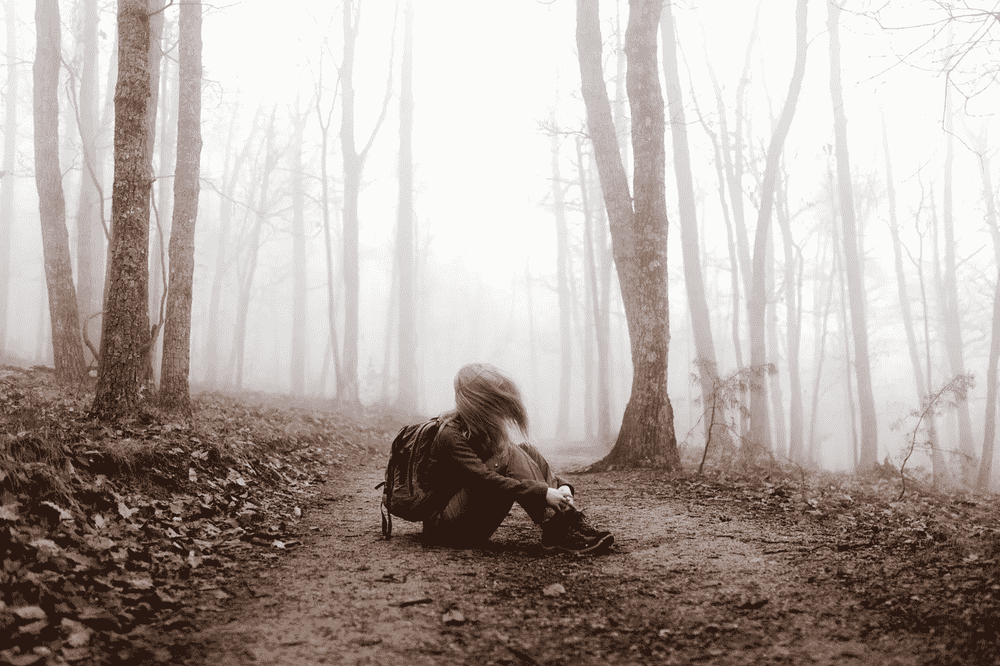

# 内心的敌人

> 原文：<https://medium.com/swlh/the-enemy-inside-18bc4140b5ba>

Photo by [Tim Bogdanov](https://unsplash.com/photos/4uojMEdcwI8?utm_source=unsplash&utm_medium=referral&utm_content=creditCopyText) on [Unsplash](https://unsplash.com/collections/1731899/runner?utm_source=unsplash&utm_medium=referral&utm_content=creditCopyText)

不管你做什么，真正的战斗就在你的内心。

那么，你正在建立你的梦想？梦想中的事业？艺术家的职业？成为世界最佳运动员的旅程？

你要走哪条路并不重要。

您每天所进行的战斗可能与您周围的人不同，但真正的战争发生在您的内心。说实话，每个人都在进行大致相同的内部斗争。

拖延症。

分散注意力。

对失败的恐惧。

缺乏承诺。

懒惰。

显然，我们有更多的这些**内鬼**。但关键是，我们每个人都在与他们战斗。

# 没人能每天打败这些内鬼。

> 总会有那么几天…
> 
> …在这一点上我们是虚弱的。
> 
> …在这条道路上，我们选择了简单的道路。
> 
> …我们没有力量与之战斗。

这完全没问题，因为这是人的天性。

只要我们能诚实地说，我们正在尽最大努力赢得每一天的内部斗争，我们在大多数日子里都取得了成功，我们已经尽了最大努力。

**但事情是这样的:**

大多数人在这方面都做得很好。对他们来说，屈服于这些内在恶魔是常态，而非例外。

我并不是说他们不努力工作。

他们可能会。

这更像是……他们一直在对自己撒谎。不断告诉自己，他们已经尽了最大努力，但事实并非如此。

Photo by [Andrew Neel](https://unsplash.com/photos/KkCig7EbfoA?utm_source=unsplash&utm_medium=referral&utm_content=creditCopyText) on [Unsplash](https://unsplash.com/search/photos/anxiety?utm_source=unsplash&utm_medium=referral&utm_content=creditCopyText)

**对不起，我只是在说我自己。**

多年来，我一直试图建立一个成功的写作生涯。有几个阶段，我疯狂地努力工作，每天都发布新内容。

但是，还有很多阶段我根本没有写。

在那段时间里，我参与了其他项目，比如不同的初创公司，不同的工作，或者基于自由职业者的工作。

所有这些特技都是我自己恐惧的结果，也是我对自己缺乏信心的结果，我不相信自己能够把自己的写作生涯发展到我想要的地步。

结果，我被即将到来的每一个机会分散了注意力。我承担了其他项目，告诉自己这些项目只是暂时的，即使参与其中，我也会继续写作。

这种情况会持续一段时间，但不会持续很长一段时间。

处理大学，一个开始，同时我的写作生涯，总是从一开始就注定要失败。在内心深处，我当然知道。

所以我让那些恐惧和分心的内在恶魔控制了我的行为...很多年了。

就在四个月前，我决定 100%专注于我的写作生涯，无论我有多接近完全没钱，我都会坚持下去。

在这四个月里，我在写作生涯中取得了比之前四年更多的成就。

# 我是如何打败我的恶魔的…至少现在是这样。

实际上，事实是我自己并没有主动选择在我的生活中做出巨大的改变。最有可能的情况是，如果我的生活没有任何改变，那么我会一如既往地坚持下去。

但是后来父亲意外去世了。

这不仅让我陷入了彻底的情感混乱，而且还夺走了我生命中最大的安全感来源。

以前，我拥有世界上所有的时间。在内心深处，我觉得即使我彻底搞砸了，至少我还有在经济上支持我的父母。

父亲去世的那一天，这张安全网也随着他一起破了。

不知何故，我父亲去世的事实，烧掉了我生活中所有其他的选择。我知道如果我想成为一名作家，那么我必须现在就去做。

因为在我接受另一份工作来支持我自己和我的伴侣的那一刻，我可能永远不会再处于这样一种情况，我会辞掉工作，开始我的写作生涯。

所以在那一瞬间，我决定毁掉我生命中所有其他的选择，烧掉所有能让我回到以前生活的船，一个人专注于我的写作生涯。

只是这一次，失败意味着我和我的搭档会流落街头。

> 现在，我根本负担不起…
> 
> …被任何事情分心。
> 
> …让我的恐惧压倒我。
> 
> …不再坚持我的行动方针。

当然，仍有一些时候我只想偷懒，狂看《网飞》系列。仍然有这样的时刻，我非常害怕下个月没有钱，这让我感到麻痹。

有时候，我遇到一个生意或者工作机会，真的只想放弃一切，走简单的路。

但后来我提醒自己，如果我现在不全力以赴，那么我可能会成为又一个梦想永远破灭的人。

没有安全网，加上越来越多的责任，我实现梦想的机会只会越来越小。

很快，我和我的伴侣将进入我们开始要孩子的年龄。

**所以我选择让我的船燃烧。**

在所有的来回，所有的尝试和回头之后，我现在已经 100%地致力于我真正想走的路。

不管最终我会成功，让我和我的伴侣过上体面的生活，还是我的生活会以一场灾难告终，这都是我要坚持的道路。

不管我内心的小恶魔告诉我什么？

# 一些最后的话:

> 赢得你生命中每一天都在发生的内心斗争的最好方法，就是不要给自己留下任何其他选择，而是去赢得它。

只要你知道还有其他选择，如果你失败了你可以做一些事情，如果你跌倒了，有一个安全网会接住你，那么你很可能会失去更多。

这并不意味着你不应该有储蓄或投资，以防你的计划失败。

事实上，在尝试任何创业努力之前选择不建立这些类型的安全网将是自杀。

但这确实意味着你应该全力以赴去实现你想要的计划。你永远不应该"**留有选择的余地**，以防你当前的计划失败。

因为除非你 100%地致力于你选择的道路，除非你把自己放在一个完整的生或死的场景中，否则你永远不会每天战胜你内心的魔鬼。

> 把你自己放在一个你必须赢得内心斗争的位置上，你会的。

**如果你觉得这篇文章有用请做👏并与你的朋友分享。记住，你最多可以鼓掌 50 次——这对我真的很重要。**

**您也可以通过** [**点击这里**](https://mailchi.mp/b0d1e1fba452/struggle-first-thrive-later) **免费订阅我的时事通讯。**

## 这个故事发表在 [The Startup](https://medium.com/swlh) 上，这是 Medium 最大的企业家出版物，拥有 298，432+人。

## 在此订阅接收[我们的头条新闻](http://growthsupply.com/the-startup-newsletter/)。

