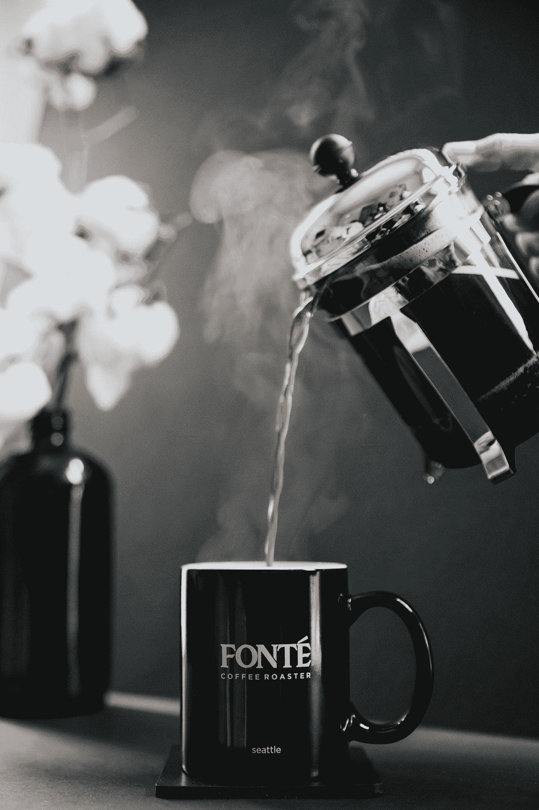
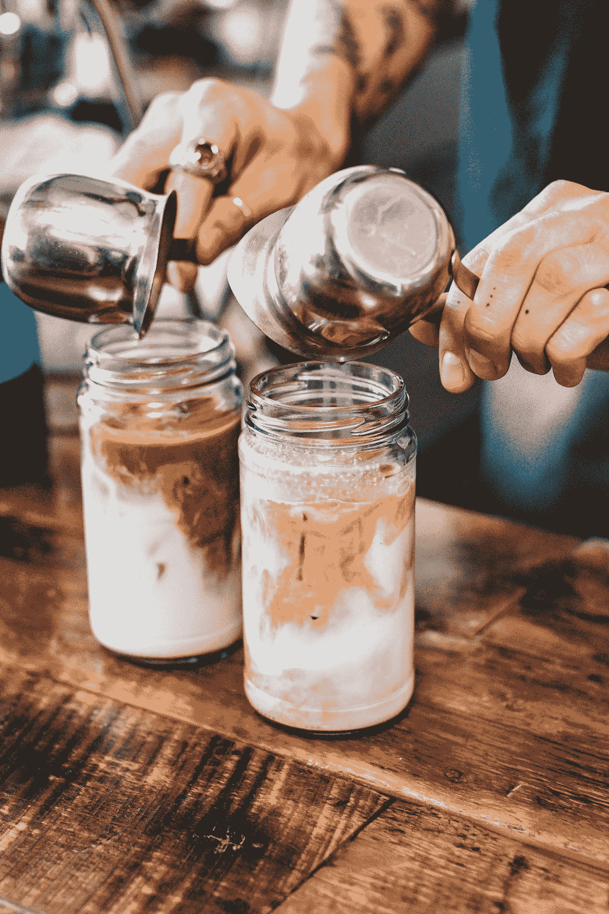
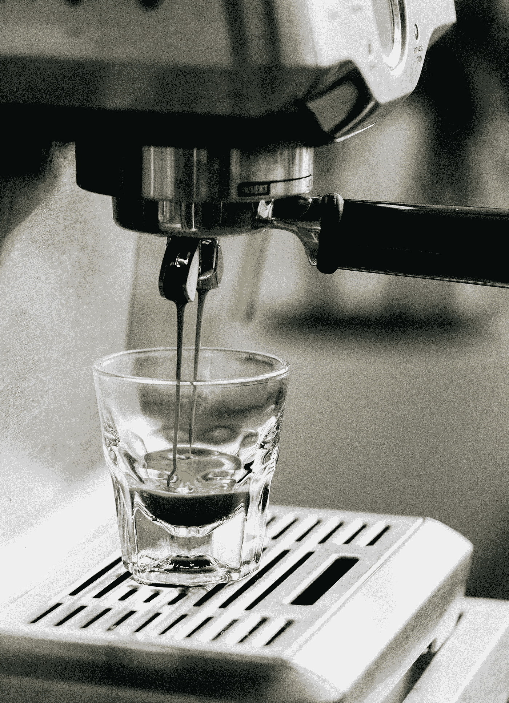

# 企业家的能量饮料

> 原文：<https://medium.com/swlh/the-energy-drink-of-entrepreneurs-8fb781c84325>

“A small cup of coffee sitting on a plate.” by [Emre Gencer](https://unsplash.com/@reo?utm_source=medium&utm_medium=referral) on [Unsplash](https://unsplash.com?utm_source=medium&utm_medium=referral)

## 每天制作完美的杯子

篮球运动员有佳得乐。极限运动有红牛。

企业家有咖啡。

众所周知，咖啡能让我们保持清醒和警觉。这是骗子和积极进取者的生活甘露。

我对咖啡的热爱始于大学期间。我妈妈给我买了一台酿造机，这成了我早晨例行公事的一部分。称量咖啡豆，倒水，等待我的新咖啡。然后我会加一点牛奶，然后去上课。我会打开我的玻璃杯，让香气让我的同学嫉妒地冷笑。

咖啡拯救了我，我会继续寻找更爱它的方式。我参加工程师资格考试时，咖啡就在那里。在我的工作生涯中，它一直存在。

我正在重读 MJ De Marco 的《百万富翁浪子》这本书。我第一次读这本书是在大学毕业后，同年我发现了每周工作四小时——这两本书都有着可笑的标题。但它们对我如何看待财富创造和创业产生了深远影响。

MJ De Marco 说，已经积累了大量财富的人与那些仍在缓慢前行的人有着不同的视角。

生产与消费。

Slowlane 说，那些仍在工作的人会把 10%的薪水存起来用于共同基金，他们有消费者心态。当某样东西引起他们的兴趣时，他们会想办法买下它。他们应该超时工作吗？要求加薪？

浪子人考虑生产它。怎么才能创造出来？他们如何从中获利？什么是分销模式？

我想把这种心态应用到我对咖啡的痴迷上。星巴克从咖啡中赚了很多钱。制作你的咖啡将有助于你欣赏当地咖啡师的下一杯拿铁咖啡。

这里有一些方法可以在早上打造一杯完美的咖啡。

## 1.法国媒体

这是最便宜也是最简单的煮早餐咖啡的方法。这是手工冲泡，不需要电。你可以选择购买便宜的玻璃变体或不锈钢。

咖啡是通过浸泡制成的。这和你泡茶是一个概念。

Photo by [Nathan Dumlao](https://unsplash.com/@nate_dumlao?utm_source=medium&utm_medium=referral) on [Unsplash](https://unsplash.com?utm_source=medium&utm_medium=referral)

你将 10 克咖啡粉倒入你的法式压榨中，然后倒入 180 克水。你等了 4 分 30 秒，然后按下过滤器。

倒上你的咖啡，享受你的早餐。

网上有无数的食谱，一千种不同的咖啡和水的比例。如何让你的第一次开花，然后是时候倒酒了。

但这是最简单不过的了。

## 2.冷酿造

我弟弟向我介绍了冷煮咖啡。一天下午，我看见他从冰箱里拿出一大罐咖啡。

我大吃一惊。我没听说过这样的事情。这是什么魔法？

他给了我一小口，我就爱上了他。

Photo by [Tyler Nix](https://unsplash.com/@jtylernix?utm_source=medium&utm_medium=referral) on [Unsplash](https://unsplash.com?utm_source=medium&utm_medium=referral)

我在网上查了一下，这不是什么新发明。这种变异已经存在多年了。这催生了一种渴望，即一些咖啡馆只供应冰镇咖啡。

这种类型的啤酒酸度较低，非常适合那些胃酸倒流的人。

这与上面的方法有 90%相同。唯一的区别是，你使用室温水，你等待 12-24 小时。

咖啡和水的比例不同。就我的食谱而言，我用 80 克咖啡兑 560 克水，然后冲泡 24 小时。

这样会产生更浓的咖啡，所以我将它与一部分水混合，以使它的味道变淡。根据你的喜好调整。

## 3.倾倒

我还没有试过这种方法。这是另一种制作咖啡的便宜方法。我见过的最喜欢的技术是 Hario V60 和 Chemex。

不是浸泡豆子，而是让水在更短的时间内流过豆子。

Photo by [Najib Kalil](https://unsplash.com/@nkalil?utm_source=medium&utm_medium=referral) on [Unsplash](https://unsplash.com?utm_source=medium&utm_medium=referral)

纸质过滤器剔除了咖啡油，与法式压榨相比，混合更为顺畅。很多人都信誓旦旦地说这种方法，我应该把我的手伸到这个仪器里。

## 4.浓咖啡

这是你在当地咖啡馆购买的所有饮料的核心——拿铁、纯白咖啡、卡布奇诺、玛奇朵和美式咖啡。

Espresso 的意思是快递。这是从咖啡豆中提取咖啡的最快方法。但制作方法很复杂，这就是为什么你会在咖啡馆里看到制造巨大噪音的巨大设备，而仅仅是制作一小杯浓缩咖啡。

“Espresso brewing into a shot glass” by [Mike Marquez](https://unsplash.com/@mensroom?utm_source=medium&utm_medium=referral) on [Unsplash](https://unsplash.com?utm_source=medium&utm_medium=referral)

有 DIY 家庭解决方案来生产这种类型的咖啡- Flair Espresso，Cafflano Kompresso 和 Wacaco Minipresso。它们使用简单，不需要电力。

你可以买一个便宜的牛奶起泡机，然后在早上去做你自己的拿铁咖啡。

有数百种方法可以制作你的咖啡。

但是就像生活中的任何事情一样，你如何做任何事情就是你如何做所有事情。

当你想要某样东西时，你是*只是*买下来，还是试图了解它的内部运作并尝试生产出来？

当你创建一个应用程序或开发一个产品时，花点时间去理解其中的错综复杂和细微差别。为你自己创造它，你会更容易委派工作。

回头见，我的朋友。

## 这篇文章发表在《T4》杂志《创业》(The Startup)上，这是 Medium 最大的创业刊物，有 320，924+人关注。

## 在这里订阅接收[我们的头条新闻](http://growthsupply.com/the-startup-newsletter/)。

