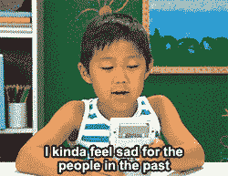

# 自学成才的时代已经到来。

> 原文：<https://medium.com/swlh/the-era-of-the-autodidact-has-arrived-9fb085cc51af>

## 为什么他们说我不行，为什么他们是对的。

向人们解释我是一名视觉艺术家、数字营销人员、网络开发人员、作家和讲故事的人总是有点困难。10 年前，当我申请工作时，面试官说我有很好的爱好，但如果我想获得成功，就需要坚持数字营销。5 年前，人力资源人员表达了严重的担忧，说我“充满潜力，但缺乏耐心”，因为我似乎太“神经质”，试图掌握所有领域的数字。今天呢？我突然变成了他们想要的那个可爱的孩子。

什么变了？工作场所做到了。

正如最近[出版的](https://www.cnbc.com/2018/08/16/15-companies-that-no-longer-require-employees-to-have-a-college-degree.html)，**世界上最大的科技公司，像苹果和 IBM，不再要求员工有大学学位**。这一举动似乎令人惊讶，但事实上是更大变革浪潮的一部分:从努力为学生进入竞争激烈的就业市场做准备的顶尖大学，到要求更多计算机科学培训的学校管理人员、教师和家长[——所有人都有点不情愿地承认**经验和现实世界的知识不亚于大学里教授的知识。**](https://news.gallup.com/reports/196379/trends-state-computer-science-schools.aspx)

新兴技术改变了现代工作场所。从可获得的工作类型([到 2030 年](https://www.mckinsey.com/featured-insights/future-of-work/jobs-lost-jobs-gained-what-the-future-of-work-will-mean-for-jobs-skills-and-wages)自动化预计将带来 8 亿个工作岗位)到我们的工作环境看起来是怎样的([到 2020 年](https://www.upwork.com/i/future-workforce/fw/2018/)三分之一的员工预计将在家工作)。现在，人们期望员工展现出一种不同的职业精神:灵活性、创造性、学习热情以及快速适应和获得新技能的能力。

总之？有点自学成才*。*

Bill Gates in his Bellevue office, 1980

但这种变化真的是凭空而来的吗？

早期的科技巨头，如比尔·盖茨和迈克尔·戴尔，有一个共同点:他们都是自学成才。这些从电脑极客变成亿万富翁的人过去和现在都不仅仅是天才——他们是自学者。在他们职业生涯的早期，他们质疑通往成功的正规途径，独自学习复杂的信息(他们中的大多数人也从大学辍学了)，尽管这些信息仍然基本上是不可获得的。

今天，在谷歌成立 20 年后，技术进步改变了一切:获取信息的能力大大提高，让我们摆脱了机构教育对学习的垄断。

[在 2017 年](https://www.cnbc.com/2017/03/14/bill-gates-main-use-for-technology-is-surprisingly-old-school.html)的采访中，比尔·盖茨表示，他最喜欢的关于技术的事情是自我教育:**我最喜欢的使用技术的方式之一是学习……它不再是真正的前沿，但我仍然认为令人兴奋的是，你可以通过教育课程和视频在线学习任何科目"**

*我们对多技能工人的需求越来越大，知识的世界唾手可得——这足以让每个人都成为一个自学者吗？大概不会。自学者还有一个真正让他们与众不同的能力——他们有自信(即使很难)。*

*成为一个自学者就是相信，不管每个人怎么说，你的心选择的道路和它拒绝的一样好。要知道没有一条清晰的成功之路，成功有许多不同的形式。要相信学习也可以横向进行，而不仅仅是纵向，你的知识越广，你就会变得越宽广，越优秀。*

*它是向每一个人和每一次经历学习——而不仅仅是向那些被认为是“专家”的人学习。自信就是在学习的过程中失败，除了自己没有人可以责怪。学习没有成绩，没有课程，没有校友，没有人认可你的知识并为你鼓掌。学习是因为这是你的本性。*

> *自信就是在学习的过程中失败，除了自己没有人可以责怪。学习没有分数，没有课程，没有校友，没有人认可你的知识并为你鼓掌。学习是因为这是你的本性。*

*尽管就业市场发生了明显的变化，但我们仍然生活在一个崇尚“专家”和“专家”的社会中，一个接受常春藤盟校和校友团体几乎是奉献、努力、知识和能力的唯一有效表达的社会。因此，那些选择自学道路的人仍然心存疑虑也就不足为奇了。*

*但是现在是时候了，我们所有人都应该接受即将到来的变化，开放我们的思想，相信我们有能力和责任学习新的技能，认识新的知识世界，最重要的是，成为自信的人。*

**哦，是的，他们是对的:我没有在他们的世界里成功。但是在今天的世界里，我觉得 [**我过得还行**](http://www.netadror.com/?utm_source=medium&utm_medium=referral&utm_campaign=autodidact) **:)***

****

## *这篇文章发表在 [The Startup](https://medium.com/swlh) 上，这是 Medium 最大的创业刊物，有+ 374，685 人关注。*

## *订阅接收[我们的头条](http://growthsupply.com/the-startup-newsletter/)。*

**