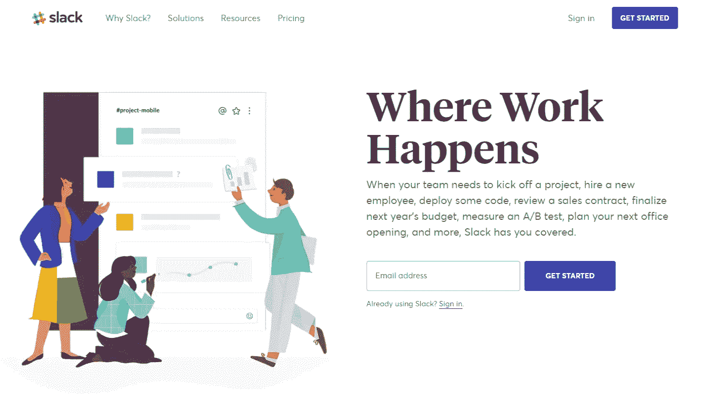

# 创造一个优秀的潜在客户网站主页的基本要素

> 原文：<https://medium.com/swlh/the-essential-elements-that-make-a-great-lead-generation-website-home-page-af26b8bb870f>

Photo by [Hal Gatewood](https://unsplash.com/photos/tZc3vjPCk-Q?utm_source=unsplash&utm_medium=referral&utm_content=creditCopyText) on [Unsplash](https://unsplash.com/search/photos/website?utm_source=unsplash&utm_medium=referral&utm_content=creditCopyText)

建立一个有效而漂亮的网站经常被忽视。当你开始做你的网站时，很容易变得不知所措。

有时你建立了一个漂亮的网站，但是没有建立一个系统来产生潜在客户。有时候你花了很多时间和精力来建立正确的系统来产生线索，但是访问者可能甚至不喜欢这个网站。

一个视觉上吸引人的网站，加上合适的产生潜在客户的系统，是建立一个成功的商业网站的关键。

在这篇文章中，我不会告诉你如何建立你的网站。我会给你一些想法，让你在网站开发过程中牢记在心。

这 5 个要素是领导一代网站的基本要素。

# **清晰的价值主张高于均价**

价值主张是总结你的业务的一句话的卖点。它传达:你是做什么的，为什么你是独一无二的？

当访问者登陆你的网站时，这应该是他们看到的第一件事。

将你的价值主张放在主页上会帮助你迅速吸引访问者。这有助于转化那些准备购买的游客。

你的主页是访问量最大的，因此也是你网站上最重要的页面。

以下是 Freshbook 如何提出他们的价值主张

[https://www.freshbooks.com/](https://www.freshbooks.com/)

写下你的价值主张很简单。用一句话把你的企业做什么和做什么最好结合起来。

您做什么+如何做得最好=价值主张

在上面 Freshbooks 的例子中，我们可以这样剖析价值主张。

他们是做什么的？小企业会计。为什么他们是最好的？他们使结算变得无痛、快速和安全。

花点时间想想是什么让你的团队与众不同。列出一份价值主张清单，并缩小一些你最喜欢的。A/B 测试他们。找到一个能很好地改变信仰的人，并坚持下去。

# **铅磁铁**

销售线索磁铁是销售线索挖掘网站上最重要的元素。

这是收集访问者联系信息的一种方式。你可以通过提供奖励来收集潜在买家的电子邮件和其他联系信息。这些激励措施被称为销售线索磁铁。

目标销售线索磁铁通常是一段可下载的数字内容。想想免费的 PDF 清单、报告、电子书和备忘单。

此外，为了收集访客信息，引导磁铁使您的访客与您的网站互动。你的内容会帮助访问者，甚至在他们成为你的客户之前。

你不仅仅是通过赠送工具和资源来吸引潜在客户。你在展示你的能力和专业知识。

# **行动号召**

随着时间的推移，网站的角色已经发生了变化。

网站的新角色是将访问者转化为领导者。

网站的行动号召 CTA 告诉访问者做一些行动。行动号召应该有助于访问者做出决定。

大多数网站使用行动号召按钮来告诉用户注册。通常按钮上写着“立即注册”。

我们大多数人都没有考虑到的一件事是买家的旅程阶段。根据买家所处的阶段来定位和规划行动号召按钮，将会增加对销售线索转化的影响。

对于处于早期认知阶段的买家，引导他们到你网站最相关的页面和内容。向他们介绍你的服务或产品。

对于处于后期决策阶段的买家，确保你的 CTA 将他们引导到你的漏斗底部，如免费试用或咨询。

Slack 在主页上使用“开始”按钮作为他们的行动号召。

[https://slack.com/](https://slack.com/)

# **高质量的博客**

一个高质量的博客带来的 CTA 是网站流量的主要来源之一。如果你没有博客或者没有坚持使用它。你在你的网站上错过了一个巨大的流量和线索生成机器。

除了给你的网站带来流量，[博客还有很多好处](https://blog.hubspot.com/marketing/the-benefits-of-business-blogging-ht)，比如增加你的在线知名度，帮助你将流量转化为商机。你写的每一篇博文都会以流量的形式为你的业务增加价值，并在未来几年带来商机。

如果你把你最近的博客文章放在你网站的主页上，将会产生巨大的影响。它会将流量从你最重要的页面转移到信息丰富的博客页面，增加产生潜在客户的机会。

# **社会证明**

每当访问者登陆你的网站并在上面花费时间，你需要与他们建立信任。除非他们信任你的品牌和你提供给他们的东西，否则他们为什么要给你信息？

如果你想赢得人们足够的信任，迫使他们向你提供个人信息，你需要证明自己。你要建立你的信誉。

在网络营销中，社交证明扮演着信任建立者的角色。它帮助买家降低风险，并证明他们的购买决定。

展示社会证明的一些有效方法是在你的网站上添加客户证明、案例研究、显著的客户标志以及信任印章。

MailChimp 通过引人注目的客户故事和强大的客户徽标展示了社会证明。

[https://mailchimp.com/](https://mailchimp.com/)

# 结论

所有这些列出的元素都不能让你的网站一夜之间成为一台产生商机的机器。当你开发你的网站时，这些信息是你应该牢记在心的手册。

制作一个优秀的潜在客户网站需要思考、设计、测试和倾听你的客户。

你需要不断地测试和调整你的网站，根据你自己独特的受众来优化你的网站。

## 这篇文章发表在 [The Startup](https://medium.com/swlh) 上，这是 Medium 最大的创业刊物，有+389，305 人关注。

## 订阅接收[我们的头条新闻](http://growthsupply.com/the-startup-newsletter/)。

