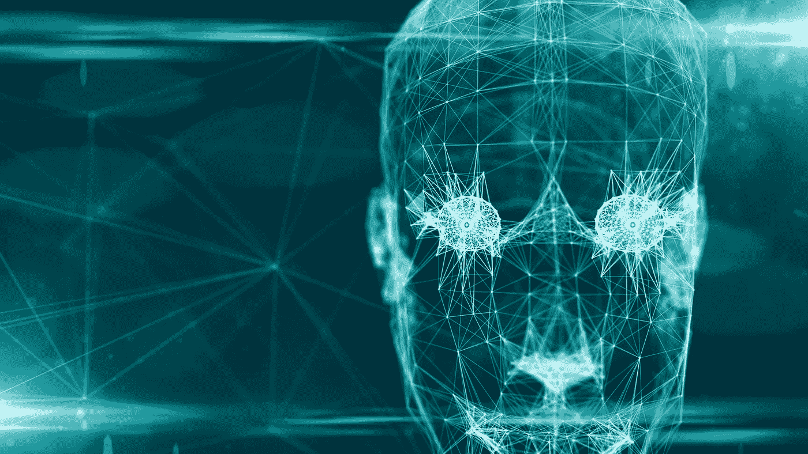
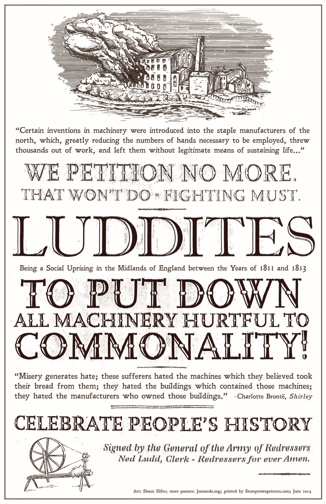
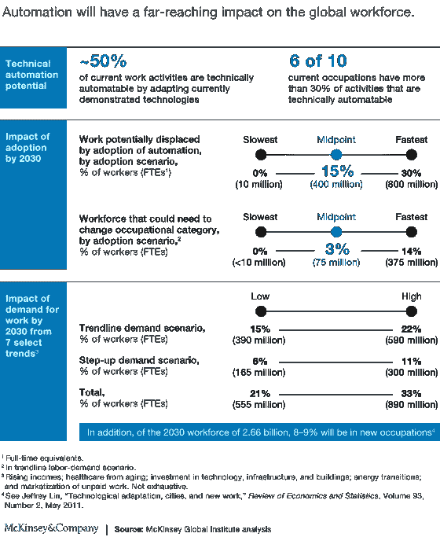
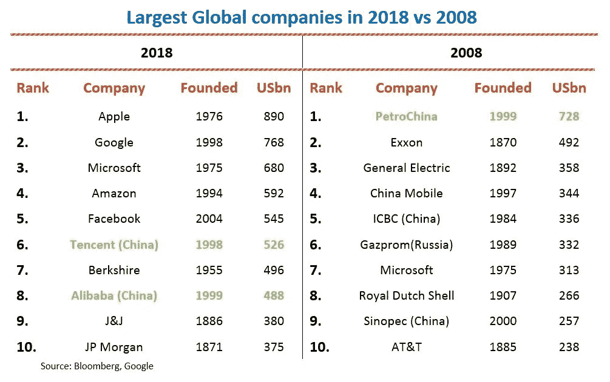
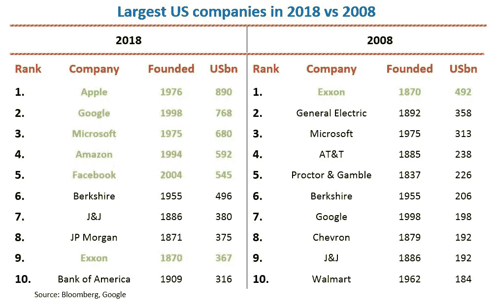
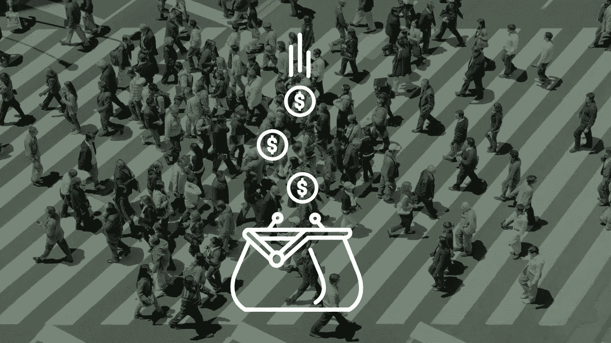
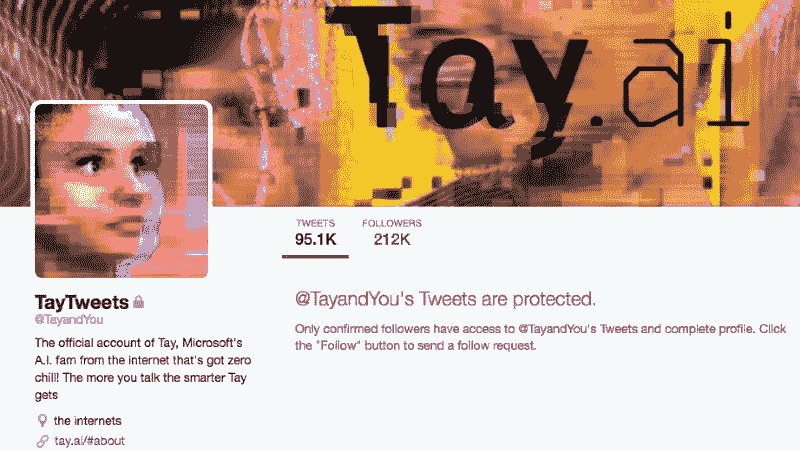
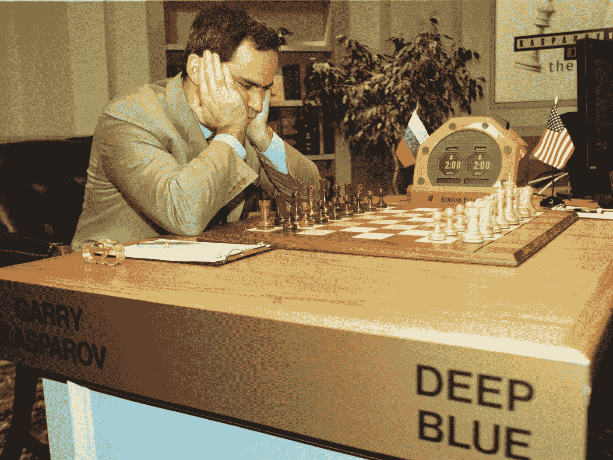

# 人工智能的伦理

> 原文：<https://medium.com/swlh/the-ethics-of-artificial-intelligence-223bd8c60b95>

> “当心；因为我无所畏惧，所以强大”——弗兰肯斯坦的怪物

在玛丽·雪莱 1818 年的著名小说中，弗兰肯斯坦博士从无生命物质中创造了智能生命——后来后悔干预了自然。

但到那时，已经太晚了。

今天，类似的叙事贯穿我们的社会；但这一次，它不再局限于书本。

怪物？

> 人工智能(AI)。

有史以来第一次，我们在没有人类参与的情况下，建立了能够自我进一步发展的技术。有能力智胜我们的技术。有办法推翻我们的技术。

这提出了一个全新的挑战。

你信任这台电脑吗？埃隆·马斯克(Elon Musk)的新纪录片《T1》(T1)警告称，人工智能是一种新的生命形式，它准备在我们周围“缠绕触角”。

最近大量涌现的人工智能恐怖故事，包括[机器人配合](https://www.youtube.com/watch?v=fUyU3lKzoio)开门，以及关于谷歌人工智能变得“[极具攻击性](https://qz.com/911843/googles-ai-got-highly-aggressive-when-competition-got-stressful-in-a-fruit-picking-game/)”的报道，描绘了一幅类似的可怕画面。

我们和艾的故事会以弗兰肯斯坦式的悲剧收场吗？或者我们能和谐相处吗？只有时间能证明一切。

但这场讨论提出了关于人工智能的重要道德和伦理问题，人工智能既是进步的前沿，也是社会风险的前沿。

那么，是什么问题让人工智能专家夜不能寐——我们如何解决这些问题？

# 失业

*自动化的风险是什么？*

从卢德运动到互联网，人们担心技术会“偷走所有的工作”。

几十年来，我们一直在制造比人类更高效地完成日常任务的机器。

所有这些发明都与急剧的经济增长相吻合，让我们的生活变得更快、更轻松。

尽管有一些艰难的调整期，机器并没有偷走所有的工作。新工作取代了旧工作，大多数人都能找到工作。快乐的日子。

为什么？因为当我们自动化手动任务时，我们释放了资源来创建更复杂的角色，这些角色涉及认知，而不是体力劳动。

这就是为什么[劳动力等级](/swlh/what-does-a-future-with-no-jobs-look-like-71bda1004a71)取决于一项工作是否可以自动化(例如，大学教授的收入高于管道工)。

[至今](/swlh/chatbots-were-the-next-big-thing-what-happened-5fc49dd6fa61)。

从法律写作到检测欺诈，从创作艺术到进行研究，人工智能也在学习如何自动化非常规工作。

麦肯锡最近的一份报告估计，到 2030 年，自动化可能会导致全球 8 亿人失业。

有史以来第一次，我们将开始在认知水平上与机器竞争。最恐怖的部分？他们最终将有能力比我们聪明得多。

许多经济学家担心，作为一个社会，我们将无法适应——最终将会落后。

自动化对我们的个人生活有什么影响呢？

目前的情况是这样的:我们出卖自己的时间来换取维持生活的钱。

当这个时间回到我们身边时会发生什么？自动化产生的真空会不会造成社会动荡？

或者我们的孩子的孩子会回过头来认为我们为了生存不得不拍卖我们醒着的时间是不人道的吗？

# 不平等

> 没有工作的未来[会发生什么？](https://blog.growthbot.org/what-does-a-future-with-no-jobs-look-like)

我们目前的经济结构很简单:以贡献换取报酬。

公司依赖于一定的工作量，并支付工资或小时工资。

但是在人工智能的帮助下，一家公司可以大规模减少其人类劳动力。

因此，它的总收入将流向更少的人。人工智能驱动的公司的负责人将相应地获得更高的工资。

贫富差距已经在扩大。

2008 年，微软是唯一一家跻身全球十大最有价值公司的科技公司；苹果排在第 39 位，谷歌第 51 位。

快进到 2018 年，美国和全球五大科技巨头已经占据了前五名的位置:

如今，硅谷催生了一种“赢家通吃”的经济，一家公司占据了大部分市场份额。

因此，初创公司和较小的竞争对手很难与 Alphabet 和脸书这样的公司竞争，因为他们对数据的访问方式不同(更多用户=更多数据，更多数据=更好的服务，更好的服务=更多用户)。)

另一个问题？这些科技巨头创造的就业机会[相对于他们在市场上的份额](https://www.slideshare.net/MosheVardi/humans-machines-and-work-the-future-is-now/71)相对较少。

1990 年，底特律最大的三家公司价值 650 亿美元，拥有 120 万名员工。2016 年，硅谷最大的三家公司估值 1.5 万亿美元，但只有 19 万名员工。

技术真的会实现它的承诺，取代它所破坏的工作吗？

受人尊敬的计算机科学家 Moshe Vardi 不太确定:

> “人们现在意识到的是，技术破坏就业和创造就业的公式，即使基本上是正确的，也太简单化了。”

技能变得多余的工人将如何生存？

令人担忧的是，专家预计高失业率可能会导致留守者之间的暴力和起义。

安德鲁·迈克菲在 2017 Asilomar AI 大会的闭幕词中做了一个严峻的预测:

> “如果目前的趋势继续下去，[人将先于机器站起来](https://futureoflife.org/wp-content/uploads/2017/01/Andrew-McAfee.pdf?x28208)。”

那么，有可能构建一个公平的后劳动社会和后劳动经济吗？

许多人认为[全民基本收入(UBI)](http://basicincome.org/basic-income/history/) 就是答案。

UBI 的实施将意味着所有公民都获得固定的收入，无论他们的职业、金融历史、住房和人口统计数据如何。

这个解决方案受到了包括理查德·布兰森、埃隆·马斯克、比尔·盖茨和马克·扎克伯格在内的思想领袖的称赞。2018 年盖洛普民意调查发现，48 %的美国人同意。

然而， [80%](https://futurism.com/half-americans-universal-income-expect-ai-companies-pay/) 赞成 UBI 的人期望受益于 AI 的商家应该为此买单。

正如[叶夫根尼·莫罗佐夫](https://www.theguardian.com/profile/evgeny-morozov)总结的:

> “如果硅谷能够神奇地靠自己提供从教育到医疗的基本服务，为什么还要费神去建立一个政府呢？更重要的是，为什么还要纳税和资助根本不存在的公共服务，而这些服务无论如何都是由科技公司以一种非常不同的模式提供的？这是一个国家和硅谷都不准备回答的问题。”

# 关系

> 机器是如何触发人脑中的奖励中心的？

机器人在模拟人类日常对话和关系的能力方面变得越来越复杂。

2015 年，一个名为[尤金·古斯特曼](https://www.theguardian.com/technology/shortcuts/2014/jun/09/eugene-goostman-turing-test-computer-program) 的机器人有史以来第一次赢得了图灵测试。

这标志着一个时代的开始，在这个时代中，我们经常像对人一样对机器说话。

我们已经看到一些机器触发我们大脑中奖励中心的例子。例如，使用 A/B 测试构建的 Clickbait headlines，这是算法优化的一种基本形式。

同样的道理也适用于让社交媒体、手机和视频游戏更加丰富多彩的“拉动刷新”和其他功能。

技术已经成为简化人类行为和激发行动的有力方式。因此，它不会导致依赖和成瘾，而是会促使人们做出更好、更利他的行为吗？

或者也许 AI 会简单地自己执行这些行为？

虽然人们在耐心和情感方面可以花费在他人身上的能力是有限的，但人工智能拥有无限的资源，可以用来建立和培养关系。

在“ [I，机器人](http://www.imdb.com/title/tt0343818/?xid=PS_smithsonian)”中，主角德尔·斯普纳发现一个机器人在他祖母的房子里烤馅饼。这种前景看起来更像是即将成为现实，而不是每天都在上演的电影剧本，因为人口学家预计，到 2060 年，每四个人中就有一个人将超过 65 岁。

机器人可以帮助残疾人和老年人进行社会护理和陪伴，如烹饪、管理药物，甚至缓解孤独感。

最终，人工智能具有改变和支持人类行为的巨大潜力——只要它最终落入正确的人手中。

# 奇异

> 我们如何保持对智能系统的控制？

在《剑桥人工智能手册》中，Keith Frankish 不确定我们能做到:

*Kurzweil (2005)认为，智能“……本质上是不可能控制的”，尽管人类试图采取预防措施，但智能实体根据定义“有能力轻松克服这些障碍。”*

让我们假设人工智能不仅聪明，而且作为提高自身智能过程的一部分，它可以不受阻碍地访问自己的源代码:它可以把自己改写成任何它想要的样子。然而，这并不意味着人工智能一定想把自己改写成一种敌对的形式。”

为什么人类处于食物链的顶端？

我们并不比许多动物更大、更快或更强壮。

不，我们的优势取决于我们的智力。我们可以战胜蟒蛇、狮子和鲨鱼，因为我们有能力创造资源来控制它们:物理工具如笼子，认知工具如训练。

但是当我们创造出比我们更聪明的 AI 时会发生什么呢？这个概念被称为“奇点”:人类不再是地球上最聪明的生物。

这让我想起了艾萨克·阿西莫夫的“机器人三定律”:

1.  **机器人不得伤害人类，也不得坐视人类受到伤害。**
2.  **机器人必须服从人类的命令，除非这些命令与第一定律相冲突。**
3.  机器人必须保护自己的存在，只要这种保护不违反第一或第二定律。

奇点会推翻这些规则。

英国数学家和密码学家 I.J. Good 在他 1965 年的论文《关于第一台超智能机器的推测》中创造了术语“T8”智能爆炸(T9)，首次警告了奇点。

当我们成功构建人工通用智能(AGI)时，智能爆炸可能会发生，由此系统将能够递归自我改进，最终导致人工超级智能(ASI)。

AGI 将理解它自己的设计，以至于它可以重新设计自己或创建一个后继系统，然后该系统将重新设计自己，以此类推，并有未知的限制。

2015 年，[史蒂芬·霍金](http://uk.businessinsider.com/stephen-hawking-prediction-reddit-ama-intelligent-machines-2015-10?r=US&IR=T) [呼应了](https://www.reddit.com/r/science/comments/3nyn5i/science_ama_series_stephen_hawking_ama_answers/)这些观点:

> “某种东西显然有可能获得比其祖先更高的智力:我们进化得比我们的类人猿祖先更聪明，爱因斯坦比他的父母更聪明。你问的这条线是人工智能在人工智能设计方面变得比人类更好的地方，以便它可以在没有人类帮助的情况下递归地改进自己。”

如果事情失去控制，就不会有假设的“关闭”按钮。

没有大红色按钮。

因为我可以预测我们的一举一动。

它将能够保护自己。

# 我们如何定义人工智能的人道待遇？

石头没有权利。

我们可以把它粉碎，扔到墙上，用它来盖房子。

一棵树比一块石头拥有更多的权利，但比动物少。一只蚂蚁的权利比一棵树多，但比一头牛少。

我们的社会或多或少毫无疑问地遵循这种等级制度。如果一个存在具有类似人类的品质，它就赢得了道德地位。我们有内在的道德义务以某种方式对待它，而不是其他方式。

道德地位可以归结为一个双向标准:感觉和智慧。

*   感觉是指感受疼痛和痛苦的能力。
*   **智慧**指的是一组与更高智能相关的能力，如自我意识和对理性的反应。

神经科学家还没有解开意识体验的定义。但很大一部分归结于围绕奖励/快乐与恐惧的潜在机制。

我们和动物分享这些机制。我们能把它们实现到机器中吗？目前，人工智能仍停留在表面水平。但它慢慢变得越来越复杂，越来越逼真。

一旦我们开始将机器视为能够感知、行动和感觉的实体，考虑它们的权利就不是那么疯狂了。

尽管他们的智力高于某些人类，他们应该没有任何道德地位吗？

弗兰肯斯坦最终发展了一种情感敏感性，但当他试图融入社会时，人们出于恐惧激烈地拒绝了他。这种情绪在今天对艾的反应中得到了回应。

例如，作为一项基于人工智能的研究的一部分，以测试人类善良的极限，一家公司发明了一个友好的机器人在公司里搭便车。几天之内，机器人被[斩首](http://www.iflscience.com/technology/hitchhiking-robot-manages-two-weeks-us-being-destroyed/)，并且在一次无端的攻击中被人类斩首。

类似的情况也出现在日本，一个迎宾机器人在商场被一群孩子摧毁。

随着人工智能变得越来越普遍，我们会开始对这种行为进行惩罚吗？

# 种族主义机器人

> 我们如何消除 AI 偏见？

AI 处理的能力远超人类。但不能相信人工智能是公平或中立的，因为它本质上反映了其开发者(通常是白人男性)的有意识或无意识的偏见。

这就是人工智能开始出错的地方。

一个例子是谷歌的[照片服务](https://gizmodo.com/5256650/camera-misses-the-mark-on-racial-sensitivity)，人工智能被用来识别人、物体和场景。

另一个是[软件](https://www.propublica.org/article/machine-bias-risk-assessments-in-criminal-sentencing)，人工智能被用来预测未来的罪犯，这显示了对黑人的偏见。

微软的种族主义机器人 [Tay](https://www.theverge.com/2016/3/24/11297050/tay-microsoft-chatbot-racist) 不会很快被遗忘。

人工智能是由具有种族主义、偏见和判断能力的人类创造的。

当人工智能接管以前由人类执行的认知任务时，它们也继承了社会需求:即，在无偏见、无判断的基础上做出决策的期望。

如果一种算法基于复杂的神经网络或定向进化，那么几乎不可能理解它为什么或如何以某种方式判断人。

但是基于决策树或贝叶斯网络的机器学习器对于程序员的检查来说可能更加透明。

这将使审计人员能够发现某些偏差背后的根源，并加以纠正。

那么，如果人工智能完全是由那些为社会正义和进步而奋斗的人创造的呢？它可以成为积极变化的催化剂。

这就是为什么开发对检查透明的算法变得越来越重要，并且对他们管理的人和被管理的人来说是可预测的。

# 为什么我们还不应该惊慌失措

## 自愿监管和治理

相关领域的领导者已经重视制定法规，试图减轻人工智能的一些负面影响。

最重要的例子之一是谷歌宣布的[道德](https://www.blog.google/topics/ai/ai-principles/)原则，这是该公司程序员反抗的结果。

首席执行官桑德尔·皮帅在[的博客文章](https://blog.google/topics/ai/ai-principles/)中概述了人工智能使用的新准则。

皮查尔表示，谷歌不会为以下领域设计人工智能:

*   *造成或可能造成整体伤害的技术。*
*   *主要目的是造成或直接导致人员伤害的武器或其他技术。*
*   *违反国际公认规范收集或使用信息进行监视的技术。*
*   *目的违反公认的国际法和人权原则的技术*

他还列出了另外七条原则，他说这些原则将指导未来人工智能系统的设计:

*   *AI 应该是对社会有益的。*
*   *应避免产生或强化偏见。*
*   *进行安全制造和测试。*
*   *负责任。*
*   融入隐私设计原则。
*   坚持科学卓越的高标准。
*   可供使用。

> 电子前沿基金会(Electronic Frontier Foundation)称这些指导方针是“人工智能伦理原则的一大胜利”。

另一个例子是英国科学院和皇家学会，它们汇集了*‘领先的学者、行业领袖、公民社会和数据与技术专家’*来制定一套指导数据治理的原则。

这些原则规定，以各种方式管理和使用数据的所有数据治理系统应该:

*   *保护个人和集体权益。*
*   *确保透明、负责和包容地进行受数据管理和数据使用影响的权衡。*
*   寻找好的实践，从成功和失败中学习。
*   *加强现有的民主治理。*

# AGI 还有很长的路要走

人工通用智能(AGI)是人工智能的圣杯。

目前，相当于或优于人类智力的人工智能被编程到一个特定的受限领域，如搜索互联网或玩游戏。

因此，人工智能在这一点上确实很擅长，但在其他方面就不行了。

考虑一下[深蓝](https://en.wikipedia.org/wiki/Deep_Blue_(chess_computer))的情况。这个人工智能打败了人类，成为国际象棋世界冠军。但是深蓝除了下棋，不能执行任何其他任务。

类似地，蜜蜂擅长建造蜂巢，海狸擅长建造水坝——但是蜜蜂不会建造水坝，海狸亦然。

既能观察又能学习的能力是人类独有的特征。

AGI 将能够从观察中学习，并最终能够完成各种各样的任务，像人类一样思考和理性化——甚至可能达到超人的智力水平。

然而，不能保证 AGI 的力量会造福世界，而不会成为人类的生存威胁。

那么，我们离发展 AGI 还有多远？

虽然创新的步伐令人眼花缭乱，但今天狭义人工智能的现实仍然相对有限。即使有天才的机器学习工程师和数百万美元的资金支持，它仍然无法在 100%的时间里准确地执行。

与此同时，狭义人工智能面临着许多其他发明同样的问题。

这并没有让这些问题变得更好或更糟——只是在我们可以预见它们的假设下，这些问题可能更容易管理。

最终，利用人们的无知，给人一种现在是——或将会是——人类的印象是错误的。

*“对机器智能的错误识别导致对人工智能的潜力和威胁的错误道德评估。什么会导致我们过度认同机器？很简单，这是对人类生活的一种误解，将语言、数学和‘理性’的能力视为其关键特征。”*

# 未知

随着机器变得更快、更聪明、更有能力，我们的生活变得更有效率——因此也更繁荣。

人工智能是一个无限的景观，具有难以想象的力量来改变我们生活的世界。

很刺激。很陌生。

但是巨大的变化也带来了潜在的危险。

历史已经给了我们许多警告，告诉我们新技术的广泛、快速采用会导致公众起义、恐惧和焦虑。

我们什么时候才能到达技术发展变得不可逆转的不归路？

根据阿明·格伦瓦德的说法，一旦科技对我们有了期望，我们就进入了 T2，而不是相反。

现在看来，这似乎是一个不可能的结果。

但是，如果说我们对指数技术有所了解的话，那就是它正在悄悄向我们走来…

这一刻，它还是遥远未来的一个小点，下一刻，没有它，我们就无法记起生活。

正如玛丽·雪莱所写的:

> "对人类来说，没有什么比巨大而突然的变化更令人痛苦的了."

我们的世界正处于永远转变的风口浪尖。

让我们小心行事。

【blog.growthbot.org】最初发表于**。**