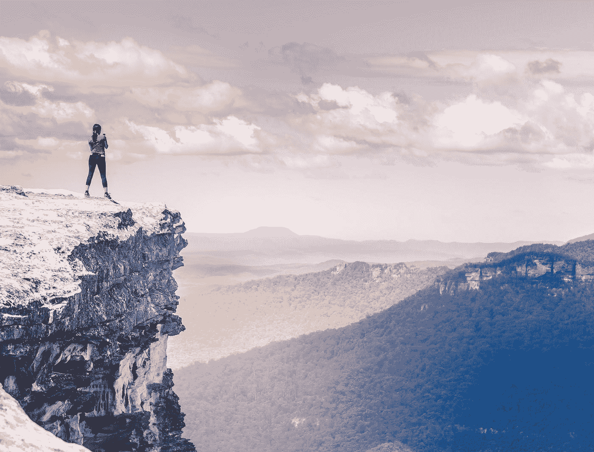

# 体验悖论

> 原文：<https://medium.com/swlh/the-experience-paradox-eef27c6e3634>

Photo by [Mike Wilson](https://unsplash.com/@mkwlsn?utm_source=medium&utm_medium=referral) on [Unsplash](https://unsplash.com?utm_source=medium&utm_medium=referral)

## 初学者的美丽心灵。

有人说最有价值的商品是信息。据说经验是没有补充的。

从我们蹒跚学步到最后一息，生命的大部分时间都围绕着获取知识。一次又一次的牺牲是为了全力以赴战胜我们自己的无知。

作为一个终身学习者，我以前也坐过这个位子。然而，我没有意识到的是，经验或收集的信息并不是最重要的因素。

**这是学习发生的背景。**

迈克尔·乔丹，一个不需要背景介绍的人，以一种有趣的方式研究游戏电影。他的会议没有关注什么是对的，什么是错的。

他关注的是*缺少的*。

他在寻找可以插入到他的剧目中的东西，这将把他的游戏推向边缘。错误当然会被识别和校准，但真正的区别是他不会很快带走任何东西。他不想限制自己。这些错误是缺失的结果，而不是错误的结果。

在商业、人际关系和生活中，我们经常被经验蒙蔽了双眼。我们看到一些事情以某种方式展开，我们在内心深处取代它，当我们认为历史即将重演时，就准备猛扑过去。一旦现实看起来与我们已经形成的信念一致，那么就变成了寻找复活节彩蛋来支持我们的论点。

如果信念是桌面，经验就是腿。

虽然这在许多情况下有助于我们，但我们不能低估敞开心扉接受其他可能性的价值。

领导者承认理性。领导者承认情感和直觉。但是没有什么能阻碍一个伟大的领导者取得杰出的成绩。这条路总是被清理成一条直线。

要做到这一点，门必须一直开着——即使只是勉强开着。

经验是用来作为指南的。一张地图，如果你愿意的话。但我们还是要抬起头来，勘察这片森林。

 [## 不可阻挡的领导者的三个特征

### 我最崇拜的开拓者的普遍品质。

medium.com](/swlh/the-3-traits-of-unstoppable-leaders-1fb5aae4be69) 

永远不要尝试你以前从未做过或解决过的事情，然后凭自己的意志找到解决方案？

这得益于没有专注于地图。你可能参考了说明书，但是当你执行实际工作时，你的思想停留在现在(一千个不可避免的陈词滥调的原谅)。

我们过去遭受的创伤也是如此。我们与一个人或一项努力有过艰难的遭遇，因此，用它来证实一个主张，即所有的人或相关活动都会产生相同的结果。

俗话说得好，

> 伤害我们的不是咬伤(经历)——而是毒液(信念)。

我不是说要鲁莽。我也不是说故意忽略最佳实践。

我只是在鼓励那扇门打开。可能发生的事情*的开端是基本面可能不可信。*

*不要让经验夺走你的时间。奇迹甚至可以支撑最好的判断。*

*保持希望，我的朋友们。*

# *你通往你热爱的生活的道路就在这里*

## *你的失败就是你的突破。在这里阅读更多我的故事[，访问我的](/@DanielJWhalen)[网站](http://www.danieljwhalen.com)，或者在[推特](https://mobile.twitter.com/DanielJWhalen)上关注我。*

**

## *这篇文章发表在 [The Startup](https://medium.com/swlh) 上，这是 Medium 最大的创业刊物，有 320，924+人关注。*

## *在这里订阅接收[我们的头条新闻](http://growthsupply.com/the-startup-newsletter/)。*

**