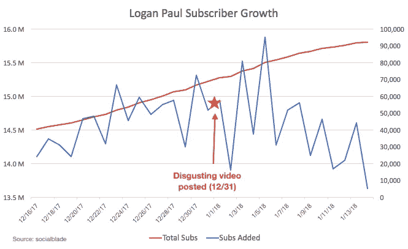

# 脸书的“修复”

> 原文：<https://medium.com/swlh/the-facebook-fix-1aa57ff434d5>

## 为什么这个世界需要更多的拉瓦尔

[*订阅我的每周简讯*](http://bit.ly/beautifultwistedtech) *，每周回顾我认为有趣的技术政策故事，为什么它们很重要，以及未来会发生什么。*

又是一周，又是一组关于技术平台和内容调节的新闻。让我们按时间顺序来看看:

*   1 月 1 日，[新法律在德国生效，该法律规定大型社交媒体平台因未能删除其平台上发布的非法内容而要承担责任(最高罚款 5000 万€)。](https://www.wsj.com/articles/facebook-google-have-a-tough-new-job-in-germany-content-cop-1515605207)
*   ESPN 发表了对想成为卡戴珊·拉瓦尔·鲍尔的采访，这立即遭到 NBA 首席哲学家兼勇士队主教练史蒂夫·科尔的谴责。
*   YouTube [宣布](https://slate.com/technology/2018/01/logan-paul-is-being-removed-from-youtube-programs-after-his-video-of-japans-suicide-forest.html)在其备受争议的视频引起广泛关注后，将从其首选广告节目和 YouTube Red 项目中撤出其灌水主管罗根·保罗。
*   脸书首席执行官马克·扎克伯格宣布将彻底改变其新闻订阅算法对故事进行排名和加权的方式，将它重新定位于朋友和家人的帖子，不喜欢企业和出版商的帖子，特别是视频。声明的目标是“鼓励人与人之间有意义的互动”。

首先，德国的新法律与美国现行法律( [47 U.S.C. 230](https://www.law.cornell.edu/uscode/text/47/230) )形成对比，后者保护互联网平台对其托管的内容不承担责任。德国的法律已经经历了混乱的头几周，Twitter 暂时关闭了一个讽刺性的账户，右翼领导人利用法律将自己描绘成审查的“受害者”。该法律将平台置于一个困难的境地，即必须在收到通知的 24 小时内删除“明显非法”的仇恨言论，并在 7 天内删除简单的“非法”言论。对于德国这样一个有着众所周知的严厉的仇恨言论法律的国家来说，将审查的责任放在这些私营公司身上可能并不罕见。但即使是法律实施的头几天，也说明了让科技公司来判断和评判什么是非法内容的危险。这些平台的力量在于任何人都可以发布任何东西，而一项法律限制从根本上约束了个人的声音。德国的法律已经导致一个过度审查的制度，因为公司对新的激励措施做出反应，导致一些人的声音没有被听到。

几天后，史蒂夫·科尔开始大谈一些据说已经感染了我们社会的“社会问题”:

> “我不知道谁会在意，但人们肯定会在意，否则 ESPN 不会花这么多钱派记者去立陶宛，因为他们解雇了那些写真正重要文章的人……”

人们喜欢听一些吹牛大王对着麦克风侃侃而谈，而媒体则通过报道来吸引更多的观众？史蒂夫，真是大发现！真正的区别是，如果 ESPN 没有报道，人们会从脸书、Instagram 或他们选择的其他平台上获得他们的重大修正。所以 ESPN 还不如趁他们还能点击的时候赚点小钱。在历史上，体育一直受到保护，不会受到技术对传统媒体造成的破坏，这是因为它的现场必看性质以及球队对球员和教练的严格控制。克尔要求 ESPN 扮演德国要求社交媒体平台扮演的角色，尽管规模较小:审查我们 NBA 不喜欢的内容。但鲍尔表明，这种模式不再有效，这让人们很恼火。不管是好是坏，现在的世界是需求驱动的。消费者、用户和观众得到他们想要的，如果你的组织不愿意为他们服务，你就死定了。克尔似乎认为，如果 ESPN 不再把麦克风放在拉瓦尔面前，他就会走开。尽管有些人可能会喜欢，但这已经不再是它的工作方式了。

罗根·保罗就是一个例子。自从 12 月 31 日发布了他的恶心视频后，他的用户持续增长。YouTube 可以切断金钱的虹吸，但他仍然得到了他显然非常渴望的关注:

While subscriber growth took a slight hit in the immediate aftermath of Paul’s post, it’s barely slowed since.

与此同时，脸书在美国“修理”自己的最新尝试……很奇怪。他们说他们现在会更重视来自朋友和家人的帖子，而不是新闻，但是网站上的个人更新数年来一直在下降。这是一个值得称赞的向“高质量接触”迈进的尝试[我上周建议](/@aetraina/ive-also-been-thinking-about-ways-to-realign-incentives-for-these-large-platforms-and-am-intrigued-e15776520940)脸书努力实现，但还不清楚这是否能真正解决过滤泡沫和假新闻的问题。正如该书的新闻订阅负责人[解释的那样](https://www.wired.com/story/facebooks-adam-mosseri-on-why-youll-see-less-video-more-from-friends/)，“你可能会和一个群体中有共同兴趣的人进行一次真正有吸引力的对话。”是的，那可能只是一个白人至上的团体。

作为一个社会，我们才刚刚开始应对由少数大型平台主导的日益集中化的互联网结构所带来的问题。当然，扎克伯格的解决方案可能是正确的。但是，更有可能的是，他错了。然后他会尝试下一件事，然后下一件事，而我们都在等待。然而，在一个充满活力的创新环境中，许多人和公司都在同时尝试许多事情，最好的往往会胜出。在我们目前的互联网结构下，无论扎克伯格说什么，都适用于社交媒体领域(谷歌在搜索领域也是如此，亚马逊在电子商务领域也是如此)。当然，在脸书宣布解决方案之前，它想出了许多主意，但都被抛弃了——像脸书这样的垄断企业在内部压制创新是出了名的。马贝尔也许是最臭名昭著的，几十年来隐藏着像电话应答机和移动电话这样的发明。但这引发了真正的矛盾:实际上最好只有一个社交媒体平台为所有人服务，我们都在许多方面受益于这种规模。当任何人都可以加入、发布和吸引观众时，这些平台是最有价值的，即使是像罗根·保罗和拉瓦尔·鲍尔这样的白痴。但是我们现在开始意识到这种集中式结构和缺乏真正的平台选择的成本。从历史上看，对这种制度的回答是以一种新的、真正颠覆性的技术或里程碑式的反垄断案件的形式出现的。

最后，前总统奥巴马出现在大卫·莱特曼的新网飞秀上，他们探讨的一个话题是社交媒体和过滤泡沫的问题。奥巴马以乐观的语气结束了讨论，他说，“我认为这是一个可以解决的问题，但我认为这是一个我们必须花很多时间思考的问题”。

所以我们会带着同样的乐观离开。

# Alexa，放点潮人的东西

最近[发表的亚马逊专利申请](https://patents.google.com/patent/US20170330209A1/)详细描述了一种新的计算可能会流行的媒体(如音乐、电影)的方法。该系统识别倾向于在流行音乐变得流行之前收听(例如)流行音乐的早期采用者，然后可以遵循这些“早期采用者”的收听模式来预测可能变得流行的不知名或不受欢迎的艺术家，并将他们推荐给其他用户。是的，但是如果潮人在听黑胶唱片呢？

Detail from an Amazon patent claiming “systems and methods that identify users of a media distribution system that tend to consume popular media items prior to such media items gaining popularity.”

# 扭曲的

上周是会议狂欢，因为没有什么比重要的人聚在一起讨论重要的事情更重要的了。随着消费电子展和摩根大通医疗保健会议的召开，许多重要的事情肯定会被讨论。虽然有很多令人兴奋的事情(我完全免费[给孩子们的机器人治疗填充鸭](https://www.engadget.com/2018/01/08/robot-therapy-duck-comforts-kids-with-cancer/))，但来自前线的消息表明我们还有很长的路要走:

**未来是迈克尔。**在摩根大通，94%的公司发言人是男性，而 77%的发言人是男性。STAT News 提供了最明显的统计数据，显示有 22 名迈克尔在发言，但只有 20 名女性首席执行官。

[统计新闻](https://www.statnews.com/2018/01/07/jpm-gender-diversity/)

**CES 也好不到哪里去。在过去的七年里，只有三位女性在 CES 的主舞台上发言。这个数字今年没有增加，因为没有女性做主题发言。CES 的组织者说:“令人沮丧的是，担任这些职位的女性人数有限。”(1)这是愚蠢的,( 2)如果美国最大的消费电子产品贸易展的组织者不能理解他们如何为科技行业带来变革，我们显然还有很长的路要走。**

[重新编码](https://www.recode.net/2018/1/8/16864946/ces-2018-keynote-speaker-diversity-failure-women-minority-ces-cta-grace-hopper?te=1&nl=dealbook&emc=edit_dk_20180109)

# “刚拍了个业余视频，我觉得应该 GoPro”

显然，建造一个很酷的摄像头只是战斗的一半。据报道，GoPro 正在试水潜在的销售，希望 GoPro 公司的买家比 GoPro 相机更多。当 GoPro 下调 2017 年第四季度指引时，其股票最近下跌了 20%。Snapchat 可能会收购它们，因为正如我们不断被提醒的那样，Snap 是一家“[相机公司](https://www.newyorker.com/business/currency/why-is-snap-calling-itself-a-camera-company)”

# 世界末日的征兆

有没有在 Instagram 上看到免费手表的广告，或者其他看起来异想天开的交易？然后继续读下去。

 [## 你 Instagram Feed 里的奇怪品牌

### 一种新型的在线零售商不生产甚至不接触产品，但是他们有一些其他的变废为宝的技巧。

www.theatlantic.com](https://www.theatlantic.com/technology/archive/2018/01/the-strange-brands-in-your-instagram-feed/550136/) 

## 这篇文章发表在[《创业](https://medium.com/swlh)》上，这是 Medium 最大的创业刊物，有 295，232+人关注。

## 在这里订阅接收[我们的头条新闻](http://growthsupply.com/the-startup-newsletter/)。

