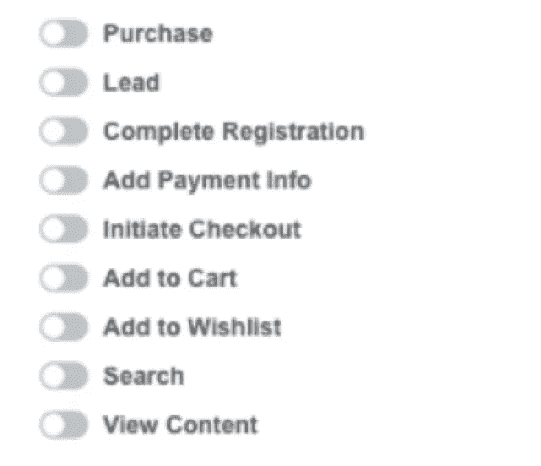
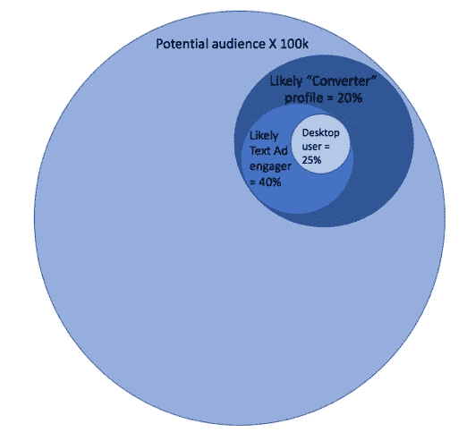
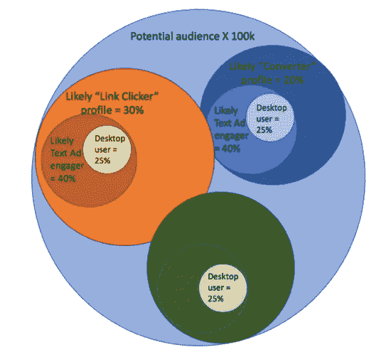
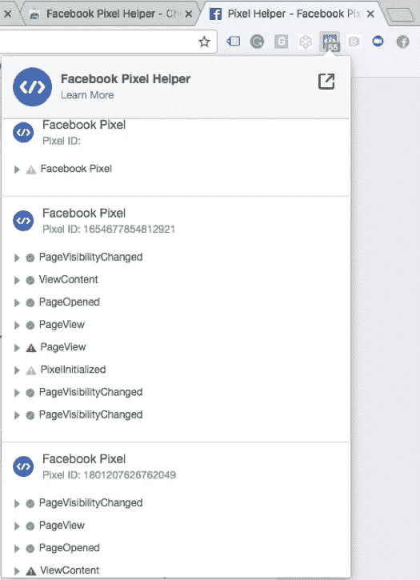

# 脸书像素——不仅仅是一个技术工具

> 原文：<https://medium.com/swlh/the-facebook-pixel-more-than-just-a-technical-tool-b92b0678c519>

对一些人来说,“像素”这个词让他们不寒而栗。对其他人来说，他们动物般的防御机制会踢进来“我不处理那些。他们是技术人员的责任。”

然而，对于聪明的营销人员来说，他们知道理解、实施和利用它们是多么重要。你看，一些表面上看起来很专业的东西实际上是一种艺术形式…就像任何其他东西一样，一旦你学会了专业知识，你就可以开始在使用它们时变得很有创造力…

首先，让我们稍微回溯一下…

# 跟踪像素—小而强大

脸书像素像任何其他跟踪像素一样，是一小段跟踪代码，可以添加到您的网站、登录页面或您拥有的任何其他 web 属性中。这可以通过标签管理器(我推荐)来实现，或者直接应用于页面的源代码。

跟踪像素使您能够:

*   跟踪用户在您的网站、登录页面、感谢页面等方面的行为。
*   数一数你得到的转化数量。
*   向访问过你网站的用户重新营销。
*   针对合适的用户类型进行优化。

至关重要的是，您必须安装 pixel，并且它能在您运行的整个活动中正确跟踪。没有这一点，可能会有一些灾难性的影响。

关于如何设置你的像素，你需要知道的一切，[到这里](https://www.facebook.com/business/help/952192354843755)。

# 使用脸书的标准事件

与你可能使用过的其他像素不同，脸书不提供“一揽子”代码扔在你的网站上…他们提供“标准事件”

标准事件是根据脸书为方便起见而标准化的典型销售漏斗绘制的。这意味着当你告诉脸书有人“退房”时，他们能够理解，因为所有的广告商都使用相同的代码来确定“退房”是什么样子。

你可以在这里找到标准赛事[的完整列表](https://www.facebook.com/business/help/952192354843755)。

# 将标准事件作为你的优势

标准事件是操纵脸书算法的一个很好的工具，该算法已经非常复杂了。它理解用户的行为，并利用这一点进行优化。

例如，如果你告诉脸书你想改变信仰，脸书会出去找最有可能改变信仰的人。

它通过观察你的观众中的所有人，以及他们独特的个人资料、活动和行为来做到这一点。它还会查看过去有多少人进入了销售漏斗。

有一种理论认为，脸书甚至会对其用户进行评分，这意味着如果你正在寻找转换器，你可能会多付一点钱来接触他们，因为他们被认为比串行链接点击器更有价值。

您可以使用一些技巧和策略来帮助您将跟踪像素部署为营销策略的一部分:

**1。在您的漏斗中添加标准事件——不管您在优化什么[强烈推荐]:**

如果你什么都不做，一定要这样做:在你的漏斗中加入标准事件。

脸书的算法是智能的——它总是在“学习”因此，通过允许脸书通过其标准事件查看所有销售漏斗，尽管只针对你想要的一个进行了优化(例如转换)，你正在“教授”算法更多关于你的理想客户和那些不太有吸引力的客户。

例如，使用:

*   Lead =向脸书展示一个对你的产品感兴趣的潜在客户(Lead ),他给了你他们的电子邮件。
*   添加支付信息=允许脸书了解客户资料，谁输入了信用卡详细信息，但没有完成购买。
*   购买=向脸书展示我们的理想受众:通过你的漏斗并转化为付费客户的客户。

**2。针对漏斗的更高端进行优化**

脸书要求在您的转换窗口内每个广告集至少有 50 次转换，以便能够优化转换。这通常适用于每笔收购成本(CPAs)较低的潜在客户(两步)营销活动。然而，对于付费活动(1 步)来说，这可能更难实现。例如:

如果你有一个为期一天的转化窗口，CPA 目标为 50 美元，那么你每天至少需要花费 2500 美元，在一个一步到位的活动中设置广告，以实现 50 次转化…也就是说，如果你的 CPA 目标立即实现，并且没有上升期。这是非常不可能的，对于一些企业来说，这是太多的花费在未经证实的推广或观众。

那么，如果你没有为转化而优化，你能做什么呢？相反，你可以为漏斗中更上游的事件进行优化:将“查看内容”标准事件添加到广告后的推广页面，并要求脸书为该目标进行优化，同时仍然跟踪你的 CPA 和转换目标，作为你成功的衡量标准。

您还可以将“添加支付信息”或“启动结账”标准事件添加到订单中，这样您就可以针对这些事件进行优化，因为访问这些页面的人可能会比访问感谢页面的人多。

**给你一个警告:**脸书非常擅长分析用户行为。所以，如果你要求它为登陆订单的人进行优化，这就是将要发生的事情。然后，你必须努力将那些订单转化为付费客户。脸书可能向你发送了数字版的“轮胎踢球者”(或橱窗购物者)，他们价值较低，也不太可能转化，这意味着你的提议需要非常努力才能吸引转化。

**3。针对具有相同受众的不同活动进行优化，以覆盖不同的子集**

脸书正在使用您的优化设置来细分您的受众。它从 100，000 个潜在客户中挑选出一部分，然后根据你的竞选团队告诉它去寻找的东西进行分割。

例如:你在寻找转化者——你所选择的受众中最有可能转化的人。那是你潜在观众的 20%。你向这些人展示的只是文本广告——脸书分析称，这些人中有 40%可能会通过文本而非视频进行互动。你的目标只是台式机，这进一步削减了你的潜在客户。

所以你看，通过改变一些定位，你可以接触到更多的潜在受众，改变你优化的人群是第一步。但在此之后，你应该考虑其他广告类型，其他设备，当然，看看你的目标位置。

所有这些都有助于你进一步扩大你的营销活动，从你认为最有可能成为你的潜在客户的人群中获得更多流量。(图中使用的数字仅用于演示目的)

# 如何检查一个像素设置是否正确？

脸书有一个工具，像素助手，它可以帮助你检查每个页面上的像素是否正确。如果有标记管理器或开发人员为您添加代码，这将特别有帮助。

它是一个 Chrome 插件。你可以在这里下载[。](https://chrome.google.com/webstore/detail/facebook-pixel-helper/fdgfkebogiimcoedlicjlajpkdmockpc?hl=en)

你也可以在这里找到关于工具[的完整文档。](https://developers.facebook.com/docs/facebook-pixel/pixel-helper)

一旦你安装了 Pixel Helper，它就会出现在你的 Chrome 浏览器屏幕的右上角。当您访问一个页面并单击像素助手图标时，将出现一个框，显示哪些像素正在触发，包括像素 ID(与您的脸书帐户中的正确像素相关联)，以及页面上放置了哪个标准事件。

简单的交通灯系统将显示哪里可能有错误——注意黄色警告符号和红色错误符号。

# 结论

脸书正在从自己的平台、其他网站以及第三方的线下和线上活动中收集越来越多的用户数据。它越来越善于为你找到合适的客户。找到优化这些像素的最佳方法符合您的最佳利益。不要把它们仅仅看作是技术人员的工作。除了追踪之外，它们也是帮助你拓展和接触新受众的一个很好的工具。

## 这篇文章发表在《T4》杂志《创业》(The Startup)上，这是 Medium 最大的创业刊物，有 303，461+人关注。

## 在这里订阅接收[我们的头条新闻](http://growthsupply.com/the-startup-newsletter/)。

