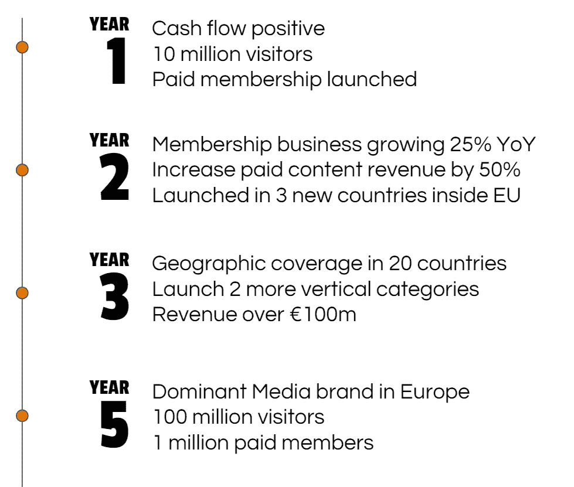
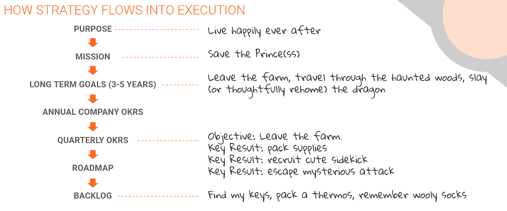

# 战略的童话方法；创建目标和清晰度

> 原文：<https://medium.com/swlh/the-fairy-tale-approach-to-strategy-creating-purpose-and-clarity-b730fc1c4edd>

没有战术的战略是最慢的胜利之路。没有战略的战术，是战败前的噪音。” —孙子

**实现战略的三个步骤**

1.  决定你公司的目标；这是你的目的
2.  确定实现目标的步骤，并清晰地传达出来；这是你的策略
3.  根据你的战略，对你坚持不懈的工作进行优先排序

在我的职业生涯中，我有幸与各行各业的许多优秀公司共事。从招聘到媒体，再到金融科技和教育科技，不管他们的行业和客户是什么，都有一个共同的线索让所有这些公司的领导层感到沮丧:为什么我们不走得更快？

这个问题的答案总是，他们试图做太多，他们的团队不清楚他们如何为大局做出贡献。

# 目标的重要性

如果许多企业的一个共同点是对交付速度不够快感到沮丧，那么一个同样普遍的观察结果是，在这些企业中，战略的考虑和执行是多么糟糕。

在与创始人和高管团队合作时，战略是我觉得最有吸引力也最令人沮丧的事情之一。尽管有大量的 MBA，大量的《哈佛商业评论》( Harvard Business Review)文章，企业培训研讨会，以及引用早已去世的中国将领的话，但战略仍然是最常被归入年度高管休假日的事情。

目标感让组织与众不同，这已成为一种老生常谈的高管信念。这是一个令人感觉良好的积极信息，让我们能够创造一个信息，即我们的企业不仅仅是为了利润而存在。目标带来积极性，快乐的员工更有效率。与我们的战术和分析竞争对手相比，一个目标将改变我们的业务。

不对。目标不会改善你的业务；只有目标和**清晰**的结合才能给你带来你所寻找的转变，幸运的是，有证据支持这些大胆的主张。

Claudine Gartenberg(沃顿商学院)和 George Serafeim(哈佛大学)在一项研究中对目标的财务影响进行了最全面的分析，该研究分析了《最佳工作场所报告》中接受调查的员工自我报告的目标感和一致性。

> 目标明确的企业有两种形式:一种是以员工之间的高度友爱为特征的企业，另一种是以管理层高度清晰为特征的企业。

最初的工作比较了目标感和财务表现，没有发现显著的相关性。只有当这两个人研究了结合了目标和清晰的组织时，他们才得出了一个惊人的结论。

> “表现出高目的性和清晰性的公司在未来的会计和股票市场上有系统地更高的表现”

这种性能改进的系统性如何？Gartenberg 声称*“高目的明确性公司的投资组合在未来获得显著的正风险调整股票回报，每年高达 7.6%”*。当组织自下而上清楚地理解了目标，并包括公司员工中的“失去的中间阶层”时，这种绩效差异尤为明显。

确定我们的目标是确定我们战略的第一步。

# 战略的“为什么”

每个高管都会承认制定战略的重要性，但争论性的高管战略会议总是以固执己见地讨论使命和愿景声明之间的差异而告终。

停下来。

让我们分析一下我们有策略的原因。一个好的战略描述了实现我们最大目标的必要步骤；我们的**宗旨**作为一个组织。它的存在有两个关键原因:统一我们团队的努力，有时(经常)指导我们确定优先级？)矛盾的战术决策。

在又一场关于愿景陈述的研讨会之后([顺便说一下](https://www.nike.com/help/a/nikeinc-mission)，耐克是最好的)，我在伦敦走了一圈，再次对会议室里浪费在语义上的时间感到沮丧。这次散步给了我一个机会来反思和分解这个使命/愿景，使之成为我们成长过程中理解的熟悉术语；一个童话。

这就是它是如何工作的——我们的**目的**是“从此幸福快乐”。突然间，我们有了一个背景和一个关于未来的深远愿景。为了从此过上幸福快乐的生活，我们首先需要从恶龙手中救出王子(或公主)；我们的**使命**。

为了营救我们的皇家朋友，我们需要一些清晰的高层次步骤——离开家，安全地穿过闹鬼的树林，最后和平地让被误解的蜥蜴回家。亲爱的读者，这就是我们的**策略**。

你觉得很蠢吗？原谅我，如果这听起来像是我在贬低那些关于战略和咨询业务的 MBA 讲座的重要性(我不打算这么做)，但请考虑一下这个问题；你在多少公司工作过，使战略正确？在某种程度上，这种糟糕的表现是因为我们将战略的重要性与复杂性混为一谈。

# 童话般的战略方法

战略不是一年重温一次的幻灯片。战略必须响应业务现实，并且应该不断地反映到对业务中的每个人都有意义的方向上。战略仅仅停留在董事会门口是不够的。

为了使个人绩效与组织最重要的目标保持一致，我们必须将战略步骤分解为整个企业可操作和可实现的目标。

一个简单的方法是从考虑未来 3-5 年实现我们总体目标所需的结构步骤开始。这应该考虑分阶段努力，重点放在最初的滩头市场，但要确保我们把目光放在地平线上。

我喜欢用 Jake Knapp 的设计冲刺的变体来做这件事，与管理团队一起思考他们的 1 年、2 年、3 年和 5 年目标，这使我们能够描述成功的顺序和我们正在走向的大目标:

A typical 1,2,3,5 year vision which helps to align our vision and build OKRs for the year. This one’s made up, by the way.

有了这些年度阶段作为我们未来成功的路线图，我们就可以进一步考虑明年和下一季度整个业务中最关键的目标。

幸运的是，英特尔和谷歌已经推广了一种分解这些目标的方法——目标和关键结果。

我不会展开这篇文章来详细讨论 okr，但是请花一些时间来熟悉它们。需要理解的关键是 OKRs 提供了一种简单、有效且描述清晰的方式来将战略转化为行动。

为了扩展我们的童话类比，我们的 okr 描述了直接的、量化的步骤，这些步骤将展示我们朝着较小的年度和季度目标取得的明确进展。最重要的是，OKRs 以有意义的方式向组织中的每个人描述了这些步骤。

Happily ever after — the flow of strategy into tactics, described in fairy tale language

Gartenberg 和 Serafeim 在他们的研究中提出了一个重要的观点，即“在组织的较低层次传播目的感在许多公司中并不成功”(Graham et al . 2015 牛津大学和安永 2016)。OKR 过程是一个被很好地记录和证明的方法，以确保有一个机制将目的扩展到公司的所有级别。

让我们回忆一下战略的关键“为什么”。这不是给投资者留下深刻印象的方式，也不是一年一次在非现场高管会议上重复的幻灯片负担。我们的战略规划了实现我们目标的步骤。它是我们在整个组织中调整活动的北极星。OKRs 的采用是我们传达我们的目的和措施或进展的过程。

一旦我们的目标和战略在整个企业内达成一致并得到沟通，下一步就是无情地优先考虑我们如何花费有限的时间和精力来实现这些目标。对我来说，区分优先级的质量以及决定做什么不做什么是伟大公司的区别。

在下一篇文章中，我将讨论一个管理我们战略赌注优先级的过程，以及如何在整个组织中平衡创新和执行。

*未完待续……*

## 这篇文章发表在[《创业](https://medium.com/swlh)》上，这是 Medium 最大的创业刊物，有+ 382，862 人关注。

## 在这里订阅接收[我们的头条新闻](http://growthsupply.com/the-startup-newsletter/)。

